# SPCarNet / MeshSplatOpt

**Train-only evidence-guided compact Mesh Splatting with protocol-audited geometry-safe reconstruction repair.**

## Current Report Package (2026-06-26)

Start here for mentor/PPT analysis from a fresh clone:

- [root report entry point](SPCARNET_REPORT_INDEX.md)
- [clone/PPT executive technical summary](docs/car_model/6-26-SPCarNet-Clone-PPT-Technical-Summary.zh.md)
- [latest 2026-06-26 status addendum](docs/car_model/6-26-SPCarNet-Current-Status-Upload-Report.md)
- [vNext implementation log](docs/car_model/6-26-SPCarNet-vNext-Implementation-Log.md)
- [vNext feasibility and execution plan](docs/car_model/6-26-SPCarNet-vNext-Feasibility-And-Execution-Plan.md)
- [vNext soft-shrink garden milestone](docs/car_model/6-26-SPCarNet-vNext-SoftShrink-Garden-Milestone-Log.md)
- [vNext technical report and artifact index](docs/car_model/6-26-SPCarNet-vNext-Technical-Report-And-Index.zh.md)
- [vNext structure-aware shrink strict multiscene log](docs/car_model/6-26-vNext-StructureAwareShrink-Strict-Multiscene-Log.md)
- [vNext manifest runner and full9 gap log](docs/car_model/6-26-vNext-ManifestRunner-and-Full9Gap-Log.md)
- [vNext structure-aware shrink ready4 artifact summary](docs/car_model/vnext_artifacts/strict_structure_aware_shrink_ready4_20260626_071413/strict_structure_aware_shrink_ready4_summary.md)
- [vNext stump rebuild / ready5 rejection log](docs/car_model/6-26-vNext-StumpInputRebuild-Ready5-and-Rejection-Log.md)
- [vNext treehill rebuild / ready6 rejection log](docs/car_model/6-26-vNext-TreehillInputRebuild-Ready6-and-Rejection-Log.md)
- [vNext flowers rebuild / ready7 same-evidence fallback log](docs/car_model/6-26-vNext-FlowersInputRebuild-Ready7-and-SameEvidenceFallback-Log.md)
- [vNext kitchen rebuild / ready8 accepted milestone log](docs/car_model/6-26-vNext-KitchenInputRebuild-Ready8-and-AcceptedMilestone-Log.md)
- [vNext ready4 preflight](docs/car_model/vnext_artifacts/vnext_structure_shrink_ready4_preflight_20260626.md)
- [vNext full9 gap preflight](docs/car_model/vnext_artifacts/vnext_structure_shrink_full9_gap_preflight_20260626.md)
- [clone-facing report package manifest](docs/car_model/6-25-SPCarNet-Report-Package-Manifest.md)
- [current mentor/PPT technical report](docs/car_model/6-25-SPCarNet-PPT-Technical-Report-Current.md)
- [long Chinese mentor technical report](docs/car_model/6-25-SPCarNet-Mentor-Technical-Report.md)
- [current cloneable report index](docs/car_model/6-25-SPCarNet-Cloneable-Report-Index.md)

Short status: `v106 POD-MoE base-preserve` is the current verified quality line and improves over the local clean MeshSplatting baseline on the assembled selected full9 table. `v113b/v113c` are strict-gate safety repairs; they improve safety and partially repair garden v110b, but do not surpass v106. `v114_oof_refit_pod_moe` is the active candidate-side long experiment and is not yet a completed result. Latest live addendum: v110 counter failed during field build with return code `-9`, likely due to memory/shared-storage pressure, so the strict branch still needs a lower-memory field-builder rerun.

vNext status: the certified residual surface texture direction is accepted as a realistic research route, not as a guaranteed result. The latest structure-aware shrink milestone adds train-policy-val local L1/gradient structure-risk shrink and fixes parent-edge apply/profile wiring. Under strict no-target-GT apply on ready scenes `counter,bonsai,room,garden`, the fixed structure-aware policy is `4 / 4` accepted with mean delta versus Phase-F compact parent of `+0.00076151` PSNR, `-0.00000302` SSIM, and `-0.00002038` LPIPS. The important repairs are `room`, which moves from previous strict face-softshrink fallback/no-op to accepted nonzero output, and `garden`, which now improves over both its Phase-F parent and previous garden face-softshrink pilot. The local rebuilds have now added `stump`, `treehill`, `flowers`, and `kitchen` inputs and moved preflight to `8 / 9` ready. `stump/treehill/flowers` are correctly rejected to fallback/no-op by the fixed certificate; `flowers` also confirms exact same-evidence fallback under the rebuilt `images_2` target-evidence resolution. `kitchen` is the first rebuilt missing-scene nonzero accepted milestone: `alpha=0.125`, `changed_fraction=0.003549714`, and same-evidence held-out delta is `+0.000786` PSNR, `+0.00000256` SSIM, `-0.00002818` LPIPS. Remaining missing-input scene is `bicycle`.

## Current v106 POD-MoE Status (2026-06-25)

The current representation-level candidate is **v106 POD-MoE base-preserve**. It keeps a v104c-like shrink view-affine residual field as the stable base, then adds two conservative triangle-attached residual experts: `detail` and `occlusion_boundary`.

Important claim boundary: this is a fixed full9 diagnostic over the local Mip-NeRF360 protocol. It is positive versus the local v104c representation-field anchor on all 9 selected scenes, but the effect size is small and it is not yet a large paper-level breakthrough.

| method | scenes | PSNR | SSIM | LPIPS | dPSNR vs v104c | dSSIM vs v104c | dLPIPS vs v104c |
|---|---:|---:|---:|---:|---:|---:|---:|
| clean MeshSplatting | 9 | 25.151682 | 0.749018 | 0.287621 | - | - | - |
| v104c shrink view-affine field | 9 | 25.829099 | 0.760727 | 0.268548 | 0.000000 | 0.000000 | 0.000000 |
| v106 POD-MoE base-preserve | 9 | 25.831280 | 0.760830 | 0.268435 | +0.002181 | +0.000103 | -0.000112 |
| v101/v102 endpoint/reference | 9 | 26.481310 | 0.783675 | 0.224305 | +0.652211 | +0.022949 | -0.044243 |

Full evidence:

- Mentor technical report: [v106 POD-MoE mentor technical report](docs/car_model/6-25-v106-PODMoE-Mentor-Technical-Report-Final.md)
- Full9 table: [full9 assembled result](docs/car_model/results/v106_podmoe_basepreserve_full9_20260625/full9_assembled.md)
- Comparison report: [v106 vs v104c report](docs/car_model/results/v106_podmoe_basepreserve_full9_20260625/full9_compare.md)
- Method log: [v106 POD-MoE base-preserve log](docs/car_model/6-25-v106-PODMoE-BasePreserve-HardTriad-Log.md)
- Qualitative example: 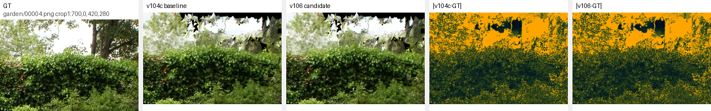

Next method step: **v114 OOF-refit POD-MoE candidate-side validation**, because v110/v110b showed that safety gates alone mostly preserve v106 rather than create a stronger candidate. v114 keeps train/all coefficients but caps expert reliability with out-of-fold gains, aiming to recover capacity without per-scene parameter scanning.

**Integrated mentor/PPT technical report:** [SPCarNet current method integrated technical report](docs/car_model/6-24-SPCarNet-Mentor-PPT-Integrated-Technical-Report.zh.md)

**Current PPT briefing report:** [method/experiment report with visual comparisons for mentor](docs/car_model/6-25-SPCarNet-Current-Method-Experiment-Report-With-Visuals-ForMentor.zh.md); [current method vs MeshSplatting complete report](docs/car_model/6-25-SPCarNet-Current-Method-vs-MeshSplatting-Complete-Report.zh.md); [complete method/experiment/render comparison report](docs/car_model/6-24-SPCarNet-Current-Complete-Method-Experiment-Report-With-Render-Comparisons.zh.md); [SPCarNet mentor/PPT clean report](docs/car_model/6-24-SPCarNet-Mentor-PPT-Technical-Report-CleanCurrent.zh.md); [full current-method mentor report](docs/car_model/6-24-SPCarNet-Mentor-PPT-Technical-Report-CurrentMethod-Full.zh.md); [method/experiment/visual comparison report](docs/car_model/6-24-SPCarNet-Current-Method-Experiment-Visual-Report.zh.md); [claim boundary and paper gap](docs/car_model/6-24-SPCarNet-Claim-Boundary-And-Paper-Gap.zh.md); [v83 patchmix hybrid log](docs/car_model/6-24-v83-PatchMixFaceAlphaLocalPatch-Hybrid-Log.md); [v84 strict selector log](docs/car_model/6-24-v84-StrictCapacitySelector-Log.md); [v86 anchor-preserving tail-risk selector log](docs/car_model/6-24-v86-AnchorPreservingTailRiskSelector-Log.md); [v83/subagent continuation log](docs/car_model/6-24-SPCarNet-PaperLoop-Continuation-v83-And-Subagents.md)

**Current evidence manifest:** `outputs/carnet/spcarnet/current_evidence_manifest_20260624.md` (`23 / 23` evidence files present, `0` required missing; existence/hash manifest only, not a correctness proof).

**Current representation-level diagnostics:** v79 reproduces the v56/v64 counter anchor (`26.756130219 / 0.862126231 / 0.251691371`) and is documented in [v79 v56-seeded anchor log](docs/car_model/6-24-v79-V56SeededFaceAlphaAnchor-Log.md). v80 (`face-alpha + local-patch + bin-gain hybrid`) completed as a near-tie diagnostic, W&B run `izuzuhy0`, and is documented in [v80 face-alpha hybrid local-patch log](docs/car_model/6-24-v80-FaceAlphaHybridLocalPatch-Log.md): it reaches `26.756135941 / 0.862126231 / 0.251691461` on `counter`, recovering from v76/v78b and beating v75, but it is not promoted because LPIPS is slightly worse than the v56/v64/v79 anchor. v81 (`view-conditioned residual basis`) completed and is documented in [v81 view-conditioned basis log](docs/car_model/6-24-v81-ViewConditionedBasis-Log.md): it reports `26.753919601 / 0.862121582 / 0.251836061`, regressing all three metrics versus the anchor. v82 (`patch-mixture teacher basis`) completed with W&B run `6subv75i` and is documented in [v82 patch-mixture teacher-basis log](docs/car_model/6-24-v82-PatchMixtureTeacherBasis-Log.md): the new basis interface runs, but the guard falls back to legacy teacher basis and the result `26.753459930 / 0.862114668 / 0.251868337` is below the anchor, so it is not promoted. v82b (`capacity pre-rank + face-alpha`) reaches a counter-level strict micro-win `26.756137848 / 0.862126350 / 0.251690656`, but hard-triad validation fails strict promotion against v64 on `kitchen/bonsai`. v83 (`patchmix + face-alpha + local-patch hybrid`) reaches `26.756147385 / 0.862125337 / 0.251688808` on `counter`, improving PSNR/LPIPS over v56/v64/v79/v80/v82 but slightly regressing SSIM, so it is mixed and not promoted. v84 materializes a strict train/policy-val selector over v82b and v64 fallback: it is `9 / 9` non-regressive/tie vs v64 and gives mean `+0.000000848` PSNR, `+0.000000013` SSIM, `-0.000000079` LPIPS, but remains report-only because the rule was formed after the v82 hard-triad diagnosis. v85 completed two safety diagnostics: SSIM-safe pre-rank patchmix correctly rejected all candidates but fell back below the anchor, while target-footprint tail-risk accepted a non-degenerate edit at `26.756134033 / 0.862126231 / 0.251691371`, effectively tying the anchor and therefore not promoted. See [v82b capacity pre-rank face-alpha log](docs/car_model/6-24-v82b-CapacityPrerankFaceAlpha-Log.md), [v82 hard-triad summary](outputs/carnet/meshsplatopt/ecsr_phase_v39_multiscene_ssimaware/v82_capacity_prerank_facealpha_triad_20260624/summary.md), [v83 patchmix hybrid log](docs/car_model/6-24-v83-PatchMixFaceAlphaLocalPatch-Hybrid-Log.md), [v84 strict selector log](docs/car_model/6-24-v84-StrictCapacitySelector-Log.md), [v85 SSIM-safe log](docs/car_model/6-24-v85-SSIMSafePreRankPatchMix-Log.md), and [v85 target-footprint tail-risk log](docs/car_model/6-24-v85-TargetFootprintTailRiskCertificate-Log.md).

**v86 anchor-preserving selector update:** v86 keeps the current v84 selected endpoint as anchor and promotes v85 target-footprint tail-risk only if its train/policy-val audit dominates that anchor. The current v85 `counter` candidate is rejected because its SSIM/L1 audit is weaker than v84/v82b, so v86 is `9 / 9` non-regressive/tie versus v84 and preserves the stronger counter row. Evidence: [v86 anchor-preserving tail-risk selector log](docs/car_model/6-24-v86-AnchorPreservingTailRiskSelector-Log.md) and `outputs/carnet/meshsplatopt/ecsr_phase_v39_multiscene_ssimaware/v86_anchor_preserving_tailrisk_selector_full9_summary.md`.

**Recent completed negative diagnostics:** [target-footprint certificate log](docs/car_model/6-24-v78-TargetFootprintCertificate-Running-Log.md) and [strict bin-gain hybrid log](docs/car_model/6-24-v77-StrictBinGainHybrid-Log.md). Pre-fix v78 and fixed-code v78b formal reruns completed as negative diagnostics and are not promoted; W&B runs `7pz9pulx` and `fvfj1s4q`, summaries under `outputs/carnet/meshsplatopt/ecsr_phase_v39_multiscene_ssimaware/v78b_*_formal_20260624/`.

[中文](README.zh.md) | [Mentor/PPT technical report 2026-06-24](docs/car_model/6-24-SPCarNet-Mentor-PPT-Technical-Report-CleanCurrent.zh.md) | [v75 local patch prior log](docs/car_model/6-24-v75-LocalPatchPrior-Log.md) | [v74 delta-cap ladder log](docs/car_model/6-24-v74-DeltaCapLadder-Log.md) | [v70 policy-val blend-ladder prior probe](docs/car_model/6-24-v70-PolicyValBlendLadder-MultiscalePrior-Log.md) | [v69 multi-scale surface prior probe](docs/car_model/6-24-v69-MultiscaleSurfacePrior-Probe-Log.md) | [v68 keep-downweight shrink probe](docs/car_model/6-24-v68-KeepDownweightUncertainty-Probe-Log.md) | [v67 uncertainty-shrink probe](docs/car_model/6-24-v67-UncertaintyShrink-Probe-Log.md) | [v66 bin-RGB alpha probe](docs/car_model/6-24-v66-BinRGBAlphaCalibration-Probe-Log.md) | [v57a face-alpha shrink probe](docs/car_model/6-24-v57a-FaceAlphaReliabilityShrink-Probe-Log.md) | [v56 source-rerun/fresh-probe log](docs/car_model/6-24-v56-SourceRerun-And-FreshProbe-Log.md) | [v56 face-alpha guard log](docs/car_model/6-23-v56-FaceAlphaReliabilityGuard-Log.md) | [v55d face-alpha calibration log](docs/car_model/6-23-v55d-FaceAlphaCalibration-CapHit-Log.md) | [v52 capacity-aware policy log](docs/car_model/6-23-v52-CapacityAwarePolicy-Log.md) | [v51 support ladder full9 log](docs/car_model/6-23-v51-SupportFootprintLadder-Full9-Log.md) | [v48 auto-support atlas log](docs/car_model/6-23-v48-AutoSupportSurfaceAtlas-Log.md) | [v47 auto-capacity atlas log](docs/car_model/6-23-v47-AutoCapacitySurfaceAtlas-Log.md) | [v42 confidence/SSIM-gated atlas log](docs/car_model/6-23-v42-ConfidenceSSIMGateAtlas-Log.md) | [v39 SSIM-aware atlas log](docs/car_model/6-23-SSIMAwareAtlas-v39-Implementation-Log.md) | [v38 risk-aware atlas log](docs/car_model/6-23-RiskAwareAtlas-v38-Implementation-Log.md) | [v37 visible barycentric log](docs/car_model/6-23-VisibleBarycentricCoverage-v37-Implementation-Log.md) | [v36 matched-res atlas log](docs/car_model/6-23-MatchedResTeacherAtlas-v36-Log.md) | [Current method report](docs/car_model/6-23-SPCarNet-Current-Method-Mentor-Technical-Report.zh.md) | [Current method/evidence log](docs/car_model/5-14-SPCarNet-Method-Modules-And-Evidence-Log.md) | [Phase-S region core/context portfolio](docs/car_model/5-17-PhaseS-RegionCoreContext-Portfolio-Log.md) | [Phase-S shared residual-field](docs/car_model/5-16-PhaseS-SharedResidualField-Operator.md) | [Phase-S effect-aware / rank2 / auto-visual](docs/car_model/5-15-PhaseS-EffectAware-Portfolio-Rank2-AutoVisual.md) | [Phase-S v20 auto-prefix / portfolio](docs/car_model/5-14-PhaseS-v20-AutoPrefix-Portfolio-Policy.md) | [Phase-S fold-aware PatchCert continuation](docs/car_model/5-14-PhaseS-V6Multifold-V7V8-FoldAware-PatchCert-Log.md) | [Phase-S Compact-Stratified PatchCert log](docs/car_model/5-14-PhaseS-CompactStratified-Gate-Log.md) | [Phase-S Direct PatchCert log](docs/car_model/5-14-PhaseS-DirectPatchCert-Carrier-Pilot.md) | [Phase-S PatchRisk log](docs/car_model/5-14-PhaseS-PatchRisk-Carrier-Pilot.md) | [Phase-S GeoRisk/CVaR log](docs/car_model/5-14-PhaseS-GeoRiskCVaR-Selector-Log.md) | [Phase-S risk-tail/alpha log](docs/car_model/5-14-PhaseS-RiskTail-Alpha-ModuleLog.md) | [Phase-S coupled selector](docs/car_model/5-13-Coupled-Selector-Pilot.md) | [Phase-J result](docs/car_model/5-8-ECSR-PhaseJ-GuardedAdaptiveEdgePolicy.md) | [Surface-lumigraph V8](docs/car_model/5-9-ECSR-SurfaceResidualLumigraphV8.md) | [Phase-R full-robust audit](docs/car_model/5-12-PhaseR-FullRobust-Outdoor-Multifold-Audit.md) | [Phase-S gaincert audit](docs/car_model/5-12-PhaseS-GainCertV1-Audit.md) | [SPCarNet selector audit](docs/car_model/5-12-SPCarNet-RagSym-Rerank-Audit.md) | [Full9 status](docs/car_model/5-12-Full9-PaperLoop-Evidence-Status.md) | [Closed-loop status](docs/car_model/5-12-PaperLoop-ClosedLoop-Status.md) | [Continuation report](docs/car_model/5-12-Subagent-PaperLoop-Continuation-Report.md) | [Phase-J external validation](docs/car_model/5-8-ECSR-PhaseJ-ExternalCourtyardValidation.md) | [Current archive](docs/car_model/5-7-Archive-Full9-CompactELA.md) | [Execution log](docs/car_model/5-8-ECSR-FinalDecisionExecutionLog.md) | [Research log](docs/car_model/SPCarNet_research_log.md) | [Legacy README](docs/car_model/archive/README_legacy_before_full9_2026-05-07.md)

Older Phase-K logs: [candidate-aware portfolio closure](docs/car_model/5-22-PhaseK-PolicyPortfolio-Closure.md), [multiscene validation log](docs/car_model/5-22-CandidateAwareELA-Multiscene-Validation-Log.md), and [rank-K PatchCert validation](docs/car_model/5-22-RankK-PatchBasis-Validation-Log.md).

Latest completed diagnostic: [v77 strict bin-gain hybrid probe](docs/car_model/6-24-v77-StrictBinGainHybrid-Log.md), W&B run `3ho2y4s1`. Previous v76 log: [v76 policy-val bin-gain hybrid prior probe](docs/car_model/6-24-v76-PolicyValBinGainHybrid-Log.md).

SPCarNet is a research branch built on Mesh Splatting. The current ECSR version keeps the fixed Phase-F compact checkpoints, then uses a train-evidence guarded portfolio for appearance recovery: stable scenes use adaptive-alpha ELA, and unstable scenes use a train-selected structural edge fallback. No held-out test metric is used to select the branch, edge gate, alpha, or compaction ratio.

```text
current method: ours_26000_phasej_guarded_adaptedge_ela
report: outputs/carnet/meshsplatopt/ecsr_phase_f/policy_val_compaction_ladder_v2_envfix/phasef_ela_eval_summary_phasej_guarded_adaptedge_full9.md
mentor_report: docs/car_model/6-24-SPCarNet-Mentor-PPT-Technical-Report-CleanCurrent.zh.md
evidence_manifest: outputs/carnet/spcarnet/current_evidence_manifest_20260624.md
```

The May 7 Compact-ELA/SOR checkpoint remains archived as `archive/full9-compact-ela-ssim-peak-20260507` at commit `fae7942`. Phase-J is stronger on the current selected full9 RGB protocol, but it is still a render-time ELA portfolio rather than a fully baked representation-level endpoint. The safe paper-facing headline is **evidence-certified post-training repair and compaction for MeshSplatting checkpoints**, not a fully solved replacement for MeshSplatting.

**Current closure status, 2026-06-24:** Phase-J local full9 RGB closure is `COMPLETE`; the paper-level representation/paper-table closed loop is still `NOT COMPLETE`. The strongest auditable endpoint remains Phase-J: under the locally reproduced selected-clean `26000/30000` envelope, same full9 split, and same evaluator, it is `9 / 9` strict on scene-level PSNR/SSIM/LPIPS, `244 / 246` strict on per-view RGB, and removes `7.6479%` triangles on average. The strongest broad fixed representation-level line remains v64/v84-scale: v64 is `9 / 9` non-regressive/tie versus v56 and promotes only `kitchen`, with mean `+0.000410080` PSNR, `+0.000000278` SSIM, `-0.000018951` LPIPS; v84 adds a strict v82b counter selector and is `9 / 9` non-regressive/tie versus v64, but its extra gain over v64 is only `+0.000000848` PSNR, `+0.000000013` SSIM, `-0.000000079` LPIPS. v65 teacher basis, v66 bin-RGB alpha, v67 uncertainty shrink, v68 keep-with-downweight shrink, v69 count-pyramid multi-scale prior, v70 policy-val blend-ladder prior, v71a evidence-consistent prior gate, v72 local prior allowlist, v73 target-support candidate selection, v73b target-support pre-rank, v74 residual delta-cap ladder, v75 local patch prior, v76 policy-val bin-gain hybrid prior, v77 strict bin-gain hybrid, v78/v78b target-footprint certificate, v80 face-alpha hybrid local-patch, v81 view-conditioned basis, v82 patch-mixture teacher basis, v82b raw capacity-prerank, v83 patchmix hybrid, v84 strict selector, and v85 SSIM/tail-risk certificate are completed diagnostics/report-only candidates, not promoted endpoints. Current complete report: [`method/experiment/render comparison report`](docs/car_model/6-24-SPCarNet-Current-Complete-Method-Experiment-Report-With-Render-Comparisons.zh.md); persistent evidence: `outputs/carnet/meshsplatopt/ecsr_phase_v39_multiscene_ssimaware/v80_facealpha_hybrid_localpatch_20260624/summary.md`, `outputs/carnet/meshsplatopt/ecsr_phase_v39_multiscene_ssimaware/v81_viewbasis_20260624/summary.md`, `outputs/carnet/meshsplatopt/ecsr_phase_v39_multiscene_ssimaware/v82_patchmix_teacher_20260624/summary.md`, `outputs/carnet/meshsplatopt/ecsr_phase_v39_multiscene_ssimaware/v83_patchmix_facealpha_localpatch_counter_20260624/summary.md`, `outputs/carnet/meshsplatopt/ecsr_phase_v39_multiscene_ssimaware/v84_strict_v82_capacity_selector_full9_summary.md`, `outputs/carnet/meshsplatopt/ecsr_phase_v39_multiscene_ssimaware/v85_ssimsafe_prerank_patchmix_counter_20260624/summary.md`, and `outputs/carnet/meshsplatopt/ecsr_phase_v39_multiscene_ssimaware/v85_target_tailrisk_counter_20260625/summary.md`.

**Paper-loop status, 2026-05-17:** `NOT COMPLETE`. Phase-J remains the strong endpoint: clean-best rows and Phase-J RGB rows are complete on `9 / 9` scenes, and Phase-J strictly beats the selected clean MeshSplatting row on `9 / 9`. Phase-S is now a real representation-level face-local repair branch, but its reliable gains remain sparse. The newest region core/context weighted fitting sends train-only render-visible region membership into the residual fitting objective, then uses the fixed effect-aware portfolio to reject unsafe rows. The direct core/context method produces a strong `flowers` report-only win, but it also false-accepts `kitchen`, `bonsai`, and `counter`; the final fixed train-val-only portfolio therefore keeps `bicycle=patchcert_v6`, `flowers=rvregion_corectx_A`, `garden=rvregion_garden`, `counter=riskpilot`, and `kitchen=rvregion_indoor`, with the other scenes falling back to Phase-J. Full9 effective report-only deltas are `+0.000947740` PSNR, `+0.000062552` SSIM, and `-0.000098634` LPIPS over Phase-J fallback. This is better than the 2026-05-15 effect-aware portfolio and the 2026-05-16 robust region prior, but the effect size is still small and not a paper-level breakthrough. Evidence: `outputs/carnet/meshsplatopt/ecsr_phase_s/render_visible_region_carriers_20260517/phase_s_effectaware_region_portfolio_v1.md`. Latest module/evidence logs: [`Phase-S region core/context portfolio`](docs/car_model/5-17-PhaseS-RegionCoreContext-Portfolio-Log.md), [`Phase-S shared residual-field`](docs/car_model/5-16-PhaseS-SharedResidualField-Operator.md), [`Phase-S effect-aware / rank2 / auto-visual`](docs/car_model/5-15-PhaseS-EffectAware-Portfolio-Rank2-AutoVisual.md), [`Phase-S v20 auto-prefix / portfolio`](docs/car_model/5-14-PhaseS-v20-AutoPrefix-Portfolio-Policy.md), [`Compact-Stratified PatchCert`](docs/car_model/5-14-PhaseS-CompactStratified-Gate-Log.md), [`Direct PatchCert`](docs/car_model/5-14-PhaseS-DirectPatchCert-Carrier-Pilot.md), [`PatchRisk`](docs/car_model/5-14-PhaseS-PatchRisk-Carrier-Pilot.md), [`GeoRisk/CVaR`](docs/car_model/5-14-PhaseS-GeoRiskCVaR-Selector-Log.md), [`risk-tail/alpha`](docs/car_model/5-14-PhaseS-RiskTail-Alpha-ModuleLog.md).

**Paper-loop update, 2026-05-22:** `NOT COMPLETE`. Candidate-aware ELA now applies the same train-only per-model auto-policy to Phase-J fallback and Phase-S candidate, then selects edge/plain variants using train-val evidence only. On `counter,bonsai,room,flowers`, the fixed portfolio selects plain candidate on `4 / 4`, but mean report-only deltas are only `+0.000053883` PSNR, `-0.000000268` SSIM, and `+0.000000469` LPIPS. The qualitative panels are similarly subtle, so this is a fairness/policy improvement rather than a paper-level representation breakthrough.

**Rank-K update, 2026-05-22:** `NOT COMPLETE`. A real representation-level rank-4 PatchCert carrier-basis operator was implemented and validated with W&B online logging on `flowers,counter,bonsai,room`. It accepts `3 / 4` scenes and gives effective held-out deltas of `+0.000042439` PSNR, `-0.000000015` SSIM, and `-0.000000183` LPIPS. `bonsai` is the clearest positive row, but `counter` still fails the compact PSNR gate and `room` exposes slight held-out balanced regression. Evidence: [`rank-K PatchCert validation`](docs/car_model/5-22-RankK-PatchBasis-Validation-Log.md).

**Paper-loop update, 2026-06-22:** `NOT COMPLETE`. Phase-J remains the presentation-safe endpoint and is documented in the mentor/PPT technical report. v26 hard local-trust, v27 soft local-trust, and v28 view-tail-safe alpha shrink are the newest repair-policy probes. v26/v27 Bonsai medium runs are fully logged and both fail promotion under honest train-val/tail gates; v27 fixes the all-zero trust failure but its accepted selector row is a held-out near-noop with tiny RGB regression. v28 is a real train/eval pipeline change that adds policy-view tail-safe alpha scaling; the first real run exposed a dangling region-risk interface bug, which has been fixed and relaunched with W&B online. v28 is still under medium validation, so it is not a headline result.

**Paper-loop update, 2026-06-23:** `NOT COMPLETE`. The mentor/PPT technical report has been refreshed with the current Phase-J headline and the v48 representation-level atlas evidence. v48 now has a full9 effective summary versus same-evidence no-op compact baseline: `7 / 9` strict RGB wins, `8 / 9` non-regressive/tie, mean `+0.001462` PSNR, `+0.00002774` SSIM, and `-0.00003953` LPIPS. This is a real train-evidence surface-atlas policy with automatic fallback, but it remains an ablation/next-step result: `stump` is rejected to no-op and `treehill` has a small LPIPS regression. Evidence: [`v48 auto-support atlas log`](docs/car_model/6-23-v48-AutoSupportSurfaceAtlas-Log.md), `outputs/carnet/meshsplatopt/ecsr_phase_v39_multiscene_ssimaware/v48_autosupport_autocap_guarded_v42calib_full9_summary.md`, and `outputs/carnet/meshsplatopt/ecsr_phase_v39_multiscene_ssimaware/v48_full9_missing_scene_small_artifacts_20260623`.

**Support-capacity update, 2026-06-23:** `NOT COMPLETE`. v51-fast support-footprint ladder has now been run on full9 with a fixed train-only policy (`2048,4096` support candidates, texture `32`, fill `nearest_observed`). It is positive versus same-evidence no-op on `6 / 9` scenes and positive versus v50 on `5 / 9` strict / `8 / 9` non-regressive scenes. Versus v48, it is strictly better only on the cap-hit scenes `counter/kitchen/bonsai`; the full9 mean PSNR is slightly lower than v48 because fixed texture/fill loses v48's auto-policy advantage. Evidence: [`v51 support ladder full9 log`](docs/car_model/6-23-v51-SupportFootprintLadder-Full9-Log.md) and `outputs/carnet/meshsplatopt/ecsr_phase_v39_multiscene_ssimaware/v51_fast_support_ladder_full9_summary.md`.

**Capacity-policy update, 2026-06-23:** `NOT COMPLETE`. v52 now fixes the v48/v51 selection as a train-only capacity-aware effective policy: keep v48 on non-cap-hit scenes, promote v51 only when v48 hit the `2048` support cap and v51 is accepted with larger support. It selects v51 on `counter/kitchen/bonsai` and v48 elsewhere. Effective full9 deltas are `+0.000086890` PSNR, `+0.000008782` SSIM, and `-0.000015303` LPIPS versus v48, with `9 / 9` non-regressive/tie. The selected small-artifact tree includes render/GT symlinks for all 9 scenes, plus a selected-render HTML gallery and a cap-hit local panel. A one-command artifact pipeline refreshes those small artifacts, gallery, panel, and manifest. The W&B-logged source-config rerun is now complete: `9 / 9` scenes reproduced, `0` missing, `0` metric mismatches under `1e-5` reproducibility tolerance. This closes the v52 reproducibility gap, but v52 remains a small-effect representation-level policy rather than the final paper endpoint. Evidence: [`v52 capacity-aware policy log`](docs/car_model/6-23-v52-CapacityAwarePolicy-Log.md), `scripts/car_model/run_v52_capacity_aware_pipeline.py`, `scripts/car_model/plan_v52_capacity_aware_source_rerun.py`, `scripts/car_model/summarize_v52_source_rerun.py`, `outputs/carnet/meshsplatopt/ecsr_phase_v39_multiscene_ssimaware/v52_capacity_aware_v48_v51_full9_summary.md`, `outputs/carnet/meshsplatopt/ecsr_phase_v39_multiscene_ssimaware/v52_capacity_aware_selected_full9/v52_capacity_aware_pipeline_report.md`, `outputs/carnet/meshsplatopt/ecsr_phase_v39_multiscene_ssimaware/v52_capacity_aware_source_rerun_plan.md`, `outputs/carnet/meshsplatopt/ecsr_phase_v39_multiscene_ssimaware/v52_capacity_aware_source_rerun_status.md`, `outputs/carnet/meshsplatopt/ecsr_phase_v39_multiscene_ssimaware/v52_capacity_aware_selected_full9/qualitative_gallery.html`, and `assets/spcarnet_v52_capacity_policy_cap_hit_panel.png`.

**Alpha-calibration probe, 2026-06-23:** `NOT PROMOTED`. v53 adds policy-val least-squares alpha calibration to the surface residual atlas and validates it with W&B on the three v52 cap-hit scenes. It identifies residual amplitude as a real bottleneck, but global alpha is too blunt: `kitchen` improves PSNR/LPIPS but regresses SSIM, `counter` is worse than v52, and `bonsai` is rejected by the safety gate. v53 is therefore documented as a negative/diagnostic result, not a new endpoint. Evidence: [`v53 alpha calibration log`](docs/car_model/6-23-v53-PolicyValAlphaCalibration-CapHit-Log.md).

**Face-alpha calibration probe, 2026-06-23:** `NOT PROMOTED_AS_GLOBAL_REPLACEMENT`. v55d adds policy-val per-face/local alpha calibration with an effective alpha cap. It strictly improves `counter` over v52 (`+0.002670` PSNR, `+0.00001156` SSIM, `-0.00017697` LPIPS), but does not close the cap-hit set: `kitchen` improves PSNR/LPIPS while regressing SSIM, and `bonsai` regresses all three metrics. The next candidate is a fixed reliability guard that enables v55d only when local-alpha evidence is dense enough and the selected global multiplier is not high. Evidence: [`v55d face-alpha calibration log`](docs/car_model/6-23-v55d-FaceAlphaCalibration-CapHit-Log.md).

**Face-alpha guard candidate, 2026-06-23:** `REPORT_ONLY_EFFECTIVE_POLICY_CANDIDATE`. v56 applies a fixed train/policy-val audit guard over v52/v55d: use v55d only when local-alpha evidence is dense enough and selected alpha is not above `0.5`; otherwise fallback to v52. It selects only `counter`, giving full9 deltas vs v52 of `+0.000296699` PSNR, `+0.000001285` SSIM, and `-0.000019663` LPIPS with `9 / 9` non-regressive/tie. The artifact pipeline now materializes a selected full9 tree with `9 / 9` render/GT links plus a selected gallery and counter crop/error-map panel. This is safer than raw v55d but still not a paper endpoint because the guard was designed after v55d held-out inspection. Evidence: [`v56 face-alpha guard log`](docs/car_model/6-23-v56-FaceAlphaReliabilityGuard-Log.md), `outputs/carnet/meshsplatopt/ecsr_phase_v39_multiscene_ssimaware/v56_face_alpha_guard_full9_summary.md`, `outputs/carnet/meshsplatopt/ecsr_phase_v39_multiscene_ssimaware/v56_face_alpha_guard_selected_full9/v56_face_alpha_guard_pipeline_report.md`, and `assets/spcarnet_v56_counter_face_alpha_guard_panel.png`.

**v56 source-rerun / fresh-probe update, 2026-06-24:** `CURRENT_MISSING_AUDIT_FRESH_PROBES_CLOSED`. New v56 source-rerun scripts reproduce the selected `counter` v55d row from source config with W&B (`26.756130 / 0.862126 / 0.251691`, guard pass, face-alpha count `394`) and combine it with the completed v52 source-rerun roots into a `COMPLETE_REPRODUCED` v56 effective-policy status (`9 / 9` completed, `0` missing, `0` mismatch). Fresh `flowers/treehill/bicycle/garden/stump/room` v55d candidate probes are all rejected by the fixed guard: `flowers/treehill/bicycle/stump` expose sparse local-alpha support plus weak policy-val view robustness, while `garden/room` are internally accepted boundary cases but rejected because the support or worst-view SSIM margin is not strong enough. The full stricter `--min_target_changed_fraction 0.0` audit is also complete and leaves metrics plus guard decisions unchanged. v56 is therefore a safer report-only candidate with closed current fixed-command audit coverage, not a paper endpoint. Evidence: [`v56 source-rerun/fresh-probe log`](docs/car_model/6-24-v56-SourceRerun-And-FreshProbe-Log.md), `outputs/carnet/meshsplatopt/ecsr_phase_v39_multiscene_ssimaware/v56_face_alpha_guard_mtc0_full_source_status.md`, and `outputs/carnet/meshsplatopt/ecsr_phase_v39_multiscene_ssimaware/v56_face_alpha_guard_mtc0_full_freshcheck_summary.md`.

**v57a reliability-shrink probe, 2026-06-24:** `REAL_PIPELINE_CHANGE_PROBED_NOT_PROMOTED`. v57a adds train-policy-val face-alpha reliability shrink to the atlas adapter and runner. The `counter` W&B probe remains positive versus v52 (`+0.001548767` PSNR, `+0.000009656` SSIM, `-0.000117481` LPIPS), but is weaker than raw v55d (`-0.001121521` PSNR, `-0.000001907` SSIM, `+0.000059486` LPIPS). The `kitchen` risk probe keeps PSNR/LPIPS gains over v52 but still regresses SSIM (`-0.000099182`), so v57a is useful infrastructure but not promoted. Evidence: [`v57a face-alpha reliability shrink probe`](docs/car_model/6-24-v57a-FaceAlphaReliabilityShrink-Probe-Log.md).

## Current Result

**Protocol.** Mip-NeRF360 same-protocol reproduction. For every scene, the clean MeshSplatting baseline is selected from clean `26000` and `30000` checkpoints using held-out test metrics only:

```text
score = PSNR + 20 * SSIM - 20 * LPIPS
```

Train metrics are not used to pick the baseline or the final method result.

**Current Phase-J RGB endpoint.**

- Report: `outputs/carnet/meshsplatopt/ecsr_phase_f/policy_val_compaction_ladder_v2_envfix/phasef_ela_eval_summary_phasej_guarded_adaptedge_full9.md`
- Scenes: `9 / 9`
- Strict RGB wins vs selected clean MeshSplatting: `9 / 9`
- Strict RGB wins vs Phase-F alpha-grid: `9 / 9`
- Mean delta vs selected clean MeshSplatting: `+1.3311 PSNR`, `+0.0347 SSIM`, `-0.0634 LPIPS`
- Mean delta vs Phase-F alpha-grid: `+0.3971 PSNR`, `+0.0083 SSIM`, `-0.0193 LPIPS`
- Mean triangle reduction: `7.6479%`
- Closure audit: `244 / 246` held-out views are strict RGB wins; sparse COLMAP geometry is safe on `9 / 9` scenes and strictly better on `6 / 9` under the max500 audit.
- External courtyard validation: on ETH3D courtyard clean9000, Phase-J improves clean MeshSplatting by up to `+0.2642 PSNR`, `+0.0094 SSIM`, `-0.0225 LPIPS`; the degraded F82 checkpoint only shows tiny improvements, so it is kept as a limitation diagnostic.

| scene | selected branch | PSNR | SSIM | LPIPS | dPSNR clean | dSSIM clean | dLPIPS clean | triangle reduction |
|---|---|---:|---:|---:|---:|---:|---:|---:|
| bicycle | adaptive alpha | 24.0215 | 0.7024 | 0.2661 | +0.7199 | +0.0425 | -0.0660 | 11.81% |
| flowers | adaptive alpha | 20.3044 | 0.5578 | 0.3292 | +0.6221 | +0.0459 | -0.0653 | 11.82% |
| garden | adaptive alpha | 26.3111 | 0.8278 | 0.1358 | +1.2819 | +0.0478 | -0.0655 | 3.47% |
| stump | adaptive alpha | 25.5951 | 0.7241 | 0.2639 | +0.3901 | +0.0189 | -0.0301 | 11.82% |
| treehill | auto edge fallback | 21.2962 | 0.5956 | 0.3363 | +0.3620 | +0.0311 | -0.0697 | 11.81% |
| room | adaptive alpha | 30.3056 | 0.9057 | 0.1960 | +1.5584 | +0.0209 | -0.0539 | 2.10% |
| counter | adaptive alpha | 28.4492 | 0.8937 | 0.1865 | +1.6974 | +0.0317 | -0.0655 | 2.10% |
| kitchen | adaptive alpha | 30.1997 | 0.9161 | 0.1320 | +2.3812 | +0.0396 | -0.0672 | 2.10% |
| bonsai | adaptive alpha | 31.8620 | 0.9303 | 0.1726 | +2.9668 | +0.0339 | -0.0869 | 11.80% |

## ECSR Upgrade Status

The next method track is **ECSR: Evidence-Certified Surface Relocation**. Its goal is to move SPCarNet from image-space residual repair toward representation-level surface compression and appearance recovery.

Current execution artifacts:

- Current-state audit: [`docs/car_model/5-8-ECSR-CurrentStateAudit.md`](docs/car_model/5-8-ECSR-CurrentStateAudit.md)
- Phase-A train-only surface evidence: [`docs/car_model/5-8-ECSR-PhaseA-SurfaceEvidence.md`](docs/car_model/5-8-ECSR-PhaseA-SurfaceEvidence.md)
- Phase-B view-support graph: [`docs/car_model/5-8-ECSR-PhaseB-ViewSupportGraph.md`](docs/car_model/5-8-ECSR-PhaseB-ViewSupportGraph.md)
- Phase-A/B cached-view policy split: [`docs/car_model/5-8-ECSR-PolicySplit.md`](docs/car_model/5-8-ECSR-PolicySplit.md)
- Full-train fitting/policy-val split: [`docs/car_model/5-8-ECSR-FullTrainPolicySplit.md`](docs/car_model/5-8-ECSR-FullTrainPolicySplit.md)
- Phase-C candidate preflight: [`docs/car_model/5-8-ECSR-PhaseC-CandidatePreflight.md`](docs/car_model/5-8-ECSR-PhaseC-CandidatePreflight.md)
- Phase-C static topology certificate: [`docs/car_model/5-8-ECSR-PhaseC-StaticTopologyCertificate.md`](docs/car_model/5-8-ECSR-PhaseC-StaticTopologyCertificate.md)
- Phase-C materialized checkpoint smoke: [`docs/car_model/5-8-ECSR-PhaseC-MaterializedStaticPass.md`](docs/car_model/5-8-ECSR-PhaseC-MaterializedStaticPass.md), [`docs/car_model/5-8-ECSR-PhaseC-RendererSmoke.md`](docs/car_model/5-8-ECSR-PhaseC-RendererSmoke.md)
- Phase-D attribute-only recovery smoke: [`docs/car_model/5-8-ECSR-PhaseD-AttributeOnlySmoke.md`](docs/car_model/5-8-ECSR-PhaseD-AttributeOnlySmoke.md)
- Phase-D constrained attribute recovery: [`docs/car_model/5-8-ECSR-PhaseD-ConstrainedAttributeRecovery.md`](docs/car_model/5-8-ECSR-PhaseD-ConstrainedAttributeRecovery.md)
- Phase-D surface residual delta smoke: [`docs/car_model/5-8-ECSR-PhaseD-SurfaceResidualDeltaSmoke.md`](docs/car_model/5-8-ECSR-PhaseD-SurfaceResidualDeltaSmoke.md)
- Phase-G teacher-bake recovery: [`docs/car_model/5-8-ECSR-PhaseG-TeacherBakeRecovery.md`](docs/car_model/5-8-ECSR-PhaseG-TeacherBakeRecovery.md)
- Phase-J guarded adaptive edge policy: [`docs/car_model/5-8-ECSR-PhaseJ-GuardedAdaptiveEdgePolicy.md`](docs/car_model/5-8-ECSR-PhaseJ-GuardedAdaptiveEdgePolicy.md)
- Phase-J external courtyard validation: [`docs/car_model/5-8-ECSR-PhaseJ-ExternalCourtyardValidation.md`](docs/car_model/5-8-ECSR-PhaseJ-ExternalCourtyardValidation.md)
- Surface-attached residual lumigraph V8: [`docs/car_model/5-9-ECSR-SurfaceResidualLumigraphV8.md`](docs/car_model/5-9-ECSR-SurfaceResidualLumigraphV8.md)
- Phase-R fixed surface-SH1 ladder: [`docs/car_model/5-10-ECSR-PhaseR-FixedCandidateLadder.md`](docs/car_model/5-10-ECSR-PhaseR-FixedCandidateLadder.md)
- Phase-R indoor multi-fold and gamma trust audit: [`docs/car_model/5-11-PhaseR-Indoor-Multifold-Gate-Audit.md`](docs/car_model/5-11-PhaseR-Indoor-Multifold-Gate-Audit.md)
- Phase-R full-robust outdoor multi-fold audit: [`docs/car_model/5-12-PhaseR-FullRobust-Outdoor-Multifold-Audit.md`](docs/car_model/5-12-PhaseR-FullRobust-Outdoor-Multifold-Audit.md)
- Execution log: [`docs/car_model/5-8-ECSR-FinalDecisionExecutionLog.md`](docs/car_model/5-8-ECSR-FinalDecisionExecutionLog.md)
- Combined Phase-A contact sheet: `outputs/carnet/meshsplatopt/ecsr_phase_a/surface_evidence/phase_a_surface_evidence_contact_sheet.png`

Phase-A result: `9 / 9` scenes pass surface addressability, but only `4 / 9` pass the current top-support multiview consistency check. This means the residual signal is real and surface-addressable, but a naive single-face residual delta is not yet a safe final method.

Phase-B result: the fixed graph policy finds `123` train-only local support clusters across full9, including `23` certificate-contraction candidates and `99` surface-attribute recovery candidates. The direct triangle-reduction upper bound of residual-hot clusters is tiny, so the next method step must separate compression candidates from appearance-recovery candidates instead of treating residual hotspots as the compression target.

Phase-C preflight result: `21 / 123` Phase-B clusters pass the train-only fitting/policy-val support-mask preflight (`13` contraction-type, `8` attribute-recovery-type). These are not accepted ECSR edits yet; they are the first eligible set for topology smoke tests and before/after local rendering certificates.

Phase-C/D execution update: the full-train split is complete for all 9 scenes. Static topology certification passes `7 / 21` preflight candidates; `3` contraction candidates were materialized as real checkpoint copies and all `3 / 3` pass renderer smoke. Two representation-level recovery MVPs are implemented but rejected as final methods: attribute-only recovery regresses `2 / 2` smoke runs, and bounded surface residual DC delta regresses `4 / 4` held-out diagnostics despite `3 / 4` train policy-val mean-L1 accepts. This established the checkpoint interface.

Phase-G tested teacher-baking ELA back into a topology-frozen checkpoint and was rejected: official `bicycle` and `flowers` pilots both remained slightly below clean MeshSplatting and far below render-time ELA. The later v30 triadic teacher-mask smoke on `bonsai` made the image-level bake safer and active, but the baked checkpoint still stayed below selected clean (`dPSNR -0.0808`, `dSSIM -0.0026`, `dLPIPS +0.0041`), so the next representation step is surface-addressed teacher residual basis rather than another global teacher loss. Phase-J is therefore the accepted current method: a no-test-GT guarded portfolio that uses adaptive alpha where stable and a train-selected structural edge fallback where adaptive alpha is unstable.

Phase-M / V8 adds the cleanest representation-attached recovery baseline so far: train residuals are stored on surface `face_id`s and applied to held-out views through target surface maps only. A fixed two-split consensus policy accepts `flowers` and `garden`, rejects the other `7 / 9` scenes as no-op, and gives a tiny positive full9 mean delta of `+0.000250` PSNR, `+0.000000868` SSIM, and `-0.00000638` LPIPS versus the Phase-F compact base. This is not the paper-facing RGB endpoint; it is the safe surface-attached baseline for the next higher-capacity representation work.

Phase-R upgrades this to checkpoint-baked surface SH1 residuals with a fixed candidate ladder plus a train-only gamma trust-region residual gate. A stricter v11 audit now runs the outdoor candidates through the same four-offset train-only gate used indoors. This corrected an optimistic v10 snapshot: v11 accepts only `3 / 9` representation edits (`stump`, `room`, `kitchen`), gives `3 / 9` report-only strict RGB wins, and has mean report-only deltas of `+0.002531` PSNR, `+0.000080` SSIM, and `-0.000120` LPIPS versus Phase-J with no-op fallback. The result is more reliable but less complete: `bicycle`, `flowers`, `garden`, `counter`, `bonsai`, and `treehill` remain fallback under the full-robust gate, so Phase-R is a rigorous representation-level baseline rather than the final visual endpoint.

Phase-S is the current representation-level repair branch. It uses face-local
SH1 residual carriers, train-only face/view consensus, and per-face gain
certificates before a checkpoint edit is materialized. The risk-tail selector
tests `top1x2,risk4x1,risk8x0.5` on all 8 candidate-bearing scenes with
W&B-logged render gates. It accepts `flowers`, `counter`, and `treehill`,
rejects `garden/bicycle/room/kitchen/bonsai`, and falls back to Phase-J on
rejection. The full8 mean effective report-only delta is `+0.000684500` PSNR,
`+0.000058956` SSIM, and `-0.000073545` LPIPS. Per-face alpha refit is wired
through the materializer, but the first `counter/garden/bicycle` pilot does not
improve over uniform risk-tail and is kept as a measured negative result.
GeoRisk/CVaR adds geometry-neighborhood penalties, per-face train-certificate
tail risk, local residual concentration, and train-val render CVaR diagnostics.
The requested 7-scene replay accepts `flowers` and `counter` only; it is an
audit/policy improvement, not a new performance breakthrough. PatchRisk and
direct PatchCert then add explicit local patch carriers. Direct PatchCert is the
stronger of the two: v5 accepts `bicycle` in a fixed 5-scene replay, and the new
v6 compact-stratified gate accepts both `bicycle` and `flowers` by requiring
small carrier capacity plus bounded train-val aggregate, tail, and stratified
view-group risk. `garden`, `counter`, and `bonsai` still fall back to Phase-J.
The v19b/v20 carrier-holdout line then tightens the audit: policy-val tuning
samples and carrier holdout samples are disjoint, strict replay checks
cluster-basis integrity, and v20 uses a deterministic auto-prefix carrier policy
instead of a manual top-k scan. The cost of this stricter evidence is clear in
the current numbers: the full9 v20 continuation accepts `garden` and `room`
under the fair train-val gate, but both are held-out near-noops. The fixed
portfolio v2 therefore keeps the already-positive GeoRisk rows on `flowers`
and `counter`, adds tiny v20 rows on `garden/room`, and falls back elsewhere.

On the object-prior side, the nested K=8 SPCarNet selector now includes a
`visible_only` observed-visible preservation policy.  On 206 validation objects
it improves all four reported inference-time metrics versus the contained
K=1/first candidate: recon `0.06786 -> 0.06259`, hidden `0.10013 -> 0.09425`,
free-space `0.03643 -> 0.03217`, and visible preservation `0.06246 -> 0.05592`.
This is a real selector upgrade, while the oracle row remains better and keeps
the completion story open.

## Additional Evaluation Views

Current Phase-J summary:

| evaluation view | result |
|---|---|
| selected clean MeshSplatting baseline | `9 / 9` strict RGB wins, mean `+1.3311` PSNR, `+0.0347` SSIM, `-0.0634` LPIPS |
| Phase-F alpha-grid predecessor | `9 / 9` strict RGB wins, mean `+0.3971` PSNR, `+0.0083` SSIM, `-0.0193` LPIPS |
| guarded branch decision | `8 / 9` adaptive-alpha branch, `1 / 9` train-selected edge fallback |
| geometry / topology | mean triangle reduction `7.6479%`; `6 / 9` strict sparse-geometry wins, `9 / 9` geometry-safe scenes under the Phase-J closure audit |
| per-view audit | `244 / 246` held-out views strictly improve PSNR, SSIM, and LPIPS over the selected clean baseline |
| external validation | ETH3D courtyard clean9000 strict RGB win: up to `+0.2642` PSNR, `+0.0094` SSIM, `-0.0225` LPIPS; mixed vs older ELA7 |
| Phase-R v11 full-robust representation ladder | `3 / 9` multi-offset train-only accepted selections, `3 / 9` report-only strict RGB wins, mean `+0.002531` PSNR, `+0.000080` SSIM, `-0.000120` LPIPS vs Phase-J with no-op fallback; this supersedes the more optimistic v10 mixed single/multi-fold snapshot |
| Phase-S risk-tail full8 | `3 / 8` candidate-bearing scenes accepted, mean effective report-only delta `+0.000684500` PSNR, `+0.000058956` SSIM, `-0.000073545` LPIPS vs Phase-J fallback; qualitative panels in `outputs/carnet/meshsplatopt/ecsr_phase_s/facelocal_coupled_selector_v1_riskpilot_20260513_qualitative` |
| Phase-S GeoRisk/CVaR 7-scene replay | `2 / 7` requested hard/control scenes accepted (`flowers`, `counter`), mean effective report-only delta `+0.000782013` PSNR, `+0.000067328` SSIM, `-0.000083983` LPIPS vs Phase-J fallback; this adds auditable geometry/CVaR diagnostics but does not beat the prior risk-tail coverage; qualitative panels in `outputs/carnet/meshsplatopt/ecsr_phase_s/facelocal_georisk_cvar_v1_20260514_qualitative` |
| Phase-S PatchRisk / direct PatchCert carrier | PatchRisk strict 5-scene replay accepts `1 / 5` (`counter`), mean `+0.000014877` PSNR, `+0.000000072` SSIM, `-0.000000089` LPIPS; direct PatchCert v5 accepts `1 / 5` (`bicycle`), mean effective `+0.000077` PSNR, `+0.000007` SSIM, `-0.000023` LPIPS; direct PatchCert v6 compact-stratified gate accepts `2 / 5` (`bicycle`, `flowers`), mean effective `+0.001163` PSNR, `+0.000101` SSIM, `-0.000141` LPIPS vs Phase-J fallback; qualitative panels in `outputs/carnet/meshsplatopt/ecsr_phase_s/phase_s_patchcert_v6_compactstrat_gate_20260514_qualitative` |
| Phase-S v20 auto-prefix PatchCert | deterministic disjoint carrier-holdout auto-prefix policy; full9 continuation now has decisions for `9 / 9`; accepts `2 / 9` (`garden`, `room`) under train-val gates, while `bicycle`, `flowers`, `counter`, `bonsai`, and `kitchen` are rejected by balanced/tail gates and `stump/treehill` are no-op; accepted report-only deltas are effectively zero-scale, so this is audit coverage rather than a visual breakthrough |
| Phase-S fixed portfolio v2 | train-val-only selection across GeoRisk/PatchRisk/v19b/v20 candidates; accepts `4 / 9` (`flowers=georisk`, `counter=georisk`, `garden=v20`, `room=v20`), falls back elsewhere; mean effective report-only delta `+0.000608232` PSNR, `+0.000052366` SSIM, `-0.000065320` LPIPS; summary in `outputs/carnet/meshsplatopt/ecsr_phase_s/phase_s_portfolio_policy_v2_20260515/portfolio_summary.md` |
| Phase-S effect-aware portfolio v1 | train-val-only portfolio with non-noop/operator-pass/effect-size gates; accepts `3 / 9` (`bicycle=patchcert_v6`, `flowers=gaincert_v2`, `counter=riskpilot`), falls back on v20 near-noop rows; mean effective report-only delta `+0.000652101` PSNR, `+0.000056287` SSIM, `-0.000078238` LPIPS; summary in `outputs/carnet/meshsplatopt/ecsr_phase_s/phase_s_effectaware_portfolio_v1_20260515/portfolio_summary.md` |
| Phase-S render-visible region-prior robust | train-only image residual regions are projected back to face carriers, then a shared face-local residual field is fitted and promoted only if the original gate passes plus LPIPS/tail/stratified train-val robustness holds; full9 default gate accepts `4 / 9` but robust promotion accepts `2 / 9` (`garden`, `kitchen`); robust effective report-only delta is `+0.000298606` PSNR, `+0.000006563` SSIM, `-0.000020499` LPIPS vs Phase-J fallback; summary in `outputs/carnet/meshsplatopt/ecsr_phase_s/render_visible_region_carriers_20260516/phase_s_regionprior_full9_robust_summary.md` |
| Phase-S region core/context weighted portfolio | feeds render-visible region core/context/outside membership into the Phase-S fitting weights, then applies a fixed train-val-only portfolio; the May 20 strictcompact re-decision makes compact/tail/stratified gate failure a real rejection, so raw corectx false positives on `kitchen/bonsai/counter` are no longer eligible; final full9 still accepts `5 / 9` (`bicycle=patchcert_v6`, `flowers=rvregion_corectx_strictcompact`, `garden=rvregion_garden`, `counter=riskpilot`, `kitchen=rvregion_indoor`) with mean effective report-only delta `+0.000947740` PSNR, `+0.000062552` SSIM, `-0.000098634` LPIPS vs Phase-J fallback; summary in `outputs/carnet/meshsplatopt/ecsr_phase_s/render_visible_region_carriers_20260517/phase_s_effectaware_region_portfolio_v2_strictcompact.md` |
| Phase-S v20 qualitative diagnostics | contact sheets copied to `assets/spcarnet_phase_s_v20_remainingA_contact_sheet.png`, `assets/spcarnet_phase_s_v20_remainingB_contact_sheet.png`, and `assets/spcarnet_phase_s_v20_remainingC_contact_sheet.png`; these are diagnostic amplified-difference panels, not strong full-frame visual wins |
| Phase-S gaincert v1 | strict four-offset gate accepts `garden`, `flowers`, `bonsai`, `kitchen`, `room`, and near-no-op `stump`; rejects `bicycle`; `counter/treehill` are blocked by single-gate rejection |
| full9 paper-loop collector | clean-best `9 / 9`, Phase-J `9 / 9`, Phase-J strict RGB wins vs clean-best `9 / 9`; Phase-S closure is `False` because strict gates are `7 / 9` with `6 / 9` accepts and only `3 / 7` all-axis train-val wins |
| Stage ELA12 clean-best audit | selected-clean subset remains `5 / 5` strict full-pass with `164 / 165` per-view RGB pass and `163 / 165` envelope pass; this is not the full nine-scene Mip-NeRF360 benchmark |
| SPCarNet visible selector | `visible_only` improves nested K=8 recon/hidden/free/visible metrics versus contained K=1/first; oracle gap remains |

**Latest Phase-S region core/context qualitative panels.** Group A contains the
successful raw `flowers/garden` rows; the May 20 strictcompact policy promotes
only `flowers` from this core/context set because the raw `garden` edit is
larger than the compact patch budget and the older garden-specific region prior
is cleaner. Group B is intentionally diagnostic: these false-positive scenes
are now rejected by the required compact/tail/stratified train-val gate.

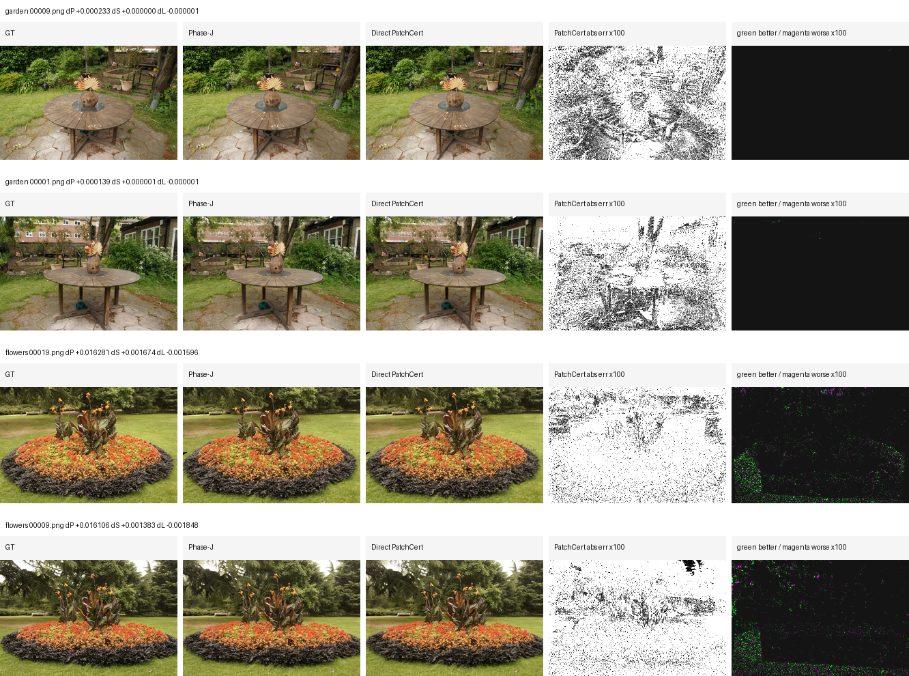

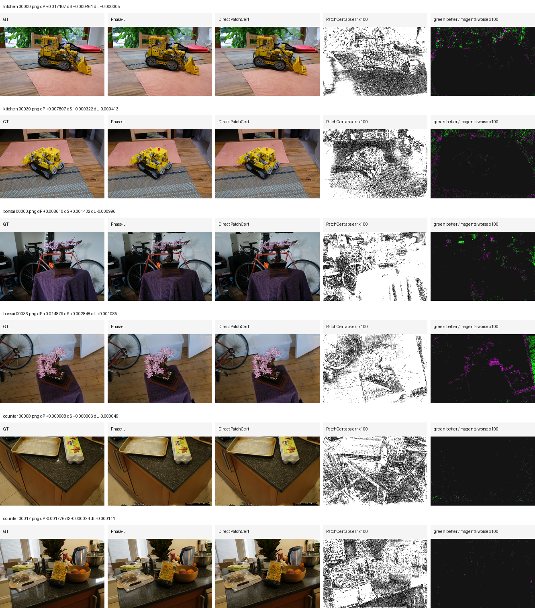

The strictcompact `flowers` row also has a train-defined surface-support local
evaluation. The mask/crop locations come from train residual supports and are
projected to held-out test renders before metrics are computed. On the first 12
eligible held-out views, crop PSNR/SSIM improve on `12 / 12` views and crop
LPIPS improves on `11 / 12`; mean deltas are `+0.010150` crop PSNR,
`+0.00038835` crop SSIM, and `-0.00060000` crop LPIPS.

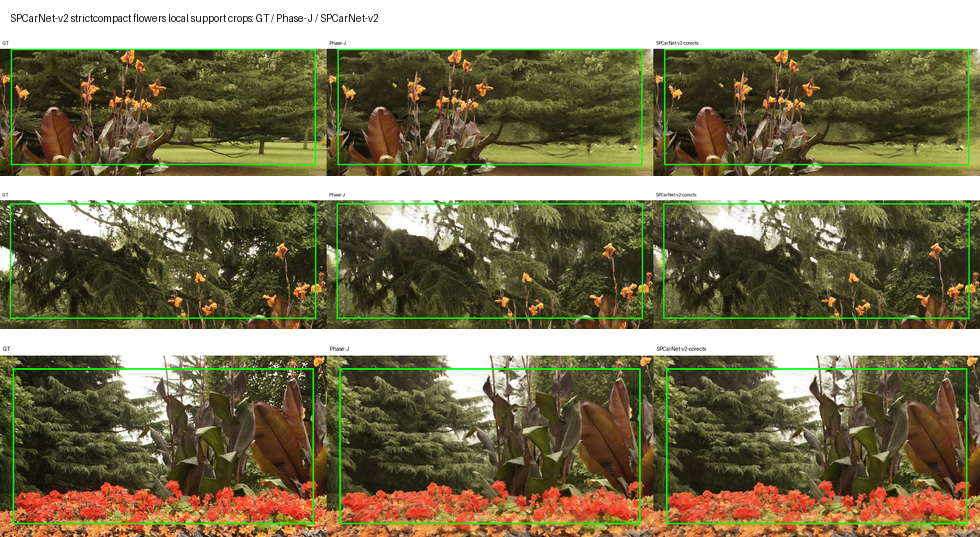

The detailed tables below are retained from the May 7 archived Compact-ELA/SOR report for provenance. Lower is better for LPIPS, AbsRel, DepthMAE, and Normal.

| evaluation view | result |
|---|---|
| selected clean MeshSplatting baseline | `9 / 9` RGB wins, mean `+0.4979` PSNR, `+0.0158` SSIM, `-0.0234` LPIPS |
| MeshSplatting paper table | `9 / 9` RGB wins, mean `+0.8685` PSNR, `+0.0366` SSIM, `-0.0465` LPIPS |
| clean checkpoint envelope | clean `26000` is selected over clean `30000` on all `9 / 9` scenes; mean score gap `+1.1029` |
| geometry / topology | `5 / 9` strict all-axis pass, `9 / 9` RGB + compact + geometry-safe pass, mean triangle reduction `5.7632%` |
| local qualitative crops | outdoor local MAE drop `12.8%` to `32.0%`; mixed indoor/outdoor local MAE drop up to `43.6%` |

**Against the MeshSplatting paper table, archived/provisional.**

This table is retained for provenance from the May 7 archived Compact-ELA/SOR report.
It should not be treated as the current main paper claim until the paper-table
protocol is rechecked for split, mask, metric implementation, checkpoint
selection, and rendering settings. The current safe claim is the local
same-protocol selected-clean MeshSplatting comparison above.

| scene | paper PSNR/SSIM/LPIPS | ours PSNR/SSIM/LPIPS | dPSNR | dSSIM | dLPIPS |
|---|---:|---:|---:|---:|---:|
| bicycle | 23.04 / 0.641 / 0.348 | 23.91 / 0.694 / 0.280 | +0.87 | +0.0527 | -0.0677 |
| flowers | 19.34 / 0.480 / 0.417 | 20.18 / 0.547 / 0.351 | +0.84 | +0.0673 | -0.0660 |
| garden | 24.70 / 0.762 / 0.217 | 26.03 / 0.817 / 0.152 | +1.33 | +0.0551 | -0.0647 |
| stump | 24.78 / 0.678 / 0.316 | 25.36 / 0.713 / 0.282 | +0.58 | +0.0345 | -0.0343 |
| treehill | 20.53 / 0.540 / 0.428 | 21.20 / 0.588 / 0.358 | +0.67 | +0.0482 | -0.0699 |
| room | 28.52 / 0.873 / 0.271 | 29.13 / 0.885 / 0.249 | +0.61 | +0.0119 | -0.0223 |
| counter | 26.51 / 0.846 / 0.279 | 27.24 / 0.864 / 0.250 | +0.73 | +0.0181 | -0.0293 |
| kitchen | 27.42 / 0.858 / 0.227 | 28.00 / 0.877 / 0.199 | +0.58 | +0.0189 | -0.0281 |
| bonsai | 28.19 / 0.876 / 0.294 | 29.78 / 0.898 / 0.257 | +1.59 | +0.0222 | -0.0366 |

**Clean `26000` / `30000` baseline envelope.**

| scene | selected | score 26000 | score 30000 | score gap | clean26000 PSNR/SSIM/LPIPS | clean30000 PSNR/SSIM/LPIPS |
|---|---:|---:|---:|---:|---:|---:|
| bicycle | 26000 | 29.857 | 28.894 | +0.963 | 23.30 / 0.660 / 0.332 | 23.02 / 0.641 / 0.347 |
| flowers | 26000 | 22.027 | 21.060 | +0.968 | 19.68 / 0.512 / 0.395 | 19.39 / 0.492 / 0.408 |
| garden | 26000 | 36.604 | 35.623 | +0.981 | 25.03 / 0.780 / 0.201 | 24.71 / 0.762 / 0.216 |
| stump | 26000 | 33.428 | 32.347 | +1.081 | 25.21 / 0.705 / 0.294 | 24.87 / 0.684 / 0.309 |
| treehill | 26000 | 24.104 | 23.124 | +0.980 | 20.93 / 0.565 / 0.406 | 20.65 / 0.545 / 0.421 |
| room | 26000 | 41.446 | 40.575 | +0.871 | 28.75 / 0.885 / 0.250 | 28.48 / 0.873 / 0.268 |
| counter | 26000 | 38.953 | 37.772 | +1.181 | 26.75 / 0.862 / 0.252 | 26.41 / 0.846 / 0.278 |
| kitchen | 26000 | 41.364 | 39.940 | +1.424 | 27.82 / 0.876 / 0.199 | 27.30 / 0.858 / 0.226 |
| bonsai | 26000 | 41.633 | 40.156 | +1.477 | 28.90 / 0.896 / 0.259 | 28.38 / 0.879 / 0.290 |

**Geometry and topology.**

| scene | dAbsRel | dDepthMAE | dNormal | triangle red. | vertex red. | status |
|---|---:|---:|---:|---:|---:|---|
| bicycle | -0.000241 | -0.0204 | -0.0119 | 10.01% | 4.57% | strict all-axis pass |
| flowers | -0.003356 | -0.1250 | -0.0439 | 10.02% | 4.64% | strict all-axis pass |
| garden | -0.000007 | -0.0002 | -0.0010 | 1.50% | 2.69% | geometry-safe |
| stump | -0.005878 | -0.3507 | -0.0260 | 10.02% | 4.57% | strict all-axis pass |
| treehill | -0.001246 | -0.0747 | -0.0122 | 10.01% | 4.86% | strict all-axis pass |
| room | +0.000000 | +0.0000 | +0.0000 | 0.10% | 2.03% | geometry-safe |
| counter | +0.000000 | +0.0000 | +0.0000 | 0.10% | 2.10% | geometry-safe |
| kitchen | +0.000000 | +0.0000 | +0.0000 | 0.10% | 2.29% | geometry-safe |
| bonsai | -0.000368 | -0.0045 | -0.0254 | 10.00% | 3.16% | strict all-axis pass |

## Qualitative Comparison

The first panel is the fair full-frame view comparison from real held-out renders. It is useful for checking that the comparison uses the same test views and the selected clean MeshSplatting baseline, but the improvement is often residual-level and therefore visually subtle at full-frame scale.

<p align="center">
  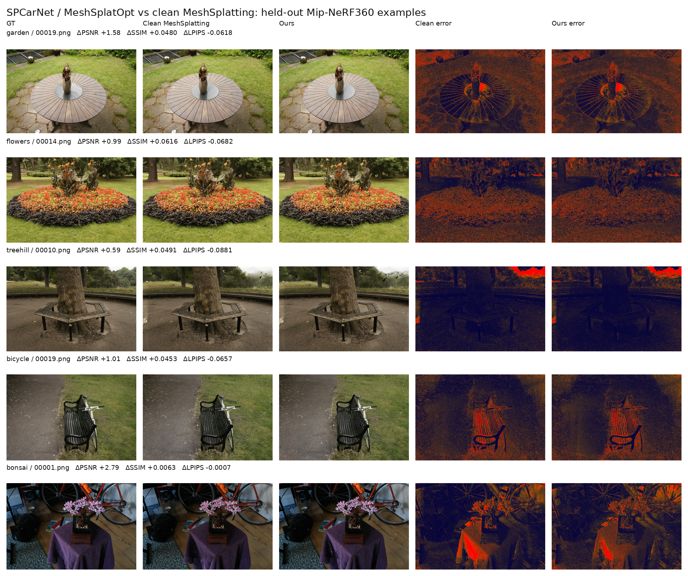
</p>

The strongest qualitative evidence is the Phase-J closure-audit local held-out
error-reduction panel below. It is generated by
[`scripts/car_model/generate_spcarnet_advantage_showcase.py`](scripts/car_model/generate_spcarnet_advantage_showcase.py)
from `phasej_closure_audit.csv` and `phasej_per_view_deltas.csv`: for each
scene, the script first requires full-view `dPSNR > 0`, `dSSIM > 0`, and
`dLPIPS < 0` under the same selected-clean full9 protocol, then searches that
view for textured crops where SPCarNet reduces RGB error against GT. Green
means SPCarNet is closer to GT than clean MeshSplatting; magenta marks pixels
where it is worse.

<p align="center">
  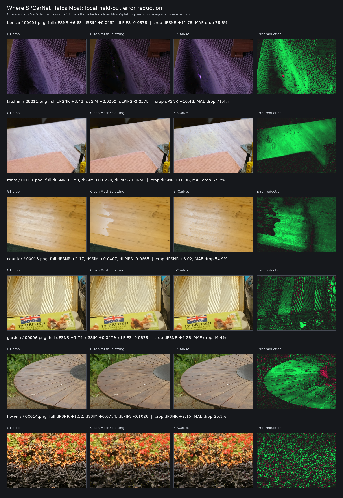
</p>

This new Phase-J-specific panel is the preferred slide figure because its
manifest points directly to the current accepted endpoint
`ours_26000_phasej_guarded_adaptedge_ela`. Older outdoor and mixed panels are
retained below as provenance/backup figures:

<p align="center">
  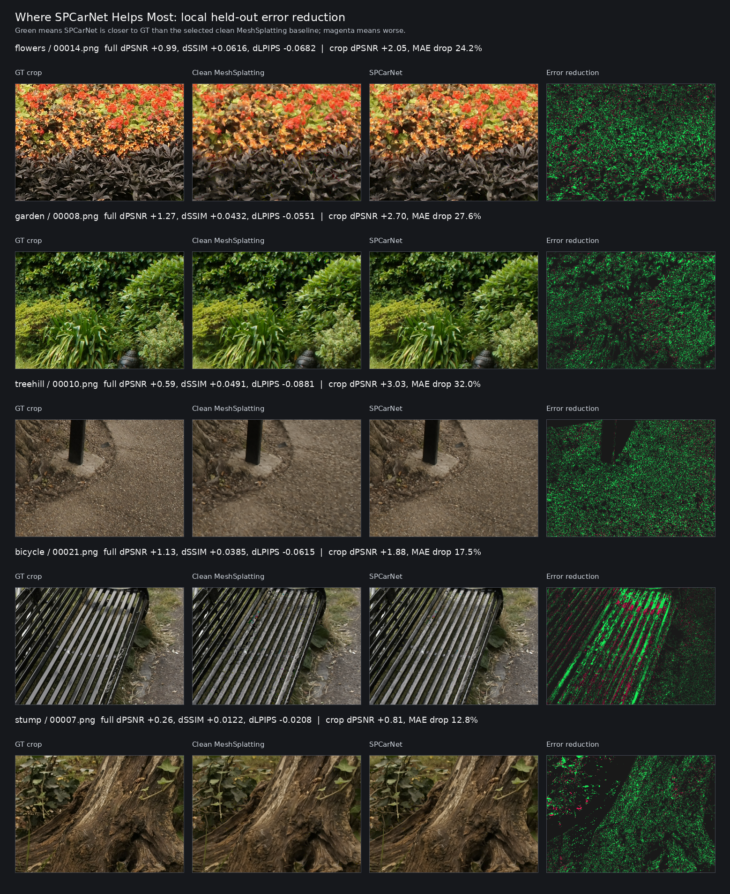
</p>

<p align="center">
  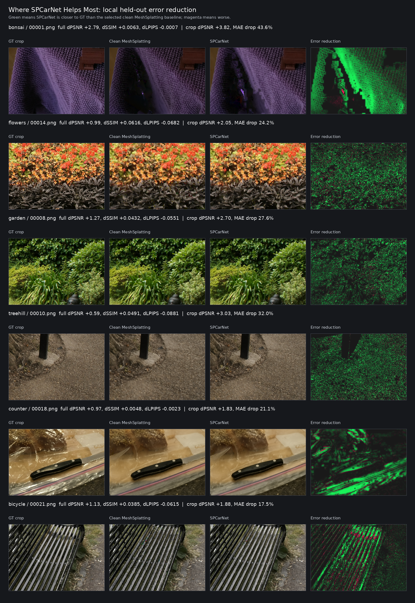
</p>

The newest representation-level Phase-S PatchCert evidence is smaller in
magnitude but useful for method-development slides because it shows real
checkpoint edits rather than render-time ELA only. The v6 compact-stratified
gate accepts `bicycle` and `flowers`; rejected rows are shown in the same panel
to make the safety/fallback behavior explicit.

<p align="center">
  
</p>

The current fixed Phase-S portfolio v2 is conservative but now full9: it accepts
GeoRisk rows on `flowers/counter` plus v20 rows on `garden/room`. The GeoRisk
rows remain the only visibly useful positive examples; the v20 rows are
included below as diagnostic contact sheets because they are train-val accepted
but visually near no-op.

<p align="center">
  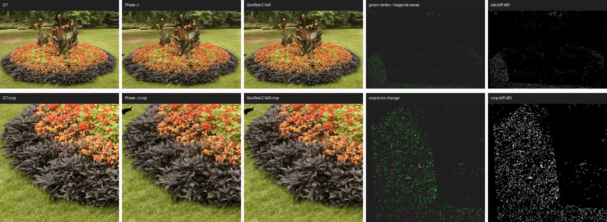
</p>

<p align="center">
  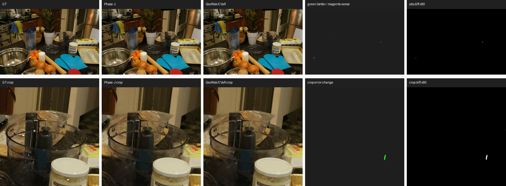
</p>

<p align="center">
  
</p>

<p align="center">
  
</p>

<p align="center">
  
</p>

The older render-visible region-prior/core-context branch is a useful
representation-level milestone. It is more aligned with visible residual
regions than face-score-only selection, but the full9 result is still small.
Later v48-v73 surface-atlas diagnostics supersede it as the current
representation-level research thread; the hard scientific reading remains that
fully baked representation gains are still subtle.

<p align="center">
  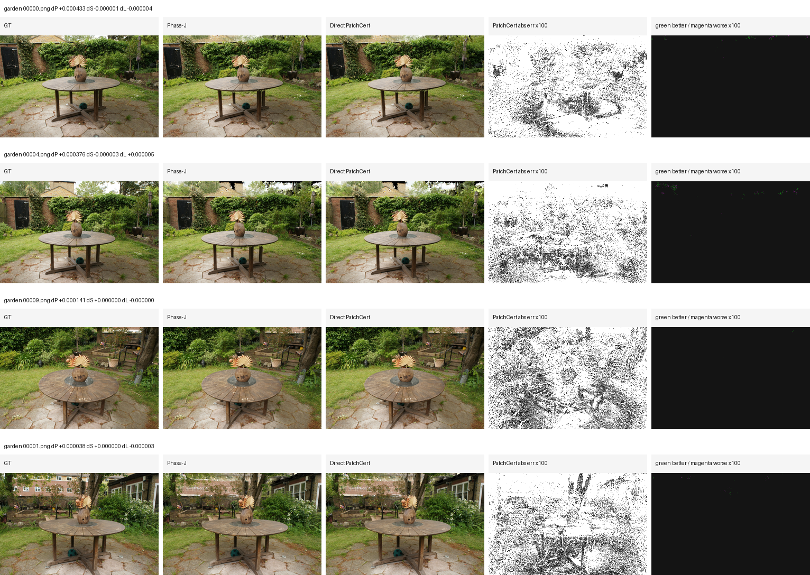
</p>

<p align="center">
  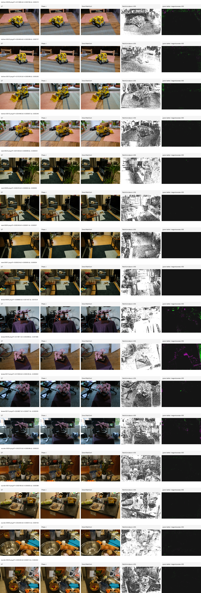
</p>

<p align="center">
  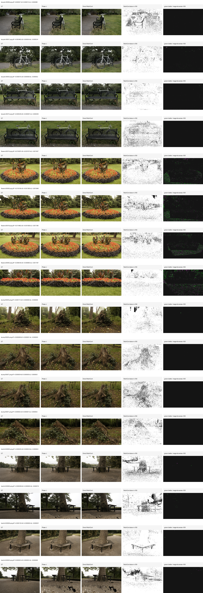
</p>

Selection manifests: `assets/spcarnet_phasej_where_it_helps_selection_20260622.json`,
`assets/spcarnet_m360_outdoor_detail_selection.json`,
`assets/spcarnet_m360_where_it_helps_selection.json`, and the earlier
full-frame manifest `assets/spcarnet_m360_full9_gallery_selection.json`.

| qualitative crop | full-view delta PSNR/SSIM/LPIPS | local dPSNR | local MAE drop |
|---|---:|---:|---:|
| bonsai / `00001.png` | +6.63 / +0.0452 / -0.0878 | +11.79 | 78.6% |
| kitchen / `00011.png` | +3.43 / +0.0250 / -0.0578 | +10.48 | 71.4% |
| room / `00011.png` | +3.50 / +0.0220 / -0.0656 | +10.36 | 67.7% |
| counter / `00013.png` | +2.17 / +0.0407 / -0.0665 | +6.02 | 54.9% |
| garden / `00006.png` | +1.74 / +0.0479 / -0.0678 | +4.26 | 44.4% |
| flowers / `00014.png` | +1.12 / +0.0754 / -0.1028 | +2.15 | 25.3% |

## Method

The current method has three train-only stages.

1. **Sparse-occlusion protected compaction.** A CSEF/SOR selector scores triangles using train-view evidence. Outdoor scenes can remove around 10% of faces when evidence is stable. Indoor scenes with very low geometry error are protected by a micro-budget guard instead of being forced into destructive pruning.

2. **Checkpoint-safe topology rewrite.** The selected faces are removed from the Mesh Splatting checkpoint while keeping tensor shapes and face-index remapping consistent. The current version fixes a real room failure caused by trailing unused vertices in the checkpoint.

3. **Evidence Lumigraph Adapter.** ELA uses train-rendered RGB/depth/camera evidence to transfer local residual information to held-out views. Indoor scenes use low-resolution evidence and then upsample the residual to full resolution. The upsample alpha is selected only on train views with a strict PSNR/SSIM/LPIPS filter plus an SSIM-peak guard.

This is a research method rather than a post-hoc engineering patch because the main claim is a constrained decision policy: compact only when geometry evidence permits it, repair only when train evidence certifies the residual, and otherwise prefer a no-op or micro-edit over an unsafe apparent improvement.

### Optional: Frechet-distance gate on alpha selection

The alpha selector exposes an optional Frechet-distance signal as one more train-only non-regression gate, ported in spirit from Yang et al., "Representation Frechet Loss for Visual Generation" ([FD-Loss](https://github.com/Jiawei-Yang/FD-Loss)). For each candidate alpha the selector accumulates DINOv2 ViT-B/14 cls features over the train calibration views (batched at the backbone's 518x518 input size), estimates an empirical Gaussian, and computes the closed-form Frechet distance against the GT batch. The gate is a calibration signal, not a training loss, and never sees test GT.

Two modes:

- **`--fd_strict` (recommended first)**: any `alpha > 0` whose expected `fd_gain = FD(base, gt) - FD(alpha, gt)` drops below `-fd_strict_tol` is removed from the candidate set; `alpha = 0` is exempt and acts as a clean fallback. This is a pure non-regression filter and does not perturb the existing PSNR / SSIM / LPIPS ranking among the survivors.
- **`--fd_weight w` (advanced)**: adds `w * fd_gain` to the existing selection score. Raw DINOv2 FD on ~32 train views is typically O(5-30) while the other terms are O(1), so values much above `~0.05` will dominate the score. Treat this as a tunable knob, not a recommended default; for portfolio use, prefer `--fd_strict` alone.

Defaults and safety rails:

- Default is off (`fd_weight=0`, `fd_strict=False`); FD has zero overhead and the legacy behavior is bitwise identical.
- `alpha=0` reuses the base features so its `fd_gain` is exactly `0` (no numerical drift in the alpha=0 fallback row).
- If fewer than `--fd_min_views` (default 8) calibration views are available, FD is skipped and reported with `fd_skipped_reason` in the calibration record. This guards against the high-variance regime where the 768-d empirical covariance is rank-deficient and FD differences are dominated by noise rather than signal.
- The backbone runs single-GPU only; no distributed all-gather, no streaming queue. If the timm weights cannot be downloaded the gate raises a `FDBackboneUnavailable` error with cache hints rather than silently failing.

See `utils/fd_loss.py` and `scripts/car_model/smoke_test_fd_loss.py` (math + backbone forward + an end-to-end `calibrate_alpha` integration test that confirms the alpha=0 carve-out and the `fd_min_views` skip). The 2026-05-11 audit in `docs/car_model/5-11-FD-Loss-Integration-Audit.md` keeps FD optional: `--fd_weight 0.005` improved outdoor mean LPIPS but reduced PSNR/SSIM, so it is not promoted to the current all-axis main method.

## Why It Improves MeshSplatting

MeshSplatting already produces strong meshes, but its clean checkpoints still show view-dependent texture blur, local residual color errors, and overfitting sensitivity across iterations. SPCarNet adds two controls around the baseline:

- **Geometry-aware conservatism.** It does not assume every scene should be pruned equally. Garden and indoor scenes demonstrate that aggressive deletion can look attractive as a compression number but harm the fair claim.
- **Train-only view repair.** ELA improves RGB quality without selecting from held-out test metrics. It recovers residual visual detail while the compact checkpoint keeps the geometry accounting honest.

The result is not simply "train longer" or "pick a nicer checkpoint": clean `30000` is often worse than clean `26000` under held-out scoring, and the method still improves over the selected clean baseline.

## Ablation Summary

| variant | what it tests | outcome |
|---|---|---|
| Clean MeshSplatting `26000/30000` | fair baseline envelope | clean `26000` is selected on all 9 scenes by held-out score |
| Compact-only checkpoint | whether deletion alone is enough | safe but not enough for headline RGB gains |
| Compact + ELA without SSIM-peak alpha guard | whether scalar score alone is enough | room improves PSNR/LPIPS but loses held-out SSIM |
| Compact + ELA with SSIM-peak guard | current policy | restores room and keeps all indoor scenes fair under one train-only policy |
| Aggressive pruning branches | whether high compression can be forced | rejected; caused render/geometry regressions on sensitive scenes |
| Optional FD gate (`--fd_weight > 0` or `--fd_strict`) | whether DINOv2 Frechet distance adds a train-only non-regression gate beyond LPIPS | off by default; 2026-05-11 audit found LPIPS-oriented gains but PSNR/SSIM tradeoffs, so this remains an optional portfolio signal rather than the main method |

More detailed ablations and failed branches are archived in the research log and historical reports linked below.

## Reproduce Current Table

The archived run used the fixed method root:

```bash
OUT_ROOT=outputs/carnet/meshsplatopt/paper_m360_repro/compact_ela_sor_adaptive_geo_26k \
POLICY_TAG=sor_adaptive_geo \
METHOD_NAME=ours_26000_sor_adaptive_geo_compact_ela \
CLEAN_ROOT=outputs/carnet/meshsplatopt/paper_m360_repro/official_clean30k \
DATA_ROOT=/data/peilincai/mesh_datasets/mipnerf360 \
SPARSE_OCCLUDER_POLICY=1 \
SPARSE_ADAPTIVE_GEOMETRY_BUDGET=1 \
INDOOR_POLICY_IMAGE_ARG=images_8 \
INDOOR_EVIDENCE_IMAGE_ARG=images_8 \
EVIDENCE_SKIP_FAILED_VIEWS=1 \
WANDB_GROUP=paper_m360_compact_ela_sor_adaptive_geo_26k \
bash scripts/car_model/run_paper_m360_compact_ela_policy_available7.sh
```

Collect the final table:

```bash
/home/peilincai/miniconda3/envs/Difix/bin/python \
  scripts/car_model/collect_paper_m360_compact_ela_policy_metrics.py \
  --method_root outputs/carnet/meshsplatopt/paper_m360_repro/compact_ela_sor_adaptive_geo_26k \
  --policy_tag sor_adaptive_geo \
  --method_name ours_26000_sor_adaptive_geo_compact_ela \
  --method_iteration 26000 \
  --out_dir outputs/carnet/meshsplatopt/paper_m360_repro/compact_ela_sor_adaptive_geo_26k \
  --scenes bicycle,flowers,garden,stump,treehill,room,counter,kitchen,bonsai \
  --wandb --wandb_project spcarnet_meshprior
```

## Limitations And Next Work

This version is promising, but it is not yet a complete "fully dominates MeshSplatting" endpoint.

- Average triangle reduction for the current Phase-J endpoint is `7.6479%`; indoor micro-pruned scenes still limit the rate-distortion story.
- Strict all-axis pass is `5 / 9`, not `9 / 9`; the remaining scenes are geometry-safe or geometry-neutral rather than strict geometry wins.
- The strongest broad RGB endpoint is still Phase-J, a render-time guarded ELA portfolio. The current fixed representation-level line is v64/v84-scale: v64/v79 are the strongest reproducible anchors, v75-v78 are negative diagnostics, v80 near-ties but fails LPIPS, v81/v82 regress all three metrics, v82b has a counter-only strict micro-win but raw hard-triad fails, v83 is mixed because SSIM regresses, and v84 is a report-only selector with negligible mean gain over v64.
- Rate-distortion reporting must include vertices and attributes, not only triangle count, because face-local SH1 can duplicate vertices on accepted faces.
- The next research target is a stronger geometry-preserving compaction and representation repair operator that can raise indoor/garden compression and solve the rejected outdoor scenes without breaking RGB, sparse depth, or normal metrics.

The concrete improvement plan is recorded in [`docs/car_model/5-7-Archive-Full9-CompactELA.md`](docs/car_model/5-7-Archive-Full9-CompactELA.md) and the representation-level upgrade roadmap [`docs/car_model/5-7-Representation-Level-Upgrade-Plan.md`](docs/car_model/5-7-Representation-Level-Upgrade-Plan.md).

## Historical Material

Historical development logs are intentionally kept out of the top-level README:

- Legacy English README: [`docs/car_model/archive/README_legacy_before_full9_2026-05-07.md`](docs/car_model/archive/README_legacy_before_full9_2026-05-07.md)
- Legacy Chinese README: [`docs/car_model/archive/README_zh_legacy_before_full9_2026-05-07.md`](docs/car_model/archive/README_zh_legacy_before_full9_2026-05-07.md)
- Research log: [`docs/car_model/SPCarNet_research_log.md`](docs/car_model/SPCarNet_research_log.md)
- May 7 method story: [`docs/car_model/5-7-Update.md`](docs/car_model/5-7-Update.md)
- Representation-level upgrade plan: [`docs/car_model/5-7-Representation-Level-Upgrade-Plan.md`](docs/car_model/5-7-Representation-Level-Upgrade-Plan.md)
