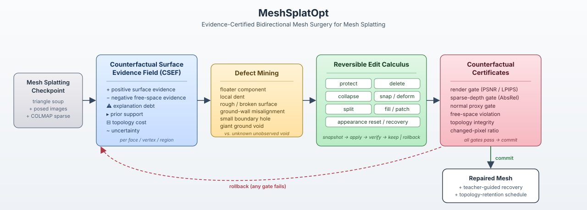
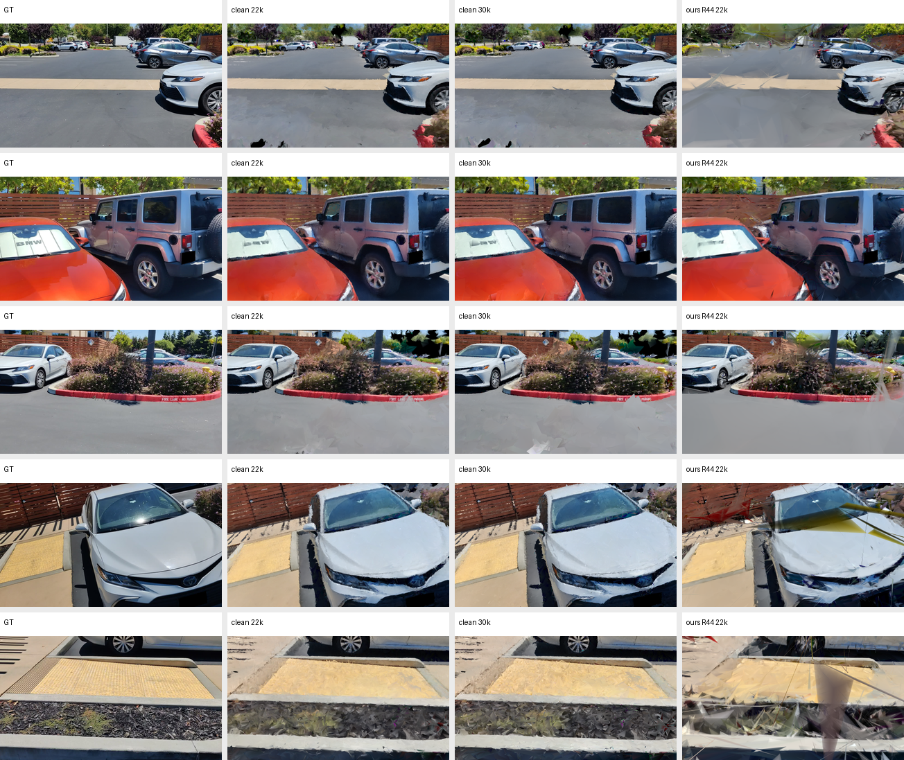
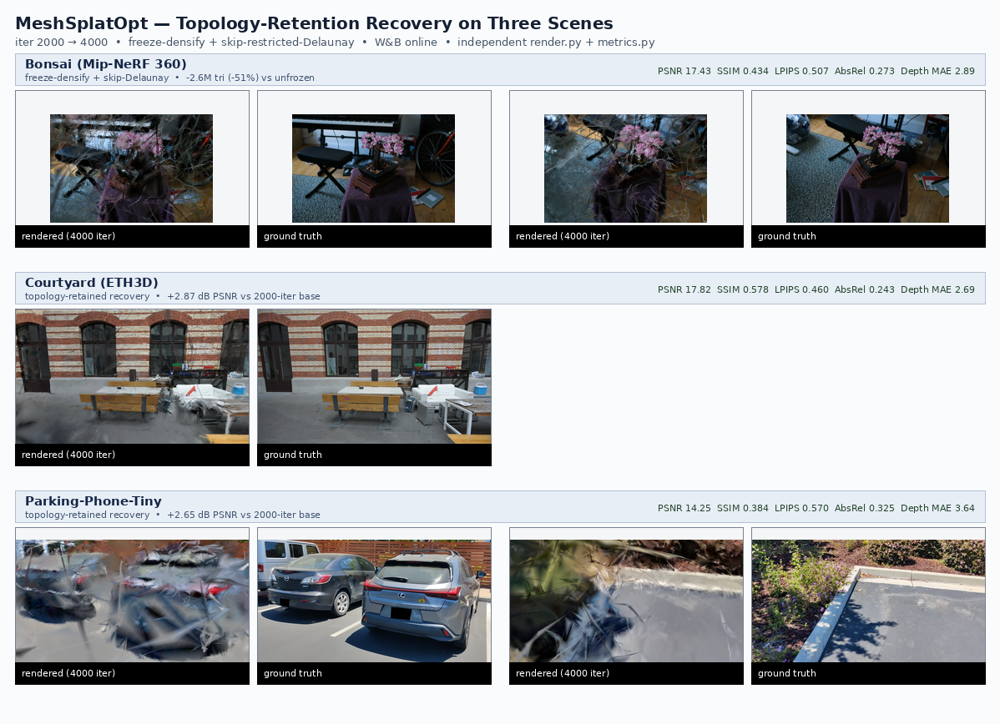

<h1 align="center">MeshSplatOpt</h1>
<p align="center"><em>Evidence-Certified Bidirectional Mesh Surgery for Mesh Splatting</em></p>

<div align="center">
  <a href="docs/NeurIPSRepairPrompts.md">NeurIPS roadmap</a> &nbsp;|&nbsp;
  <a href="docs/car_model/parking_clean_to_compact_repair_report.md">Clean-to-compact repair</a> &nbsp;|&nbsp;
  <a href="docs/car_model/parking_best_clean_long_vs_method_long_report.md">Clean-baseline correction</a>
</div>

<br>

<div align="center">
  
</div>

> **In one sentence (intent).** Existing Mesh-Splatting / 3DGS pruning methods ask *which primitives can be removed*; MeshSplatOpt asks *which local surface edit best reduces scene-evidence debt while remaining counterfactually certified by held-out rendering and sparse geometry.* The same edit calculus is meant to handle deletion, collapse, snapping, splitting, hole filling, and appearance recovery — every committed edit must clear render, sparse-depth, normal, free-space, and topology certificates, otherwise it rolls back.

> **In one sentence (current evidence).** As of 2026-05-03, the R44 sparse-depth low-topology path failed against the strongest clean long baseline, but the new **clean-to-compact recovery path** (clean 22k -> 80% area-prune -> fixed-topology recovery) restores clean-level render quality with only 20% of the clean-long triangles: R48.01 reaches PSNR 18.620 / SSIM 0.642 / LPIPS 0.349 at 1.71M triangles, beating clean 22k on PSNR, SSIM, AbsRel, and Depth MAE while nearly tying LPIPS.

The method scaffold (CSEF + reversible edit calculus + counterfactual certificates) and the recovery recipe are kept honest by separating *what passed every gate* from *what actually improved the headline metrics*. This README documents both.

---

## Honest project status

R0 → R48. Stages with `_FAIL`, `REJECTED`, or `MIXED` decisions are the failure-evidence backbone of the current paper-discipline story.

### Method scaffold (R0–R15)

| stage | scope | decision |
|---|---|---|
| R0 | branch, audit, pivot lock | `PASS` |
| R1–R2 | RFC + related-work / novelty matrix | `PASS` |
| R3 | CSEF data model + diagnostics | `PASS` |
| R4 | defect mining (floater / dent / rough / misalign / hole / giant void) | `PASS` |
| R5 | unified reversible edit abstraction (snapshot · apply · rollback) | `PASS` |
| R6 | strong delete / collapse / merge baselines | `PASS` |
| R7 | snap / deform proposals | `PASS` |
| R8 | giant ground-void & large-hole fill proposals | `PASS` |
| R9 | object-prior vehicle-region repair (gated) | `PASS` |
| R10 | generalized counterfactual validation for arbitrary edits | `PASS` |
| R11 | teacher-guided appearance & geometry recovery | `PASS` |
| R12 | edit portfolio & repair state machine | `PASS` |
| R13 | synthetic repair benchmark | `PASS` (full ≥ delete-only on 5 / 7 categories; unknown void rejected) |
| R14 | real-checkpoint dry-runs, render-backed gates, freeze-densify schedule | `TOPOLOGY_RETENTION_PASS` |
| R15 | three-scene medium-budget freeze validation | `MULTI_SCENE_SCHEDULE_PASS_SNAP_SELECTOR_WEAK` |

### Selector and edit-primitive failure log (R16–R26)

| stage | scope | decision |
|---|---|---|
| R16 | three-scene **full**-budget freeze (2000 → 7000) | `THREE_SCENE_FULL_SCHEDULE_PASS` (schedule, not edit) |
| R17.01–R17.05 | area-seeded / portfolio local snap | `PORTFOLIO_SNAP_GATE_PASS_RECOVERY_QUALITY_FAIL` |
| R17.06 | risk-filtered area snap (boundary excl., uncertainty cap) | `RISK_FILTERED_LOCAL_SNAP_GATE_PASS` (numerical-noise deltas) |
| R18.01–R18.03 | train-residual snap (parking) | `GATE_PASS_RECOVERY_MOSTLY_POSITIVE` (small effect) |
| R19.01–R19.08 | residual snap, cross-scene (courtyard + bonsai) | `CROSS_SCENE_GATE_PASS_RECOVERY_MIXED_POSITIVE` |
| R20 | parking medium residual snap (2000 → 4000) | `MEDIUM_RESIDUAL_SNAP_DEPTH_GAIN_RENDER_QUALITY_FAIL` |
| R21 | residual **patch** snap (k-hop expansion) | `PATCH_SNAP_GATE_PASS_RECOVERY_MIXED` |
| R22 | boundary fan `FILL_PATCH` (parking) | `BOUNDARY_FILL_GATE_PASS_SHORT_PROMISING_MEDIUM_FAIL` |
| R23 | residual-aware boundary-loop selector | `SELECTOR_PASS_GEOMETRY_STILL_WEAK` |
| R24 | nearest-face field initialization on appended fill faces | `PASS` (engineering only) |
| R25 | unfrozen densification post-edit (diagnostic) | `FAIL` — topology blew up to 5.89M tri |
| R26 | plane-grid Delaunay fill (51 v / 106 f) | `FILL_INIT_GRID_ENGINEERING_PASS_MEDIUM_REPAIR_FAIL` |

### Recovery-recipe wins and the clean-baseline correction (R27–R48)

| stage | scope | decision |
|---|---|---|
| R27 | low-λ sparse-COLMAP-depth recovery, λ = 0.005 (medium) | `SPARSE_DEPTH_REPAIR_MEDIUM_PASS`, but matched control shows **sparse-recovery is the dominant contributor** |
| R28 | full-budget grid-fill + sparse vs matched baseline+sparse | **`SPARSE_DEPTH_FULL_PASS_GRID_FILL_REJECTED`** — the edit does not beat baseline+sparse at 7000 |
| R29 | alternate sparse-depth loss spaces (relative / log) | `LOSS_SPACE_DIAGNOSTIC_REJECTED_FOR_PARKING_FULL` |
| R30 | long-horizon continuation up to 20 000 iter | `RENDER_EARLY_STOP_AT_16000` |
| R31 | cross-scene sparse recovery on courtyard + bonsai | `CROSS_SCENE_SPARSE_RECOVERY_PASS` |
| R32–R36 | trusted (low-error) sparse correspondence sampling | `TRUSTED_SAMPLING_GEOMETRY_PASS_RENDER_MIXED` (per-scene fraction) |
| R37 | error-stratified sampler | rejected — controlled negative |
| R38–R39 | λ fine-sweep (0.005 → 0.002) | `NEW_STRONGEST_PARKING_RESULT_AND_LAMBDA_CURVE_PASS` |
| R40–R42 | low-λ regime + cross-scene jump (R40.02 courtyard) | `LOW_LAMBDA_CROSS_SCENE_STRONG_PASS` |
| R43 | long-horizon validation 16k → 30k / 7k → 20k | `LONG_HORIZON_VALIDATION_SPLIT` (parking overtraining; courtyard render-only) |
| R44 | sparse-depth **decay** schedule | `SPARSE_DECAY_LONG_HORIZON_REPAIR_PARTIAL_PASS_CLEAN_LONG_RENDER_FAIL` |
| R45–R46 | clean-render teacher loss from the low-topology R44 checkpoint | `LOW_TOPOLOGY_TEACHER_DISTILLATION_REJECTED` |
| R47–R50 | clean 22k -> area compaction -> topology-frozen recovery | `CLEAN_TO_COMPACT_RECOVERY_PASS_EARLY_STOP_AT_26K` |

The **R44.01 vs clean 22k** comparison is the load-bearing failure evidence — see `docs/car_model/parking_best_clean_long_vs_method_long_report.md`. The R48 repair that follows it is documented in `docs/car_model/parking_clean_to_compact_repair_report.md`.

---

## Where the method actually stands today

### What is validated

- **Sparse-COLMAP-depth supervision during recovery** is the dominant contributor to every measurable metric improvement on parking, courtyard, and bonsai. Validated regime: λ ∈ [0.001, 0.002], `mixed_low_error` correspondence sampling with a per-scene trusted fraction (parking 0.50, courtyard 0.625, bonsai 0.50), decay window after the geometry has anchored.
- **Clean-to-compact recovery is now the strongest parking route.** R48.01 starts from clean 22k, prunes the smallest-area 80% of triangles, freezes topology, and recovers from 22k to 26k. It reaches PSNR 18.620 / SSIM 0.642 / LPIPS 0.349 with 1,709,648 triangles, versus clean 22k at PSNR 18.480 / SSIM 0.635 / LPIPS 0.347 with 8,548,242 triangles. R49/R50 reject continuation to 30k, so R48.01 is the accepted early-stop checkpoint.
- **Topology-retention freeze schedule** keeps checkpoint connectivity through the recovery window. Use `--freeze_topology_updates --skip_restricted_delaunay` for strict fixed-topology continuation; older runs that used only `--densify_until_iter <load_iter> --skip_restricted_delaunay` are topology-retention schedules, not a hard no-mutation guarantee. Without topology retention, R25 demonstrates that unbounded post-edit densification grows parking from 0.78M -> 5.89M triangles and *still* loses render.
- **Strict topology-freeze now has an explicit guard.** Use `--freeze_topology_updates --skip_restricted_delaunay` for fixed-topology continuation. `--skip_restricted_delaunay` alone skips only the Delaunay refresh; it does not disable the standard prune/densify branch.
- **The full reversible edit pipeline** — proposal JSON → snapshot → apply → render-backed counterfactual gate → automatic rollback — works end-to-end on real Mesh Splatting checkpoints for `SNAP_VERTICES`, `FILL_PATCH` (fan and Delaunay grid), and the synthetic R13 set.
- **The synthetic repair benchmark passes** on `giant_ground_void`, `ground_wall_misalignment`, `local_dent`, `noisy_rough_patch`, and `small_hole`; the unobserved-void case is correctly rejected in normal mode.

### What does *not* work yet

- **Edit primitives do not improve the headline metrics at full budget.** R28 ablates this directly: matched baseline + sparse-depth (no edit) ties or beats grid-fill + sparse-depth at iter 7000 on parking PSNR. The fill / snap edits are gate-safe and trainable, not quality-improving on their own.
- **The ultra-low-topology R44 path still loses on render.** Clean current-branch 22k reaches PSNR 18.48 / SSIM 0.635 / LPIPS 0.347; R44.01 reaches PSNR 17.17 / SSIM 0.549 / LPIPS 0.442. R44.01 remains useful only as a very-small-topology / normal-proxy point.
- **Teacher render distillation from R44 does not fix the failure.** R45 full-image teacher loss and R46 counterfactual masked teacher loss both reduce render quality from the R44 starting point, so the accepted repair is clean-to-compact, not low-topology teacher distillation.
- **Long-horizon training without sparse-depth decay overshoots.** R43.01b at 30 000 iter loses 0.90 dB PSNR vs the 22 000-iter checkpoint. R44 fixes this with a decay window, but only partially — courtyard tolerates `7k → 20k` with decay; parking does not benefit beyond `≈22k`.
- **Trusted sparse-correspondence sampling is per-scene-tunable, not universal.** R33 / R36 show that the fraction (0.50 vs 0.625) does not transfer cleanly across scenes; the geometry knob must be set per scene and reported as a Pareto column, not a constant.
- **Area-seeded snap selectors fail.** R17 (area portfolio) and R17.06 (risk-filtered area) deliver only numerical-noise gate deltas and lose to equal-budget continuation on PSNR / SSIM / depth / normal.
- **Residual-driven snap and patch-snap are tiny effects.** R18 / R19 / R21 pass the gate but recovery deltas remain in the third decimal of PSNR; R20 medium recovery confirms a depth-only gain at the cost of render.
- **Boundary `FILL_PATCH` fails medium recovery.** R22 fan fill is gate-safe and short-promising but loses at 4000 iter; R23 residual-aware re-ranking does not change which loop is picked; R26 plane-grid Delaunay fill (51 v / 106 f) clears the gate but R28 shows it loses at 7000 iter to baseline+sparse.
- **Unbounded post-edit densification is not a recovery strategy.** R25 grew parking to 5.89M triangles and still ended at PSNR 12.03 / SSIM 0.31 — strictly worse than the frozen-topology recovery.
- **Alternative sparse-depth loss spaces (`relative`, `log`, `inverse`) are rejected** for parking full budget — the original metric-depth Smooth-L1 form remains the validated variant.

A short summary of the "what does and does not work" carved out of R0–R44 lives in [`docs/car_model/SPCarNet_research_log.md`](docs/car_model/SPCarNet_research_log.md).

---

## Headline result figure (clean long vs ours, parking)

The fair comparison: each row is one held-out test view; columns are GT, the strongest clean long-horizon baselines (current-branch 22k and 30k), the failed low-topology R44 branch, and the repaired R48 clean-to-compact branch.

<div align="center">
  
</div>

| run | iter | PSNR ↑ | SSIM ↑ | LPIPS ↓ | AbsRel ↓ | Depth MAE ↓ | Normal ° ↓ | triangles |
|---|---:|---:|---:|---:|---:|---:|---:|---:|
| clean 7k (historical, weak ref) | 7 000 | 17.20 | 0.535 | 0.451 | 0.076 | 1.75 | 45.56 | 833 775 |
| **clean 22k (strongest baseline)** | 22 000 | **18.48** | **0.635** | **0.347** | 0.082 | **1.87** | 45.11 | 8 548 242 |
| clean 30k | 30 000 | 18.41 | 0.632 | 0.351 | **0.082** | 1.87 | 44.84 | 8 548 242 |
| **ours R44 22k (decay)** | 22 000 | 17.17 | 0.549 | 0.442 | 0.187 | 2.92 | **42.22** | **782 982** |
| **ours R48 26k (clean-to-compact)** | 26 000 | **18.62** | **0.642** | 0.349 | **0.080** | **1.85** | 44.74 | 1 709 648 |
| ours R50 30k (true topology-frozen continuation) | 30 000 | 18.45 | 0.629 | 0.361 | 0.081 | 1.84 | 45.32 | 1 709 648 |
| ours R43 30k (no decay) | 30 000 | 16.25 | 0.511 | 0.477 | 0.194 | 3.02 | 43.71 | 782 982 |

`clean 22k` dominates the old R44 low-topology branch, but R48.01 repairs the failure by preserving clean-level render quality after 80% area compaction. Pre-R44 comparisons that quoted the `clean 7k` baseline were misleading and are now retired.

The earlier multi-scene medium-budget panel (R14.21b / R15.01–R15.04, three scenes at iter 4000 under the freeze schedule) is kept as intermediate diagnostic evidence:

<div align="center">
  
</div>

These medium-budget renders pass the topology-retention story (bonsai −51% triangles vs unfrozen 4000-iter continuation, courtyard +2.87 dB, parking +2.65 dB) but the unfrozen 4000-iter is **not** the strongest clean baseline. They are now framed as schedule diagnostics, not as the headline.

---

## Counterfactual Surface Evidence Field (CSEF)

Every candidate edit consults a per-face / per-vertex / per-region field with the following channels:

```text
CSEF(x, n, region) = {
  positive_surface_evidence,        # multi-view visibility, COLMAP support, normal agreement, prior support
  negative_free_space_evidence,     # camera rays / sparse points indicating "nothing here"
  explanation_debt,                 # residual pixels, boundary holes, missing depth, unmatched semantics
  prior_support,                    # plane / object / symmetry / smoothness priors
  topology_cost,                    # ∆triangles, ∆memory, ∆render cost
  uncertainty                       # low evidence, posterior variance, poor coverage
}
```

The edit objective is

```text
maximize  evidence_debt_reduction(edit)
        + render_quality_gain(edit)
        + geometry_consistency_gain(edit)
        − free_space_violation(edit)
        − hallucination_risk(edit)
        − topology_cost(edit)
```

subject to render, sparse-depth, normal-proxy, free-space, topology, and changed-pixel certificates all clearing. CSEF is the proposal source; the certificates are the dispositional gate. R17–R26 evidence shows that **the gate works as intended** — every edit type is gate-safe and reversible. The remaining open problem is the **proposal score**: it is not yet predictive enough of post-recovery render gain to outperform a matched baseline+sparse control.

## Reversible edit calculus

Seven first-class operations, all backed by `snapshot → apply → verify → keep | rollback`:

| op | role | current empirical state |
|---|---|---|
| `protect` | preserve supported geometry from later edits | works |
| `delete / prune` | remove unsupported floaters and redundant topology | gate-safe; PRISM line is the named baseline |
| `collapse / merge` | reduce topology while preserving supported surfaces | implemented; not the source of current Pareto win |
| `snap / deform` | correct dents, rough patches, plane / wall misalignment | R17–R21: gate-safe but recovery-quality fail / mixed |
| `split / subdivide` | allocate topology where the mesh under-explains evidence | implemented; not yet load-bearing |
| `fill / patch` | repair small holes and certified giant ground voids | R22 / R26: gate-safe; medium / full **fail** vs baseline+sparse |
| `appearance reset / recovery` | restore radiance after geometry repair | R11 / R44 sparse-decay: load-bearing |

Giant-hole policy distinguishes **observed**, **prior-supported**, and **unknown unobserved** voids: the third is rejected in normal mode and only proposed under an explicit `--allow_prior_only_fill` diagnostic flag — and even then it is labelled `prior_only_flag=true` and excluded from headline metrics.

---

## Validated recovery recipe (parking, the only fully-tuned scene)

```bash
# Edit + recovery on a real Mesh Splatting checkpoint. The edit is reversible and
# gate-checked, but at full budget the dominant contributor is sparse-depth
# supervision with a decay window — keep both rows in the report.
python scripts/car_model/meshsplatopt_run_teacher_recovery.py \
    --model_path <checkpoint_dir> \
    --edit_json   <accepted_edits.json> \
    --output_dir  outputs/carnet/meshsplatopt/<run_name> \
    --load_iteration 16000 --iterations 6000 \
    --train_extra_args " \
       --densify_until_iter 16000 --skip_restricted_delaunay \
       --enable_sparse_colmap_depth_loss \
       --lambda_sparse_colmap_depth 0.001 \
       --sparse_colmap_depth_start_iter 16000 \
       --sparse_colmap_depth_warmup_iters 50 \
       --sparse_colmap_depth_min_matches 16 \
       --sparse_colmap_depth_sample_mode mixed_low_error \
       --sparse_colmap_depth_low_error_fraction 0.50 \
       --sparse_colmap_depth_decay_start_iter 16000 \
       --sparse_colmap_depth_decay_end_iter   20000 \
       --sparse_colmap_depth_decay_final_mult 0.0 \
       --sparse_colmap_depth_enable_in_final_finetune"

# Independent paper-facing eval (never mixed with training metrics).
python render.py  -m outputs/carnet/meshsplatopt/<run_name>/recovery_model
python metrics.py -m outputs/carnet/meshsplatopt/<run_name>/recovery_model
python evaluate_geometry_colmap.py -s <scene> \
    -m outputs/carnet/meshsplatopt/<run_name>/recovery_model --iteration 22000 --eval \
    --output outputs/carnet/meshsplatopt/<run_name>/recovery_model/geometry_eval_colmap/iter_22000.json
```

For courtyard the validated regime is fraction `0.625`, λ `0.002`, `7k → 20k` with decay starting at 7k. For bonsai the validated regime is fraction `0.50`, λ `0.002`, `2k → 7k` (longer continuation has not yet been validated).

Reproducible paper-facing tables are written by:

```bash
python scripts/car_model/meshsplatopt_collect_sparse_recovery_results.py
# → outputs/carnet/meshsplatopt/sparse_recovery_tables/{json,csv,md}
```

## Repository layout (MeshSplatOpt additions)

```text
ss3dm_prior/meshsplatopt/        core method
  csef_types.py / csef_builder.py
  defect_types.py / defect_mining.py
  edit_types.py / edit_apply.py / edit_snapshot.py
  topology_baselines.py
  snap_proposals.py
  hole_fill.py / ground_void_fill.py
  object_prior_repair.py
  counterfactual_edit_gate.py
  teacher_recovery.py
  edit_portfolio.py / repair_state_machine.py
  synthetic_damage.py
  checkpoint_adapter.py            # nearest-face init for FILL_PATCH

scripts/car_model/                 CLI entry points
  meshsplatopt_build_csef.py
  meshsplatopt_mine_defects.py
  meshsplatopt_make_snap_proposals.py
  meshsplatopt_make_fill_proposals.py
  meshsplatopt_select_checkpoint_local_snap_edit.py        # R17 area / R17.06 risk-filtered
  meshsplatopt_select_checkpoint_residual_snap_edit.py     # R18 / R19
  meshsplatopt_expand_snap_edit_to_patch.py                # R21
  meshsplatopt_select_checkpoint_boundary_fill_edit.py     # R22 / R23
  meshsplatopt_expand_boundary_fill_to_grid.py             # R26
  meshsplatopt_validate_edit_counterfactual.py
  meshsplatopt_run_teacher_recovery.py                     # accepts --train_extra_args
  meshsplatopt_run_repair_state_machine.py
  meshsplatopt_collect_sparse_recovery_results.py          # paper-table collector

docs/car_model/                    per-stage design / implementation / smoke / report files
docs/NeurIPSRepairPrompts.md       full R0–R17 stage spec (drafted before R44)
outputs/carnet/meshsplatopt/       per-stage artefacts (proposals, gates, snapshots, recoveries, results.json)
outputs/carnet/meshsplatopt/sparse_recovery_tables/        paper-facing JSON / CSV / Markdown
outputs/carnet/meshsplatopt/best_clean_long_vs_method_long/  fair clean-baseline correction
```

The PRISM safety stack (`utils/prism_*`, `ss3dm_prior/meshprior/*`) is preserved and re-used as the rollback / counterfactual primitives — Stage 35 PRISM remains a named baseline rather than the final method.

---

## Operating rules (non-negotiable)

These come from `docs/NeurIPSRepairPrompts.md` §3 and are enforced per-stage:

1. Work one stage at a time; do not proceed after a failed hard gate.
2. Never mix training-time metrics with independent `render.py + metrics.py` metrics.
3. Never use ground truth to choose proposals at inference time.
4. Every edit type must support rollback; the gate must rollback automatically on reject.
5. Every accepted repair must have an audit trail: proposal JSON, before / after snapshots, gate report, W&B link if trained, independent metrics if rendered.
6. Old PRISM stages remain named baselines and are not overwritten.
7. All training runs use W&B online (`WANDB_PROJECT=spcarnet_meshprior`).
8. Every stage writes design, implementation, smoke, and research-log entries.
9. **Negative results are first-class.** Failed gates and `*_FAIL` / `*_REJECTED` decisions stay in the research log and the README; they are the discipline that prevents over-claiming.

---

## Mesh-Splatting foundation

MeshSplatOpt builds on the differentiable opaque-mesh renderer from [MeshSplatting](https://meshsplatting.github.io). The original training, rendering, and evaluation entry points are unchanged on this branch and remain the way to produce input checkpoints.

### Install

```bash
git clone https://github.com/meshsplatting/mesh-splatting --recursive
cd mesh-splatting
micromamba create -n mesh_splatting python=3.11
micromamba activate mesh_splatting
micromamba install nvidia/label/cuda-12.6.0::cuda
pip install torch==2.7.1 torchvision==0.22.1
pip install -r requirements.txt
bash compile.sh
( cd submodules/simple-knn && pip install . --no-build-isolation )
( cd submodules/effrdel    && pip install -e . )
```

Optional fused-SSIM speed-up:

```bash
pip install git+https://github.com/rahul-goel/fused-ssim/ --no-build-isolation
```

### Train / render / evaluate

```bash
python train.py -s <scene> -m <output_model_path> --eval                      # outdoor
python train.py -s <scene> -m <output_model_path> --indoor --eval             # indoor
python full_eval.py --mipnerf360 <path_to_mipnerf360> --output_path <save>    # MipNeRF-360 sweep
python render.py  -m <model>
python metrics.py -m <model>
python evaluate_geometry_colmap.py -s <scene> -m <model> --iteration <iter> --eval \
    --output <model>/geometry_eval_colmap/iter_<iter>.json                    # COLMAP sparse depth + PCA-normal proxy
```

Optional explicit train/test split (strict out-of-train holdout):

```bash
python create_colmap_outoftrain_split.py -s <scene> -o <scene>/sparse/0/split_outoftrain_v1.json --test_ratio 0.12 --gap_ratio 0.03
python train.py -s <scene> -m <model> --eval --split_strategy file --split_file <split_json>
```

Depth and normal supervision hooks (`extract_normals.py`, `Depth-Anything-V2`, `utils/make_depth_scale.py`) and the SAM-based object-extraction pipeline (`segmentation/*`) are unchanged from the upstream repo.

### Local recommended scenes

```text
/data2/peilincai/mesh_datasets/mipnerf360/{bonsai,flowers}     # COLMAP-compatible
```

---

## Related work (positioning, not contribution)

The full novelty-threat matrix is in `docs/car_model/meshsplatopt_stageR2_related_work_matrix.md`.

- **Mesh / triangle splatting and surface-aligned 3DGS:** MeshSplatting, Triangle Splatting, 2D Triangle Splatting, SuGaR, MeshGS, 2DGS, DN-Splatter.
- **Pruned / compact 3DGS:** LightGaussian, Compact3DGS, EAGLES, Mini-Splatting, EfficientGS, RadSplat, LP-3DGS, MaskGaussian, PUP 3D-GS, GaussianPOP, GaussianSpa, SafeguardGS.
- **Classical mesh processing:** QEM edge collapse, constrained Delaunay triangulation, screened Poisson reconstruction, isotropic / adaptive remeshing, Laplacian / ARAP deformation, hole filling.

These are baselines, not contributions. The intended differentiator was the **unified CSEF + reversible edit calculus + counterfactual certificate** triple. The present empirical state is that the *certification* part is real and load-bearing, but the *edit-quality* part has not yet outperformed a matched sparse-depth recovery without the edit. The honest current contribution is **(i) a counterfactually safe edit / rollback infrastructure for Mesh Splatting checkpoints, and (ii) a low-λ sparse-depth recovery recipe with confidence-weighted COLMAP correspondence sampling and a decay window**, evaluated as a **topology / normal Pareto** point against the strongest clean long-horizon baseline.

---

## Citing

The MeshSplatOpt branch is ongoing work; please cite the MeshSplatting foundation paper.

```bibtex
@article{Held2025MeshSplatting,
  title  = {MeshSplatting: Differentiable Rendering with Opaque Meshes},
  author = {Held, Jan and Son, Sanghyun and Vandeghen, Renaud and Rebain, Daniel and Gadelha, Matheus and Zhou, Yi and Cioppa, Anthony and G Lin, Ming C. and Van Droogenbroeck, Marc and Tagliasacchi, Andrea},
  journal= {arXiv:2512.06818},
  year   = {2025}
}
```

```bibtex
@article{Held2025Triangle,
  title  = {Triangle Splatting for Real-Time Radiance Field Rendering},
  author = {Held, Jan and Vandeghen, Renaud and Deliege, Adrien and Hamdi, Abdullah and Cioppa, Anthony and Giancola, Silvio and Vedaldi, Andrea and Ghanem, Bernard and Tagliasacchi, Andrea and Van Droogenbroeck, Marc},
  journal= {arXiv},
  year   = {2025}
}
```

```bibtex
@InProceedings{held20243d,
  title    = {3D Convex Splatting: Radiance Field Rendering with 3D Smooth Convexes},
  author   = {Held, Jan and Vandeghen, Renaud and Hamdi, Abdullah and Deliege, Adrien and Cioppa, Anthony and Giancola, Silvio and Vedaldi, Andrea and Ghanem, Bernard and Van Droogenbroeck, Marc},
  booktitle= {Proceedings of the IEEE/CVF Conference on Computer Vision and Pattern Recognition (CVPR)},
  year     = {2025}
}
```

## Acknowledgements

J. Held is funded by the F.R.S.-FNRS. The present research benefited from computational resources made available on Lucia, the Tier-1 supercomputer of the Walloon Region, infrastructure funded by the Walloon Region under the grant agreement n°1910247. We thank Bernhard Kerbl and George Kopanas for helpful feedback and proofreading on the original MeshSplatting paper.
