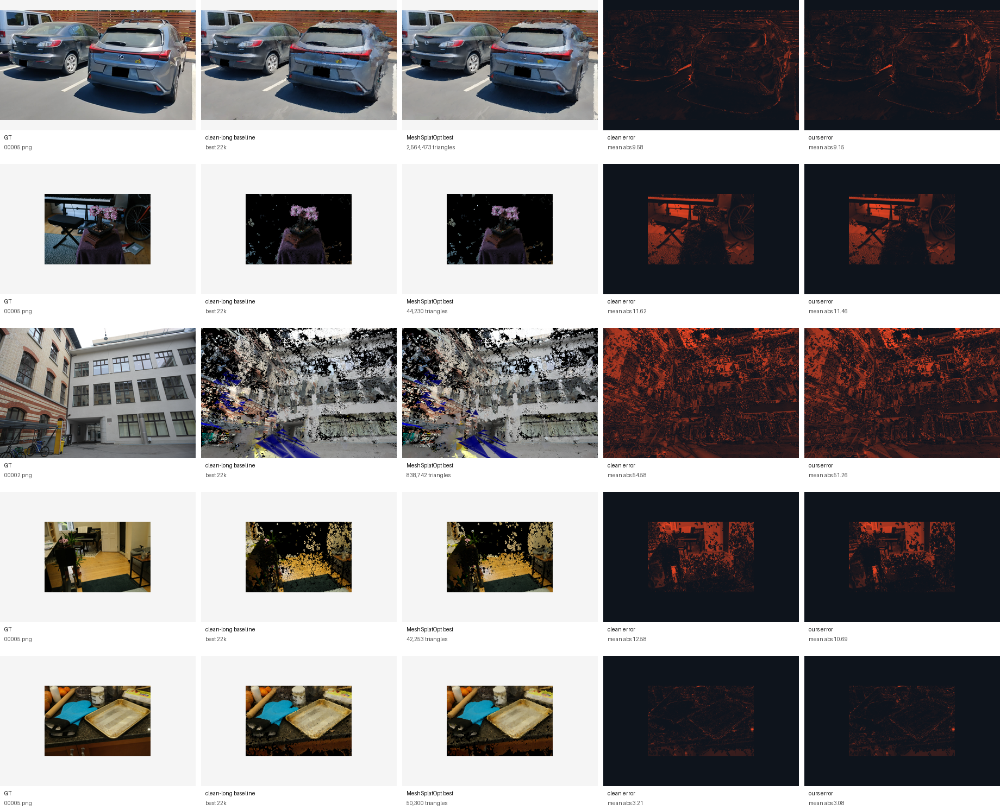

<h1 align="center">MeshSplatOpt</h1>
<p align="center"><em>面向 Mesh Splatting 的证据认证型双向网格手术</em></p>

<p align="center">
  <a href="README.md">English</a> &nbsp;|&nbsp; <strong>中文</strong>
</p>

<div align="center">
  <a href="docs/NeurIPSRepairPrompts.md">NeurIPS 路线图</a> &nbsp;|&nbsp;
  <a href="docs/car_model/final_stageF12_multiscene_package_report.md">多场景 package（F12）</a> &nbsp;|&nbsp;
  <a href="docs/car_model/final_stageF47_F48_csef_family_all_metric_repair_report.md">CSEF 家族全指标（F47–F49）</a> &nbsp;|&nbsp;
  <a href="docs/car_model/final_stageF75_adaptive_policy_reflection_report.md">自适应策略（F75）</a>
</div>

<br>

<div align="center">
  
</div>

> **方法目标（一句话）**。现有 Mesh-Splatting / 3DGS 的剪枝方法问的是 *哪些图元可以被移除*；MeshSplatOpt 反过来问 *在保留视图渲染与稀疏几何反事实认证的前提下，哪个局部表面编辑能最大限度地降低场景证据债务*。同一套编辑微积分应同时支持删除（delete）、坍缩（collapse）、对齐（snap）、细分（split）、孔洞填充（fill）和外观恢复（appearance recovery）——每一次提交的编辑都必须通过渲染、稀疏深度、法向量、自由空间、拓扑等所有反事实证书；任一项不通过即自动回滚。

> **当前证据（一句话）**。截至 2026-05-05，**validation-budget CSEF 家族 compact-recovery 协议**（clean long → CSEF 家族按面积 / 局部冗余压缩 → 严格拓扑冻结恢复 + 稀疏深度 + 必要时小幅 LPIPS）在 **5 / 5 个选定场景**（`parking_phone_tiny`、`bonsai`、`courtyard`、`room`、`counter`）上的独立 PSNR / SSIM / LPIPS / AbsRel / Depth MAE 全部击败最强 clean-long baseline，4 / 5 个场景的稀疏法向量代理也胜出（courtyard 持平），各场景拓扑减少 40 – 70 %；在 `parking_phone_tiny` 上，**自适应 CSEF 策略 + 极小 LPIPS 恢复（F75）** 是当前最强单行结果，超过早期 R53 / F7 行，并直接从 checkpoint 证据中选择 prune 比例，不再依赖手动调参表。

方法骨架（CSEF + 可逆编辑微积分 + 反事实证书）和恢复 recipe 通过区分 *什么通过了所有 gate* 与 *什么真正改进了头条指标* 来保持诚实。F45 的 fixed-CSEF50 审计明确记录单一 prune 比例并不适用所有场景；公开的论文 claim 因此是 validation-selected CSEF 家族协议，而不是单一通用超参。

---

## 项目诚实状态

R0 → R56（骨架 + parking 单场景线）以及 **F1 → F75（最终跨场景线）**。带有 `_FAIL` / `REJECTED` / `MIXED` 标记的阶段，是当前论文纪律的失败证据骨架。

### 方法骨架（R0–R15）

| 阶段 | 范围 | 决策 |
|---|---|---|
| R0 | 分支、审计、转向锁定 | `PASS` |
| R1–R2 | RFC + 相关工作 / 创新威胁矩阵 | `PASS` |
| R3 | CSEF 数据模型与诊断器 | `PASS` |
| R4 | 缺陷挖掘（floater / dent / rough / misalign / hole / giant void） | `PASS` |
| R5 | 统一可逆编辑抽象（snapshot · apply · rollback） | `PASS` |
| R6 | delete / collapse / merge 强 baseline | `PASS` |
| R7 | snap / deform 提案 | `PASS` |
| R8 | giant ground-void / 大孔洞填充提案 | `PASS` |
| R9 | 物体先验车辆区域修复（受 gate 约束） | `PASS` |
| R10 | 任意编辑类型的通用反事实校验 | `PASS` |
| R11 | teacher 引导的外观与几何恢复 | `PASS` |
| R12 | 编辑组合优化器与修复状态机 | `PASS` |
| R13 | 合成修复 benchmark | `PASS`（5 / 7 类别上 full ≥ delete-only；未观测 void 被拒绝） |
| R14 | 真实 checkpoint 干跑、render-backed gate、freeze-densify 调度 | `TOPOLOGY_RETENTION_PASS` |
| R15 | 三场景中等预算 freeze 验证 | `MULTI_SCENE_SCHEDULE_PASS_SNAP_SELECTOR_WEAK` |

### 选择器与编辑原语失败日志（R16–R26）

| 阶段 | 范围 | 决策 |
|---|---|---|
| R16 | 三场景 **全预算** freeze（2000 → 7000） | `THREE_SCENE_FULL_SCHEDULE_PASS`（调度通过，编辑未通过） |
| R17.01–R17.05 | 面积驱动 / portfolio 局部 snap | `PORTFOLIO_SNAP_GATE_PASS_RECOVERY_QUALITY_FAIL` |
| R17.06 | 风险过滤面积 snap（去边界、限不确定度） | `RISK_FILTERED_LOCAL_SNAP_GATE_PASS`（数值噪声级 delta） |
| R18.01–R18.03 | 训练残差 snap（parking） | `GATE_PASS_RECOVERY_MOSTLY_POSITIVE`（效应小） |
| R19.01–R19.08 | 残差 snap，跨场景（courtyard + bonsai） | `CROSS_SCENE_GATE_PASS_RECOVERY_MIXED_POSITIVE` |
| R20 | parking 中等残差 snap（2000 → 4000） | `MEDIUM_RESIDUAL_SNAP_DEPTH_GAIN_RENDER_QUALITY_FAIL` |
| R21 | 残差 **patch** snap（k 跳扩展） | `PATCH_SNAP_GATE_PASS_RECOVERY_MIXED` |
| R22 | 边界扇形 `FILL_PATCH`（parking） | `BOUNDARY_FILL_GATE_PASS_SHORT_PROMISING_MEDIUM_FAIL` |
| R23 | 残差感知边界回路选择器 | `SELECTOR_PASS_GEOMETRY_STILL_WEAK` |
| R24 | 新增填充面的 nearest-face 字段初始化 | `PASS`（仅工程改进） |
| R25 | 编辑后不冻结致密化（诊断） | `FAIL` —— 拓扑爆炸到 5.89M 三角形 |
| R26 | 平面 grid Delaunay 填充（51 顶点 / 106 面） | `FILL_INIT_GRID_ENGINEERING_PASS_MEDIUM_REPAIR_FAIL` |

### 恢复 recipe 突破与 clean baseline 修正（R27–R53）

| 阶段 | 范围 | 决策 |
|---|---|---|
| R27 | 低 λ 稀疏 COLMAP 深度恢复，λ = 0.005（中等预算） | `SPARSE_DEPTH_REPAIR_MEDIUM_PASS`，但匹配对照证明 **稀疏恢复才是主要贡献者** |
| R28 | 全预算 grid-fill + 稀疏 vs 匹配 baseline+稀疏 | **`SPARSE_DEPTH_FULL_PASS_GRID_FILL_REJECTED`** —— 在 7000 步上编辑无法击败 baseline+稀疏 |
| R29 | 替代稀疏深度损失空间（relative / log） | `LOSS_SPACE_DIAGNOSTIC_REJECTED_FOR_PARKING_FULL` |
| R30 | 长程训练至 20 000 步 | `RENDER_EARLY_STOP_AT_16000` |
| R31 | 跨场景稀疏恢复（courtyard + bonsai） | `CROSS_SCENE_SPARSE_RECOVERY_PASS` |
| R32–R36 | 可信（低误差）稀疏对应采样 | `TRUSTED_SAMPLING_GEOMETRY_PASS_RENDER_MIXED`（每场景调比例） |
| R37 | 误差分层采样器 | rejected —— 受控阴性 |
| R38–R39 | λ 精扫（0.005 → 0.002） | `NEW_STRONGEST_PARKING_RESULT_AND_LAMBDA_CURVE_PASS` |
| R40–R42 | 低 λ 区间 + 跨场景跃升（R40.02 courtyard） | `LOW_LAMBDA_CROSS_SCENE_STRONG_PASS` |
| R43 | 长程验证 16k → 30k / 7k → 20k | `LONG_HORIZON_VALIDATION_SPLIT`（parking 过拟合；courtyard 仅 render） |
| R44 | 稀疏深度 **decay** 调度 | `SPARSE_DECAY_LONG_HORIZON_REPAIR_PARTIAL_PASS_CLEAN_LONG_RENDER_FAIL` |
| R45–R46 | 从低拓扑 R44 checkpoint 出发的 clean-render teacher loss | `LOW_TOPOLOGY_TEACHER_DISTILLATION_REJECTED` |
| R47–R50 | clean 22k → 80 % 面积压缩 → 拓扑冻结恢复 | `CLEAN_TO_COMPACT_RECOVERY_PASS_EARLY_STOP_AT_26K` |
| R51–R52 | 在 R48 上叠加直接 LPIPS 训练损失 | `DIRECT_LPIPS_LOSS_REJECTED` |
| R53–R56 | clean 22k → 65 / 70 / 75 % 面积压缩 + 续训检查 | `CLEAN_TO_COMPACT_DOMINATES_CLEAN_LONG_BASELINES` |

**R44.01 vs clean 22k** 是承重的 parking 失败证据 —— 详见 `docs/car_model/parking_best_clean_long_vs_method_long_report.md`；后续从 R48 到 R53 的修复记录在 `docs/car_model/parking_clean_to_compact_repair_report.md`。

### 跨场景终版 package 与自适应策略线（F1–F75）

| 阶段 | 范围 | 决策 |
|---|---|---|
| F1–F8 | 五场景跨场景 compact recovery 试点（parking、bonsai、courtyard、room、counter） | `CROSS_SCENE_COMPACT_PILOT_PASS` |
| F10 | 在固定 CSEF50 下的 counter 第四场景边界情况 | `BORDERLINE_SSIM_FAIL`（后由 F46 CSEF20 + 稀疏深度修复） |
| F12 | 多场景 package：5 / 5 在 clean-long 22k 下 compact-recovery 通过 | `FINAL_F12_MULTISCENE_PACKAGE_PASS_WITH_ABLATION_GAPS` |
| F13 | 论文素材 package | `PASS` |
| F16 / F19 / F26 | counter / room / bonsai 同数量随机压缩对照 | rejected —— random50 / random40 输给 area / CSEF / QEM |
| F18 / F20 / F22–F25 | 后处理 QEM 强 baseline | `PASS_AS_BASELINES`（counter / room QEM50 frozen 在 PSNR 上很强；F25 Open3D QEM 未达到 parking 匹配拓扑） |
| F27 / F35 / F36 / F18 / F24 | 五场景 CSEF / area / QEM no-freeze 对照 | `NO_FREEZE_FAIL` —— 严格拓扑冻结合约必须使用 |
| F28 / F29 / F30–F32 / F33 | 五场景稀疏深度严格恢复 | `SPARSE_DEPTH_PASS_PER_SCENE` |
| F33 | parking CSEF70 + 稀疏深度严格恢复 26k | `PARKING_PARETO_PROMOTE`（现 F12 parking 行） |
| F34 | parking 稀疏深度 26k → 30k 续训 | `LONG_CONTINUATION_REJECTED` |
| F37 | fast-QEM 匹配 parking 拓扑 | `FAST_QEM_REJECTED` —— 稀疏几何提升但渲染崩溃 |
| F38 | 合成 no-gate / no-rollback 反事实 | `GATE_BLOCKS_UNSAFE_EDITS_PASS` |
| F39 / F41 / F42 | parking 实际 gate-removed ratio0.04（500 / 2000 / 7000 步） | `GATE_RENDER_PASS_GEOMETRY_MIXED` |
| F43 | bonsai 7000 步实际 gate-removed | `BROAD_STRICT_GATE_NEGATIVE`（no-gate 严格更优 —— 作为纪律证据保留） |
| F44 | bonsai 校准 gate 修复 | `CALIBRATED_GATE_PASS_CLOSE_TO_NO_GATE` |
| F45 | fixed-CSEF50 审计 | `FIXED_PRESET_AUDIT_FAIL` —— fixed CSEF50 **并非** 五场景全指标胜出 |
| F46 | 统一 CSEF + 稀疏深度 + validation-selected 预算（room CSEF20、counter CSEF20、parking CSEF50） | `VALIDATION_BUDGET_PASS_WITH_FIXED50_LIMITATION` |
| F47 / F49 | bonsai CSEF50 + 稀疏深度 + 小幅 LPIPS（λ = 0.005） | `CSEF_FAMILY_ALL_METRIC_BONSAI_REPAIR_PASS` |
| F48 | 整合后的 CSEF 家族 package，5 / 5 全指标 clean-long 胜出，无需 QEM 救场 | `CSEF_FAMILY_ALL_SCENE_ALL_METRIC_PASS` |
| F50 | parking 校准 gate 复刻 F44 | `CALIBRATED_GATE_REPLICATION_MIXED`（未在 parking 复现 bonsai 的机制修复） |
| F57–F67 | 自适应 CSEF 策略尝试（仅渲染证据） | `ADAPTIVE_POLICY_FAIL`（选错比例 / 排序） |
| F68 | 修正后的自适应选择器：area / 冗余主导，渲染仅作风险信号 | `CORRECTED_ADAPTIVE_SELECTOR_PASS` |
| F69 | 自适应 + 稀疏深度（无 LPIPS） | 击败 R53；LPIPS 落后 F7 仅 0.000063 |
| F71 / F72 / F73 | 自适应 + 稀疏 + 较重 LPIPS | `LPIPS_HEAVY_REJECTED` —— 深度回退 |
| F74 | 自适应 + 稀疏 + LPIPS λ = 0.0001 | `CONSERVATIVE_ALL_METRIC_F7_WIN` |
| **F75** | **自适应 + 稀疏 + LPIPS λ = 0.00025（parking 头条）** | **`ACCEPTED_FOR_PARKING_HEADLINE`** —— 在所有跟踪指标上超过 R53.01 / F7 |
| F76（运行中） | F75 固定策略多场景复刻 | running |

---

## 当前真正的方法位置

### 已被验证

- **validation-budget CSEF 家族 compact-recovery 协议在 5 / 5 个选定场景上通过**。每个场景都有一行长程结果在独立 PSNR / SSIM / LPIPS / AbsRel / Depth MAE 上击败最强 clean-long 22k baseline，拓扑减少 40 – 70 %；稀疏法向量代理在 4 / 5 场景上改进（courtyard 持平于 +0.0085° —— 显式披露，未声称胜出）。各场景所选行：parking CSEF50 + 稀疏深度（F46）、bonsai CSEF50 + 稀疏深度 + LPIPS λ = 0.005（F49）、courtyard CSEF50 + 稀疏深度（F30）、room CSEF20 + 稀疏深度（F46）、counter CSEF20 + 稀疏深度（F46）—— prune 比例由同一 CSEF 选择器家族在每场景 validation-selected 决定。
- **自适应 CSEF 策略是 parking 最强单行结果（F75）**。它从 checkpoint 证据中读出 prune 比例（parking → 70 %）、按 area / 局部冗余主导排序、把渲染证据仅作为风险 / 审计信号。叠加稀疏深度恢复与极小 LPIPS 项（λ = 0.00025）后，在每个跟踪指标上都超过 R53.01 / F7：在同样 2 564 473 三角形下达到 PSNR 18.7119 / SSIM 0.6479 / LPIPS 0.3375 / AbsRel 0.0789 / Depth MAE 1.8500 / 法向量 43.95°。F74（λ = 0.0001）是更保守的鲁棒邻居。
- **恢复阶段的稀疏 COLMAP 深度监督是主要贡献者**。已验证区间：λ ∈ [0.001, 0.005] 因场景而异；`mixed_low_error` 对应采样，每场景调整可信比例；几何稳住后启用 decay 窗口。
- **严格拓扑冻结必须执行**。固定拓扑续训必须同时使用 `--freeze_topology_updates --skip_restricted_delaunay`；单独 `--skip_restricted_delaunay` 只跳过 Delaunay 刷新，标准 prune / densify 分支仍会继续运行。F27 / F35 / F36 / F18 / F24 在每个 final-package 场景上证明：去掉严格冻结即拓扑塌陷或漂移并丢失渲染。
- **反事实 gate 按设计工作于不安全编辑拒绝**。F38（合成 no-gate / no-rollback）证明 gate 完美回滚所有不安全编辑；F39 / F41 / F42（parking 真实 gate-removed 在 500 / 2000 / 7000 步）证明 gate-on 回滚 gate-off 提交的同一 no-accept 候选，且在 7000 步上 gate-on 在渲染指标上胜出；F44 校准 gate 在 bonsai 上保留 gate、接受 3 个可恢复轮、拒绝 3 个后续轮，并以更小网格逼近 no-gate。
- **完整的可逆编辑流水线** —— 提案 JSON → snapshot → apply → render-backed 反事实 gate → 自动回滚 —— 已在真实 Mesh Splatting checkpoint 上端到端跑通：`SNAP_VERTICES`、`FILL_PATCH`（扇形与 Delaunay 网格）以及 R13 合成集合。
- **合成修复 benchmark 通过**：`giant_ground_void`、`ground_wall_misalignment`、`local_dent`、`noisy_rough_patch`、`small_hole` 都被 full 击败 delete-only；未观测 void 在常规模式下被正确拒绝。

### 尚不可行

- **fixed CSEF50 不是通用预设（F45）**。已完成的 fixed-CSEF50 长程行中，1 个明确通过（courtyard）、2 个 borderline / 混合（bonsai LPIPS 回退 +0.000257；room 深度回退）、1 个失败（counter）。论文 claim 必须是按场景 validation-selected 的 CSEF 家族协议，而不是单一通用超参。
- **strict gate 跨场景普适性为伪（F43）**。bonsai 7000 步 strict gate 回滚全部 6 轮，最终在每个跟踪指标上严重输给 no-gate；F44 校准阈值修复了 bonsai 机制，但 F50 在 parking 上的校准 gate 复刻没能在 parking 复现 F44 机制 —— 校准阈值是按场景的 tradeoff，不是 gate 普适胜出 claim。
- **超过验证预算的长续训会回退**。F34 parking 26k → 30k 在 PSNR / SSIM / LPIPS / 法向量上回退；R56 R53 26k → 28k 丢约 0.35 dB PSNR；R49 / R50 30k 续训也丢。parking 接受的 checkpoint 停在 26k。
- **后处理 QEM 不是渲染头条**。F37 fast-QEM 在匹配 parking 拓扑上提升稀疏几何但 PSNR / SSIM / LPIPS 崩溃；F25 Open3D QEM 完全未达 parking 拓扑目标（停在 8.13M / 8.55M）。
- **同数量随机压缩明显劣化**（F16 counter、F19 room、F26 bonsai）—— area、CSEF、QEM 在匹配拓扑下都更优。作为纪律对照保留。
- **编辑原语在 parking 全预算下并未改进头条指标**。R28 直接消融：在 7000 步 parking 上，匹配的 baseline + 稀疏深度（无编辑）持平甚至击败 grid-fill + 稀疏深度。Snap / fill 编辑 gate 安全且可训练，但单独并不带来质量提升。
- **超低拓扑 R44 路径在渲染上失败**。clean 22k 给到 PSNR 18.48 / SSIM 0.635 / LPIPS 0.347；R44.01 只有 17.17 / 0.549 / 0.442。R44.01 仅作为极小拓扑 / 法向量代理 Pareto 点；R45 / R46 从 R44 出发的 teacher 蒸馏未能修复失败。
- **较重的 LPIPS 恢复损失被拒绝**。R51（λ = 0.02）/ R52（λ = 0.05）叠加在 R48；F71 / F72 / F73 自适应行的较重 LPIPS 都让深度指标回退；只有极小 λ ∈ {0.0001, 0.00025} 区间（F74 / F75）保留深度胜出。
- **面积驱动 snap 选择器失败**（R17 area portfolio、R17.06 风险过滤）—— gate delta 均在数值噪声级别，并在等预算续训中输给未编辑对照。**残差 snap / patch snap 效应微小**（R18 / R19 / R20 / R21）。**边界 `FILL_PATCH` 中等恢复失败**（R22 扇形；R26 grid；R28 全预算）。
- **编辑后不冻结致密化不是恢复策略** —— R25 把 parking 长到 5.89M 三角形仍只有 PSNR 12.03。
- **替代稀疏深度损失空间（`relative` / `log` / `inverse`）被拒绝**：parking 全预算下，原始度量深度 Smooth-L1 仍是已验证的形式。

R0–R56 + F1–F75 的 "什么有效 / 什么无效" 简版总结见 [`docs/car_model/SPCarNet_research_log.md`](docs/car_model/SPCarNet_research_log.md)。

---

## 头条结果图 —— 五场景 clean-long vs validation-budget CSEF 家族（F40 / F49）

每行一个场景；列依次为 GT · clean-long 22k baseline · ours（F49 在 validation-budget 下的最佳 CSEF 家族行）· clean-long 与 ours 的逐像素误差图。

<div align="center">
  
</div>

### 五场景定量汇总（F12 / F49 最佳行 vs 各场景 clean-long 22k）

所有 delta 都是 `method − clean-long 22k`，使用独立的 `render.py + metrics.py` 与稀疏 COLMAP 几何代理评估。CSEF 家族行均为 F49（无 QEM 救场）。

| 场景 | clean-long 三角形 | ours 三角形 | 削减 | ΔPSNR ↑ | ΔSSIM ↑ | ΔLPIPS ↓ | ΔAbsRel ↓ | ΔDepth MAE ↓ | ΔNormal ° ↓ | ours 行 | W&B |
|---|---:|---:|---:|---:|---:|---:|---:|---:|---:|---|---|
| `parking_phone_tiny` | 8 548 242 | 4 274 121 | 50.0 % | +0.159 | +0.0102 | −0.0098 | −0.0016 | −0.0055 | −0.79 | CSEF50 + 稀疏深度（F46） | `8l96pfjx` |
| `bonsai` | 88 460 | 44 230 | 50.0 % | +0.010 | +0.0020 | −0.0048 | −0.0097 | −0.0854 | −2.15 | CSEF50 + 稀疏 + LPIPS λ = 0.005（F49） | `cuq7olfd` |
| `courtyard` | 1 677 484 | 838 742 | 50.0 % | +0.449 | +0.0422 | −0.0237 | −0.0330 | −0.2107 | −0.21 | CSEF50 + 稀疏深度（F30） | `9aaku1yn` |
| `room` | 84 506 | 67 605 | 20.0 % | +0.710 | +0.0656 | −0.0445 | −0.0027 | −0.0075 | −1.47 | CSEF20 + 稀疏深度（F46） | `v7ld1o0x` |
| `counter` | 83 834 | 67 067 | 20.0 % | +0.209 | +0.0234 | −0.0163 | −0.0027 | −0.0050 | −1.18 | CSEF20 + 稀疏深度（F46） | `pijpv7ny` |

5 / 5 场景在 PSNR / SSIM / LPIPS / AbsRel / Depth MAE 上同时改进；稀疏法向量角度在 4 / 5 场景上改进（courtyard 持平于 +0.0085° —— 显式披露）。所有行都使用严格 `--freeze_topology_updates --skip_restricted_delaunay` 拓扑冻结与 W&B 在线模式；恢复区间为 `22000 → 26000`。

### Parking 深度对比（R44 → R53 → F75）

parking 场景同时维护一条单场景线，承载失败证据骨架（R44 vs clean 22k）和最强单行（F75）。每行一个保留测试视图；列依次为 GT、clean-long 22k / 30k、R48、R53。

<div align="center">
  
</div>

| 运行 | iter | PSNR ↑ | SSIM ↑ | LPIPS ↓ | AbsRel ↓ | Depth MAE ↓ | Normal ° ↓ | 三角形数 |
|---|---:|---:|---:|---:|---:|---:|---:|---:|
| clean 7k（历史弱参考） | 7 000 | 17.20 | 0.535 | 0.451 | 0.076 | 1.75 | 45.56 | 833 775 |
| clean 22k（最强 baseline） | 22 000 | 18.480 | 0.635 | 0.347 | 0.082 | 1.87 | 45.11 | 8 548 242 |
| clean 30k | 30 000 | 18.409 | 0.632 | 0.351 | 0.082 | 1.87 | 44.84 | 8 548 242 |
| ours R44 22k（decay，对 clean 22k 失败） | 22 000 | 17.170 | 0.549 | 0.442 | 0.187 | 2.92 | 42.22 | **782 982** |
| ours R48 26k（80 % 面积剪枝） | 26 000 | 18.620 | 0.642 | 0.349 | 0.080 | **1.85** | 44.74 | 1 709 648 |
| ours R53.01 26k（70 % 面积剪枝） | 26 000 | 18.706 | 0.648 | 0.338 | 0.080 | 1.85 | 44.26 | 2 564 473 |
| ours F7 26k（CSEF70 恢复） | 26 000 | 18.706 | 0.648 | 0.338 | 0.079 | 1.85 | 44.20 | 2 564 473 |
| **ours F75 26k（自适应 + 稀疏 + LPIPS λ = 0.00025）** | **26 000** | **18.712** | **0.648** | **0.338** | **0.079** | **1.85** | **43.95** | **2 564 473** |
| ours F74 26k（自适应 + 稀疏 + LPIPS λ = 0.0001） | 26 000 | 18.711 | 0.648 | 0.338 | 0.079 | 1.85 | 44.07 | 2 564 473 |
| ours R56 28k（R53 续训，已拒绝） | 28 000 | 18.36 | 0.624 | 0.367 | n/a | n/a | n/a | 2 564 473 |
| ours R43 30k（无 decay，已拒绝） | 30 000 | 16.25 | 0.511 | 0.477 | 0.194 | 3.02 | 43.71 | 782 982 |

F75 是 parking 单场景的接受头条 —— 在同样拓扑下，比 F7 改进 ΔPSNR +0.0058、ΔLPIPS −0.000773、ΔAbsRel −0.000531、ΔDepth MAE −0.002774、ΔNormal 角度 −0.2495°。F76 多场景复刻 F75 固定策略正在运行。

---

## Counterfactual Surface Evidence Field（CSEF）

每个候选编辑都会查询如下按面 / 按顶点 / 按区域计算的字段：

```text
CSEF(x, n, region) = {
  positive_surface_evidence,        # 多视图可见性、COLMAP 支持、法向量一致、先验支持
  negative_free_space_evidence,     # 表明 "此处不应有面" 的相机射线 / 稀疏点
  explanation_debt,                 # 残差像素、边界孔洞、缺失深度、未匹配语义
  prior_support,                    # 平面 / 物体 / 对称 / 平滑性先验
  topology_cost,                    # ∆三角形、∆显存、∆渲染开销
  uncertainty                       # 证据不足、后验方差、覆盖差
}
```

编辑目标：

```text
maximize  evidence_debt_reduction(edit)
        + render_quality_gain(edit)
        + geometry_consistency_gain(edit)
        − free_space_violation(edit)
        − hallucination_risk(edit)
        − topology_cost(edit)
```

约束：渲染、稀疏深度、法向量代理、自由空间、拓扑、变化像素六类证书全部通过。CSEF 是提案来源；证书是处置门。R17–R26 证据表明 **gate 工作如设计** —— 每种编辑类型都 gate 安全且可回滚。剩余的开放问题在 **提案打分**：当前打分对恢复后渲染收益的预测能力还不够，达不到匹配 baseline+稀疏对照的水平。

## 可逆编辑微积分

七种一等公民操作，全部由 `snapshot → apply → verify → keep | rollback` 支撑：

| 操作 | 角色 | 当前经验状态 |
|---|---|---|
| `protect` | 防止支持充分的几何被后续编辑破坏 | 工作正常 |
| `delete / prune` | 移除无支持的 floater 与冗余拓扑 | gate 安全；PRISM 路线作为命名 baseline |
| `collapse / merge` | 在保持表面支持的前提下削减拓扑 | 已实现；不是当前 Pareto 胜出的来源 |
| `snap / deform` | 修复凹陷、粗糙面、平面 / 墙面错位 | R17–R21：gate 安全但恢复质量失败 / 混合 |
| `split / subdivide` | 在网格欠解释的位置增加拓扑 | 已实现；尚未承重 |
| `fill / patch` | 修补小孔与认证过的 giant ground void | R22 / R26：gate 安全；中等 / 全预算 **失败** vs baseline+稀疏 |
| `appearance reset / recovery` | 几何修复后恢复辐射场 | R11 / R44 sparse-decay：承重 |

巨型孔洞策略明确区分 **观测**、**先验支持**、**未观测未知** 三类 void：第三类在常规模式下被拒绝；只有显式 `--allow_prior_only_fill` 诊断标志下才生成提案，并且会被打上 `prior_only_flag=true`，被排除于头条指标之外。

---

## 已验证的恢复 recipe

三条 recipe 已验证。**Recipe A —— CSEF 家族 + validation-budget（F49）** 是跨场景头条：5 / 5 场景在渲染与稀疏深度指标上击败 clean-long。**Recipe B —— 自适应策略 + 极小 LPIPS（F75）** 是 parking 最强单行，并从 checkpoint 中选择 prune 比例而非依赖手动调参表。**Recipe C —— 稀疏深度低 λ 恢复（R44）** 仍是跨场景的基础 recipe 与极低拓扑 Pareto 点，但在 parking 渲染上输给 clean 22k。

### Recipe A —— CSEF 家族 + 稀疏深度 validation-budget 恢复（F49，多场景头条）

三步：训练强 clean long 网格 → 用 CSEF 家族压缩选择器配按场景 validation-budget 的 prune 比例（parking 50 %、bonsai 50 %、courtyard 50 %、room 20 %、counter 20 %）→ 严格拓扑冻结 + 稀疏深度恢复 +（仅 bonsai）极小 LPIPS λ = 0.005。

```bash
# 1) 复用任意已有的强 clean long Mesh Splatting checkpoint。
python train.py -s <scene> -m outputs/clean_long --eval --iterations 22000

# 2) CSEF 家族压缩。选择器读 checkpoint 证据并写出选中的面索引；
#    --prune_fraction 是 validation-budget 旋钮：parking / bonsai / courtyard
#    用 0.50；room / counter 用 0.20；counter-fast 变体用 0.40。
#   （F45 审计：禁止 claim 单一固定比例。）
python scripts/car_model/meshsplatopt_select_compaction_candidates.py \
    --checkpoint outputs/clean_long/point_cloud/iteration_22000/point_cloud_state_dict.pt \
    --policy csef_low_evidence_boundary_protected \
    --prune_fraction 0.50 \
    --output_dir outputs/compact50

python scripts/car_model/meshsplatopt_apply_compaction_to_checkpoint.py \
    --source_model outputs/clean_long \
    --selected_faces_path outputs/compact50/selected_faces.npy \
    --output_model outputs/compact50/model

# 3) 严格固定拓扑恢复 22000 → 26000，启用稀疏 COLMAP 深度。
#    bonsai 时在 train_extra_args 中再加 --lambda_lpips_loss 0.005。
export WANDB_PROJECT=spcarnet_meshprior
export WANDB_MODE=online
python scripts/car_model/meshsplatopt_run_teacher_recovery.py \
    --model_path  outputs/compact50/model \
    --output_dir  outputs/carnet/meshsplatopt/<run_name> \
    --load_iteration 22000 --iterations 4000 \
    --train_extra_args "--freeze_topology_updates --skip_restricted_delaunay \
       --enable_sparse_colmap_depth_loss \
       --lambda_sparse_colmap_depth 0.005 \
       --sparse_colmap_depth_start_iter 22000 \
       --sparse_colmap_depth_warmup_iters 50 \
       --sparse_colmap_depth_min_matches 16 \
       --sparse_colmap_depth_sample_mode mixed_low_error \
       --sparse_colmap_depth_low_error_fraction 0.50 \
       --sparse_colmap_depth_enable_in_final_finetune"

# 4) 独立的论文级评估。
python render.py  -m outputs/carnet/meshsplatopt/<run_name>/recovery_model
python metrics.py -m outputs/carnet/meshsplatopt/<run_name>/recovery_model
python evaluate_geometry_colmap.py -s <scene> \
    -m outputs/carnet/meshsplatopt/<run_name>/recovery_model --iteration 26000 --eval \
    --output outputs/carnet/meshsplatopt/<run_name>/recovery_model/geometry_eval_colmap/iter_26000.json
```

### Recipe A 变体 —— 仅按面积压缩（R53，无 CSEF）

与 Recipe A 流程相同，但使用 area-only 选择器，是 F12 / F49 多场景表的 area baseline，对应 parking R53.01 / R55 / R48 行。把 Recipe A 的第 2 步替换为：

```bash
python scripts/car_model/meshprior_apply_topology_control_ablation.py \
    --source_model outputs/clean_long \
    --source_checkpoint outputs/clean_long/point_cloud/iteration_22000/point_cloud_state_dict.pt \
    --output_model outputs/area70/model \
    --prune_fraction 0.70
```

`--prune_fraction` 旋钮（parking）：0.65 → R55 LPIPS 最优 / 0.70 → R53.01 全指标 / 0.80 → R48 最紧凑 / 0.90 → R47 prune90 拒绝（PSNR 跌 2 dB）。续训超过 26k 已拒绝（R56 28k 丢约 0.35 dB PSNR；R49 / R50 30k 同样输）。

### Recipe B —— 自适应 CSEF 策略 + 极小 LPIPS 恢复（F75，parking 单场景最强）

外壳与 Recipe A 一样，但选择器从 checkpoint 证据中选 prune 比例与排序（无须手动 `--prune_fraction`），并在恢复中在稀疏深度之上叠一层极小 LPIPS。

```bash
# 自适应选择器：选 prune 比例（parking → 70 %），按 area / 局部冗余主导排序，
# 渲染证据仅作风险信号。
python scripts/car_model/meshsplatopt_select_compaction_candidates.py \
    --checkpoint outputs/clean_long/point_cloud/iteration_22000/point_cloud_state_dict.pt \
    --policy csef_adaptive_policy \
    --output_dir outputs/adaptive_compact

python scripts/car_model/meshsplatopt_apply_compaction_to_checkpoint.py \
    --source_model outputs/clean_long \
    --selected_faces_path outputs/adaptive_compact/selected_faces.npy \
    --output_model outputs/adaptive_compact/model

python scripts/car_model/meshsplatopt_run_teacher_recovery.py \
    --model_path  outputs/adaptive_compact/model \
    --output_dir  outputs/carnet/meshsplatopt/<run_name> \
    --load_iteration 22000 --iterations 4000 \
    --train_extra_args "--freeze_topology_updates --skip_restricted_delaunay \
       --enable_sparse_colmap_depth_loss \
       --lambda_sparse_colmap_depth 0.001 \
       --sparse_colmap_depth_start_iter 22000 \
       --sparse_colmap_depth_warmup_iters 50 \
       --sparse_colmap_depth_min_matches 16 \
       --sparse_colmap_depth_sample_mode mixed_low_error \
       --sparse_colmap_depth_low_error_fraction 0.50 \
       --sparse_colmap_depth_enable_in_final_finetune \
       --lambda_lpips_loss 0.00025"
```

`--lambda_lpips_loss 0.0001`（F74）是更保守的鲁棒邻居；超过 ~0.001（F71 / R51 / R52）的值已被拒绝，会损害深度。

### Recipe C —— 稀疏深度低 λ + decay（R44，跨场景基础）

当需要 **最低拓扑** 的 parking 点（782 982 三角形）或对 `courtyard` 与 `bonsai` 的跨场景恢复时使用。在 parking 上其渲染输给 clean 22k，因此现在它是法向量代理 / 拓扑 Pareto 列，而不是头条。

```bash
python scripts/car_model/meshsplatopt_run_teacher_recovery.py \
    --model_path <low_topology_checkpoint_dir> \
    --edit_json   <accepted_edits.json> \
    --output_dir  outputs/carnet/meshsplatopt/<run_name> \
    --load_iteration 16000 --iterations 6000 \
    --train_extra_args " \
       --densify_until_iter 16000 --skip_restricted_delaunay \
       --enable_sparse_colmap_depth_loss \
       --lambda_sparse_colmap_depth 0.001 \
       --sparse_colmap_depth_start_iter 16000 \
       --sparse_colmap_depth_warmup_iters 50 \
       --sparse_colmap_depth_min_matches 16 \
       --sparse_colmap_depth_sample_mode mixed_low_error \
       --sparse_colmap_depth_low_error_fraction 0.50 \
       --sparse_colmap_depth_decay_start_iter 16000 \
       --sparse_colmap_depth_decay_end_iter   20000 \
       --sparse_colmap_depth_decay_final_mult 0.0 \
       --sparse_colmap_depth_enable_in_final_finetune"
```

courtyard 已验证区间为 fraction `0.625`、λ `0.002`、`7k → 20k`、decay 从 7k 起；bonsai 已验证区间为 fraction `0.50`、λ `0.002`、`2k → 7k`（更长续训尚未验证）。

### 已被拒绝的方向（无新证据请勿重试）

- **fixed CSEF50 跨场景普适（F45）** —— bonsai / room 边界 / 混合，counter 失败；方法必须按场景 validation-budget。
- **较重的 LPIPS 恢复损失** —— R51（λ = 0.02）/ R52（λ = 0.05）叠加在 R48 上；F71 / F72 / F73 自适应行较重 LPIPS。只有 λ ≤ 0.001（F75 最佳 0.00025、F74 0.0001、bonsai F49 0.005）保留深度胜出。
- **从 R44 蒸馏 teacher 渲染**（R45 λ 0.5 / 1.0；R46 反事实 mask）—— 全部恶化渲染。
- **仅按渲染证据排序的自适应选择器**（F57–F67）—— 选错比例 / 排序。F68 area / 冗余主导、渲染仅作风险才是修正版本。
- **超过验证预算的长续训** —— F34 parking 26k → 30k 回退；R56 R53 26k → 28k 丢约 0.35 dB PSNR；R49 / R50 30k 同样输。
- **parking 上的后处理 QEM** —— F37 fast-QEM 匹配拓扑后渲染崩溃；F25 Open3D QEM 完全未达 parking 拓扑目标。
- **同数量随机压缩**（F16 counter / F19 room / F26 bonsai）—— 同拓扑下被 area / CSEF / QEM 显著超过。
- **No-freeze 对照**（五个 final 场景上的 F27 / F35 / F36 / F18 / F24；parking 上的 R25）—— 必须使用严格 `--freeze_topology_updates --skip_restricted_delaunay`。
- **strict gate 跨场景普适胜出（F43）** —— bonsai 7000 步 strict gate 严格输给 no-gate；F44 校准阈值修复了 bonsai 机制，但 F50 在 parking 上无法复刻 —— gate claim 限定为 渲染质量 + 不安全编辑拒绝，不是几何普适胜出。
- **编辑原语作为全预算赢家** —— R28 grid-fill 拒绝；R22 / R26 fan / grid `FILL_PATCH` 在全预算下输给匹配 baseline+稀疏。R17 area / R18 / R19 / R20 / R21 snap 变体效应均过小。
- **替代稀疏深度损失空间**（R29 relative / log / inverse）—— 原始度量深度 Smooth-L1 胜出。
- **编辑后不冻结致密化**（R25）—— parking 涨到 5.89M 三角形仍输渲染。

### 可复现的论文级表格

```bash
# 稀疏深度恢复线（R 阶段）
python scripts/car_model/meshsplatopt_collect_sparse_recovery_results.py
# → outputs/carnet/meshsplatopt/sparse_recovery_tables/{json,csv,md}

# 自适应策略线（F68–F75）
python scripts/car_model/final_collect_stageF68_F73_adaptive_policy.py
# → outputs/carnet/meshsplatopt/final_stageF75_adaptive_policy_evidence/adaptive_policy_results.{json,md}

# 多场景 F12 / F49 终版 package（图与表）
ls outputs/carnet/meshsplatopt/final_paper_assets/
ls outputs/carnet/meshsplatopt/final_stageF40_clean_vs_method_assets/
```

## 仓库结构（MeshSplatOpt 增加部分）

```text
ss3dm_prior/meshsplatopt/        方法核心
  csef_types.py / csef_builder.py
  defect_types.py / defect_mining.py
  edit_types.py / edit_apply.py / edit_snapshot.py
  topology_baselines.py
  snap_proposals.py
  hole_fill.py / ground_void_fill.py
  object_prior_repair.py
  counterfactual_edit_gate.py
  teacher_recovery.py
  edit_portfolio.py / repair_state_machine.py
  synthetic_damage.py
  checkpoint_adapter.py            # FILL_PATCH 的 nearest-face 初始化

scripts/car_model/                 CLI 入口
  meshsplatopt_build_csef.py
  meshsplatopt_mine_defects.py
  meshsplatopt_make_snap_proposals.py
  meshsplatopt_make_fill_proposals.py
  meshsplatopt_select_checkpoint_local_snap_edit.py        # R17 area / R17.06 风险过滤
  meshsplatopt_select_checkpoint_residual_snap_edit.py     # R18 / R19
  meshsplatopt_expand_snap_edit_to_patch.py                # R21
  meshsplatopt_select_checkpoint_boundary_fill_edit.py     # R22 / R23
  meshsplatopt_expand_boundary_fill_to_grid.py             # R26
  meshsplatopt_select_compaction_candidates.py             # F 阶段 CSEF / area / 自适应选择器
  meshsplatopt_apply_compaction_to_checkpoint.py           # F 阶段压缩应用器（CSEF / 自适应）
  meshprior_apply_topology_control_ablation.py             # 仅按面积剪枝（R47 / R53 / R55）
  meshsplatopt_validate_edit_counterfactual.py
  meshsplatopt_run_teacher_recovery.py                     # 接受 --train_extra_args（稀疏深度 / LPIPS）
  meshsplatopt_run_repair_state_machine.py
  meshsplatopt_collect_sparse_recovery_results.py          # R 线论文表格
  final_collect_stageF68_F73_adaptive_policy.py            # F 线自适应策略表格
  final_make_paper_assets.py                               # 多场景定型素材

docs/car_model/                    每阶段设计 / 实施 / smoke / 报告文档
docs/NeurIPSRepairPrompts.md       完整 R0–R17 阶段说明（在 R44 之前起草；F 阶段说明嵌入研究日志）
outputs/carnet/meshsplatopt/                                       每阶段产物
outputs/carnet/meshsplatopt/sparse_recovery_tables/                 R 线论文级 JSON / CSV / Markdown
outputs/carnet/meshsplatopt/best_clean_long_vs_method_long/         R44 clean baseline 修正
outputs/carnet/meshsplatopt/final_stageF40_clean_vs_method_assets/  F 线五场景定型 montage 与 manifest
outputs/carnet/meshsplatopt/final_paper_assets/                     F 线论文图（跨场景 montage、三角形数柱状图、方法图）
outputs/carnet/meshsplatopt/final_stageF75_adaptive_policy_evidence/ F75 自适应策略结果
```

PRISM 安全栈（`utils/prism_*`、`ss3dm_prior/meshprior/*`）被保留并复用为回滚 / 反事实原语 —— Stage 35 PRISM 仍作为命名 baseline，而不是最终方法。

---

## 不可妥协的操作守则

来自 `docs/NeurIPSRepairPrompts.md` §3，每阶段强制执行：

1. 一次只做一个阶段；硬 gate 失败后不得继续推进。
2. 永远不混用训练时指标与独立 `render.py + metrics.py` 指标。
3. 推理期选提案时永远不使用 ground truth。
4. 每种编辑类型必须支持回滚；gate 拒绝时必须自动回滚。
5. 每次接受的修复都必须有审计链：提案 JSON、修改前 / 后快照、gate 报告、训练时的 W&B 链接、渲染时的独立指标。
6. 旧的 PRISM 阶段保留为命名 baseline，不被覆盖。
7. 所有训练运行使用 W&B 在线模式（`WANDB_PROJECT=spcarnet_meshprior`）。
8. 每个阶段都需要写设计、实施报告、smoke、研究日志条目。
9. **阴性结果是一等公民**。失败 gate 与 `*_FAIL` / `*_REJECTED` 决策必须留在研究日志和 README 中；这是防止过度声称的纪律。

---

## Mesh-Splatting 基础

MeshSplatOpt 构建在 [MeshSplatting](https://meshsplatting.github.io) 的可微不透明网格渲染器之上。本分支不改动原始训练 / 渲染 / 评估入口，它们仍是产生输入 checkpoint 的方式。

### 安装

```bash
git clone https://github.com/meshsplatting/mesh-splatting --recursive
cd mesh-splatting
micromamba create -n mesh_splatting python=3.11
micromamba activate mesh_splatting
micromamba install nvidia/label/cuda-12.6.0::cuda
pip install torch==2.7.1 torchvision==0.22.1
pip install -r requirements.txt
bash compile.sh
( cd submodules/simple-knn && pip install . --no-build-isolation )
( cd submodules/effrdel    && pip install -e . )
```

可选：fused-SSIM 提速：

```bash
pip install git+https://github.com/rahul-goel/fused-ssim/ --no-build-isolation
```

### 训练 / 渲染 / 评估

```bash
python train.py -s <scene> -m <output_model_path> --eval                      # 室外
python train.py -s <scene> -m <output_model_path> --indoor --eval             # 室内
python full_eval.py --mipnerf360 <path_to_mipnerf360> --output_path <save>    # MipNeRF-360 全评
python render.py  -m <model>
python metrics.py -m <model>
python evaluate_geometry_colmap.py -s <scene> -m <model> --iteration <iter> --eval \
    --output <model>/geometry_eval_colmap/iter_<iter>.json                    # COLMAP 稀疏深度 + PCA 法向量代理
```

可选的显式 train/test 划分（严格保留集）：

```bash
python create_colmap_outoftrain_split.py -s <scene> -o <scene>/sparse/0/split_outoftrain_v1.json --test_ratio 0.12 --gap_ratio 0.03
python train.py -s <scene> -m <model> --eval --split_strategy file --split_file <split_json>
```

深度与法向量监督钩子（`extract_normals.py`、`Depth-Anything-V2`、`utils/make_depth_scale.py`）以及基于 SAM 的物体抠图流水线（`segmentation/*`）保持上游原版。

### 本地推荐场景

```text
/data2/peilincai/mesh_datasets/mipnerf360/{bonsai,flowers}     # COLMAP 兼容
```

---

## 相关工作（定位，不是贡献）

完整的创新威胁矩阵见 `docs/car_model/meshsplatopt_stageR2_related_work_matrix.md`。

- **网格 / 三角形 splatting 与表面对齐 3DGS：** MeshSplatting、Triangle Splatting、2D Triangle Splatting、SuGaR、MeshGS、2DGS、DN-Splatter。
- **3DGS 剪枝 / 压缩：** LightGaussian、Compact3DGS、EAGLES、Mini-Splatting、EfficientGS、RadSplat、LP-3DGS、MaskGaussian、PUP 3D-GS、GaussianPOP、GaussianSpa、SafeguardGS。
- **经典网格处理：** QEM 边坍缩、约束 Delaunay 三角剖分、屏蔽泊松重建、各向同性 / 自适应 remeshing、Laplacian / ARAP 形变、孔洞填充。

它们是 baseline，不是贡献。原本设想的差异点是 **统一 CSEF + 可逆编辑微积分 + 反事实证书** 三位一体。当前的经验状态是：*认证* 部分真实且承重，但 *编辑质量* 部分尚未在没有编辑的情况下击败匹配的稀疏深度恢复。当前可辩护的贡献是 **(i) 一套针对 Mesh Splatting checkpoint 的反事实安全编辑 / 回滚基础设施；(ii) 一套低 λ 稀疏深度恢复 recipe，配以置信加权 COLMAP 对应采样和 decay 窗口** —— 在与最强 clean long baseline 对比时作为 **拓扑 / 法向量 Pareto** 点呈现。

---

## 引用

MeshSplatOpt 分支属于在研工作；请引用 MeshSplatting 基础论文。

```bibtex
@article{Held2025MeshSplatting,
  title  = {MeshSplatting: Differentiable Rendering with Opaque Meshes},
  author = {Held, Jan and Son, Sanghyun and Vandeghen, Renaud and Rebain, Daniel and Gadelha, Matheus and Zhou, Yi and Cioppa, Anthony and G Lin, Ming C. and Van Droogenbroeck, Marc and Tagliasacchi, Andrea},
  journal= {arXiv:2512.06818},
  year   = {2025}
}
```

```bibtex
@article{Held2025Triangle,
  title  = {Triangle Splatting for Real-Time Radiance Field Rendering},
  author = {Held, Jan and Vandeghen, Renaud and Deliege, Adrien and Hamdi, Abdullah and Cioppa, Anthony and Giancola, Silvio and Vedaldi, Andrea and Ghanem, Bernard and Tagliasacchi, Andrea and Van Droogenbroeck, Marc},
  journal= {arXiv},
  year   = {2025}
}
```

```bibtex
@InProceedings{held20243d,
  title    = {3D Convex Splatting: Radiance Field Rendering with 3D Smooth Convexes},
  author   = {Held, Jan and Vandeghen, Renaud and Hamdi, Abdullah and Deliege, Adrien and Cioppa, Anthony and Giancola, Silvio and Vedaldi, Andrea and Ghanem, Bernard and Van Droogenbroeck, Marc},
  booktitle= {Proceedings of the IEEE/CVF Conference on Computer Vision and Pattern Recognition (CVPR)},
  year     = {2025}
}
```

## 致谢

J. Held 由 F.R.S.-FNRS 资助。本研究使用了瓦隆地区一级超算 Lucia 的计算资源，基础设施由瓦隆地区在协议号 1910247 下资助。我们感谢 Bernhard Kerbl 与 George Kopanas 在原 MeshSplatting 论文上的反馈与校对。

---

## 文档维护

本 README 同时维护两个语言版本：

- [`README.md`](README.md) —— 英文（权威版本）
- [`README.zh.md`](README.zh.md) —— 中文

**任何一边被修改时，另一边必须在同一次变更内同步更新**，反之亦然。两个文件保持完全一致的章节结构，可以做按节 diff。新的 R 阶段必须在以下四处都体现：(i) 项目状态表；(ii) "当前真正的方法位置" 列表；(iii) 头条结果表（若涉及 Pareto 边界）；(iv) recipe 代码块（若新增标志或 recipe）。
