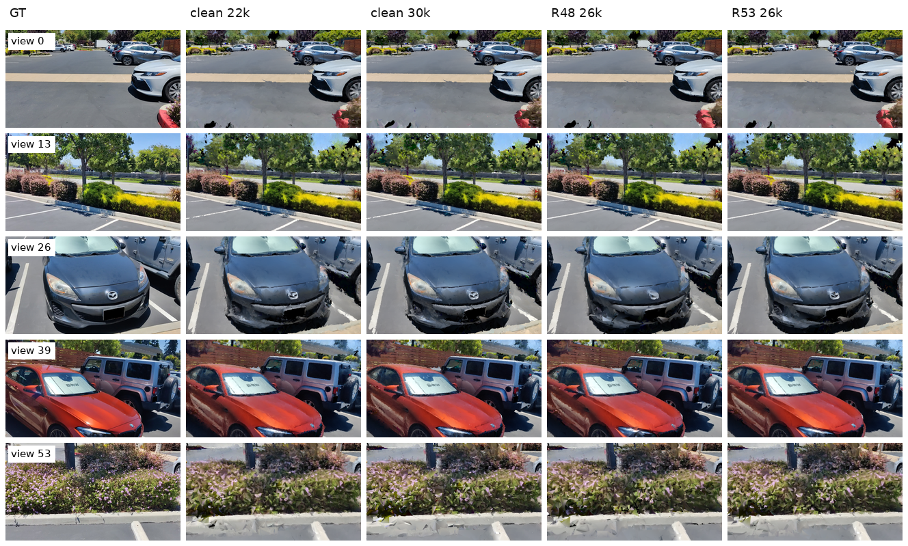

<h1 align="center">MeshSplatOpt</h1>
<p align="center"><em>面向 Mesh Splatting 的证据认证型双向网格手术</em></p>

<p align="center">
  <a href="README.md">English</a> &nbsp;|&nbsp; <strong>中文</strong>
</p>

<div align="center">
  <a href="docs/NeurIPSRepairPrompts.md">NeurIPS 路线图</a> &nbsp;|&nbsp;
  <a href="docs/car_model/parking_clean_to_compact_repair_report.md">Clean-to-compact 修复报告</a> &nbsp;|&nbsp;
  <a href="docs/car_model/parking_best_clean_long_vs_method_long_report.md">Clean baseline 修正报告</a>
</div>

<br>

<div align="center">
  
</div>

> **方法目标（一句话）**。现有 Mesh-Splatting / 3DGS 的剪枝方法问的是 *哪些图元可以被移除*；MeshSplatOpt 反过来问 *在保留视图渲染与稀疏几何反事实认证的前提下，哪个局部表面编辑能最大限度地降低场景证据债务*。同一套编辑微积分应同时支持删除（delete）、坍缩（collapse）、对齐（snap）、细分（split）、孔洞填充（fill）和外观恢复（appearance recovery）——每一次提交的编辑都必须通过渲染、稀疏深度、法向量、自由空间、拓扑等所有反事实证书；任一项不通过即自动回滚。

> **当前证据（一句话）**。截至 2026-05-03，R44 的稀疏深度 + 极低拓扑路线在与最强 clean long baseline 对比时失败；但修复后的 **clean-to-compact 恢复路径**（clean 22k → 按面积剪掉 70 % 三角形 → 拓扑严格冻结后恢复）已经在独立渲染与稀疏几何指标上击败 clean long baseline，并且仅使用 30 % 的三角形：R53.01 在 2.56M 三角形下达到 PSNR 18.706 / SSIM 0.648 / LPIPS 0.338，而 clean 22k 在 8.55M 三角形下为 PSNR 18.480 / SSIM 0.635 / LPIPS 0.347。

方法骨架（CSEF + 可逆编辑微积分 + 反事实证书）和恢复 recipe 通过区分 *什么通过了所有 gate* 与 *什么真正改进了头条指标* 来保持诚实。本 README 同时记录两类。

---

## 项目诚实状态

R0 → R53。带有 `_FAIL` / `REJECTED` / `MIXED` 标记的阶段，是当前论文纪律的失败证据骨架。

### 方法骨架（R0–R15）

| 阶段 | 范围 | 决策 |
|---|---|---|
| R0 | 分支、审计、转向锁定 | `PASS` |
| R1–R2 | RFC + 相关工作 / 创新威胁矩阵 | `PASS` |
| R3 | CSEF 数据模型与诊断器 | `PASS` |
| R4 | 缺陷挖掘（floater / dent / rough / misalign / hole / giant void） | `PASS` |
| R5 | 统一可逆编辑抽象（snapshot · apply · rollback） | `PASS` |
| R6 | delete / collapse / merge 强 baseline | `PASS` |
| R7 | snap / deform 提案 | `PASS` |
| R8 | giant ground-void / 大孔洞填充提案 | `PASS` |
| R9 | 物体先验车辆区域修复（受 gate 约束） | `PASS` |
| R10 | 任意编辑类型的通用反事实校验 | `PASS` |
| R11 | teacher 引导的外观与几何恢复 | `PASS` |
| R12 | 编辑组合优化器与修复状态机 | `PASS` |
| R13 | 合成修复 benchmark | `PASS`（5 / 7 类别上 full ≥ delete-only；未观测 void 被拒绝） |
| R14 | 真实 checkpoint 干跑、render-backed gate、freeze-densify 调度 | `TOPOLOGY_RETENTION_PASS` |
| R15 | 三场景中等预算 freeze 验证 | `MULTI_SCENE_SCHEDULE_PASS_SNAP_SELECTOR_WEAK` |

### 选择器与编辑原语失败日志（R16–R26）

| 阶段 | 范围 | 决策 |
|---|---|---|
| R16 | 三场景 **全预算** freeze（2000 → 7000） | `THREE_SCENE_FULL_SCHEDULE_PASS`（调度通过，编辑未通过） |
| R17.01–R17.05 | 面积驱动 / portfolio 局部 snap | `PORTFOLIO_SNAP_GATE_PASS_RECOVERY_QUALITY_FAIL` |
| R17.06 | 风险过滤面积 snap（去边界、限不确定度） | `RISK_FILTERED_LOCAL_SNAP_GATE_PASS`（数值噪声级 delta） |
| R18.01–R18.03 | 训练残差 snap（parking） | `GATE_PASS_RECOVERY_MOSTLY_POSITIVE`（效应小） |
| R19.01–R19.08 | 残差 snap，跨场景（courtyard + bonsai） | `CROSS_SCENE_GATE_PASS_RECOVERY_MIXED_POSITIVE` |
| R20 | parking 中等残差 snap（2000 → 4000） | `MEDIUM_RESIDUAL_SNAP_DEPTH_GAIN_RENDER_QUALITY_FAIL` |
| R21 | 残差 **patch** snap（k 跳扩展） | `PATCH_SNAP_GATE_PASS_RECOVERY_MIXED` |
| R22 | 边界扇形 `FILL_PATCH`（parking） | `BOUNDARY_FILL_GATE_PASS_SHORT_PROMISING_MEDIUM_FAIL` |
| R23 | 残差感知边界回路选择器 | `SELECTOR_PASS_GEOMETRY_STILL_WEAK` |
| R24 | 新增填充面的 nearest-face 字段初始化 | `PASS`（仅工程改进） |
| R25 | 编辑后不冻结致密化（诊断） | `FAIL` —— 拓扑爆炸到 5.89M 三角形 |
| R26 | 平面 grid Delaunay 填充（51 顶点 / 106 面） | `FILL_INIT_GRID_ENGINEERING_PASS_MEDIUM_REPAIR_FAIL` |

### 恢复 recipe 突破与 clean baseline 修正（R27–R53）

| 阶段 | 范围 | 决策 |
|---|---|---|
| R27 | 低 λ 稀疏 COLMAP 深度恢复，λ = 0.005（中等预算） | `SPARSE_DEPTH_REPAIR_MEDIUM_PASS`，但匹配对照证明 **稀疏恢复才是主要贡献者** |
| R28 | 全预算 grid-fill + 稀疏 vs 匹配 baseline+稀疏 | **`SPARSE_DEPTH_FULL_PASS_GRID_FILL_REJECTED`** —— 在 7000 步上编辑无法击败 baseline+稀疏 |
| R29 | 替代稀疏深度损失空间（relative / log） | `LOSS_SPACE_DIAGNOSTIC_REJECTED_FOR_PARKING_FULL` |
| R30 | 长程训练至 20 000 步 | `RENDER_EARLY_STOP_AT_16000` |
| R31 | 跨场景稀疏恢复（courtyard + bonsai） | `CROSS_SCENE_SPARSE_RECOVERY_PASS` |
| R32–R36 | 可信（低误差）稀疏对应采样 | `TRUSTED_SAMPLING_GEOMETRY_PASS_RENDER_MIXED`（每场景调比例） |
| R37 | 误差分层采样器 | rejected —— 受控阴性 |
| R38–R39 | λ 精扫（0.005 → 0.002） | `NEW_STRONGEST_PARKING_RESULT_AND_LAMBDA_CURVE_PASS` |
| R40–R42 | 低 λ 区间 + 跨场景跃升（R40.02 courtyard） | `LOW_LAMBDA_CROSS_SCENE_STRONG_PASS` |
| R43 | 长程验证 16k → 30k / 7k → 20k | `LONG_HORIZON_VALIDATION_SPLIT`（parking 过拟合；courtyard 仅 render） |
| R44 | 稀疏深度 **decay** 调度 | `SPARSE_DECAY_LONG_HORIZON_REPAIR_PARTIAL_PASS_CLEAN_LONG_RENDER_FAIL` |
| R45–R46 | 从低拓扑 R44 checkpoint 出发的 clean-render teacher loss | `LOW_TOPOLOGY_TEACHER_DISTILLATION_REJECTED` |
| R47–R50 | clean 22k → 80 % 面积压缩 → 拓扑冻结恢复 | `CLEAN_TO_COMPACT_RECOVERY_PASS_EARLY_STOP_AT_26K` |
| R51–R52 | 在 R48 上叠加直接 LPIPS 训练损失 | `DIRECT_LPIPS_LOSS_REJECTED` |
| R53–R56 | clean 22k → 65 / 70 / 75 % 面积压缩 + 续训检查 | `CLEAN_TO_COMPACT_DOMINATES_CLEAN_LONG_BASELINES` |

**R44.01 vs clean 22k** 是承重的失败证据 —— 详见 `docs/car_model/parking_best_clean_long_vs_method_long_report.md`；后续从 R48 到 R53 的修复记录在 `docs/car_model/parking_clean_to_compact_repair_report.md`。

---

## 当前真正的方法位置

### 已被验证

- **恢复阶段的稀疏 COLMAP 深度监督** 是 parking、courtyard、bonsai 上每一项可测改进的主要贡献。已验证区间：λ ∈ [0.001, 0.002]，`mixed_low_error` 对应采样、每场景设定可信比例（parking 0.50、courtyard 0.625、bonsai 0.50）；几何稳住后启用 decay 窗口。
- **Clean-to-compact 恢复** 已成为 parking 最强路径。R53.01 从 clean 22k 出发，按面积剪掉最小的 70 % 三角形，冻结拓扑后从 22k 恢复到 26k。在 2,564,473 三角形下达到独立 PSNR 18.706 / SSIM 0.648 / LPIPS 0.338；clean 22k 在 8,548,242 三角形下是 PSNR 18.480 / SSIM 0.635 / LPIPS 0.347。R55.01 是 LPIPS 最优的 65 % 剪枝 Pareto 点；R48 是更紧凑的 80 % 剪枝 Pareto 点。
- **拓扑保持冻结调度** 在恢复窗内保留 checkpoint 的连接关系。**严格固定拓扑** 必须使用 `--freeze_topology_updates --skip_restricted_delaunay` 双标志；早期仅用 `--densify_until_iter <load_iter> --skip_restricted_delaunay` 的方案是拓扑保持调度，并不是硬性零变更保证。若不冻结拓扑，R25 已证明无界致密化把 parking 从 0.78M 长到 5.89M 三角形，并且依然在渲染上失败。
- **严格拓扑冻结现已显式守护**。`--skip_restricted_delaunay` 单独使用只跳过 Delaunay 刷新，标准 prune/densify 分支仍会继续运行；`--freeze_topology_updates` 才会一并禁用标准 prune/densify 分支。
- **完整的可逆编辑流水线** —— 提案 JSON → snapshot → apply → render-backed 反事实 gate → 自动回滚 —— 已在真实 Mesh Splatting checkpoint 上端到端跑通：`SNAP_VERTICES`、`FILL_PATCH`（扇形与 Delaunay 网格）以及 R13 合成集合。
- **合成修复 benchmark 通过**：`giant_ground_void`、`ground_wall_misalignment`、`local_dent`、`noisy_rough_patch`、`small_hole` 都被 full 击败 delete-only；未观测 void 在常规模式下被正确拒绝。

### 尚不可行

- **编辑原语在全预算下并未改进头条指标**。R28 直接做了消融：在 7000 步 parking 上，匹配的 baseline + 稀疏深度（无编辑）持平甚至击败 grid-fill + 稀疏深度。Snap / fill 编辑 gate 安全且可训练，但单独并不带来质量提升。
- **超低拓扑 R44 路径在渲染上仍失败**。clean 22k 给到 PSNR 18.48 / SSIM 0.635 / LPIPS 0.347；R44.01 只有 PSNR 17.17 / SSIM 0.549 / LPIPS 0.442。R44.01 仅作为极小拓扑 / 法向量代理 Pareto 点。
- **从 R44 蒸馏 teacher 渲染未能修复失败**。R45 的全图 teacher loss 与 R46 的反事实 mask teacher loss 都让渲染质量从 R44 起点下降；接受的修复路线是 clean-to-compact，不是低拓扑 teacher 蒸馏。
- **没有稀疏深度 decay 的长程训练会过冲**。R43.01b 在 30 000 步比 22 000 步丢 0.90 dB PSNR；R44 用 decay 窗口部分修复 —— courtyard 在 `7k → 20k` 加 decay 表现良好；parking 在 `≈22k` 之后没有收益。
- **可信稀疏对应采样需逐场景调，不是普适常数**。R33 / R36 显示 0.50 vs 0.625 不能跨场景直接迁移；它是按场景调的几何置信旋钮，应作为 Pareto 列汇报，而非常量。
- **面积驱动 snap 选择器失败**。R17（面积 portfolio）与 R17.06（风险过滤面积）的 gate delta 均在数值噪声级别，并且在等预算续训中输给了未编辑的对照。
- **残差驱动 snap 与 patch snap 效应微小**。R18 / R19 / R21 都通过 gate，但恢复 delta 停留在 PSNR 第三位小数；R20 中等恢复证实只有深度提升、渲染下降。
- **边界 `FILL_PATCH` 中等恢复失败**。R22 扇形填充 gate 安全、短训表现可期，但 4000 步失败；R23 的残差感知重排不会改变所选回路；R26 平面 grid Delaunay 填充（51 顶点 / 106 面）通过 gate，但 R28 在 7000 步输给 baseline+稀疏。
- **编辑后不冻结致密化不是恢复策略**。R25 把 parking 长到 5.89M 三角形，最终仍只有 PSNR 12.03 / SSIM 0.31 —— 严格弱于冻结拓扑的恢复。
- **替代稀疏深度损失空间（`relative` / `log` / `inverse`）被拒绝**：parking 全预算下，原始度量深度 Smooth-L1 仍是已验证的形式。

R0–R44 的 "什么有效 / 什么无效" 简版总结见 [`docs/car_model/SPCarNet_research_log.md`](docs/car_model/SPCarNet_research_log.md)。

---

## 头条结果图（clean long vs ours，parking）

公平对比：每行一个保留测试视图；列依次为 GT、最强 clean long baseline（current-branch 22k 与 30k）、更紧凑的 R48 行，以及质量占优的 R53 clean-to-compact 分支。

<div align="center">
  
</div>

| 运行 | iter | PSNR ↑ | SSIM ↑ | LPIPS ↓ | AbsRel ↓ | Depth MAE ↓ | Normal ° ↓ | 三角形数 |
|---|---:|---:|---:|---:|---:|---:|---:|---:|
| clean 7k（历史弱参考） | 7 000 | 17.20 | 0.535 | 0.451 | 0.076 | 1.75 | 45.56 | 833 775 |
| **clean 22k（最强 baseline）** | 22 000 | **18.48** | **0.635** | **0.347** | 0.082 | **1.87** | 45.11 | 8 548 242 |
| clean 30k | 30 000 | 18.41 | 0.632 | 0.351 | **0.082** | 1.87 | 44.84 | 8 548 242 |
| **ours R44 22k（decay）** | 22 000 | 17.17 | 0.549 | 0.442 | 0.187 | 2.92 | **42.22** | **782 982** |
| ours R48 26k（80 % 剪枝） | 26 000 | 18.62 | 0.642 | 0.349 | 0.080 | **1.85** | 44.74 | 1 709 648 |
| **ours R53 26k（70 % 剪枝）** | 26 000 | **18.71** | **0.648** | **0.338** | **0.080** | **1.85** | **44.26** | 2 564 473 |
| ours R55 26k（65 % 剪枝，LPIPS Pareto） | 26 000 | 18.70 | 0.648 | **0.337** | **0.080** | 1.86 | **44.24** | 2 991 885 |
| ours R56 28k（R53 续训） | 28 000 | 18.36 | 0.624 | 0.367 | n/a | n/a | n/a | 2 564 473 |
| ours R50 30k（真正拓扑冻结续训） | 30 000 | 18.45 | 0.629 | 0.361 | 0.081 | 1.84 | 45.32 | 1 709 648 |
| ours R43 30k（无 decay） | 30 000 | 16.25 | 0.511 | 0.477 | 0.194 | 3.02 | 43.71 | 782 982 |

`clean 22k` 完胜旧的 R44 低拓扑分支，但 R53.01 决定性地修复了这次失败：在 70 % 面积压缩之后，独立 PSNR / SSIM / LPIPS / AbsRel / Depth MAE / 法向量角度上同时击败 clean 22k 与 clean 30k。R44 之前对照中引用 `clean 7k` 的写法存在误导，已经被淘汰。

早期的多场景中等预算面板（R14.21b / R15.01–R15.04，三场景在第 4000 步 freeze 调度下）作为中间诊断证据保留：

<div align="center">
  
</div>

这些中等预算渲染支持拓扑保持的故事（bonsai 相对于 4000 步 unfrozen 续训减少 51 % 三角形；courtyard +2.87 dB；parking +2.65 dB），但 4000 步 unfrozen **不是** 最强 clean baseline。它们现在被定位为调度诊断，而不是头条。

---

## Counterfactual Surface Evidence Field（CSEF）

每个候选编辑都会查询如下按面 / 按顶点 / 按区域计算的字段：

```text
CSEF(x, n, region) = {
  positive_surface_evidence,        # 多视图可见性、COLMAP 支持、法向量一致、先验支持
  negative_free_space_evidence,     # 表明 "此处不应有面" 的相机射线 / 稀疏点
  explanation_debt,                 # 残差像素、边界孔洞、缺失深度、未匹配语义
  prior_support,                    # 平面 / 物体 / 对称 / 平滑性先验
  topology_cost,                    # ∆三角形、∆显存、∆渲染开销
  uncertainty                       # 证据不足、后验方差、覆盖差
}
```

编辑目标：

```text
maximize  evidence_debt_reduction(edit)
        + render_quality_gain(edit)
        + geometry_consistency_gain(edit)
        − free_space_violation(edit)
        − hallucination_risk(edit)
        − topology_cost(edit)
```

约束：渲染、稀疏深度、法向量代理、自由空间、拓扑、变化像素六类证书全部通过。CSEF 是提案来源；证书是处置门。R17–R26 证据表明 **gate 工作如设计** —— 每种编辑类型都 gate 安全且可回滚。剩余的开放问题在 **提案打分**：当前打分对恢复后渲染收益的预测能力还不够，达不到匹配 baseline+稀疏对照的水平。

## 可逆编辑微积分

七种一等公民操作，全部由 `snapshot → apply → verify → keep | rollback` 支撑：

| 操作 | 角色 | 当前经验状态 |
|---|---|---|
| `protect` | 防止支持充分的几何被后续编辑破坏 | 工作正常 |
| `delete / prune` | 移除无支持的 floater 与冗余拓扑 | gate 安全；PRISM 路线作为命名 baseline |
| `collapse / merge` | 在保持表面支持的前提下削减拓扑 | 已实现；不是当前 Pareto 胜出的来源 |
| `snap / deform` | 修复凹陷、粗糙面、平面 / 墙面错位 | R17–R21：gate 安全但恢复质量失败 / 混合 |
| `split / subdivide` | 在网格欠解释的位置增加拓扑 | 已实现；尚未承重 |
| `fill / patch` | 修补小孔与认证过的 giant ground void | R22 / R26：gate 安全；中等 / 全预算 **失败** vs baseline+稀疏 |
| `appearance reset / recovery` | 几何修复后恢复辐射场 | R11 / R44 sparse-decay：承重 |

巨型孔洞策略明确区分 **观测**、**先验支持**、**未观测未知** 三类 void：第三类在常规模式下被拒绝；只有显式 `--allow_prior_only_fill` 诊断标志下才生成提案，并且会被打上 `prior_only_flag=true`，被排除于头条指标之外。

---

## 已验证的恢复 recipe

两条 recipe 已被验证。**Clean-to-compact（R53）** 是头条路径 —— 在保留 30 % 三角形的前提下，独立指标全面击败最强 clean long baseline。**稀疏深度恢复（R44）** 仍是跨场景路径与极低拓扑 Pareto 点，但在 parking 渲染上输给 clean 22k。

### Recipe A —— clean-to-compact（R53，头条，parking）

三步：训练强 clean long 网格 → 按面积剪掉最小 70 % 三角形 → 拓扑严格冻结后恢复。

```bash
# 1) 训练（或复用）一个强 clean long Mesh Splatting checkpoint。
python train.py -s <scene> -m outputs/clean_long --eval --iterations 22000

# 2) 最小面积 70 % 三角形压缩（R53）。同一脚本通过 --prune_fraction 支持
#    65 / 75 / 80 / 90 %；70 % 是全指标头条。
python scripts/car_model/meshprior_apply_topology_control_ablation.py \
    --source_model outputs/clean_long \
    --source_checkpoint outputs/clean_long/point_cloud/iteration_22000/point_cloud_state_dict.pt \
    --output_model outputs/compact70/model \
    --prune_fraction 0.70

# 3) 严格固定拓扑恢复 22000 → 26000。两个标志必须同时使用：
#    单独 --skip_restricted_delaunay 只跳过 Delaunay 刷新，标准 500 步
#    prune/densify 分支会继续运行到 densify_until_iter + 1000（R49 暴露
#    了这个 bug；R50 验证修复后可严格保持三角形数）。
export WANDB_PROJECT=spcarnet_meshprior
export WANDB_MODE=online
python scripts/car_model/meshsplatopt_run_teacher_recovery.py \
    --model_path  outputs/compact70/model \
    --output_dir  outputs/carnet/meshsplatopt/<run_name> \
    --load_iteration 22000 --iterations 4000 \
    --train_extra_args "--freeze_topology_updates --skip_restricted_delaunay"

# 4) 独立的论文级评估。
python render.py  -m outputs/carnet/meshsplatopt/<run_name>/recovery_model
python metrics.py -m outputs/carnet/meshsplatopt/<run_name>/recovery_model
python evaluate_geometry_colmap.py -s <scene> \
    -m outputs/carnet/meshsplatopt/<run_name>/recovery_model --iteration 26000 --eval \
    --output outputs/carnet/meshsplatopt/<run_name>/recovery_model/geometry_eval_colmap/iter_26000.json
```

Pareto 旋钮：`--prune_fraction` 越小（如 `0.65`，R55）则 LPIPS / 法向量越好但用更多三角形；越大（`0.80`，R47/R48）则 Pareto 更紧凑（仅 20 % 三角形）但 LPIPS 略差；`0.90` 已被拒绝（R47 prune90 PSNR 跌 2 dB）。续训超过 26k 也已被拒绝（R56 28k 丢约 0.35 dB PSNR；R49/R50 30k 同样输）。

### Recipe B —— 稀疏深度低 λ + decay 恢复（R44，跨场景）

当需要 **最低拓扑** 的 parking 点（782 982 三角形）或对 `courtyard` 与 `bonsai` 的跨场景恢复时使用。在 parking 上其渲染输给 clean 22k，因此现在它是法向量代理 / 拓扑 Pareto 列，而不是头条。

```bash
python scripts/car_model/meshsplatopt_run_teacher_recovery.py \
    --model_path <low_topology_checkpoint_dir> \
    --edit_json   <accepted_edits.json> \
    --output_dir  outputs/carnet/meshsplatopt/<run_name> \
    --load_iteration 16000 --iterations 6000 \
    --train_extra_args " \
       --densify_until_iter 16000 --skip_restricted_delaunay \
       --enable_sparse_colmap_depth_loss \
       --lambda_sparse_colmap_depth 0.001 \
       --sparse_colmap_depth_start_iter 16000 \
       --sparse_colmap_depth_warmup_iters 50 \
       --sparse_colmap_depth_min_matches 16 \
       --sparse_colmap_depth_sample_mode mixed_low_error \
       --sparse_colmap_depth_low_error_fraction 0.50 \
       --sparse_colmap_depth_decay_start_iter 16000 \
       --sparse_colmap_depth_decay_end_iter   20000 \
       --sparse_colmap_depth_decay_final_mult 0.0 \
       --sparse_colmap_depth_enable_in_final_finetune"
```

courtyard 已验证区间为 fraction `0.625`、λ `0.002`、`7k → 20k`、decay 从 7k 起；bonsai 已验证区间为 fraction `0.50`、λ `0.002`、`2k → 7k`（更长续训尚未验证）。

### 已被拒绝的方向（无新证据请勿重试）

- **从 R44 蒸馏 teacher 渲染**（R45 lambda 0.5 / 1.0；R46 反事实 mask）—— 全部恶化渲染。
- **直接 LPIPS 训练损失**（R51 λ = 0.02；R52 λ = 0.05）叠加在 R48 上 —— 都恶化 PSNR / SSIM，且无法把 LPIPS 推过 clean-long 目标。修复方案是降低剪枝幅度，而不是加感知损失。
- **R48 / R53 续训到 30k**（R49 旧版、R50 严格固定拓扑、R56 固定拓扑 28k）—— 接受的 checkpoint 停在 26k。
- **替代稀疏深度损失空间**（R29 relative / log / inverse）—— 原始度量深度 Smooth-L1 胜出。
- **编辑后不冻结致密化**（R25）—— parking 涨到 5.89M 三角形仍输渲染。

### 可复现的论文级表格

```bash
python scripts/car_model/meshsplatopt_collect_sparse_recovery_results.py
# → outputs/carnet/meshsplatopt/sparse_recovery_tables/{json,csv,md}
```

## 仓库结构（MeshSplatOpt 增加部分）

```text
ss3dm_prior/meshsplatopt/        方法核心
  csef_types.py / csef_builder.py
  defect_types.py / defect_mining.py
  edit_types.py / edit_apply.py / edit_snapshot.py
  topology_baselines.py
  snap_proposals.py
  hole_fill.py / ground_void_fill.py
  object_prior_repair.py
  counterfactual_edit_gate.py
  teacher_recovery.py
  edit_portfolio.py / repair_state_machine.py
  synthetic_damage.py
  checkpoint_adapter.py            # FILL_PATCH 的 nearest-face 初始化

scripts/car_model/                 CLI 入口
  meshsplatopt_build_csef.py
  meshsplatopt_mine_defects.py
  meshsplatopt_make_snap_proposals.py
  meshsplatopt_make_fill_proposals.py
  meshsplatopt_select_checkpoint_local_snap_edit.py        # R17 area / R17.06 风险过滤
  meshsplatopt_select_checkpoint_residual_snap_edit.py     # R18 / R19
  meshsplatopt_expand_snap_edit_to_patch.py                # R21
  meshsplatopt_select_checkpoint_boundary_fill_edit.py     # R22 / R23
  meshsplatopt_expand_boundary_fill_to_grid.py             # R26
  meshsplatopt_validate_edit_counterfactual.py
  meshsplatopt_run_teacher_recovery.py                     # 接受 --train_extra_args
  meshsplatopt_run_repair_state_machine.py
  meshsplatopt_collect_sparse_recovery_results.py          # 论文表格收集器
  meshprior_apply_topology_control_ablation.py             # 按面积剪枝（R47 / R53 / R55）

docs/car_model/                    每阶段设计 / 实施 / smoke / 报告文档
docs/NeurIPSRepairPrompts.md       完整 R0–R17 阶段说明（在 R44 之前起草）
outputs/carnet/meshsplatopt/       每阶段产物（提案、gate、快照、恢复、results.json）
outputs/carnet/meshsplatopt/sparse_recovery_tables/        论文级 JSON / CSV / Markdown
outputs/carnet/meshsplatopt/best_clean_long_vs_method_long/  公平 clean baseline 修正
```

PRISM 安全栈（`utils/prism_*`、`ss3dm_prior/meshprior/*`）被保留并复用为回滚 / 反事实原语 —— Stage 35 PRISM 仍作为命名 baseline，而不是最终方法。

---

## 不可妥协的操作守则

来自 `docs/NeurIPSRepairPrompts.md` §3，每阶段强制执行：

1. 一次只做一个阶段；硬 gate 失败后不得继续推进。
2. 永远不混用训练时指标与独立 `render.py + metrics.py` 指标。
3. 推理期选提案时永远不使用 ground truth。
4. 每种编辑类型必须支持回滚；gate 拒绝时必须自动回滚。
5. 每次接受的修复都必须有审计链：提案 JSON、修改前 / 后快照、gate 报告、训练时的 W&B 链接、渲染时的独立指标。
6. 旧的 PRISM 阶段保留为命名 baseline，不被覆盖。
7. 所有训练运行使用 W&B 在线模式（`WANDB_PROJECT=spcarnet_meshprior`）。
8. 每个阶段都需要写设计、实施报告、smoke、研究日志条目。
9. **阴性结果是一等公民**。失败 gate 与 `*_FAIL` / `*_REJECTED` 决策必须留在研究日志和 README 中；这是防止过度声称的纪律。

---

## Mesh-Splatting 基础

MeshSplatOpt 构建在 [MeshSplatting](https://meshsplatting.github.io) 的可微不透明网格渲染器之上。本分支不改动原始训练 / 渲染 / 评估入口，它们仍是产生输入 checkpoint 的方式。

### 安装

```bash
git clone https://github.com/meshsplatting/mesh-splatting --recursive
cd mesh-splatting
micromamba create -n mesh_splatting python=3.11
micromamba activate mesh_splatting
micromamba install nvidia/label/cuda-12.6.0::cuda
pip install torch==2.7.1 torchvision==0.22.1
pip install -r requirements.txt
bash compile.sh
( cd submodules/simple-knn && pip install . --no-build-isolation )
( cd submodules/effrdel    && pip install -e . )
```

可选：fused-SSIM 提速：

```bash
pip install git+https://github.com/rahul-goel/fused-ssim/ --no-build-isolation
```

### 训练 / 渲染 / 评估

```bash
python train.py -s <scene> -m <output_model_path> --eval                      # 室外
python train.py -s <scene> -m <output_model_path> --indoor --eval             # 室内
python full_eval.py --mipnerf360 <path_to_mipnerf360> --output_path <save>    # MipNeRF-360 全评
python render.py  -m <model>
python metrics.py -m <model>
python evaluate_geometry_colmap.py -s <scene> -m <model> --iteration <iter> --eval \
    --output <model>/geometry_eval_colmap/iter_<iter>.json                    # COLMAP 稀疏深度 + PCA 法向量代理
```

可选的显式 train/test 划分（严格保留集）：

```bash
python create_colmap_outoftrain_split.py -s <scene> -o <scene>/sparse/0/split_outoftrain_v1.json --test_ratio 0.12 --gap_ratio 0.03
python train.py -s <scene> -m <model> --eval --split_strategy file --split_file <split_json>
```

深度与法向量监督钩子（`extract_normals.py`、`Depth-Anything-V2`、`utils/make_depth_scale.py`）以及基于 SAM 的物体抠图流水线（`segmentation/*`）保持上游原版。

### 本地推荐场景

```text
/data2/peilincai/mesh_datasets/mipnerf360/{bonsai,flowers}     # COLMAP 兼容
```

---

## 相关工作（定位，不是贡献）

完整的创新威胁矩阵见 `docs/car_model/meshsplatopt_stageR2_related_work_matrix.md`。

- **网格 / 三角形 splatting 与表面对齐 3DGS：** MeshSplatting、Triangle Splatting、2D Triangle Splatting、SuGaR、MeshGS、2DGS、DN-Splatter。
- **3DGS 剪枝 / 压缩：** LightGaussian、Compact3DGS、EAGLES、Mini-Splatting、EfficientGS、RadSplat、LP-3DGS、MaskGaussian、PUP 3D-GS、GaussianPOP、GaussianSpa、SafeguardGS。
- **经典网格处理：** QEM 边坍缩、约束 Delaunay 三角剖分、屏蔽泊松重建、各向同性 / 自适应 remeshing、Laplacian / ARAP 形变、孔洞填充。

它们是 baseline，不是贡献。原本设想的差异点是 **统一 CSEF + 可逆编辑微积分 + 反事实证书** 三位一体。当前的经验状态是：*认证* 部分真实且承重，但 *编辑质量* 部分尚未在没有编辑的情况下击败匹配的稀疏深度恢复。当前可辩护的贡献是 **(i) 一套针对 Mesh Splatting checkpoint 的反事实安全编辑 / 回滚基础设施；(ii) 一套低 λ 稀疏深度恢复 recipe，配以置信加权 COLMAP 对应采样和 decay 窗口** —— 在与最强 clean long baseline 对比时作为 **拓扑 / 法向量 Pareto** 点呈现。

---

## 引用

MeshSplatOpt 分支属于在研工作；请引用 MeshSplatting 基础论文。

```bibtex
@article{Held2025MeshSplatting,
  title  = {MeshSplatting: Differentiable Rendering with Opaque Meshes},
  author = {Held, Jan and Son, Sanghyun and Vandeghen, Renaud and Rebain, Daniel and Gadelha, Matheus and Zhou, Yi and Cioppa, Anthony and G Lin, Ming C. and Van Droogenbroeck, Marc and Tagliasacchi, Andrea},
  journal= {arXiv:2512.06818},
  year   = {2025}
}
```

```bibtex
@article{Held2025Triangle,
  title  = {Triangle Splatting for Real-Time Radiance Field Rendering},
  author = {Held, Jan and Vandeghen, Renaud and Deliege, Adrien and Hamdi, Abdullah and Cioppa, Anthony and Giancola, Silvio and Vedaldi, Andrea and Ghanem, Bernard and Tagliasacchi, Andrea and Van Droogenbroeck, Marc},
  journal= {arXiv},
  year   = {2025}
}
```

```bibtex
@InProceedings{held20243d,
  title    = {3D Convex Splatting: Radiance Field Rendering with 3D Smooth Convexes},
  author   = {Held, Jan and Vandeghen, Renaud and Hamdi, Abdullah and Deliege, Adrien and Cioppa, Anthony and Giancola, Silvio and Vedaldi, Andrea and Ghanem, Bernard and Van Droogenbroeck, Marc},
  booktitle= {Proceedings of the IEEE/CVF Conference on Computer Vision and Pattern Recognition (CVPR)},
  year     = {2025}
}
```

## 致谢

J. Held 由 F.R.S.-FNRS 资助。本研究使用了瓦隆地区一级超算 Lucia 的计算资源，基础设施由瓦隆地区在协议号 1910247 下资助。我们感谢 Bernhard Kerbl 与 George Kopanas 在原 MeshSplatting 论文上的反馈与校对。

---

## 文档维护

本 README 同时维护两个语言版本：

- [`README.md`](README.md) —— 英文（权威版本）
- [`README.zh.md`](README.zh.md) —— 中文

**任何一边被修改时，另一边必须在同一次变更内同步更新**，反之亦然。两个文件保持完全一致的章节结构，可以做按节 diff。新的 R 阶段必须在以下四处都体现：(i) 项目状态表；(ii) "当前真正的方法位置" 列表；(iii) 头条结果表（若涉及 Pareto 边界）；(iv) recipe 代码块（若新增标志或 recipe）。
