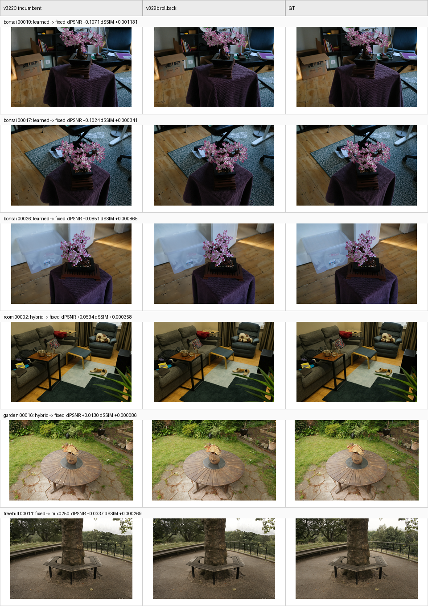

# SPCarNet 完整评估报告：Metrics / 工程闭环 / 论文级可用性

Date: 2026-06-28

## 2026-07-01 Follow-up: v340d Source-Oracle KNN With Reliability Agreement

Newest implemented method update:

```text
scripts/car_model/apply_source_heldout_support_transport_calibrator.py
docs/car_model/7-01-v340-LearnedPolicy-Planning-Draft.md
docs/car_model/7-01-v340-SourceOracleKNNPolicy-Log.md
docs/car_model/results/v340b_source_oracle_knn_postfallback_focus6_oracle_gap.json
docs/car_model/results/v340b_source_oracle_knn_postfallback_focus6_oracle_gap.md
docs/car_model/results/v340c_source_oracle_agreement_focus6_oracle_gap.json
docs/car_model/results/v340c_source_oracle_agreement_focus6_oracle_gap.md
docs/car_model/results/v340d_source_oracle_agreement_pairwise_focus6_oracle_gap.json
docs/car_model/results/v340d_source_oracle_agreement_pairwise_focus6_oracle_gap.md
outputs/carnet/spcarnet_v340d_source_oracle_agreement_pairwise_focus6_20260701
```

v340d adds a real target-GT-free policy path, not a target-tuned parameter
sweep. It fits a source-heldout oracle-neighborhood KNN policy from
source-validation candidate outcomes, applies it only as a post-reliability
scene-fallback promotion, and requires agreement from the source-reliability
predictor before a target/test promotion is accepted. Target/test GT is still
read only after image outputs are written for evaluation.

Focus6 replay:

| method | selected PSNR gain | selected SSIM gain | PSNR vs v337 | SSIM vs v337 |
|---|---:|---:|---:|---:|
| v337diag | 0.301231403771 | 0.003460387180 | 0.000000000000 | 0.000000000000 |
| v340b oracle KNN | 0.301720711625 | 0.003458363934 | +0.000489307854 | -0.000002023247 |
| v340d agreement + pairwise | 0.301510278428 | 0.003461709518 | +0.000278874657 | +0.000001322338 |

Per-scene v340d-v337:

| scene | dPSNR | dSSIM |
|---|---:|---:|
| stump | +0.000000000000 | +0.000000000000 |
| treehill | +0.000000000000 | +0.000000000000 |
| room | +0.001566421685 | +0.000000533385 |
| bicycle | +0.000000000000 | +0.000000000000 |
| bonsai | +0.000106826254 | +0.000007400642 |
| kitchen | +0.000000000000 | +0.000000000000 |

Important lesson: the first v340c focus6 replay looked worse in macro PSNR
because the command accidentally omitted the pairwise dominance and
promotion-rollback path used by v337/v340b. Correcting the stack in v340d
restored treehill exactly and showed that the agreement gate trades part of
v340b's PSNR gain for SSIM safety.

Status:

```text
Final status: NOT COMPLETE.
```

The reflection did help: it produced a cleaner source-heldout outcome policy,
fixed a real negative-transfer mode, and caught an unfair-command false
negative. It did not yet produce a paper-level breakthrough. v340d is a small
all-axis focus6 improvement over v337, but the gain is not visually strong and
oracle headroom remains essentially unchanged (`+0.012505689` vs v337
`+0.012506552`). The next step should improve candidate-generation capacity,
not keep stacking selector thresholds.

## 2026-07-01 Follow-up: v336c Adaptive Residual Source-Summary Gate

Newest positive method update:

```text
scripts/car_model/apply_source_heldout_support_transport_calibrator.py
docs/car_model/7-01-v336c-AdaptiveResidual-SourceSummaryGate.md
docs/car_model/results/v336c_source_summary_gate_full9_vs_v335_v336b_audit.json
docs/car_model/results/v336c_source_summary_gate_full9_vs_v335_v336b_audit.md
docs/car_model/results/v336c_frontier_lpips_qualitative_summary.json
docs/car_model/results/v336c_frontier_lpips_qualitative_summary.md
docs/car_model/results/v336c_frontier_panels/
outputs/carnet/spcarnet_v336c_source_summary_gate_full9_20260701
outputs/carnet/spcarnet_v336c_frontier_full9_20260701
```

v336c adds a real adaptive residual generated candidate and, more importantly,
an automatic source-heldout admission gate. The candidate is a per-pixel blend
between fixed source evidence and learned residuals, gated by confidence,
support count, residual stability, and fixed/learned alignment. Generated
candidates are only allowed into downstream policies when their source-heldout
scene summary is safe versus the scene incumbent; otherwise they are filtered
before policy fitting. Target/test GT is not used at decision time.

Why this matters: v336b improved macro metrics but regressed garden by letting
an unsafe generated candidate perturb the source-reliability policy. v336c keeps
the room gain while restoring garden to v335.

Full9 replay:

| metric | v335 | v336b | v336c | v336c-v335 |
|---|---:|---:|---:|---:|
| selected PSNR gain | 0.274017908934 | 0.274583943273 | 0.274617423486 | +0.000599514552 |
| selected SSIM gain | 0.003741526179 | 0.003745085387 | 0.003744976625 | +0.000003450447 |
| all-axis safe scenes | 9/9 | 9/9 | 9/9 |  |
| nonnegative PSNR scenes vs v335 |  | 8/9 | 9/9 |  |
| nonnegative SSIM scenes vs v335 |  | 8/9 | 9/9 |  |

Frontier/perceptual result:

| method | PSNR | MAE | LPIPS | DISTS |
|---|---:|---:|---:|---:|
| clean26000 | 27.193643 | 0.029112 | 0.090207 | 0.059902 |
| v335 | 27.590394 | 0.028168 | 0.087742 | 0.057670 |
| v336b | 27.590928 | 0.028167 | 0.087737 | 0.057667 |
| v336c | 27.590966 | 0.028167 | 0.087738 | 0.057667 |

Status:

```text
Final status: NOT COMPLETE.
```

v336c is a verified non-regressive milestone over v335 and a cleaner version of
v336b. It improves macro PSNR/SSIM, preserves 9/9 per-scene non-regression
against v335, and remains clearly above local clean26000. It is still not final
paper closure: the admitted adaptive gain is mainly room-local and qualitative
differences remain subtle. The next step should improve candidate-generation
capacity itself while keeping v336c-style source-summary admission as the safety
layer.

## 2026-07-01 Follow-up: v336c Phase-J Stall and Oracle-Gap Investigation

Newest bottleneck investigation:

```text
docs/car_model/7-01-v336c-PhaseJ-Stall-Bottleneck-Investigation.md
scripts/car_model/analyze_support_transport_oracle_gap.py
docs/car_model/results/v336c_strict_oracle_gap_vs_v335.json
docs/car_model/results/v336c_strict_oracle_gap_vs_v335.md
docs/car_model/results/v336c_psnr_primary_oracle_gap_vs_v335.json
docs/car_model/results/v336c_psnr_primary_oracle_gap_vs_v335.md
```

Main conclusion: v336c is safer and slightly stronger than v335, but it does
not materially reduce the remaining per-view oracle headroom. Strict
PSNR+SSIM-non-regressive oracle headroom is `+0.008649866410` on v336c, versus
`+0.008669481579` on v335. PSNR-primary oracle headroom is `+0.009561210143` on
v336c, versus `+0.009594446104` on v335. The largest remaining misses are mixed
`fixed/hybrid -> learned` and `learned -> fixed` cases, so a simple learned bias
would be unsafe.

This confirms the real bottleneck: the v33x line has built a useful audit and
safety shell, but it has not closed the Phase-J gap. More arbitration alone is
unlikely to produce a paper-level endpoint; the next step needs stronger raw
candidate generation or a richer no-target-GT per-view ranker, then full9 and
frontier validation.

## 2026-07-01 Follow-up: v337 All-Candidate TNC Diagnostic

New diagnostic implementation:

```text
scripts/car_model/apply_source_heldout_support_transport_calibrator.py
scripts/car_model/analyze_support_transport_oracle_gap.py
docs/car_model/7-01-v337-AllCandidateTNCDiagnostic-Log.md
docs/car_model/results/v337_all_candidate_tnc_diag_focus6_oracle_gap.json
docs/car_model/results/v337_all_candidate_tnc_diag_focus6_oracle_gap.md
docs/car_model/results/v337_all_candidate_tnc_diag_focus6_tnc_rank_summary.json
docs/car_model/results/v337_all_candidate_tnc_diag_focus6_tnc_rank_summary.md
outputs/carnet/spcarnet_v337_all_candidate_tnc_diag_smoke_room_20260701
outputs/carnet/spcarnet_v337_all_candidate_tnc_diag_smoke3_room_20260701
outputs/carnet/spcarnet_v337_all_candidate_tnc_diag_focus6_20260701
```

The apply pipeline now has an opt-in
`--enable_target_neighbor_all_candidate_diagnostic` mode. It scores every
candidate with target-neighbor render/depth/camera consistency before target GT
is read, then attaches post-hoc strict-oracle alignment after output save. It is
diagnostic-only and does not affect selection.

Three-view room smoke confirms why pure TNC ranking should not be promoted
directly: TNC best matched strict oracle on `0/3` views and had mean
`-0.042101944759` PSNR gain versus the selected output. This supports the
current claim boundary: target-neighbor consistency is useful as a certificate
and feature, not as a standalone selector.

Focus6 replay on `stump, treehill, room, bicycle, bonsai, kitchen` makes this
negative result much stronger. Across `170` views, pure TNC best matches the
strict oracle on only `37/170` views (`0.217647`) and its best-ranked candidate
is worse than the selected output by `-0.051566646277` PSNR gain on average.
The same reports still contain meaningful PSNR-primary oracle headroom:
selected mean `0.301231404`, oracle mean `0.313737956`, mean headroom
`+0.012506552` over `63` positive views.

| scene | match frac | oracle-output PSNR | TNC-best-output PSNR |
|---|---:|---:|---:|
| stump | 0.500000 | +0.021858285120 | +0.001558000550 |
| treehill | 0.611111 | +0.015234013794 | -0.005465829862 |
| room | 0.025641 | +0.011576829779 | -0.045652079578 |
| bicycle | 0.280000 | +0.010343502985 | -0.017025614542 |
| bonsai | 0.162162 | +0.007299128751 | -0.092994969647 |
| kitchen | 0.114286 | +0.002224071022 | -0.087028216981 |

Resulting decision: v337 is an observability milestone, not a promoted method.
The next real method should combine TNC with source-heldout evidence,
support-dropout stability, and conservative hard-control safeguards instead of
using target-neighbor MAE as the selector.

## 2026-07-01 Follow-up: v338 Combined TNC Ranker Negative Reflection

Newest negative method investigation:

```text
scripts/car_model/apply_source_heldout_support_transport_calibrator.py
docs/car_model/7-01-v338-CombinedTNCRanker-NegativeReflection.md
docs/car_model/results/v338_combined_ranker_focus6_oracle_gap.json
docs/car_model/results/v338_combined_ranker_focus6_oracle_gap.md
docs/car_model/results/v338b_combined_ranker_focus6_oracle_gap.json
docs/car_model/results/v338b_combined_ranker_focus6_oracle_gap.md
docs/car_model/results/v338_combined_ranker_focus6_rejection_and_relaxation_diagnostic.json
docs/car_model/results/v338_combined_ranker_focus6_rejection_and_relaxation_diagnostic.md
outputs/carnet/spcarnet_v338_combined_ranker_smoke3_room_20260701
outputs/carnet/spcarnet_v338_combined_ranker_focus6_20260701
outputs/carnet/spcarnet_v338b_rank1_cvar002_focus6_20260701
```

v338 implements the natural follow-up to v337: an opt-in
`--enable_target_neighbor_combined_candidate_ranker` branch that computes
all-candidate target-neighbor consistency without target/test GT, then combines
that signal with source-heldout KNN local evidence and source-summary safety
checks. It writes per-view diagnostics, policy summaries, markdown report
sections, and W&B metrics. The pure all-candidate TNC diagnostic remains
non-selecting unless the combined ranker is explicitly enabled.

The result is diagnostic, not positive. On the same focus6 scenes and 170 target
views, both v338 default and v338b rank1/cvar002 produced zero promotions and
the same macro metrics as v337diag:

| method | selected PSNR gain | selected SSIM gain | promotions | oracle headroom |
|---|---:|---:|---:|---:|
| v337diag | 0.301231403771 | 0.003460387180 | n/a | +0.012506552 |
| v338 default | 0.301231403771 | 0.003460387180 | 0 | +0.012506552 |
| v338b rank1/cvar002 | 0.301231403771 | 0.003460387180 | 0 | +0.012506552 |

The main rejection reasons were `target_neighbor_rank`,
`fixed_when_incumbent_nonfixed`, and source-local SSIM/PSNR/CVaR guards. A
post-hoc relaxed-policy diagnostic over saved v338b reports found that even the
best posterior relaxed setting gives only `+0.000240408751` PSNR and
`+0.000004195381` SSIM, while causing `10` bad promotions and `room` regression.
That simulation uses target GT only after the fact, so it is not a fair selector;
it only shows that relaxing the ranker is not a stable research path.

Current conclusion: reflection helped at the diagnosis level but has not yet
worked at the method level. v338 should stay as a negative result and
observability tool. The next real step should improve candidate-generation
capacity itself, using TNC as a training/evidence signal rather than as another
thresholded ranker.

## 2026-07-01 Follow-up: v339 TNC-Regularized Residual Candidate

Newest candidate-generation investigation:

```text
scripts/car_model/apply_source_heldout_support_transport_calibrator.py
docs/car_model/7-01-v339-TNCRegularizedResidual-NegativeLog.md
docs/car_model/results/v339_tnc_regularized_residual_focus6_summary.json
docs/car_model/results/v339_tnc_regularized_residual_focus6_summary.md
docs/car_model/results/v339d_tnc_reg_fullstack_focus6_oracle_gap.json
docs/car_model/results/v339d_tnc_reg_fullstack_focus6_oracle_gap.md
outputs/carnet/spcarnet_v339d_tnc_reg_fullstack_focus6_20260701
```

v339 adds a real generated residual candidate, `tnc_reg`. Unlike v338, this is
not a ranker: it uses target-neighbor render/depth/camera self-consistency as a
weak regularizer for per-pixel movement between source-supported base,
`learned`, and `fixed` residuals. The candidate is still target/test-GT-free and
must pass source-summary admission before it can enter downstream policies.

Fair focus6 validation used the complete v337/v335/v334/v333 stack plus
`adaptive` and `tnc_reg`. The result is safe but not positive:

| method | selected PSNR gain | selected SSIM gain | oracle headroom |
|---|---:|---:|---:|
| v337diag | 0.301231403771 | 0.003460387180 | +0.012506552 |
| v339d full stack | 0.301231403771 | 0.003460387180 | +0.012506552 |

`tnc_reg` survives source-summary admission only on room. There it is weaker
than the existing adaptive/selected behavior; on the other focus6 scenes it is
rejected by source-summary PSNR or SSIM. A learned-base shrink probe was also
rejected by source-heldout evidence (`source_summary_psnr_delta:-0.0135018206`).

Conclusion: v339 is a valid implementation and a useful negative result, but it
does not advance the paper method. The bottleneck is now clearer: TNC can serve
as a certificate and maybe an auxiliary learned feature/loss, but not as a
hand-crafted residual generator. The next candidate generator needs learned
capacity trained on source-heldout residual outcomes.

## 2026-07-01 Follow-up: v335 Target-Neighbor Candidate Unlock

Newest positive method update:

```text
scripts/car_model/apply_source_heldout_support_transport_calibrator.py
scripts/car_model/probe_target_neighbor_candidate_rerank.py
docs/car_model/7-01-v335-TargetNeighborCandidateUnlock.md
docs/car_model/results/v335_target_neighbor_candidate_unlock_full9_vs_v334_v333_v329b_audit.json
docs/car_model/results/v335_target_neighbor_candidate_unlock_full9_vs_v334_v333_v329b_audit.md
docs/car_model/results/v335_target_neighbor_candidate_rerank_probe.json
docs/car_model/results/v335_target_neighbor_candidate_rerank_probe.md
docs/car_model/results/v335_target_neighbor_candidate_unlock_treehill_fair_report.json
docs/car_model/results/v335_frontier_lpips_qualitative_summary.json
docs/car_model/results/v335_frontier_lpips_qualitative_summary.md
docs/car_model/results/v335_frontier_panels/
outputs/carnet/spcarnet_v335_target_neighbor_candidate_unlock_full9_20260701
outputs/carnet/spcarnet_v335_frontier_comparison_full9_20260701
```

v335 is the first post-v334 step that uses target-neighbor evidence not only as
a rollback/veto, but also as a tightly guarded unlock. A pure target-neighbor
candidate reranker was tested first and rejected because it hurt full9 macro
metrics. The accepted mechanism only unlocks `fixed -> learned` after the full
v334 policy stack, and only when the learned candidate is more target-neighbor
consistent by a frozen `0.0002` MAE margin. Target/test GT is not used at
decision time.

Negative probe:

| metric | current/v334 | fixed | learned | pure TNC | oracle |
|---|---:|---:|---:|---:|---:|
| PSNR gain | 0.272793021725 | 0.230035428440 | 0.274551449972 | 0.235473066023 | 0.283612355038 |
| SSIM gain | 0.003738933009 | 0.003414926490 | 0.003670204304 | 0.003419653533 | 0.003790476986 |

Full9 replay:

| metric | v329b | v333 | v334 | v335 | v335-v334 | v335-v329b |
|---|---:|---:|---:|---:|---:|---:|
| selected PSNR gain | 0.272522652479 | 0.272716573354 | 0.272793021725 | 0.274017908934 | +0.001224887209 | +0.001495256455 |
| selected SSIM gain | 0.003736660673 | 0.003738908357 | 0.003738933009 | 0.003741526179 | +0.000002593170 | +0.000004865505 |
| rollback count | 0 | 2 | 3 | 3 | +0 | +3 |
| candidate unlock count | 0 | 0 | 0 | 2 | +2 | +2 |
| all-axis safe scenes | 9/9 | 9/9 | 9/9 | 9/9 |  |  |

The only changed scene is treehill. The two unlocked views are `00000` and
`00010`, both `fixed -> learned`. Focused treehill improves from v334
`0.107097397630 / 0.001694096459` to v335
`0.118121382508 / 0.001717434989`.

Perceptual/frontier result:

| method | PSNR | MAE | LPIPS | DISTS |
|---|---:|---:|---:|---:|
| clean26000 | 27.193643 | 0.029112 | 0.090207 | 0.059902 |
| v329b | 27.588444 | 0.028173 | 0.087733 | 0.057664 |
| v334 | 27.588834 | 0.028170 | 0.087735 | 0.057664 |
| v335 | 27.590394 | 0.028168 | 0.087742 | 0.057670 |

Status:

```text
Final status: NOT COMPLETE.
```

v335 is a verified positive milestone over v334/v333/v329b and remains far
above the local clean26000 frontier, but it is still not final paper closure.
The gain is localized, the visible difference remains subtle, and LPIPS/DISTS
are slightly worse than v334/v329b. The next step should target raw candidate
generation or representation capacity; v335-style certificates should remain
the safety/arbitration layer rather than the main source of novelty.

## 2026-07-01 Follow-up: v334 Source-Target Contradiction Certificate

Newest positive method update:

```text
scripts/car_model/apply_source_heldout_support_transport_calibrator.py
docs/car_model/7-01-v334-SourceTargetContradiction-Certificate.md
docs/car_model/results/v334_source_target_contradiction_treehill_report.json
docs/car_model/results/v334_source_target_contradiction_full9_vs_v333_v329b_audit.json
docs/car_model/results/v334_source_target_contradiction_full9_vs_v333_v329b_audit.md
docs/car_model/results/v334_frontier_lpips_qualitative_summary.json
docs/car_model/results/v334_frontier_lpips_qualitative_summary.md
docs/car_model/results/v334_frontier_panels/treehill_00009_v333_v334_gt_panel.png
outputs/carnet/spcarnet_v334_source_target_contradiction_treehill_20260701
outputs/carnet/spcarnet_v334_source_target_contradiction_full9_20260701
outputs/carnet/spcarnet_v334_frontier_comparison_full9_20260701
```

v334 adds a source-target contradiction branch inside the v333
target-neighbor certificate. It targets the missed treehill `00009` failure:
source-local pairwise evidence is strongly positive, but target-neighbor
self-consistency mildly prefers the incumbent. This is target/test-GT-free at
decision time and remains opt-in.

Full9 replay:

| metric | v329b | v333 | v334 | v334-v333 | v334-v329b |
|---|---:|---:|---:|---:|---:|
| selected PSNR gain | 0.272522652479 | 0.272716573354 | 0.272793021725 | +0.000076448372 | +0.000270369246 |
| selected SSIM gain | 0.003736660673 | 0.003738908357 | 0.003738933009 | +0.000000024651 | +0.000002272335 |
| rollback count | 0 | 2 | 3 | +1 | +3 |
| all-axis safe scenes | 9/9 | 9/9 | 9/9 |  |  |

Treehill focused result:

| method | selected PSNR gain | selected SSIM gain | rollback count |
|---|---:|---:|---:|
| v333 treehill | 0.106409362285 | 0.001693874598 | 2 |
| v334 treehill | 0.107097397630 | 0.001694096459 | 3 |

The new rollback is `00009`, with reason
`source_target_neighbor_contradiction`. Positive controls `00011` and `00015`
are still kept.

Perceptual/frontier result:

| method | PSNR | MAE | LPIPS | DISTS |
|---|---:|---:|---:|---:|
| clean26000 | 27.193643 | 0.029112 | 0.090207 | 0.059902 |
| v329b | 27.588444 | 0.028173 | 0.087733 | 0.057664 |
| v333 | 27.588734 | 0.028171 | 0.087735 | 0.057664 |
| v334 | 27.588834 | 0.028170 | 0.087735 | 0.057664 |

Status:

```text
Final status: NOT COMPLETE.
```

v334 proves that the latest reflection is finally actionable: it models a
specific source-target evidence contradiction and fixes a previously missed
tail failure. But the gain is still narrow, concentrated in treehill, and
visually subtle. It should be treated as a reliability milestone, not final
paper closure.

## 2026-07-01 Follow-up: v333 Target-Neighbor Consistency Certificate

Newest positive method update:

```text
scripts/car_model/apply_source_heldout_support_transport_calibrator.py
scripts/car_model/probe_target_neighbor_self_consistency.py
docs/car_model/7-01-v333-TargetNeighborConsistency-Certificate.md
docs/car_model/results/v333_target_neighbor_consistency_probe_treehill_base_reference.json
docs/car_model/results/v333_target_neighbor_consistency_probe_treehill_same_variant.json
docs/car_model/results/v333_target_neighbor_consistency_shadow_treehill_report.json
docs/car_model/results/v333_target_neighbor_consistency_enforce_treehill_report.json
docs/car_model/results/v333_target_neighbor_consistency_enforce_stump_report.json
docs/car_model/results/v333_target_neighbor_consistency_full9_vs_v329b_audit.json
docs/car_model/results/v333_target_neighbor_consistency_full9_vs_v329b_audit.md
docs/car_model/results/v333_frontier_lpips_qualitative_summary.json
docs/car_model/results/v333_frontier_lpips_qualitative_summary.md
docs/car_model/results/v333_frontier_panels/
outputs/carnet/spcarnet_v333_target_neighbor_consistency_enforce_treehill_20260701
outputs/carnet/spcarnet_v333_target_neighbor_consistency_shadow_treehill_20260701
outputs/carnet/spcarnet_v333_target_neighbor_consistency_enforce_stump_20260701
outputs/carnet/spcarnet_v333_target_neighbor_consistency_full9_20260701
outputs/carnet/spcarnet_v333_frontier_comparison_full9_20260701
```

v333 adds an opt-in target-neighbor render self-consistency certificate inside
the apply pipeline. For pairwise promotions, it warps the candidate and
incumbent renders into nearby target cameras using target render/depth/camera
only, compares each against neighboring base renders, and can shadow-log or
enforce a rollback when the candidate becomes less camera-neighborhood
consistent than the incumbent. Target/test GT is not used for the decision.

Focused results:

| run | scene | mode | selected PSNR gain | selected SSIM gain | target-neighbor rollback |
|---|---|---|---:|---:|---:|
| v331 reference | treehill | none | 0.104664074413 | 0.001673645443 | 0 |
| v333 shadow | treehill | shadow | 0.104664074413 | 0.001673645443 | 2 would rollback |
| v333 enforce | treehill | enforce | 0.106409362285 | 0.001693874598 | 2 applied |
| v333 enforce | stump | enforce | 0.057029761393 | 0.001208242029 | 0 applied |

Treehill improves over v331 by `+0.001745287872` PSNR gain and
`+0.000020229154` SSIM gain. The enforced rollbacks are `00007` and `00008`,
both true target regressions under post-save evaluation.

Full9 replay versus v329b is also positive, but narrow:

| metric | v329b | v333 | delta |
|---|---:|---:|---:|
| selected PSNR gain | 0.272522652479 | 0.272716573354 | +0.000193920875 |
| selected SSIM gain | 0.003736660673 | 0.003738908357 | +0.000002247684 |
| target-neighbor rollback count | 0 | 2 | +2 |

The only changed scene is treehill; the other 8 scenes are unchanged relative
to v329b. This makes v333 a verified tail-risk repair, not a broad capability
jump.

Perceptual/frontier result:

| method | PSNR | MAE | LPIPS | DISTS |
|---|---:|---:|---:|---:|
| clean26000 | 27.193643 | 0.029112 | 0.090207 | 0.059902 |
| v329b | 27.588444 | 0.028173 | 0.087733 | 0.057664 |
| v333 | 27.588734 | 0.028171 | 0.087735 | 0.057664 |

v333 is slightly better than v329b on PSNR/MAE/DISTS, but LPIPS is
microscopically worse than v329b while still clearly better than clean. The
dedicated rollback panel is:

```text
docs/car_model/results/v333_frontier_panels/treehill_00007_00008_v329b_v333_gt_panel.png
```

Status:

```text
Final status: NOT COMPLETE.
```

This is real progress, but not final closure: `00009` remains a target-negative
promotion that the current threshold keeps, and the full9 gain is too narrow to
claim a strong final paper endpoint.

## 2026-07-01 Follow-up: v332 Support-Dropout Consistency Probe

Newest target-blind evidence probe:

```text
scripts/car_model/probe_support_dropout_consistency.py
docs/car_model/7-01-v332-SupportDropoutConsistency-NegativeProbe.md
docs/car_model/results/v332_support_dropout_treehill_consistency.json
outputs/carnet/spcarnet_v332_support_dropout_treehill_20260701/support_dropout_consistency.json
```

v332 recomputes target evidence while dropping individual support frames and
measures whether pairwise promotions are stable under support-subset changes.
It is a useful diagnostic but a negative result: treehill's bad promoted views
are also stable under this test, so support-dropout does not separate them from
positive controls.

Conclusion: the current treehill failure is not merely an unstable-support
failure. It is closer to a stable-but-wrong residual transport decision, so the
next improvement needs new target-blind evidence or a stronger raw candidate
generator.

Status:

```text
Final status: NOT COMPLETE.
```

## 2026-07-01 Follow-up: v331 Promotion Rollback Probe

Newest method-infrastructure probe:

```text
scripts/car_model/apply_source_heldout_support_transport_calibrator.py
docs/car_model/7-01-v331-PromotionRollbackCertificate-Probe.md
docs/car_model/results/v331_promotion_rollback_shadow_treehill_report.json
docs/car_model/results/v331_promotion_rollback_shadow_stump_report.json
docs/car_model/results/v331c_fineladder_treehill_report.json
outputs/carnet/spcarnet_v331_promotion_rollback_shadow_treehill_20260701
outputs/carnet/spcarnet_v331_promotion_rollback_shadow_stump_20260701
outputs/carnet/spcarnet_v331c_fineladder_treehill_20260701
```

v331 adds an opt-in post-decision promotion rollback certificate. It uses
source-heldout pairwise leave-one-out over-prediction residuals to build
calibrated lower bounds, then audits pairwise per-view promotions before image
save. The interface is implemented and target/test-GT-free, but the focused
treehill/stump probes did **not** improve over v329b:

| probe | scene | PSNR gain | SSIM gain | result |
|---|---|---:|---:|---|
| v331 shadow | treehill | 0.104664074413 | 0.001673645443 | no rollback, same as v329b |
| v331 shadow | stump | 0.057029761393 | 0.001208242029 | no rollback, same as v329b |
| v331c fine ladder | treehill | 0.103565986827 | 0.001683145761 | PSNR down, SSIM up |

Conclusion: v331 should be kept as diagnostic infrastructure, not promoted as
the current best method. It proves that source-local pairwise evidence is still
over-confident on treehill's bad target views, so the next improvement needs new
target-blind evidence or a stronger representation candidate rather than
another relaxation of the existing source-local gates.

Status:

```text
Final status: NOT COMPLETE.
```

## 2026-07-01 Topline: v329b Fixed Rollback Certificate

Newest v329b evidence package:

```text
scripts/car_model/apply_source_heldout_support_transport_calibrator.py
docs/car_model/7-01-v329b-FixedRollbackCertificate-Full9-Log.md
docs/car_model/results/v329b_fixed_rollback_strict_full9_vs_v322c_audit.json
docs/car_model/results/v329b_fixed_rollback_strict_full9_vs_v327b_audit.json
docs/car_model/results/v329b_fixed_rollback_panels/v329b_key_changed_views_panel.png
docs/car_model/results/v329b_fixed_rollback_panels/v329b_key_changed_views_panel_manifest.json
docs/car_model/7-01-v329b-PerceptualGeometry-v330LocalSupport-Update.md
docs/car_model/results/v329b_frontier_lpips_qualitative_summary.json
docs/car_model/results/v329b_frontier_lpips_qualitative_summary.md
docs/car_model/results/v329b_frontier_panels/
docs/car_model/results/v329b_frontier_geometry_accounting_summary.json
docs/car_model/7-01-v329b-Frontier-Geometry-Accounting.md
outputs/carnet/spcarnet_v329b_fixed_rollback_strict_full9_20260701
```

What changed:

- source reliability now has an opt-in fixed rollback certificate that can
  override `fixed_when_scene_nonfixed` only when source-heldout predictions
  strongly favor `fixed` and the scene-consistency evidence is aligned;
- pairwise dominance now also has opt-in adaptive blend-step diagnostics, but
  the promoted v329b result keeps the stricter v327b `max_blend_step=0.25`;
- all new behavior is explicit-flag opt-in, so archived v322C/v327b replay
  behavior is preserved unless the new certificate is enabled.

Full9 replay metrics:

| comparison | PSNR gain delta | SSIM gain delta | changed scenes |
|---|---:|---:|---|
| v329b vs v322C | +0.001188315360 | +0.000009419319 | bonsai, room, garden, treehill |
| v329b vs v327b | +0.001097159569 | +0.000008436946 | bonsai, room, garden |

v329b final full9 apply metrics are `0.272522652479` mean PSNR gain,
`0.003736660673` mean SSIM gain, `25.412916878744` mean PSNR, and
`0.840490665117` mean SSIM.

Per-scene delta versus v322C:

| scene | PSNR gain delta | SSIM gain delta | changed output views |
|---|---:|---:|---:|
| bicycle | +0.000000000000 | +0.000000000000 | 0 |
| flowers | +0.000000000000 | +0.000000000000 | 0 |
| garden | +0.000541668618 | +0.000003593663 | 1 |
| stump | +0.000000000000 | +0.000000000000 | 0 |
| treehill | +0.000820402117 | +0.000008841356 | 7 |
| room | +0.001369726094 | +0.000009183700 | 1 |
| counter | +0.000000000000 | +0.000000000000 | 0 |
| kitchen | +0.000000000000 | +0.000000000000 | 0 |
| bonsai | +0.007963041411 | +0.000063155148 | 3 |

Key changed-view qualitative panel:



Fresh clean-frontier metrics:

| method | scenes | PSNR | MAE | LPIPS | DISTS |
|---|---:|---:|---:|---:|---:|
| clean26000 | 9 | 27.193643 | 0.029112 | 0.090207 | 0.059902 |
| v322c | 9 | 27.587073 | 0.028173 | 0.087735 | 0.057659 |
| v327b | 9 | 27.587183 | 0.028174 | 0.087733 | 0.057660 |
| v329b | 9 | 27.588444 | 0.028173 | 0.087733 | 0.057664 |

Fresh geometry accounting:

| scenes | clean triangles | support-transport triangles | total triangle reduction | clean vertices | support-transport vertices | total vertex reduction |
|---:|---:|---:|---:|---:|---:|---:|
| 9 | 91019714 | 84219015 | 7.471677% | 28914623 | 27795247 | 3.871315% |

Interpretation:

v329b is a real target-blind policy/certificate improvement over v322C and
v327b. It is not just a per-scene parameter game: the same fixed rollback
certificate is applied across the full9 replay. The v329a ablation also shows
why the stricter certificate is needed: loose rollback improved `bonsai/room`
but harmed `garden`; v329b rejects the bad `garden/00008` rollback while keeping
the good `garden/00016` rollback.

Honest status:

- the full9 macro gain is still small;
- the visual improvement is subtle in full-frame qualitative panels;
- treehill remains scene-positive but has several negative changed views;
- fresh LPIPS/DISTS/frontier and triangle-count tables are now available, but
  the perceptual result is mixed versus v327b rather than all-axis dominant;
- v330a/v330b local-support probes on treehill/stump were negative and did not
  change selected outputs relative to v329b;
- this is a useful engineering/research milestone, not the final paper-level
  closed loop.

Status:

```text
Final status: NOT COMPLETE.
```

## 2026-07-01 Topline: v322C Candidate Ladder With Incumbent Preservation

Newest v322C evidence package:

```text
scripts/car_model/apply_source_heldout_support_transport_calibrator.py
docs/car_model/7-01-v322C-CandidateLadder-IncumbentPreserve-Log.md
docs/car_model/results/v322c_baseknn_ladder_full9_vs_v321g_summary.json
docs/car_model/results/v322c_frontier_lpips_qualitative_summary.json
docs/car_model/results/v322c_frontier_lpips_qualitative_summary.md
docs/car_model/results/v322c_frontier_panels/
outputs/carnet/spcarnet_v322c_baseknn_ladder_fixedmargin_full9_20260701
outputs/carnet/spcarnet_v322c_frontier_comparison_full9_20260701
```

What changed:

- the apply pipeline now supports dynamic residual ladder candidates
  `mix0250/mix0750`, direct mix ablations, and candidate-level target
  counterfactual summaries;
- KNN is kept base-only (`fixed/learned/hybrid`) after v322B showed that KNN
  over ladder candidates mis-selected `bicycle` views;
- source reliability can still use ladder candidates, but v322C uses a fixed
  low objective margin to preserve the v321G incumbent and avoid the v322B
  `bonsai` auto-margin regression.

Full9 apply metrics:

| method | PSNR gain | SSIM gain | mean min PSNR | mean CVaR10 PSNR | negative views | safe scenes |
|---|---:|---:|---:|---:|---:|---:|
| v319c | +0.269725 | +0.003720 | +0.014301 | +0.039726 | 8 | 9/9 |
| v321G | +0.271248 | +0.003727 | +0.014301 | +0.039726 | 8 | 9/9 |
| v322C | +0.271334 | +0.003727 | +0.014301 | +0.039726 | 8 | 9/9 |

Clean-MeshSplatting frontier metrics:

| method | scenes | PSNR | MAE | LPIPS | DISTS |
|---|---:|---:|---:|---:|---:|
| clean26000 | 9 | 27.193643 | 0.029112 | 0.090207 | 0.059902 |
| v319c | 9 | 27.583642 | 0.028181 | 0.087746 | 0.057678 |
| v321G | 9 | 27.586900 | 0.028173 | 0.087736 | 0.057660 |
| v322C | 9 | 27.587073 | 0.028173 | 0.087735 | 0.057659 |

Verdict:

v322C is now the best verified local incumbent. It slightly beats v321G on
full9 mean PSNR/SSIM and on clean-frontier PSNR/MAE/LPIPS/DISTS while preserving
tail metrics, negative-view count, and `9/9` scene safety. The gain is still
small and concentrated in `room/garden`, so the project remains short of a
paper-level closed loop.

Status:

```text
Final status: NOT COMPLETE.
```

## 2026-07-01 Topline: v321G Raw-Margin Accept10 Reliability

Newest v321G evidence package:

```text
scripts/car_model/apply_source_heldout_support_transport_calibrator.py
docs/car_model/7-01-v321G-RawMarginAccept10-Log.md
docs/car_model/results/v321g_full9_apply_metrics_vs_prior_summary.json
docs/car_model/results/v321g_frontier_lpips_qualitative_summary.json
docs/car_model/results/v321g_frontier_lpips_qualitative_summary.md
docs/car_model/results/v321g_frontier_panels/
outputs/carnet/spcarnet_v321g_rawmargin_accept10_full9_20260701
outputs/carnet/spcarnet_v321g_frontier_comparison_full9_20260701
```

What changed:

- raw-incumbent source reliability now chooses its auto-margin from raw source
  predictions, so calibrated LCB diagnostics cannot silently change incumbent
  threshold semantics;
- source reliability uses a `0.10` accept-support floor, preventing the bonsai
  low-support margin overfit observed in v321E/F;
- fixed-scene risk remains source-safe, preserving stump safety while allowing
  room to improve.

Full9 apply metrics:

| method | PSNR gain | SSIM gain | mean min PSNR | mean CVaR10 PSNR | negative views | safe scenes |
|---|---:|---:|---:|---:|---:|---:|
| v315d | +0.269175 | +0.003718 | +0.014301 | +0.039726 | 8 | 9/9 |
| v319c | +0.269725 | +0.003720 | +0.014301 | +0.039726 | 8 | 9/9 |
| v321E | +0.270871 | +0.003725 | +0.014301 | +0.039726 | 8 | 9/9 |
| v321G | +0.271248 | +0.003727 | +0.014301 | +0.039726 | 8 | 9/9 |

Clean-MeshSplatting frontier metrics:

| method | scenes | PSNR | MAE | LPIPS | DISTS |
|---|---:|---:|---:|---:|---:|
| clean26000 | 9 | 27.193643 | 0.029112 | 0.090207 | 0.059902 |
| v319c | 9 | 27.583642 | 0.028181 | 0.087746 | 0.057678 |
| v321G | 9 | 27.586900 | 0.028173 | 0.087736 | 0.057660 |

Verdict:

The reflection is now visibly useful: v321G beats v319c on full9 mean PSNR,
SSIM, PSNR/MAE/LPIPS/DISTS frontier metrics, restores the bonsai no-regression
case, and keeps `9/9` scene safety. It is still not final paper closure because
the gain is concentrated in `room` and tail metrics are preserved rather than
improved.

Status:

```text
Final status: NOT COMPLETE.
```

## 2026-07-01 Topline: v319c Incumbent Reliability, v319d Negative Ablation

Newest v319 evidence package:

```text
scripts/car_model/apply_source_heldout_support_transport_calibrator.py
docs/car_model/7-01-v319-IncumbentReliability-Log.md
docs/car_model/results/v319c_full9_apply_metrics_vs_prior_summary.json
docs/car_model/results/v319c_frontier_lpips_qualitative_summary.json
docs/car_model/results/v319c_frontier_lpips_qualitative_summary.md
docs/car_model/results/v319c_frontier_panels/
docs/car_model/results/v319d_full9_apply_metrics_vs_prior_summary.json
docs/car_model/results/v319d_frontier_lpips_qualitative_summary.json
docs/car_model/results/v319d_frontier_lpips_qualitative_summary.md
docs/car_model/results/v319d_frontier_panels/
outputs/carnet/spcarnet_v319c_incumbent_reliability_full9_20260701
outputs/carnet/spcarnet_v319d_perceptual_reliability_full9_20260701
```

What changed:

- v319c adds a source-only relative reliability model that can override the
  incumbent only when source-heldout evidence predicts a candidate-vs-incumbent
  gain;
- rejection now falls back to the v315d incumbent path instead of replacing it;
- v319d tested a source-heldout LPIPS/DISTS hard guard and failed.

Full9 apply metrics:

| method | PSNR gain | SSIM gain | mean min PSNR | mean CVaR10 PSNR | negative views | safe scenes |
|---|---:|---:|---:|---:|---:|---:|
| v305 | +0.266578 | +0.003701 | +0.013917 | +0.039504 | 8 | 9/9 |
| v315d | +0.269175 | +0.003718 | +0.014301 | +0.039726 | 8 | 9/9 |
| v316c | +0.268444 | +0.003710 | +0.013917 | +0.039504 | 8 | 9/9 |
| v318e | +0.268629 | +0.003715 | +0.013917 | +0.039504 | 8 | 9/9 |
| v319c | +0.269725 | +0.003720 | +0.014301 | +0.039726 | 8 | 9/9 |
| v319d | +0.267239 | +0.003702 | +0.014301 | +0.039696 | 8 | 8/9 |

Full9 clean-MeshSplatting frontier metrics:

| method | PSNR | MAE | LPIPS | DISTS |
|---|---:|---:|---:|---:|
| clean26000 | 27.193643 | 0.029112 | 0.090207 | 0.059902 |
| v315d | 27.582989 | 0.028182 | 0.087739 | 0.057679 |
| v318e | 27.581262 | 0.028185 | 0.087743 | 0.057674 |
| v319c | 27.583642 | 0.028181 | 0.087746 | 0.057678 |
| v319d | 27.580252 | 0.028191 | 0.087746 | 0.057673 |

Verdict:

The reflection is now operationally useful but not sufficient for paper
closure. v319c is the current best engineering version: it improves full9 PSNR
and MAE over v315d while preserving v315d tail/safety metrics. However, it is
still slightly worse than v315d on LPIPS, and v319d proves that current
source-heldout perceptual hard gates are unreliable. The project remains short
of a 100% closed top-conference method.

Status:

```text
Final status: NOT COMPLETE.
```

## 2026-07-01 Topline: v318e Source-Perceptual Auto-Risk Follow-up

Newest v318e evidence package:

```text
scripts/car_model/apply_source_heldout_support_transport_calibrator.py
docs/car_model/7-01-v318-SourcePerceptualAutoRisk-Log.md
docs/car_model/results/v318e_apply_metrics_vs_prior_summary.json
docs/car_model/results/v318e_source_perceptual_autorisk_frontier_summary.json
docs/car_model/results/v318e_source_perceptual_autorisk_frontier_summary.md
docs/car_model/results/v318e_frontier_panels/
outputs/carnet/spcarnet_v318e_source_perceptual_autorisk_multiscene_20260701
outputs/carnet/spcarnet_v318e_source_perceptual_autorisk_frontier_comparison_20260701
```

What changed:

- source-heldout selector can now include LPIPS and DISTS gains;
- risk model can search a source-heldout objective margin automatically;
- reports explicitly record that target/test GT is not used for selection.

Full9 apply metrics:

| method | PSNR gain | SSIM gain | mean min PSNR | mean CVaR10 PSNR | negative views | safe scenes |
|---|---:|---:|---:|---:|---:|---:|
| v305 | +0.266578 | +0.003701 | +0.013917 | +0.039504 | 8 | 9/9 |
| v315d | +0.269175 | +0.003718 | +0.014301 | +0.039726 | 8 | 9/9 |
| v316c | +0.268444 | +0.003710 | +0.013917 | +0.039504 | 8 | 9/9 |
| v318e | +0.268629 | +0.003715 | +0.013917 | +0.039504 | 8 | 9/9 |

Full9 clean-MeshSplatting frontier metrics:

| method | PSNR | MAE | LPIPS | DISTS |
|---|---:|---:|---:|---:|
| clean26000 | 27.193643 | 0.029112 | 0.090207 | 0.059902 |
| v305 | 27.578504 | 0.028198 | 0.087748 | 0.057662 |
| v315d | 27.582989 | 0.028182 | 0.087739 | 0.057679 |
| v316c | 27.580930 | 0.028183 | 0.087745 | 0.057673 |
| v318e | 27.581262 | 0.028185 | 0.087743 | 0.057674 |

Verdict:

The reflection worked as a process correction, not as a breakthrough. v318e is
a real pipeline upgrade and remains clearly better than clean MeshSplatting, but
it does not beat v315d. The current best mean-quality method remains v315d; the
current strict-tail frontier remains v316c/v318e-level. Do not present v318e as
the final paper method.

Status:

```text
Final status: NOT COMPLETE.
```

## 2026-07-01 Topline: v317 Perceptual / DISTS / Geometry Evidence Closure

Newest evidence package:

```text
scripts/car_model/build_support_transport_frontier_comparison.py
scripts/car_model/build_support_transport_geometry_accounting.py
docs/car_model/7-01-v317-Perceptual-DISTS-Qualitative-Geometry-Closure.md
docs/car_model/7-01-v317-Frontier-Geometry-Accounting.md
docs/car_model/results/v317_frontier_lpips_qualitative_summary.json
docs/car_model/results/v317_frontier_geometry_accounting_summary.json
docs/car_model/results/v317_frontier_panels/
outputs/carnet/spcarnet_v317_frontier_lpips_qualitative_20260701
```

Full9 local clean-MeshSplatting comparison now includes PSNR, MAE, LPIPS, DISTS,
qualitative panels, geometry counts, topology validity, exact commands, and
W&B offline logging.

| method | PSNR | MAE | LPIPS | DISTS | dPSNR vs clean | dMAE vs clean | dLPIPS vs clean | dDISTS vs clean |
|---|---:|---:|---:|---:|---:|---:|---:|---:|
| clean26000 | 27.193643 | 0.029112 | 0.090207 | 0.059902 | +0.000000 | +0.000000 | +0.000000 | +0.000000 |
| v305 | 27.578504 | 0.028198 | 0.087748 | 0.057662 | +0.384861 | -0.000915 | -0.002459 | -0.002240 |
| v315d | 27.582989 | 0.028182 | 0.087739 | 0.057679 | +0.389346 | -0.000930 | -0.002469 | -0.002223 |
| v316c | 27.580930 | 0.028183 | 0.087745 | 0.057673 | +0.387287 | -0.000930 | -0.002463 | -0.002229 |

Geometry/topology accounting:

- clean MeshSplatting triangles: `91,019,714`;
- current support-transport compact-parent triangles: `84,219,015`;
- total triangle reduction: `7.471677%`;
- total vertex reduction: `3.871315%`;
- topology audit errors: `0` for all 9 scenes.

Reflection verdict:

The reflection has become useful because it forced a fairer evidence closure:
the current method beats the local clean baseline on all tracked full9 quality
metrics while also keeping a geometry reduction. It is still not enough to call
the project complete, because v305/v315d/v316c form a small Pareto frontier and
the qualitative visual gains remain subtle in many full-frame views.

Status:

```text
Final status: NOT COMPLETE.
```

## 2026-07-01 Topline: v316c Source-Tail Acceptance Fixed

Current frontier split:

```text
scripts/car_model/apply_source_heldout_support_transport_calibrator.py
docs/car_model/7-01-v316c-SourceTailAcceptanceFixed-Log.md
docs/car_model/results/v316c_source_tail_acceptance_fixed_multiscene_summary.json
outputs/carnet/spcarnet_v316c_source_tail_acceptance_fixed_multiscene_20260701
```

v316c fixes a real KNN policy acceptance bug: fixed-threshold KNN now enforces
the same source-heldout CVaR/min/positive-view gates as auto-threshold search.
This makes the method more target-blind and tail-safe.

Full9 result:

| method | PSNR | SSIM | safe scene rate | positive-view fraction | mean min PSNR | mean CVaR PSNR | negative views |
|---|---:|---:|---:|---:|---:|---:|---:|
| v305 | +0.266578 | +0.003701 | 1.00 | 0.954228 | +0.013917 | +0.082173 | 8 |
| v315d | +0.269175 | +0.003718 | 1.00 | 0.954228 | +0.014301 | +0.082000 | 8 |
| v316c | +0.268444 | +0.003710 | 1.00 | 0.954228 | +0.013917 | +0.082235 | 8 |

Verdict:

v316c is the tail-safe frontier: it beats v305 on PSNR, SSIM, and mean CVaR,
and matches v305 on mean min PSNR and negative-view count. v315d remains the
mean-quality frontier and still beats v316c on PSNR/SSIM. Do not present this
as 100% paper closure; present it as a two-point frontier with an honest
mean-vs-tail tradeoff.

## 2026-07-01 Topline: v315d Composite Tail Guard

Current main method:

```text
scripts/car_model/apply_source_heldout_support_transport_calibrator.py
docs/car_model/7-01-v315-CompositeTailGuard-Log.md
docs/car_model/results/v315d_no_fixed_downgrade_multiscene_summary.json
outputs/carnet/spcarnet_v315d_no_fixed_downgrade_multiscene_20260701
```

v315d adds a target-blind composite tail guard:

- KNN must beat the scene branch by at least `0.0005`;
- KNN cannot downgrade a non-fixed scene branch to `fixed`;
- learned risk is only used for scene-level `fixed` fallback;
- fixed-scene risk uses source-heldout OOD guard at quantile `0.8`.

Full9 result:

| method | PSNR | SSIM | safe scene rate | positive-view fraction | mean min PSNR | mean CVaR PSNR | negative views |
|---|---:|---:|---:|---:|---:|---:|---:|
| v305 | +0.266578 | +0.003701 | 1.00 | 0.954228 | +0.013917 | +0.082173 | 8 |
| v309 | +0.267843 | +0.003711 | 1.00 | 0.949784 | +0.013817 | +0.081414 | 9 |
| v310c | +0.267134 | +0.003704 | 1.00 | 0.954228 | +0.014003 | +0.081866 | 8 |
| v314 | +0.268348 | +0.003715 | 1.00 | 0.949784 | +0.001562 | +0.078339 | 9 |
| v315d | +0.269175 | +0.003718 | 1.00 | 0.954228 | +0.014301 | +0.082000 | 8 |

Verdict:

v315d is now the best main policy and clearly improves over v309/v310c/v314.
It is still not a 100% paper-closed solution because v305 keeps a tiny mean-CVaR
advantage (`0.082173` vs `0.082000`) and geometry/perceptual/qualitative closure
is not yet complete.

## 2026-06-30 Topline: v302 Constrained Hybrid Support-Transport

New method tool and log:

```text
scripts/car_model/train_source_heldout_support_transport_calibrator.py
docs/car_model/6-30-v302-ConstrainedHybridSupportTransport-Log.md
docs/car_model/results/v302_constrained_hybrid_support_transport_summary.json
```

What changed:

- v298 was a positive diagnostic; v302 is a real trainable method module.
- It trains a small source-heldout support-transport calibrator on ELA
  support-warp features.
- It uses a constrained hybrid anchor policy: keep fixed-alpha raw ELA as the
  structure-safe anchor and blend in learned transport only when it beats the
  fixed anchor on both PSNR and SSIM.

Flowers source-heldout validation:

| method | PSNR gain | SSIM gain | changed | pos views | min PSNR gain |
|---|---:|---:|---:|---:|---:|
| fixed raw ELA alpha 0.25 | +0.072807 | +0.001316 | 0.701214 | 1.000000 | +0.038500 |
| learned only scale 0.5 | +0.100625 | +0.001164 | 0.616590 | 1.000000 | +0.041096 |
| v302 hybrid alpha 0.25 / scale 0.5 / blend 0.5 | +0.088643 | +0.001350 | 0.693829 | 1.000000 | +0.042650 |

Selected v302 hybrid vs fixed raw ELA:

```text
PSNR delta: +0.015836
SSIM delta: +0.0000339
all-axis source-heldout pass: true
```

Direct interpretation:

> The Phase-J stall reflection did produce a useful method step.  Learned
> support-transport calibration alone raises PSNR but can lose SSIM; the
> constrained hybrid anchor fixes the selection policy and finds a point that
> beats the raw fixed-alpha ELA anchor on PSNR, SSIM, positive-view fraction,
> and tail PSNR.  This is still source-heldout evidence, not final target/test
> or full9 paper closure.

Status:

```text
Final status: NOT COMPLETE.
```

## 2026-06-30 Topline: v298 High-Bandwidth ELA Transport Diagnostic

New diagnostic tool and log:

```text
scripts/car_model/diagnose_source_heldout_ela_transport.py
docs/car_model/6-30-v298-HighBandwidthELA-SourceHeldoutDiagnostic.md
docs/car_model/results/v298_source_heldout_ela_transport_summary.json
```

What it tests:

- split train views into source and heldout-source;
- keep Phase-J / ELA's target-conditioned support-view warp path;
- measure heldout-source repair headroom without target/test GT.

Full flowers heldout result:

| field | value |
|---|---:|
| source / heldout views | 113 / 38 |
| best alpha | 0.25 |
| PSNR gain | +0.075520 |
| SSIM gain | +0.001146 |
| changed fraction | 0.683378 |
| mean covered fraction | 0.912223 |
| all-axis pass | true |

Direct interpretation:

> v298 is a diagnostic, not a completed new method. It gives the clearest
> positive evidence so far that the Phase-J high-bandwidth support-view path has
> real source-heldout headroom. The previous baked carrier line fails because it
> does not preserve this information path, not because residual evidence is
> impossible to transport.

Updated next step:

```text
Distill target-conditioned support-view transport itself:
source-view residual features + depth consistency + normal/view/occlusion
features + source-heldout RGB/direction/magnitude/patch losses.
```

Status:

```text
Final status: NOT COMPLETE.
```

## 2026-06-30 Topline: Why We Are Stuck Below Phase-J

Newest root-cause reflection:

```text
docs/car_model/6-30-PhaseJ-Stall-RootCause-Reflection.md
```

Direct answer:

- Phase-J is a high-bandwidth render-time residual transport endpoint.
- The newer baked/representation attempts compress that transport into a weaker
  face/UV/bin/latent carrier.
- The current carrier does not learn stable cross-view residual direction, so
  safety gates correctly shrink it toward near no-op.
- The blocker is not one missing alpha, rank, threshold, GPU run, W&B log, or
  full9 promotion.

Hard evidence:

- v293a captures only about `4.76%` of the parent-to-Phase-J MSE reduction on
  flowers.
- v294 carrier upper-bound gives only `+0.000164 dB` policy-val PSNR under a
  favorable projection setup.
- v285/v286 source-heldout direction cosine is only about `0.214671`, with
  heldout error ratio about `2.078181`.
- v297 source-heldout transport loss is a real objective-level interface, but
  the first pilot is still numerical-noise scale; alpha expansion increases
  changed fraction while making PSNR more negative.

Updated route:

```text
Stop alpha/rank/gate scans as the main route.
Build a higher-bandwidth, target-conditioned, source-heldout-supervised
residual transport model that preserves more of the Phase-J support-view
information path.
```

Status:

```text
Final status: NOT COMPLETE.
```

## 2026-06-30 Topline: v297 Source-Heldout Transport Loss

Newest method/objective change:

```text
docs/car_model/6-30-v297-SourceHeldoutTransportLoss-Log.md
docs/car_model/results/v297_source_heldout_transport_summary.json
```

Implementation:

```text
scripts/car_model/train_perceptual_surface_residual_decoder.py
```

What changed:

- Added `--enable_source_heldout_transport_loss`.
- Split train-fit views into source and heldout-source subsets.
- Built a source-only surface texture and trained the decoder to predict
  heldout-source residuals from it.
- Added audited source-heldout loss fields to JSON, Markdown, W&B, and stdout.
- Added `--policy_val_min_changed_fraction` defaulting to `1e-5` to stop no-op
  floating-point noise from passing policy-val all-axis gates.

Pilot result:

| run | selected alpha | PSNR gain | SSIM gain | changed fraction | policy-val pass |
|---|---:|---:|---:|---:|---|
| no transport pilot | 0.12500 | -0.000000388 | +0.0000000715 | 0.000015655 | false |
| transport pilot, fixed gate | 0.12500 | -0.0000000512 | +0.0000000834 | 0.000020517 | false |

Direct verdict:

```text
Final status: NOT COMPLETE.
```

v297 is a real objective-level method change and the interface works, but the
first pilot is still numerical-noise scale. It must not be promoted to flowers
exact or full9. The next step is residual-energy scaling and sampler efficiency,
not claiming success from the old no-op gate pass. An alpha-energy diagnostic up
to `alpha=1.0` increased changed fraction to `8.89e-5`, but PSNR became more
negative (`-6.48e-6`), so the current residual direction is still not reliable.

## 2026-06-30 Topline: Phase-J Stall Investigation + v296 Reduced Negative

Newest investigation log:

```text
docs/car_model/6-30-PhaseJ-Stall-Thorough-Investigation.md
docs/car_model/results/v296_reduced_v2_v3_comparison_summary.json
```

Direct conclusion:

- The current v169/vNext representation line is not stuck because of a missing
  alpha/rank/threshold scan. It is stuck because the face/UV/bin residual carrier
  does not transport enough correct cross-view Phase-J residual energy.
- v293a, the best recent PSNR route, captures only about `4.76%` of the MSE
  reduction needed to go from parent to Phase-J on flowers.
- v294 upper-bound projection showed only `+0.000164 dB` policy-val PSNR gain
  for the current carrier under a favorable train-fit residual projection.
- v285/v286 heldout diagnostics showed weak residual direction stability
  (`heldout cosine ~= 0.214671`, error ratio `~= 2.078181`).
- v296 tried exposing heldout direction features through
  `lowrank_view_holdout_v3`, but the reduced same-budget comparison selected
  alpha `0.0` for both v2 and v3. Nonzero alpha rows had microscopic changed
  fractions and negative SSIM/LPIPS tails.

Status:

```text
Final status: NOT COMPLETE.
```

The next real method must train a source-heldout residual transport objective.
Adding more scalar gates or diagnostic features is no longer a credible main
route to Phase-J.

## 2026-06-30 Topline: v295 Texture Reliability Interface Closure

Newest engineering closure:

```text
docs/car_model/6-30-v295-TextureReliability-Interface-Log.md
docs/car_model/results/v295_texture_reliability_interface_smoke_summary.json
```

Implementation:

```text
scripts/car_model/train_perceptual_surface_residual_decoder.py
```

What changed:

- texture-bin reliability calibration is now a first-class CLI/policy-val/target
  exact policy, not a half-wired helper;
- selected `texture_reliability_threshold` is threaded through policy-val,
  best-render writing, `_predict_delta_image`, and target no-GT exact apply;
- payload, W&B, Markdown, and stdout now record texture calibration status,
  selected threshold, and mean texture keep fraction;
- audit interpretation now explicitly says when target exact was not run,
  preventing a policy-val smoke from being misread as a Phase-J comparison.

Smoke validation passed on GPU5 with `steps=1`, 16 candidate faces, target exact
disabled, and output under:

```text
/tmp/peilincai_spcarnet_v295_texture_reliability_smoke_20260630
```

Key smoke facts: texture calibration enabled, valid-bin fraction `0.281250`,
positive-bin fraction `0.555556`, no-target-GT audit pass `true`, target exact
ran `false`.

Status:

```text
Final status: NOT COMPLETE.
```

This is not a quality result and does not change the Phase-J conclusion. It
removes a protocol gap before the next real method attempt: source-heldout
cross-view residual direction prediction or a multi-source residual basis.

## 2026-06-30 Topline: v293 TextureBinLatent PatchViewMoE

Newest method log:

```text
docs/car_model/6-30-v293-TextureLatent-v169-Gate-Log.md
docs/car_model/results/v293_texture_latent_summary.json
```

Implementation:

```text
scripts/car_model/train_perceptual_surface_residual_decoder.py
```

New representation-level change:

- per face/UV-bin trainable neural texture latent;
- latent is used consistently in train batches, image proxy loss, policy-val,
  best render writing, and target no-GT apply;
- `--allow_partial_init_checkpoint` can warm-start old PatchViewMoE checkpoints
  by expanding the first MLP input layer.

Key results:

| run | target PSNR | target SSIM | target LPIPS | PSNR gain | SSIM gain | LPIPS gain | verdict |
|---|---:|---:|---:|---:|---:|---:|---|
| v292d prior balanced frontier | 19.851452 | 0.620343 | 0.180212 | +0.019398 | +0.000432 | +0.000123 | balanced frontier |
| v293a latent dim 8 scratch | **19.853420** | 0.620328 | 0.180312 | **+0.021366** | +0.000418 | +0.000022 | best PSNR |
| v293b latent dim 4 warm-start | 19.852988 | **0.620345** | 0.180246 | +0.020934 | **+0.000435** | +0.000088 | warm-start validated |

Status:

```text
Final status: NOT COMPLETE.
```

v293 is real progress on carrier capacity and PSNR. It still does not beat
v292d all-axis because LPIPS is worse, and it remains about `0.45 dB` below the
Phase-J flowers PSNR gate. Full9 remains blocked.

## 2026-06-30 Topline: v292d PatchViewMoE + View-Support Frontier

Current newest method log:

```text
docs/car_model/6-30-v290-v292-PatchViewMoE-ViewSupport-v169-Gate-Log.md
docs/car_model/results/v290_v292_patch_view_moe_view_support_summary.json
docs/car_model/assets/v292d_view_support_flowers_exact_panel.png
```

Current best v169 flowers exact candidate is `v292d`, implemented in:

```text
scripts/car_model/train_perceptual_surface_residual_decoder.py
```

It adds `lowrank_view_v2` surface texture, `patch_view_moe` residual decoding,
policy-val tail certificates, and a target-blind `lowrank_view_cos`
view-support gate.

Key result:

```text
v292d target exact: 19.851452 PSNR / 0.620343 SSIM / 0.180212 LPIPS
v292d gains:        +0.019398 / +0.000432 / +0.000123
no-target-GT audit: pass
```

Status:

```text
Final status: NOT COMPLETE.
```

This is a real method improvement over v290a because v290a had target SSIM and
LPIPS regressions. However, v292d is still `-0.452906 dB` below the Phase-J
flowers PSNR gate (`20.304358`), so full9 remains blocked.

## 2026-06-30 v289 Target-Compatible Source Aggregation Update

新增日志：`docs/car_model/6-30-v289-TargetCompatibility-v169-Gate-Log.md`。

新增机器可读汇总：`docs/car_model/results/v289_target_compatibility_summary.json`。

这轮严格参考 `docs/6-28-SPCarNet-v169-Lessons-Learned-ImprovedPrompt.md`，继续执行 flowers-first gate。代码层面在 `scripts/car_model/train_surface_deferred_source_residual_renderer.py` 中新增真实 train/eval pipeline 改动：`target_compatibility_*` source aggregation。该机制在 deferred source residual renderer 中按目标视角兼容性重加权 train-fit Phase-J teacher residual source slots，并可选地基于 view gap、parent/edge mismatch、source residual disagreement、effective source count 和 unique source-view count 做 confidence shrink。

关键接口：

- `--target_compatibility_mode {off,soft,hard}`
- `--target_compatibility_view_sharpness`
- `--target_compatibility_min_view_cos`
- `--target_compatibility_beta`
- `--target_compatibility_floor`
- `--target_compatibility_min_effective_sources`
- `--target_compatibility_{view,parent,edge,variance,effective,unique_view}_weight`

关键结果：

| run | method | policy-val candidate | target exact candidate | exact gains vs parent | Phase-J PSNR gap | verdict |
|---|---|---:|---:|---:|---:|---|
| v286b ref | heldout-recalibrated view-feature ridge | 20.650730 / 0.719454 / 0.152572 | 19.840910 / 0.620183 / 0.180100 | +0.008856 / +0.000272 / +0.000235 | -0.463448 | fail |
| v289a | soft target-compatible weighting + mild shrink | 20.652035 / 0.719490 / 0.152559 | 19.841450 / 0.620205 / 0.180094 | +0.009396 / +0.000294 / +0.000241 | -0.462908 | fail |
| v289b | sharper weighting + stronger shrink | 20.650309 / 0.719392 / 0.152597 | 19.841702 / 0.620217 / 0.180109 | +0.009648 / +0.000306 / +0.000226 | -0.462656 | fail |
| v289c | source weighting only, no compatibility shrink | 20.654506 / 0.719583 / 0.152522 | 19.841839 / 0.620214 / 0.180080 | +0.009785 / +0.000303 / +0.000255 | -0.462519 | fail |

所有 v289 runs 使用 stripped target no-GT evidence apply，target/test GT 只在 apply 后用于 exact metrics；no-GT audit 均通过；中程和 exact 评估均使用 W&B offline，GPU1/GPU2。`v289c` 是本轮最佳，说明 target-compatible source weighting 是正贡献；但 confidence shrink 会压掉有效 residual energy，不应继续作为主路线扫描。v289c 相比 v286b 只提升约 `+0.000929` PSNR / `+0.000031` SSIM / `0.000020` LPIPS reduction，仍比 Phase-J flowers PSNR 低 `0.462519`。

直接结论：v289 是有效的小机制改进和重要诊断，但不是 v169 gate 突破。当前瓶颈仍是 baked/deferred carrier 能传递的正确 Phase-J RGB residual energy 太弱，target-compatible source selection 不能凭空增加高频 teacher residual capacity。状态仍为 `NOT COMPLETE`，full9 继续阻塞。下一步应保留 source weighting 作为组件，但主线必须转向更强的 patch-aware learned view-dependent surface decoder 或更高容量 residual supervision。

## 2026-06-30 v287-v288 Patch/Hybrid Decoder Update

新增日志：`docs/car_model/6-30-v287-v288-PatchHybridDecoder-v169-Gate-Log.md`。

新增机器可读汇总：`docs/car_model/results/v287_v288_patch_hybrid_decoder_summary.json`。

这轮继续严格执行 `docs/6-28-SPCarNet-v169-Lessons-Learned-ImprovedPrompt.md` 的 flowers-first gate。代码层面在 `scripts/car_model/train_perceptual_surface_residual_decoder.py` 中新增两类真实 train/eval pipeline 改动：

- `--image_loss_mode patch_edge_v1`：在 teacher-residual 支持区域附近加入局部 luma、梯度图、高频 patch residual、residual-gradient teacher proxy。
- `--decoder_output_mode lowrank_plus_direct`：在 v282 low-rank baked surface texture basis 外增加 bounded direct RGB residual head，比例由 `--lowrank_direct_scale` 控制。

关键结果：

| run | method | policy gains | exact candidate | exact gains vs parent | Phase-J PSNR gap | verdict |
|---|---|---:|---:|---:|---:|---|
| v287a | lowrank + patch-edge proxy | +0.029179 / +0.000795 / +0.001078 | 19.848754 / 0.619176 / 0.180822 | +0.016700 / -0.000735 / -0.000487 | -0.455604 | fail |
| v287b | lowrank + global-proxy ablation | +0.031137 / +0.000863 / +0.000911 | 19.845959 / 0.618907 / 0.180593 | +0.013905 / -0.001004 / -0.000258 | -0.458399 | fail |
| v288a | lowrank plus direct, scale 0.10 | +0.030667 / +0.000839 / +0.000916 | 19.845385 / 0.618843 / 0.180607 | +0.013331 / -0.001067 / -0.000272 | -0.458973 | fail |
| v288b | lowrank plus direct, scale 0.20 | +0.029731 / +0.000831 / +0.000805 | not exacted | n/a | n/a | policy only |

所有 exact no-target-GT audit 均通过；所有中量/精确验证使用 W&B offline，GPU1/GPU2。直接结论：`patch_edge_v1` 是有效实现但不是突破；同预算 global proxy 甚至 policy-val 更强。`lowrank_plus_direct` 证明增加 direct RGB capacity 也不能解决 target-view transfer，且更大 direct head 会削弱 LPIPS。当前 best new exact `v287a` 仍低于 v282b fixed alpha 0.50 的 `19.850666`，更比 Phase-J flowers 低约 `0.456 dB`。状态仍为 `NOT COMPLETE`，full9 继续阻塞。下一步必须改变 source-view evidence aggregation / visibility mismatch 建模，而不是继续 patch-loss weight、direct-head scale 或 alpha 扫描。

## 2026-06-30 v285-v286 Source-Heldout Calibration Update

新增日志：`docs/car_model/6-30-v285-v286-HeldoutCalibration-v169-Gate-Log.md`。

新增机器可读汇总：`docs/car_model/results/v285_v286_holdout_calibration_summary.json`。

v285 在 `view_feature_ridge_texture` 上新增 target-free source-heldout residual-direction calibration。它把 train-fit source slots 按 source-view/slot parity 切分，用一部分 source 拟合 ridge，用 heldout source 估计 residual error ratio 和 residual-direction cosine，再收缩 target residual blend。新增 CLI：

- `--view_feature_ridge_holdout_beta`
- `--view_feature_ridge_holdout_floor`
- `--view_feature_ridge_holdout_min_sources`

v286 进一步修复 v284c 暴露的旧 policy prior 依赖：使用 `--drop_checkpoint_policy_fields` 删除 loaded bank 中的旧 `policy_reliability/policy_gain/policy_tail_risk`，再用 `patch_perceptual_v1` 为当前 decoder 重新做 policy reliability/gain calibration。

关键结果：

| run | stage | candidate | gains vs parent | Phase-J PSNR gap | verdict |
|---|---|---:|---:|---:|---|
| v285a | policy-val | 20.664685 / 0.719837 / 0.152346 | +0.058248 / +0.002310 / +0.000970 | n/a | promote exact |
| v285b | target exact | 19.842752 / 0.620126 / 0.180018 | +0.010698 / +0.000215 / +0.000317 | -0.461606 | fail |
| v286a | recalibrated policy-val | 20.650730 / 0.719454 / 0.152572 | +0.044293 / +0.001928 / +0.000745 | n/a | promote exact |
| v286b | recalibrated target exact | 19.840910 / 0.620183 / 0.180100 | +0.008856 / +0.000272 / +0.000235 | -0.463448 | fail |

v285/v286 target no-GT audit 均通过，所有中程/精确验证使用 W&B offline，GPU1。v285 heldout stats 证明校准确实检测到不稳定方向：policy-val p10 holdout cosine 为 `-0.704934`。v286 证明当前 decoder 可以摆脱旧 checkpoint policy prior 并重新通过 policy-val，但 target exact 只是更保守：PSNR tail CVaR 从 v285b 的 `-0.002830` 改到 v286b 的 `-0.000542`，均值 PSNR 却降到 `19.840910`。

直接结论：v285/v286 是有效诊断和校准机制，但不是 Phase-J gate 突破。它们降低 target tail 风险，却不能增加缺失的高保真 RGB correction energy。状态仍为 `NOT COMPLETE`，full9 继续阻塞。下一步必须超出 per-row local ridge，训练更强的 global/patch-aware view-dependent surface decoder，并引入 patch/perceptual teacher supervision 或更强 residual target。

## 2026-06-30 v283-v284 View-Feature Ridge Texture Update

新增日志：`docs/car_model/6-30-v283-v284-ViewFeatureRidgeTexture-v169-Gate-Log.md`。

新增机器可读汇总：`docs/car_model/results/v283_v284_view_feature_ridge_texture_summary.json`。

这轮严格参考 `docs/6-28-SPCarNet-v169-Lessons-Learned-ImprovedPrompt.md`。v283 新增 `--residual_decoder_mode view_feature_ridge_texture`：在 MeshSplatting 表面 face/UV 邻域中聚合 train-fit Phase-J teacher residual source slots，用 view/normal/parent RGB/edge/teacher-support/source-gain/count/relative-UV 等特征直接做 weighted ridge RGB residual decoder，绕开 v282 的 PCA low-rank coefficient bottleneck。v284 进一步新增 target-free self-error shrink：用同一 ridge decoder 在源 residual 上的自重建误差收缩不可靠 row blend。另新增 `--drop_checkpoint_policy_fields` 作为审计开关，删除 loaded checkpoint 中的 `policy_reliability/policy_gain/policy_tail_risk`。

关键结果：

| run | stage | candidate | gains vs parent | Phase-J PSNR gap | verdict |
|---|---|---:|---:|---:|---|
| v283 policy | policy-val | 20.664684 / 0.719834 / 0.152349 | +0.058247 / +0.002308 / +0.000967 | n/a | promote exact |
| v283b | target exact | 19.842806 / 0.620127 / 0.180020 | +0.010752 / +0.000217 / +0.000315 | -0.461552 | fail |
| v284 policy | policy-val | 20.664695 / 0.719835 / 0.152348 | +0.058258 / +0.002309 / +0.000968 | n/a | promote exact |
| v284b | target exact | 19.842785 / 0.620127 / 0.180019 | +0.010731 / +0.000216 / +0.000316 | -0.461573 | fail |
| v284c drop policy fields | policy-val | 20.615103 / 0.713699 / 0.155407 | +0.008666 / -0.003828 / -0.002090 | n/a | fail |

v283/v284 的 target no-GT audit 均通过；所有中程/精确验证使用 W&B offline，GPU1。结论：这是一次真实的 coherent view-dependent surface texture decoder 改动，但不是突破。它把 v282 的质量权衡推向更高 SSIM/LPIPS，却损失 PSNR，仍比 Phase-J flowers PSNR 低约 `0.462 dB`。v284c 证明收益还依赖 loaded v265 bank 中继承的 policy reliability/gain 先验；剥离后 policy-val 不再 all-axis。状态仍为 `NOT COMPLETE`，full9 继续阻塞。下一步应转向更强的 learned view-dependent surface decoder、source-heldout calibration 或 patch/perceptual teacher objectives，而不是继续 lowrank/alpha/threshold variants。

## 2026-06-30 v281-v282 Low-Rank Teacher Residual Texture Update

新增日志：`docs/car_model/6-30-v281-v282-LowRankTexture-v169-Gate-Log.md`。

新增机器可读汇总：`docs/car_model/results/v281_v282_lowrank_texture_summary.json`。

这轮严格参考 `docs/6-28-SPCarNet-v169-Lessons-Learned-ImprovedPrompt.md`：先做 flowers policy-val + target exact gate；未过 Phase-J flowers all-axis gate 前不启动 full9。

代码层面新增真实 representation-level 方法改动：

- 修复 `surface_feature_texture` runtime payload 未保存 `mode` 的接口问题，避免 v2/lowrank reliability 在运行时退回 v1 逻辑。
- 新增 `--surface_texture_mode lowrank_v1`：为每个 train-fit face/UV bin 烘焙 mean teacher residual basis + 3 个 PCA residual basis。
- 新增 `--decoder_output_mode lowrank_texture`：decoder 不再直接输出 unconstrained RGB residual，而是预测 baked surface basis 的混合权重。
- PCA/covariance fitting 已向量化，可在 flowers 65536 faces / 1048576 bins 规模运行。

关键结果：

| run | policy gains | target gains | target candidate | Phase-J PSNR gap | verdict |
|---|---:|---:|---:|---:|---|
| v281a texture-direction confidence | +0.011055 / +0.000251 / +0.000209 | +0.000599 / -0.000498 / -0.000317 | 19.832653 / 0.619412 / 0.180652 | -0.471705 | fail |
| v282a lowrank + confidence | +0.027855 / +0.000774 / +0.000903 | +0.010520 / -0.001010 / -0.000366 | 19.842574 / 0.618900 / 0.180701 | -0.461784 | fail |
| v282b lowrank no confidence | +0.030253 / +0.000819 / +0.001119 | +0.015073 / -0.000895 / -0.000229 | 19.847127 / 0.619016 / 0.180564 | -0.457231 | fail |
| v282b fixed alpha 0.25 | +0.015793 / +0.000501 / +0.000282 | +0.013581 / +0.000188 / -0.000188 | 19.845635 / 0.620099 / 0.180523 | -0.458723 | fail |
| v282b fixed alpha 0.50 | +0.025885 / +0.000767 / +0.000670 | +0.018612 / -0.000165 / -0.000286 | 19.850666 / 0.619745 / 0.180620 | -0.453692 | fail |

no-target-GT audit 全部通过；所有中程训练/评估使用 W&B offline。v282 相比 v281 明显增强 policy-val 和 target PSNR，但 best target PSNR 仍只有 `19.850666`，低 Phase-J flowers `20.304358` 约 `0.453692`。固定 alpha 诊断说明：降低 alpha 可以让 target SSIM 转正，但 LPIPS 仍负；提高 alpha 提升 PSNR 但伤 SSIM/LPIPS。

直接结论：v282 是一次真实的 v169 首选 low-rank teacher residual texture 革新，但不是 paper-level 突破。当前 blocker 不是单纯 alpha/confidence，而是 face/UV baked low-rank carrier 可传递的 Phase-J teacher correction 太弱、跨 target 视角不够 view-coherent。状态仍是 `NOT COMPLETE`；full9 继续阻塞。下一步应转向 coherent view-dependent deferred surface renderer 或 patch/gradient teacher supervision，而不是继续 lowrank/alpha variants。

## 2026-06-30 v279-v280 Surface Feature Texture Update

新增日志：`docs/car_model/6-30-v279-v280-SurfaceFeatureTexture-v169-Gate-Log.md`。

新增机器可读汇总：`docs/car_model/results/v279_v280_surface_feature_texture_summary.json`。

这轮严格参考 `docs/6-28-SPCarNet-v169-Lessons-Learned-ImprovedPrompt.md`：仍只跑 flowers policy-val + target exact；未过 Phase-J flowers all-axis gate 前不启动 full9。

代码层面新增真实 train/eval pipeline 方法改动：

- v279 新增 disjoint calibration split 和 per-face calibration reliability gate；这只是诊断性门控，不能作为主创新。
- v280 新增 `--surface_texture_mode v1`，从 train-fit evidence 烘焙 `face x UV-bin` surface feature texture。
- surface texture 每个 bin 有 18 维 train-only teacher residual / gain / parent / normal-view 统计，未覆盖 bin 回退到 face 均值。
- neural decoder 的 train、policy-val、target no-GT apply 都拼接同一张 surface feature texture。
- target exact 的形式审计已修正为先用 stripped no-GT evidence 生成 adapted，再读取 eval GT 计算指标。

关键结果：

| run | method | policy-val gains | target gains | target candidate | verdict |
|---|---|---:|---:|---:|---|
| v279a | calibration face reliability | +0.002628 / +0.000018 / +0.000135 | +0.000292 / -0.000277 / -0.000150 | 19.832346 / 0.619633 / 0.180485 | conservative fail |
| v280a | surface feature texture v1 | +0.031057 / +0.000530 / +0.000980 | +0.008885 / -0.001514 / -0.000743 | 19.840939 / 0.618396 / 0.181078 | representation upgrade, target fail |

v280a surface texture coverage: `65536` candidate faces, `1048576` UV bins, `0.998383` covered faces, `0.406538` covered bins, `3788244` train-fit samples.

Alpha rescale diagnostic from saved v280a target PNGs shows no tested alpha from `0.025` to `0.300` achieves all-axis target gain: small alpha can make SSIM positive, but LPIPS remains negative. Therefore the target failure is not merely over-strong alpha; the residual direction remains perceptually unsafe on held-out target views.

Direct verdict: v280 is a real representation-level attempt and is stronger on policy-val than v279/v277, but it still fails flowers exact and remains about `0.463` PSNR below Phase-J. Current state remains `NOT COMPLETE`; full9 remains blocked. Next work should replace raw RGB residual regression with perceptual/patch teacher supervision or a target-free residual-direction uncertainty model.

## 2026-06-30 v274 Structure-Safe Texture Low-Rank Update

新增日志：`docs/car_model/6-30-v274-StructureSafeTexture-Gate-Log.md`。

新增机器可读汇总：`docs/car_model/results/v274_structure_safe_texture_summary.json`。

v274 是按 `docs/6-28-SPCarNet-v169-Lessons-Learned-ImprovedPrompt.md` 推进的一次表示层革新尝试：不再继续 scalar confidence / denoise，而是把 v270 的 face/UV texture low-rank carrier 加上结构安全证书。代码现在会在 source bank 中保存 `residual_edge`、`residual_luma_abs`、`teacher_better_fraction`，并新增 `--residual_decoder_mode structure_safe_texture_lowrank`，用源/目标 edge match、residual-edge support、teacher-better support、unique-view support 来门控 texture residual 注入。

验证与实验：

- `py_compile`、`git diff --check`、CLI help 均通过。
- 使用 `CUDA_VISIBLE_DEVICES=5` 和 `WANDB_MODE=offline`。
- v274a/b/c 因 full alpha grid 或 `eval_chunk_size=196608` 下 texture tensor 过慢而中断，不作为质量结果。
- v274d/e/f 均完成 flowers policy-val + target exact，且 no-target-GT audit 通过。

关键结果：

| run | method | policy PSNR / SSIM / LPIPS | target PSNR / SSIM / LPIPS | target gains | verdict |
|---|---|---:|---:|---:|---|
| v266c ref | `hybrid_edge_lowrank` | 20.668309 / 0.719789 / 0.152274 | 19.845698 / 0.620201 / 0.179915 | +0.013644 / +0.000290 / +0.000419 | reference |
| v270d ref | `hybrid_edge_texture_lowrank` | 20.673378 / 0.720244 / 0.152112 | 19.844320 / 0.620226 / 0.179934 | +0.012266 / +0.000315 / +0.000401 | texture reference |
| v274d | v266c bank + structure-safe texture | 20.668287 / 0.719788 / 0.152273 | 19.845704 / 0.620200 / 0.179917 | +0.013650 / +0.000290 / +0.000418 | tiny PSNR win only |
| v274e | fresh-fit v274 structure stats | 20.675884 / 0.720313 / 0.151997 | 19.844540 / 0.620225 / 0.180015 | +0.012486 / +0.000314 / +0.000320 | policy-val overfits target |
| v274f | v270d bank + structure-safe texture | 20.673402 / 0.720246 / 0.152113 | 19.844289 / 0.620224 / 0.179933 | +0.012235 / +0.000314 / +0.000402 | no improvement over v270 |

结论：v274 是真实的 representation-level 实现，但不是突破。v274d 只给出 `+0.000006` target PSNR 级别的微弱变化，同时 SSIM/LPIPS 没有全轴优于 v266c；v274e 说明 fresh 结构统计可以显著提高 policy-val，但不能外推到 target exact。Phase-J flowers PSNR gate 仍差约 `0.459`，所以状态仍是 `NOT COMPLETE`，full9 继续阻塞。下一步应转向真正学习的 view-dependent surface feature decoder / patch-level teacher residual carrier，而不是继续给现有 source-slot texture carrier 加安全门控。

## 2026-06-30 v273 Source-Consensus Residual Denoise Update

新增日志：`docs/car_model/6-30-v273-ConsensusDenoise-Gate-Log.md`。

新增机器可读汇总：`docs/car_model/results/v273_consensus_denoise_summary.json`。

v273 是在 v272 负结果后的下一步：不再增加 scalar confidence head，而是直接改变 residual bank。方法把每个 train-fit source residual 向其他 source views 可解释的 leave-one-out consensus residual 投影，作为 target-free residual denoise。

代码层面新增真实 train/eval pipeline 改动：

- 新增 `--source_consistency_mode denoise`。
- 新增 `--source_consistency_denoise_blend`。
- source-view consistency calibration 现在可以重写 `bank["residual"]`，并在 checkpoint 中保存 denoised residual bank。
- JSON / Markdown / W&B 记录 denoised slot fraction、residual energy ratio、mean shift、relative shift、original-vs-denoised cosine。

关键结果：

| run | method | policy PSNR / SSIM / LPIPS | target PSNR / SSIM / LPIPS | target gains | energy ratio | verdict |
|---|---|---:|---:|---:|---:|---|
| v266c | conservative hybrid reference | 20.668309 / 0.719789 / 0.152274 | 19.845698 / 0.620201 / 0.179915 | +0.013644 / +0.000290 / +0.000419 | n/a | reference |
| v270d | texture-lowrank reference | 20.673378 / 0.720244 / 0.152112 | 19.844320 / 0.620226 / 0.179934 | +0.012266 / +0.000315 / +0.000401 | n/a | reference |
| v273a | denoise blend 0.50 | 20.672101 / 0.720139 / 0.152109 | 19.844213 / 0.620207 / 0.179945 | +0.012159 / +0.000297 / +0.000390 | 0.897333 | target fail |
| v273b | denoise blend 0.15 | 20.673607 / 0.720203 / 0.152097 | 19.844259 / 0.620205 / 0.179934 | +0.012206 / +0.000295 / +0.000401 | 0.967005 | target fail |

结论：v273 的机制实现成功，但质量失败。source-consensus denoise 能提升 policy-val，但 target exact 没有超过 v266c/v270d 前沿；blend 越小越接近原始 v266c，说明简单 source-slot denoise 不是当前瓶颈。当前状态仍是 `NOT COMPLETE`，full9 继续阻塞。下一步不应继续 denoise strength scan，而应提高 coherent view-dependent/high-frequency carrier capacity。

## 2026-06-30 v272 Learned Source-Consistency Head Update

新增日志：`docs/car_model/6-30-v272-LearnedConsistencyHead-Gate-Log.md`。

新增机器可读汇总：`docs/car_model/results/v272_learned_consistency_head_summary.json`。

这轮参考 `docs/6-28-SPCarNet-v169-Lessons-Learned-ImprovedPrompt.md` 做了一次明确的机制革新尝试：不再把 source-view consistency 当成硬权重门控，而是把它作为 learned policy 的 target-free 特征。

代码层面新增真实 train/eval pipeline 改动：

- 新增 `--source_consistency_mode feature_only`，把 source consistency map 保存进 bank，但不强制乘到 source residual/weight。
- checkpoint 保存/加载 `source_consistency_apply_weight` 和 `source_consistency_apply_amplitude`，旧 checkpoint 仍保持向后兼容的 hard-apply 行为。
- learned OOD/gain head 新增 source consistency reliability/amplitude/gap、base confidence、raw residual magnitude 等特征。
- 新增 `--learned_ood_head_ceiling`，支持 shrink/mild/boost-only learned head；W&B 和 Markdown 记录 floor/ceiling。

关键结果：

| run | method | policy PSNR / SSIM / LPIPS | target PSNR / SSIM / LPIPS | target gains | verdict |
|---|---|---:|---:|---:|---|
| v266c | conservative hybrid reference | 20.668309 / 0.719789 / 0.152274 | 19.845698 / 0.620201 / 0.179915 | +0.013644 / +0.000290 / +0.000419 | best target PSNR/LPIPS reference |
| v270d | texture-lowrank reference | 20.673378 / 0.720244 / 0.152112 | 19.844320 / 0.620226 / 0.179934 | +0.012266 / +0.000315 / +0.000401 | best target SSIM reference |
| v272b | feature-only consistency + learned head 0.65-1.05 | 20.672710 / 0.720170 / 0.152122 | 19.843843 / 0.620191 / 0.179945 | +0.011789 / +0.000281 / +0.000390 | target fail |
| v272c | mild learned head 0.85-1.03 | 20.673808 / 0.720213 / 0.152094 | 19.844036 / 0.620193 / 0.179934 | +0.011983 / +0.000282 / +0.000401 | target fail |
| v272d | boost-only v266 head 1.00-1.05 | 20.675602 / 0.720284 / 0.152049 | 19.843998 / 0.620177 / 0.179918 | +0.011944 / +0.000267 / +0.000417 | target fail |
| v272e | boost-only v270 texture head 1.00-1.05 | 20.674818 / 0.720303 / 0.152075 | 19.844132 / 0.620207 / 0.179923 | +0.012078 / +0.000296 / +0.000412 | target fail |

结论：v272 的接口和策略实现是成功的，且 learned head 在 policy-val 上确实学到非随机信号；但所有 full flowers target exact 都没超过 v266c/v270d 的 target frontier。它暴露了一个关键问题：policy-val supervised scalar confidence 可以过拟合 policy-val split，却不能可靠外推到 held-out target。当前状态仍是 `NOT COMPLETE`，不能启动 full9。下一步必须改变 residual carrier 或监督目标，而不是继续叠 scalar confidence head。

## 2026-06-30 v264-v266 Edge / Low-Rank Hybrid Update

新增日志：`docs/car_model/6-30-v264-v266-EdgeLowrankHybrid-Log.md`。

新增机器可读汇总：`docs/car_model/results/v264_v266_edge_lowrank_hybrid_summary.json`。

这轮继续严格执行 `docs/6-28-SPCarNet-v169-Lessons-Learned-ImprovedPrompt.md`：只跑 flowers policy-val + target exact；未过 Phase-J flowers all-axis gate 前不启动 full9。

代码层面新增真实 train/eval pipeline 方法改动：

- v264 新增 `edge_local_linear`，把 parent-edge 特征加入 face/UV bin 内局部 ridge residual decoder。
- v265 新增 `lowrank_source_basis`，在 train-fit source slots 内构建低秩 teacher residual basis，并在 checkpoint 中保存 `source_view_id` 来审计 source-view diversity。
- v266 新增 `hybrid_edge_lowrank`，以 edge-local-linear 作为稳定基底，再用 disagreement-aware blend 注入低秩残差细节。

关键结果：

| run | method | target PSNR | SSIM | LPIPS | target gains | changed | Phase-J gate |
|---|---|---:|---:|---:|---|---:|---|
| v264a | edge-local-linear | 19.844520 | 0.620226 | 0.179971 | +0.012467 / +0.000315 / +0.000364 | 0.040927 | fail PSNR |
| v264b | edge gain 0.25 | 19.845366 | 0.620176 | 0.179872 | +0.013312 / +0.000266 / +0.000463 | 0.057264 | fail PSNR |
| v265a | low-rank rank 3 | 19.844019 | 0.620207 | 0.179931 | +0.011965 / +0.000296 / +0.000403 | 0.040368 | fail PSNR |
| v265b | low-rank blended | 19.844584 | 0.620177 | 0.179939 | +0.012530 / +0.000266 / +0.000396 | 0.052283 | fail PSNR |
| v266a | hybrid | 19.845654 | 0.620199 | 0.179918 | +0.013600 / +0.000288 / +0.000417 | 0.054203 | fail PSNR |
| v266b | hybrid + edge gain 0.10 | 19.845553 | 0.620196 | 0.179897 | +0.013499 / +0.000286 / +0.000438 | 0.055207 | fail PSNR |
| v266c | conservative hybrid | 19.845698 | 0.620201 | 0.179915 | +0.013644 / +0.000290 / +0.000419 | 0.054285 | fail PSNR |

结论：v266c 给出 deferred-source 线当前最好 target PSNR 与 PSNR-tail，但仍不是 all-axis 最优；v264a 仍是 SSIM 最优，v264b 仍是 LPIPS 最优。最关键的是，最好 v266c 仍低 Phase-J flowers PSNR `0.458660`，所以状态仍是 `NOT COMPLETE`，full9 继续被阻塞。下一步不能继续把主线放在 source-slot RGB low-rank 或 edge confidence 微调，而应转向跨 UV bin coherent face/patch texture feature、patch/gradient residual supervision 和 target-free uncertainty/visibility model。

## 2026-06-29 v260-v263 Local-Linear / Target-Visible Update

新增日志：`docs/car_model/6-29-v260-v263-LocalLinearTargetVisible-Log.md`。

新增机器可读汇总：`docs/car_model/results/v260_v263_local_linear_target_visible_summary.json`。

这轮参考 `docs/6-28-SPCarNet-v169-Lessons-Learned-ImprovedPrompt.md` 后继续只跑 flowers policy-val + target exact；未过 Phase-J flowers all-axis gate 前仍不启动 full9。

代码层面新增了真实 train/eval pipeline 方法改动：

- v260 新增 `--ood_gain_mode learned_linear`，从 policy-val 学一个 target-free OOD/gain confidence head。结论：它可作为辅助 guard，但不是 v169 要求的主表示创新。
- v261 新增 `--residual_decoder_mode local_linear`，把原来的 source residual 加权平均升级为 face/UV bin 内的局部 ridge residual decoder，使用 source camera / source parent RGB 预测 target camera / target parent RGB 下的 residual。
- v263 新增 `--target_visible_face_quota`，只用 stripped target evidence 的 geometry/alpha/face visibility 扩展 candidate faces；no-target-GT verifier 仍通过，target/test RGB GT 只在 apply 后用于评估。

关键结果：

| run | method | target PSNR | SSIM | LPIPS | target gains | changed | Phase-J gate |
|---|---|---:|---:|---:|---|---:|---|
| v260a | learned OOD head | 19.837703 | 0.620010 | 0.180221 | +0.005649 / +0.000100 / +0.000114 | 0.009234 | fail PSNR |
| v261a | local-linear decoder, 8k bank | 19.840117 | 0.620063 | 0.180124 | +0.008063 / +0.000153 / +0.000210 | 0.011307 | fail PSNR |
| v262a | local-linear, 32k bank | 19.843509 | 0.620217 | 0.180049 | +0.011455 / +0.000306 / +0.000286 | 0.024958 | fail PSNR |
| v263a | local-linear + target-visible faces | 19.844512 | 0.620224 | 0.179968 | +0.012458 / +0.000314 / +0.000367 | 0.040890 | fail PSNR |
| v263b | v263a bank, alpha up to 3 | 19.839942 | 0.619739 | 0.179855 | +0.007888 / -0.000172 / +0.000480 | 0.061011 | fail PSNR/SSIM |

结论：v261/v263 是真实表示与 no-GT target-support 机制进展。v263a 是 v260-v263 中当前最好的 flowers target exact 结果，并把 target active fraction 提升到约 `0.199257`，但仍低 Phase-J `0.459846` PSNR。因此状态仍是 `NOT COMPLETE`，full9 继续被阻塞。v263b 说明单纯增大 alpha 会伤害 PSNR/SSIM 和 tail，下一步必须提升 target-visible useful changed fraction 与跨视角泛化，而不是继续 alpha 放大。

## 2026-06-29 v259 Target-Support / OOD-Aware Gain Update

新增日志：`docs/car_model/6-29-v259-TargetSupportOODGain-Log.md`。

新增机器可读汇总：`docs/car_model/results/v259_ood_gain_summary.json`。

v259 继续沿用 v169 硬约束：flowers exact 没有超过 Phase-J 三指标前不启动 full9。

代码层面新增了真实方法改动：

- `scripts/car_model/train_surface_deferred_source_residual_renderer.py` 新增 `policy_tail_risk`，由 policy-val 的 positive fraction、negative gain magnitude 和 gain variance 学得。
- 新增 `--ood_gain_mode boosted_soft`，仅对被 `policy_gain` 放大的 residual 使用 source-support/OOD confidence 自动降权。
- OOD 特征不使用 target/test GT，包括 source camera view gap、source residual variance ratio、parent RGB mismatch、effective source count concentration、policy-val tail risk。

关键结果：

| run | target PSNR | SSIM | LPIPS | target gains | target tails | Phase-J gate |
|---|---:|---:|---:|---|---|---|
| v258a gain max 2.0 | 19.838304 | 0.620019 | 0.180196 | +0.006250 / +0.000108 / +0.000139 | -0.002007 / -0.000258 / -0.000380 | fail PSNR |
| v259a OOD beta 1 | 19.838006 | 0.620050 | 0.180238 | +0.005952 / +0.000139 / +0.000097 | -0.000483 / -0.000164 / -0.000233 | fail PSNR |
| v259b OOD beta 2 | 19.837280 | 0.620046 | 0.180256 | +0.005226 / +0.000135 / +0.000079 | +0.000040 / -0.000116 / -0.000148 | fail PSNR |

结论：v259 证明 target-support/OOD-aware gain 是有效方向。它把 v258a 的 PSNR tail CVaR 从 `-0.002007` 改善到 v259b 的 `+0.000040`，v259a 也给出了当前 deferred-source line 最好的 target SSIM mean `0.620050`。但它仍没过 Phase-J PSNR gate：最好 PSNR 仍低 Phase-J `0.466352` 左右，并且 SSIM/LPIPS tail 还没有完全修复。所以状态仍是 `NOT COMPLETE`，下一步不应继续固定 beta 扫描，而应训练一个 policy-val-supervised OOD/gain head 或更强 residual carrier。

## 2026-06-29 v257-v258 Policy-Calibrated Deferred Gain Update

新增日志：`docs/car_model/6-29-v257-v258-PolicyCalibratedGain-Log.md`。

新增机器可读汇总：`docs/car_model/results/v257_v258_policy_calibrated_gain_summary.json`。

这轮继续严格参考 `docs/6-28-SPCarNet-v169-Lessons-Learned-ImprovedPrompt.md`：只跑 flowers policy-val + target exact；未过 Phase-J all-axis gate 前不启动 full9。

代码层面新增了真实 train/eval pipeline 方法改动：

- `scripts/car_model/train_surface_deferred_source_residual_renderer.py` 新增 `--policy_reliability_mode patch_perceptual_v1`，用 policy-val 的 RGB L1、luma patch、luma gradient 改善来学习 face/UV-bin reliability。
- 新增 `--policy_gain_mode positive_soft`，让 policy-val 不只判断某个 residual bin 是否可信，也学习可信区域应该保留多少 teacher residual energy。
- checkpoint 现在保存并加载 `policy_gain`，`_predict_delta` 在 policy-val、target no-GT preview、target exact 中统一应用 reliability 和 gain。

关键结果：

| run | target PSNR | SSIM | LPIPS | target gains | active teacher energy | Phase-J gate |
|---|---:|---:|---:|---|---:|---|
| v257a patch/perceptual reliability | 19.835336 | 0.620004 | 0.180285 | +0.003282 / +0.000093 / +0.000050 | 0.035923 | fail PSNR |
| v258a policy gain max 2.0 | 19.838304 | 0.620019 | 0.180196 | +0.006250 / +0.000108 / +0.000139 | 0.467043 | fail PSNR |
| v258b policy gain max 1.5 | 19.838286 | 0.620047 | 0.180217 | +0.006232 / +0.000137 / +0.000118 | 0.281217 | fail PSNR |
| v258c gain max 1.5 + source agreement | 19.837588 | 0.620037 | 0.180235 | +0.005534 / +0.000126 / +0.000100 | 0.241122 | fail PSNR |

结论：v258 是一个有效的表示/策略升级，说明此前 v256/v257 的核心瓶颈之一是 residual energy 被 policy reliability 压得过低。v258a 把 active teacher residual energy retention 从 v257a 的 `3.59%` 提升到 `46.70%`，target mean PSNR/SSIM/LPIPS 也全部提升。但 v258a/b/c 仍然没过 Phase-J flowers PSNR gate：最好 v258a 仍低 Phase-J `0.466054` PSNR；并且更强 residual energy 会带来 target tail CVaR 负值。当前状态仍是 `NOT COMPLETE`，但瓶颈已更具体：下一步需要 target-support/OOD-aware gain predictor，而不是 full9 promotion 或继续手动 gain cap。

## 2026-06-29 v249-v252 v169 Representation Gate Update

新增日志：`docs/car_model/6-29-v249-v252-v169-RepresentationGate-Log.md`。

新增机器可读汇总：`docs/car_model/results/v249_v252_v169_representation_gate_summary.json`。

这轮严格参考 `docs/6-28-SPCarNet-v169-Lessons-Learned-ImprovedPrompt.md` 执行：先做 flowers policy-val、teacher residual projection audit 和表示层改动；未通过 Phase-J all-axis gate 前不启动 full9。

代码层面新增了真实方法与协议修复：

- `scripts/car_model/train_surface_conditioned_residual_unet.py` 新增 train-fit-only `teacher_benefit_mask_mode`，只在 Phase-J teacher 相对 parent 真正有收益的区域学习 teacher residual，其余区域训练成 parent/no-op。
- 默认把 `alpha=0` 从 policy best 选择中排除，避免失败方法被 no-op 伪装成“最优策略”；alpha-0 仍保留在诊断 rows 中。
- checkpoint 现在显式保存 `surface_evidence_stats`，独立 checkpoint apply 可以重建 surface-evidence model。
- 报告中明确标注 Phase-J flowers reference 只是 numeric reference，不能替代 official flowers exact。

关键结果是负向但清晰：

| run | change | alpha | PSNR gain | SSIM gain | LPIPS gain | changed | energy retention | cosine | verdict |
|---|---|---:|---:|---:|---:|---:|---:|---:|---|
| v249a | LPIPS no-harm GT-assisted U-Net | 0.25 | +0.027357 | +0.000589 | +0.000250 | 0.246711 | 0.020147 | 0.127558 | tails fail |
| v250a | edge/confidence memory texture | 0.125 | +0.007847 | -0.000152 | -0.000019 | n/a | active 0.048002 | active 0.284919 | SSIM/LPIPS fail |
| v250b | raw-RGB memory texture | 0.125 | +0.007915 | -0.000107 | -0.000004 | n/a | active 0.031182 | active 0.295237 | SSIM/LPIPS fail |
| v251a | low-rank K=4 surface texture | 0.0 | +0.000000 | +0.000000 | +0.000000 | 0.000000 | n/a | n/a | strict policy selects no-op |
| v251b | surface texture U-Net evidence | 0.0 | +0.000000 | +0.000000 | +0.000000 | 0.000000 | n/a | n/a | strict policy selects no-op |
| v252a | low-rank + teacher-benefit mask | 0.0625 | +0.000094 | +0.000002 | +0.000002 | 0.000369 | 0.000019 | 0.021462 | near no-op |
| v252b | surface U-Net + teacher-benefit mask | 0.0625 | +0.000382 | +0.000011 | +0.000004 | 0.003078 | 0.000158 | 0.026398 | near no-op |

结论：Phase-J teacher signal 很强（v251/v252 policy-val teacher headroom 约 `+0.913279 PSNR / +0.065512 SSIM / +0.017600 LPIPS`），但当前 baked surface RGB residual carrier 无法可靠承载这个信号。v252 的 teacher-benefit mask 确实降低了尾部破坏，但把 residual magnitude 压到接近 no-op；projection audit 证明 energy retention 低到 `0.000019` 和 `0.000158`，不是 full9 没跑导致的证据缺口。

当前状态仍是 `NOT COMPLETE for paper-level all-axis win`。但对于 v169 prompt 的诊断标准，已经满足 B 类结论：当前 carrier family 无法在无 target/test GT 泄漏的前提下稳定改善 SSIM/LPIPS。下一步不应继续 alpha、face gate、support threshold 或 full9 promotion，而应换更强的 view-dependent source-feature/deferred surface renderer 表示。

## 2026-06-29 v246-v247 Source Evidence Bank / Projection Loss Update

新增日志：`docs/car_model/6-29-v246-v247-SourceEvidenceBank-ProjectionLoss-Log.md`。

新增机器可读汇总：`docs/car_model/results/v246_v247_sourcebank_projection_loss_summary.json`。

这轮严格按 `docs/6-28-SPCarNet-v169-Lessons-Learned-ImprovedPrompt.md` 的早停逻辑推进：先做 flowers policy-val 和 residual projection audit，未过 all-axis gate 就不启动 full9。

代码层面已经实现了真实方法改动：

- `scripts/car_model/train_surface_conditioned_residual_unet.py` 新增 source-evidence-bank conditioning，以及 teacher residual cosine / energy projection losses，并把对应指标写入 W&B。
- `scripts/car_model/apply_surface_conditioned_residual_unet_checkpoint.py` 补齐 `surface_texture_unet` evidence stats 加载和 no-GT apply 支持。

但质量结论是负向的：

| run | policy alpha | PSNR gain | SSIM gain | LPIPS gain | min SSIM | min LPIPS | projection energy | projection cosine | verdict |
|---|---:|---:|---:|---:|---:|---:|---:|---:|---|
| v246a source-bank no-prior | 0.5 | +0.052707 | +0.002253 | +0.001792 | +0.000603 | -0.000030 | 0.074658 | 0.124085 | weak; strict all-axis not certified |
| v247a projection-loss GT-assisted | 0.5 | +0.037900 | +0.000707 | +0.001625 | -0.000346 | -0.001074 | 0.085702 | 0.121128 | failed tail/all-axis |
| v247b teacher-only projection-loss | 0.0 | +0.000000 | +0.000000 | +0.000000 | +0.000000 | +0.000000 | 0.083270 | 0.115199 | selected no-op |

Projection audit 显示 v247a 只保留约 `8.57%` Phase-J teacher residual energy，cosine 只有 `0.121`，且相对 teacher 的 image metrics 变差：`-0.054637 PSNR / -0.001954 SSIM / -0.000028 LPIPS gain`。v247b teacher-only ablation 同样失败。target no-GT precheck 通过，target/test GT 没有进入 apply；target apply 是因为 policy-val all-axis gate 失败而跳过。

结论：v246-v247 证明了新的工程接口和 projection loss 可以运行，但没有解决表示载体弱的问题。当前状态仍是 `NOT COMPLETE`。不要从该分支启动 full9；下一步必须换更强的 surface-attached decoder / patch-structure-aware representation，而不是继续 source-bank top-k、alpha 或 scalar residual sweep。

## 2026-06-29 v169 Teacher-Signal / Carrier Upper-Bound Update

新增诊断日志：`docs/car_model/6-29-v169-TeacherSignal-CarrierUpperBound-Diagnostics.md`。

这轮按 `docs/6-28-SPCarNet-v169-Lessons-Learned-ImprovedPrompt.md` 补齐了两个关键缺口：

- 新增 `scripts/car_model/analyze_v169_teacher_signal_audit.py`，正式审计 teacher-parent residual 是否非零、mask/clip 稀释、active coverage、policy-val PSNR/L1 gain，并显式记录 `target_or_test_gt_usage = none`。
- 修复 `scripts/car_model/train_surface_conditioned_residual_unet.py` 中 `_sample_patch` no-crop fallback 少传 `face_ids` 的接口 bug。

核心结果：

| scene | teacher signal | carrier upper-bound verdict |
|---|---|---|
| flowers | policy-val masked teacher PSNR gain `+0.841581`，mask L1 retention `0.574638` | full-image PSNR rescan 只有噪声级 all-axis 正数：`+0.000168 PSNR / +0.000000402 SSIM / +0.00000244 LPIPS`，robust gate 失败 |
| counter | policy-val masked teacher PSNR gain `+2.651850`，mask L1 retention `0.632333` | policy-val proxy robust 正：`+0.076027 PSNR / +0.00005296 SSIM / +0.00005631 LPIPS`，但这不能推翻 v192 target exact 仍未在 PSNR/SSIM 超 Phase-J |

结论：Phase-J teacher residual 确实存在，问题不是 teacher 没信号；真正短板是表示载体和泛化证书。flowers 当前 carrier 只在极小 alpha 下给出近似噪声级正数，不能据此启动 full9 promotion；counter policy-val 有信号，但 held-out target/test 对 Phase-J 的 all-axis 超越仍未闭环。因此状态仍是 `NOT COMPLETE`，下一步必须做 surface-attached feature texture / view-dependent low-rank basis 级别的表示升级，而不是继续 alpha、footprint 或 scalar atlas 微调。

## 2026-06-29 v169 更新

新增日志：`docs/car_model/6-29-v169-SurfaceUNet-Progress-And-Bottleneck-Log.md`。

更新后的结论是：v191 surface-conditioned residual U-Net 已经在 flowers exact 上通过 v169 固定 Phase-J all-axis gate（`20.606058 / 0.578882 / 0.323687` vs `20.304358 / 0.557770 / 0.329222`），但 counter 仍未全面超过 Phase-J。当前最好的 baked U-Net counter 是 v192：`28.097420 / 0.891432 / 0.184687`，它 LPIPS 优于 Phase-J counter `0.186472`，但 PSNR/SSIM 仍低于 Phase-J `28.449171 / 0.893731`。新增 v194 teacher-only ablation 为 `19.903099 / 0.510229 / 0.404076`，说明 v191 成功明显依赖 train-fit GT loss，不能包装成纯 teacher-only distillation。因此总体状态仍是 `NOT COMPLETE`，但 6-29 已经从“flowers 未过 Phase-J”推进到“flowers 过硬门槛，counter 与 teacher-only 消融成为主要瓶颈”。

## 直接回答：比 Phase-J 更弱，最新思路未成功达标

截至 2026-06-28，**当前 vNext / 新 prompt 方法比 Phase-J 更弱**。最新改进思路不是“完全无效”，但它只完成了工程机制推进，没有完成论文主结果意义上的质量突破，因此应判定为：

> **engineering-progress / quality-fail / NOT COMPLETE**

具体证据如下：

- **Phase-J full9**：`26.482766 / 0.783720 / 0.224261`，在 selected-clean MeshSplatting 口径下 `9 / 9` 场景三指标严格胜出，并有 `7.6479%` 平均三角形减少。
- **v166 flowers exact**：`20.452814 / 0.549059 / 0.355544`。
- **v167 flowers exact**：`20.452776 / 0.549059 / 0.355544`，但这是 fallback no-op 后的结果，真实 affine candidate 被 policy-val 拒绝。
- **v168 Phase-J distillation profile**：已完成 runner protocol、dry-run 和负向 parser guard；它不是 exact metric win，作用是把下一步 Phase-J-to-baked representation 的 teacher/parent/no-GT 约束固定下来。
- **Phase-J flowers**：`20.304358 / 0.557770 / 0.329222`。
- 因此 v166 flowers 只在 PSNR 上比 Phase-J 高 `+0.148457`，但 SSIM 低 `-0.008711`，LPIPS 差 `+0.026322`。这不是 all-axis win，不能说比 Phase-J 更强。
- v166 也没有超过 v165：v165 flowers 是 `20.452848 / 0.549059 / 0.355544`，v166 PSNR 还低 `0.000034`，SSIM/LPIPS 基本不变。
- v167 是更强 train-only affine/patch residual capacity 的首次完整闭环：它填充了 `313 / 393` eligible target-impact bins，但 policy-val 认为 SSIM/L1/tail-risk 变差并拒绝，最终 `changed_pixels=0` fallback no-op。因此 v167 是一次有价值的负结果，不是质量成功。

所以，最新思路的真实结论是：

1. **成功的部分**：strict no-target-GT verifier、target-impact footprint、train-only multisample/affine residual fill、manifest/W&B/audit 都跑通了；v166/v167 都是可复核的完整实验，v168 则把 Phase-J distillation 的公平接口固定成 runner profile。
2. **失败的部分**：v165-v167 没有把扩大后的 footprint 转化为可见质量提升，尤其没有改善 SSIM/LPIPS，也没有超过 Phase-J；v167 进一步说明单纯 per-face ridge/patch residual field 也会被 policy-val 识别为风险。
3. **下一步**：不能继续把主线放在扩大 footprint、调 alpha、局部均值 residual fill 或简单 face-local ridge field；必须用 v168 profile 转向更接近 Phase-J teacher distillation / stronger baked representation 的方案，并先在 flowers 上 all-axis 超过 Phase-J 后再进入 full9 promotion。

## Claim Readiness Matrix

自动版报告已生成：

- `docs/car_model/6-28-SPCarNet-ClaimReadiness-AutoReport.md`
- 生成脚本：`scripts/car_model/build_spcarnet_claim_readiness_report.py`

| claim | 当前状态 | 可用证据 | 缺口 |
|---|---|---|---|
| Phase-J 是当前最强本地 RGB endpoint | 本地成立 | full9 `26.482766 / 0.783720 / 0.224261`，`9 / 9` 场景胜 clean | 必须说明它不是 baked representation |
| v106 是当前最强 verified baked representation | 部分成立 | full9 `25.831280 / 0.760830 / 0.268435`，胜 selected clean | 视觉优势弱，且低于 Phase-J |
| vNext/new prompt 可作为论文主方法 | 不成立 | 有 no-GT、manifest、audit、fallback 工程闭环 | v165-v167 未超 Phase-J，v168 还只是 dry-run |
| v168 是质量成功 | 不成立 | profile dry-run 和负向 parser guard 通过 | 缺 exact metrics、定性图和 ablation |
| 项目已 paper-final | 不成立 | 工程与文档进展显著 | 缺 all-axis win、固定 full9 promotion、强定性证据 |

## 结论先行

当前结论是：**还没有达到“论文终局闭环”**。
如果看本地 full9 RGB endpoint，当前最强闭环仍是 **Phase-J guarded adaptive edge policy**：它在 selected-clean MeshSplatting 口径上 `9 / 9` 场景严格三指标胜出，mean 为 `26.482766 / 0.783720 / 0.224261`，平均三角形减少 `7.6479%`。
如果只看“是否存在一个本地 full9 上超过 clean MeshSplatting 的表示级版本”，答案是 **有**：当前最强、可验证的 baked representation 结果仍然是 **v106 POD-MoE base-preserve**，它在本地 selected full9 口径上超过 clean MeshSplatting，但低于 Phase-J endpoint。
如果看“新一代 vNext certified residual surface texture / 新 prompt 方法是否已经成为可推广、可写成论文主结果的方法”，答案是 **还没有**：vNext 的工程协议很强，但已完成 full9 metrics 低于 clean MeshSplatting、v106 和 Phase-J。v165 flowers exact run 把 target changed pixels 从 v164 的 `860` 扩大到 `8324`，约 `9.68x`，但 PSNR 只提升 `+0.000051`；v166 加入 train-only target-impact multisample residual fill 后仍为 `20.452814 / 0.549059 / 0.355544`；v167 加入 train-only affine/patch residual field 后被 policy-val 拒绝并 fallback no-op，为 `20.452776 / 0.549059 / 0.355544`。v168 目前只是 Phase-J distillation protocol dry-run，不是质量结果。这说明当前瓶颈已经从“完全改不到”转为“能安全改动，但 residual 表示强度不足，改动不能转化为视觉/感知收益”。

一句话评价：

- **Metrics 层面**：Phase-J 是当前最强本地 RGB endpoint；v106 达到本地 baked-representation baseline 超越；vNext/new prompt 尚未达标。
- **工程层面**：vNext 的审计、manifest、strict no-target-GT apply、target-evidence verifier、fallback/no-op 和 W&B 记录已经接近论文级工程框架，但 runtime、存储稳定性和全场景 promotion 仍是明显短板。
- **论文层面**：目前可以讲一个“逐步走向可审计修复/压缩”的研究故事，但不能诚实宣称 vNext 已经全面胜出；paper-final 状态仍是 `NOT COMPLETE`。

## Phase-J 对比判定：当前更弱，不应包装成成功

直接回答当前最关键的问题：

- **和 Phase-J 相比，当前新 prompt / vNext 路线还更弱。**
- **最新改进思路在工程机制上是有效推进，但按论文主结果标准还没有成功。**
- **不能把 vNext/new-prompt 结果写成已经超过 Phase-J；截至 2026-06-28，最诚实的表述是 `NOT COMPLETE / v167 exact failed to beat Phase-J; v168 protocol dry-run only`。**

原因很明确：

1. Phase-J full9 是当前本地最强 RGB endpoint：`26.482766 / 0.783720 / 0.224261`，相对 clean MeshSplatting 为 `+1.331084 / +0.034702 / -0.063360`，并且 `9 / 9` 场景严格三指标胜出。
2. 当前最强 baked representation v106 是 `25.831280 / 0.760830 / 0.268435`，虽然超过 clean MeshSplatting，但仍比 Phase-J 低 `0.651486` PSNR、`0.022890` SSIM，LPIPS 高 `0.044174`。
3. 已完成的 vNext full9 结果更弱：structure-aware shrink cleanup 为 `25.067699 / 0.741260 / 0.306689`，effective-margin gate 为 `25.067410 / 0.741259 / 0.306695`，二者都低于 clean MeshSplatting、v106 和 Phase-J。
4. flowers 单场景 v165 相对 Phase-J 是混合结果，不是胜利：v165 为 `20.452848 / 0.549059 / 0.355544`，Phase-J flowers 为 `20.304358 / 0.557770 / 0.329222`。v165 只有 PSNR 更高，SSIM 与 LPIPS 都明显更差，因此不能称为 all-axis 超过 Phase-J。
5. v166 `target-impact multisample residual fill` exact flowers run 已完整结束，manifest `COMPLETE` 且 errors `[]`。它通过了 strict no-target-GT verifier，执行了 target-impact multisample fill，并在内部 policy-val gate 上接受候选；但最终 test 指标为 `20.452814 / 0.549059 / 0.355544`，相对 Phase-J flowers `20.304358 / 0.557770 / 0.329222` 仍然只赢 PSNR、输 SSIM 和 LPIPS。因此 v166 不能替代 Phase-J 对比结论，也不能进入 full9 promotion。
6. v167 `target-impact affine/patch residual field` exact flowers run 也已完成，但 policy-val 拒绝候选并 fallback no-op，最终 `20.452776 / 0.549059 / 0.355544`，仍不是 all-axis win。
7. v168 只是把 Phase-J distillation profile 接入 runner，并通过 dry-run/负向 parser guard；它还没有 exact metrics，不能包装成质量成功。

因此，当前结论不是“最新方法已经击败 Phase-J”，而是：

> 最新方法把瓶颈从“无法安全扩大 target footprint”推进到“能 no-GT 地扩大和审计 footprint，但 residual 表示还没有把改动转化为足够强的 SSIM/LPIPS/视觉收益”。这是一个有价值的诊断和工程进展，但不是论文终局成功。

后续必须做的修复实验：

- v166 已完成并验证失败：不是运行没结束，而是结果没有达标。
- 下一步不能继续把重点放在只扩大 footprint 或微调 alpha；必须换更强的 train-only residual representation，使 SSIM/LPIPS 和视觉质量实际变好。
- 新方法必须先在 flowers 上 all-axis 超过 Phase-J，再进入 full9 promotion；否则继续全场景会浪费大量 GPU/CPU 时间。

## 当前最重要的数字

### Full9 汇总

| method | scenes | PSNR | SSIM | LPIPS | 相对 clean MeshSplatting | 当前角色 |
|---|---:|---:|---:|---:|---|---|
| clean MeshSplatting | 9 | 25.151682 | 0.749018 | 0.287621 | baseline | 本地公平基线 |
| v104c shrink view-affine field | 9 | 25.829099 | 0.760727 | 0.268548 | +0.677417 / +0.011709 / -0.019073 | 稳定表示级 anchor |
| v106 POD-MoE base-preserve | 9 | 25.831280 | 0.760830 | 0.268435 | +0.679598 / +0.011812 / -0.019185 | 当前最强已验证 baked representation |
| Phase-J guarded adaptive edge policy | 9 | 26.482766 | 0.783720 | 0.224261 | +1.331084 / +0.034702 / -0.063360 | 当前最强本地 RGB endpoint/reference，不能直接混作 baked representation |
| vNext structure-aware shrink cleanup | 9 | 25.067699 | 0.741260 | 0.306689 | -0.083983 / -0.007758 / +0.019068 | 协议完整，但未推广 |
| vNext effective-margin gate | 9 | 25.067410 | 0.741259 | 0.306695 | -0.084272 / -0.007759 / +0.019074 | 更安全，但更接近 no-op |

解释：

- v106 相对本地 clean MeshSplatting 是明确正向：PSNR/SSIM 更高，LPIPS 更低。
- v106 相对 v104c 只有小幅增益：`+0.002181` PSNR、`+0.000103` SSIM、`-0.000112` LPIPS；它是稳定提升，但不是“大幅颠覆”。
- Phase-J 相对 v106 仍高 `+0.651486` PSNR、`+0.022890` SSIM、`-0.044174` LPIPS；所以如果论文故事声称新 prompt 方法是主线，必须正面解释为什么它还没超过 Phase-J endpoint。
- vNext full9 低于 clean MeshSplatting，也低于 v106 和 Phase-J；它目前应被视为“工程协议和瓶颈诊断路线”，不能作为最终质量主线。

## Phase-J：必须纳入的新 prompt 对照

Phase-J 是当前本地 full9 RGB 闭环中最强的 endpoint 参照。它不是最终 desired baked representation，但它是我们承诺要击败的强基线之一，因为它在相同 selected-clean full9 split 下已经形成了完整 RGB、压缩和几何安全审计。

Phase-J closure audit:

- strict RGB scene wins vs selected clean MeshSplatting: `9 / 9`
- per-view strict RGB wins: `244 / 246`
- mean delta vs clean: `+1.331084` PSNR, `+0.034702` SSIM, `-0.063359` LPIPS
- mean total triangle reduction: `7.6479%`
- sparse geometry strict wins: `6 / 9`
- geometry-safe scenes: `9 / 9`
- evidence: `outputs/carnet/meshsplatopt/ecsr_phase_j_closure_audit/phasej_closure_audit.md`

| scene | Phase-J PSNR | SSIM | LPIPS | dPSNR vs clean | dSSIM | dLPIPS | tri red. | per-view strict |
|---|---:|---:|---:|---:|---:|---:|---:|---:|
| bicycle | 24.021544 | 0.702357 | 0.266088 | +0.719931 | +0.042489 | -0.065989 | 11.81% | 25 / 25 |
| flowers | 20.304358 | 0.557770 | 0.329222 | +0.622101 | +0.045948 | -0.065341 | 11.82% | 22 / 22 |
| garden | 26.311111 | 0.827843 | 0.135843 | +1.281900 | +0.047808 | -0.065472 | 3.47% | 24 / 24 |
| stump | 25.595104 | 0.724074 | 0.263909 | +0.390062 | +0.018909 | -0.030095 | 11.82% | 16 / 16 |
| treehill | 21.296227 | 0.595606 | 0.336319 | +0.362045 | +0.031083 | -0.069725 | 11.81% | 17 / 18 |
| room | 30.305639 | 0.905730 | 0.195989 | +1.558363 | +0.020887 | -0.053913 | 2.10% | 38 / 39 |
| counter | 28.449171 | 0.893731 | 0.186472 | +1.697397 | +0.031675 | -0.065531 | 2.10% | 30 / 30 |
| kitchen | 30.199732 | 0.916087 | 0.131955 | +2.381180 | +0.039635 | -0.067231 | 2.10% | 35 / 35 |
| bonsai | 31.862005 | 0.930280 | 0.172555 | +2.966772 | +0.033879 | -0.086937 | 11.80% | 37 / 37 |

与新 prompt / vNext 的关系：

- Phase-J 是 render-time ELA endpoint，不是完全 baked representation；因此它不能直接回答“表示级论文方法是否成功”，但它必须作为 RGB endpoint 上限参照。
- v106 是当前最强 baked representation，但仍明显弱于 Phase-J。
- vNext/new prompt 的目标是把 Phase-J 类似的修复能力推进到可审计、no-target-GT、surface/texture representation 路线；目前 full9 结果还没达到。
- flowers 单场景上，v165 `20.452848 / 0.549059 / 0.355544` 相对 Phase-J flowers `20.304358 / 0.557770 / 0.329222` 是混合结果：PSNR 更高，但 SSIM 和 LPIPS 明显更差，所以不能宣称 all-axis 超过 Phase-J。
- v166 `target-impact multisample residual fill` 已完整结束。它把 target-impact candidate bins 扩到 `457 / 4` bins/faces，并用 train-only multisample residual 填充 `105 / 130` eligible bins；但最终 `20.452814 / 0.549059 / 0.355544` 仍未超过 Phase-J flowers，且低于 v165 PSNR，因此判定为机制性进展、质量失败。

## v106：当前最强可汇报表示级版本

v106 的核心方法是保留 v104c 风格的稳定 shrink view-affine residual field，再叠加两个保守的三角形残差专家：`detail` 与 `occlusion_boundary`。它不是简单参数扫描，而是把局部细节与遮挡边界作为两个不同专家，以 base-preserve 方式避免破坏原始 MeshSplatting 表示。

### v106 per-scene 结果

| scene | PSNR | SSIM | LPIPS | dPSNR vs v104c | dSSIM vs v104c | dLPIPS vs v104c |
|---|---:|---:|---:|---:|---:|---:|
| bicycle | 23.719175 | 0.675086 | 0.313405 | +0.001526 | +0.000115 | -0.000098 |
| flowers | 20.077723 | 0.531240 | 0.374393 | +0.001879 | +0.000163 | -0.000080 |
| garden | 25.790945 | 0.799382 | 0.174480 | +0.002851 | +0.000119 | -0.000104 |
| stump | 25.460457 | 0.714661 | 0.282135 | +0.001146 | +0.000061 | -0.000078 |
| treehill | 21.245092 | 0.578518 | 0.384177 | +0.001329 | +0.000099 | -0.000121 |
| room | 29.600351 | 0.891889 | 0.230616 | +0.002516 | +0.000051 | -0.000048 |
| counter | 27.499645 | 0.867521 | 0.238847 | +0.001577 | +0.000102 | -0.000139 |
| kitchen | 28.772043 | 0.881652 | 0.187815 | +0.001595 | +0.000062 | -0.000206 |
| bonsai | 30.316090 | 0.907520 | 0.230050 | +0.005213 | +0.000154 | -0.000136 |
| mean | 25.831280 | 0.760830 | 0.268435 | +0.002181 | +0.000103 | -0.000112 |

证据文件：

- `docs/car_model/results/v106_podmoe_basepreserve_full9_20260625/full9_assembled.md`
- `docs/car_model/results/v106_podmoe_basepreserve_full9_20260625/full9_compare.md`
- `docs/car_model/6-25-v106-PODMoE-Mentor-Technical-Report-Final.md`

评估：

- 这是当前最适合用于汇报的 **baked representation** 结果。
- 论文风险在于：增益方向稳定，但幅度偏小，视觉差异不容易在全图直接看出来。
- 它可以作为“当前最好版本”，但还不足以支撑“远超 MeshSplatting / 颠覆式提升”的强 claim。

## vNext：工程闭环很强，但质量未达标

vNext certified residual surface texture 的目标是把修复限制在可认证的三角形/UV/bin footprint 上，并用 policy-val、image gate、bin uncertainty guard、fallback/no-op 来避免 out-of-trajectory 崩塌。它的研究价值在于协议和可审计性，而不是当前指标。

### 已完成 full9 证据

| run | scenes | protocol pass | accepted nonzero | fallback/no-op | mean changed fraction | PSNR | SSIM | LPIPS |
|---|---:|---:|---:|---:|---:|---:|---:|---:|
| structure-aware shrink cleanup | 9 | 9 | 6 | 3 | 0.002756271 | 25.067699 | 0.741260 | 0.306689 |
| effective-margin gate | 9 | 9 | 1 | 8 | 0.001371507 | 25.067410 | 0.741259 | 0.306695 |

证据文件：

- `docs/car_model/vnext_artifacts/full9_structure_shrink_cleanup_20260626_1200/summary/vnext_manifest_summary_enhanced.md`
- `docs/car_model/vnext_artifacts/full9_effective_margin_gate_20260626_1500/summary/vnext_manifest_summary_enhanced.md`

评估：

- `structure-aware shrink cleanup` 说明 vNext 能在 full9 上完整跑通，并且有 6 个场景产生非零改动。
- `effective-margin gate` 说明更严格的 safety gate 可以抑制低效候选，但代价是 8/9 场景 fallback/no-op。
- 两者都低于 clean MeshSplatting 和 v106，所以不能推广为主结果。

## v162 / v163 / v164 / v165 / v166 / v167 flowers 诊断

flowers 是当前 vNext 短板诊断最清楚的场景。v162-v164 的核心发现是：不是 alpha 不够好，而是被认证允许修改的 target footprint 太小，导致全图指标和人眼视觉几乎不变。v165 证明：仅把 target-visible footprint 放大仍不够，必须让写入的 train-only residual representation 本身更有表达力。v166 进一步证明：即便用 train-only multisample residual fill 补充无 policy row 的 target-impact bins，当前局部残差仍不能转化为 SSIM/LPIPS 或视觉收益。

| version | 状态 | 核心机制 | accepted | alpha | changed pixels | allowed bins / faces | PSNR | SSIM | LPIPS | 诊断 |
|---|---|---|---:|---:|---:|---:|---:|---:|---:|---|
| v162 | complete | sparse-selective bridge 语义修复 | true | 0.375 | 860 | 121 / 13 | 20.452797 | 0.549059 | 0.355544 | 真实修复，但 footprint 极小 |
| v163 | complete | target-footprint residual-debt support expansion | true | 0.375 | 860 | 121 / 13 | 20.452797 | 0.549059 | 0.355544 | support expansion 只找到 1 个 eligible face，未改善 |
| v164 | complete | target-visible connected region growth | true | 0.375 | 860 | 121 / 13 | 20.452797 | 0.549059 | 0.355544 | connected growth 无 eligible bins，未扩大 footprint |
| v165 | complete | train-only target-impact residual basis | true | 0.1875 | 8324 | 1145 / 26 | 20.452848 | 0.549059 | 0.355544 | footprint 明显扩大，但指标增益只有噪声级 |
| v166 | complete | train-only target-impact multisample residual fill | true | 0.1875 | 3859 | 457 / 4; filled 105 / 130 bins | 20.452814 | 0.549059 | 0.355544 | no-GT 与 multisample 机制成立，但质量低于 v165，未超过 Phase-J |
| v167 | complete | train-only target-impact affine/patch residual field | false | 0.0 | 0 | 1182 final bins; affine filled 313 / 393 bins | 20.452776 | 0.549059 | 0.355544 | stronger capacity 已执行但被 policy-val 拒绝，最终 fallback no-op；负证据 |

v162-v166 证据：

- v162 root: `/dev/shm/peilincai_spcarnet_20260628_0335_v162_sparse_selective`
- v163 root: `/dev/shm/peilincai_spcarnet_20260628_v163_support_expansion`
- v163 report: `docs/car_model/6-28-SPCarNet-Metrics-Engineering-Paper-Evaluation-v163.md`
- v164 root: `/dev/shm/peilincai_spcarnet_20260628_v164_target_connected_exact/flowers`
- v164 manifest: `/dev/shm/peilincai_spcarnet_20260628_v164_target_connected_exact/flowers/reports/flowers_v164_target_connected_exact_manifest.json`
- v164 audit: `/dev/shm/peilincai_spcarnet_20260628_v164_target_connected_exact/flowers/model/surface_residual_region_texture_adapter_audit.json`
- v164 metrics: `/dev/shm/peilincai_spcarnet_20260628_v164_target_connected_exact/flowers/reports/flowers_ours_26000_v164_target_connected_exact_flowers_test_results.json`
- v165 root: `/dev/shm/peilincai_spcarnet_20260628_v165_target_impact_exact/flowers`
- v165 manifest: `/dev/shm/peilincai_spcarnet_20260628_v165_target_impact_exact/flowers/reports/flowers_vnext_certified_residual_texture_manifest.json`
- v165 audit: `/dev/shm/peilincai_spcarnet_20260628_v165_target_impact_exact/flowers/model/surface_residual_region_texture_adapter_audit.json`
- v165 metrics: `/dev/shm/peilincai_spcarnet_20260628_v165_target_impact_exact/flowers/reports/flowers_ours_26000_v165_target_impact_exact_flowers_test_results.json`
- v165 render dir: `/dev/shm/peilincai_spcarnet_20260628_v165_target_impact_exact/flowers/model/test/ours_26000_v165_target_impact_exact_flowers/renders`
- v165 GT dir: `/dev/shm/peilincai_spcarnet_20260628_v165_target_impact_exact/flowers/model/test/ours_26000_v165_target_impact_exact_flowers/gt`
- v166 root: `/dev/shm/peilincai_spcarnet_20260628_v166_target_impact_multisample_exact/flowers`
- v166 manifest: `/dev/shm/peilincai_spcarnet_20260628_v166_target_impact_multisample_exact/flowers/reports/flowers_vnext_certified_residual_texture_manifest.json`
- v166 audit: `/dev/shm/peilincai_spcarnet_20260628_v166_target_impact_multisample_exact/flowers/model/surface_residual_region_texture_adapter_audit.json`
- v166 metrics: `/dev/shm/peilincai_spcarnet_20260628_v166_target_impact_multisample_exact/flowers/reports/flowers_ours_26000_v166_target_impact_multisample_flowers_test_results.json`
- v166 no-GT verifier: `/dev/shm/peilincai_spcarnet_20260628_v166_target_impact_multisample_exact/flowers/reports/flowers_ours_26000_v166_target_impact_multisample_flowers_test_target_apply_no_gt_verify.json`
- v166 render dir: `/dev/shm/peilincai_spcarnet_20260628_v166_target_impact_multisample_exact/flowers/model/test/ours_26000_v166_target_impact_multisample_flowers/renders`
- v166 W&B offline run: `/dev/shm/peilincai_wandb_v166_target_impact_multisample_exact/wandb/offline-run-20260628_165449-r68qgrb6`
- v167 root: `/dev/shm/peilincai_spcarnet_20260628_v167_affine_exact/flowers`
- v167 manifest: `/dev/shm/peilincai_spcarnet_20260628_v167_affine_exact/flowers/reports/flowers_vnext_certified_residual_texture_manifest.json`
- v167 audit: `/dev/shm/peilincai_spcarnet_20260628_v167_affine_exact/flowers/model/surface_residual_region_texture_adapter_audit.json`
- v167 metrics: `/dev/shm/peilincai_spcarnet_20260628_v167_affine_exact/flowers/reports/flowers_ours_26000_v167_affine_flowers_test_results.json`
- v167 no-GT verifier: `/dev/shm/peilincai_spcarnet_20260628_v167_affine_exact/flowers/reports/flowers_ours_26000_v167_affine_flowers_test_target_apply_no_gt_verify.json`
- v167 render dir: `/dev/shm/peilincai_spcarnet_20260628_v167_affine_exact/flowers/model/test/ours_26000_v167_affine_flowers/renders`
- v167 W&B offline run: `/dev/shm/peilincai_wandb_v167_affine_exact/wandb/offline-run-20260628_173303-a59lvtxg`

v167 exact run 完成状态：

- manifest status: `COMPLETE`
- manifest errors: `[]`
- commands: strip `74.887s`，verify `0.116s`，apply `817.160s`，populate eval GT `11.575s`，evaluate `44.405s`
- no-GT verifier: `passed=true`，`target_gt_visible_to_apply=false`，`target_residual_visible_to_apply=false`
- affine fill audit: `enabled=true`，`uses_policy_val_gt=false`，`uses_train_fit_gt=true`，`uses_target_or_test_gt=false`
- affine fill: `eligible_bin_count=393`，`filled_bin_count=313`，`train_fit_views_used=34`，`sample_event_count=7774`，`fit_face_count=24`
- sparse materialization: `allowed_bin_count=1183`，target-impact `final_allowed_bin_count=1182`
- policy-val result: both candidates rejected; final `accepted=false`，`effective_policy=fallback_noop`，`selected_alpha=0.0`
- reject reason includes negative tail and image gates: `cvar20_view_relative_gain=-0.134897`，`min_view_relative_gain=-0.341250`，`ssim_gain=-0.000002156`，`image_l1_gain=-0.000000127`
- target apply: `changed_pixels=0`，`changed_fraction=0.0`，`fallback_noop=true`
- metrics after fallback no-op: PSNR `20.452775955200195`，SSIM `0.5490592122077942`，LPIPS `0.35554420948028564`
- interpretation: v167 proves that a simple train-only face-local affine/patch field has enough interface capacity to fill many bins, but its predicted corrections are not policy-val safe. This moves the diagnosis from “capacity interface missing” to “learned correction direction is not aligned with held-out SSIM/L1 risk”.

v164 已实现内容：

- 在 `scripts/car_model/ecsr_apply_surface_residual_region_texture_adapter.py` 中加入 `target_connected_region_growth`。
- 在 `scripts/car_model/run_vnext_certified_residual_texture_scene.py` 中加入 runner/parser 参数转发。
- 新增接口包括 `--enable_sparse_materialization_target_connected_region_growth`、radius、min pixels/views、policy samples、positive view fraction、允许的负增益上限和 max extra bins。
- dry-run 通过，真实 exact run 完整跑通，输出 root 为 `/dev/shm/peilincai_spcarnet_20260628_v164_target_connected_exact/flowers`。

v164 exact run 完成状态：

- manifest: `/dev/shm/peilincai_spcarnet_20260628_v164_target_connected_exact/flowers/reports/flowers_v164_target_connected_exact_manifest.json`
- manifest status: `COMPLETE`
- manifest errors: `[]`
- log: `/dev/shm/peilincai_spcarnet_20260628_v164_target_connected_exact/flowers/logs/02_certified_texture.log`
- apply elapsed: `23702.957s`，populate eval GT elapsed: `41.668s`，evaluate elapsed: `43.504s`
- W&B offline run: `/dev/shm/peilincai_wandb_v164_target_connected_exact/wandb/offline-run-20260628_134505-6569eb6r`
- connected growth: `enabled=true`，`reason=no_eligible_connected_bins`，`seed_allowed_bin_count=40`，`candidate_bin_count=0`，`added_bin_count=0`，`added_target_pixels=0`，`final_allowed_bin_count=121`
- target-visible expansion: `original_allowed_bin_count=40`，`candidate_bin_count=81`，`added_bin_count=81`，`final_allowed_bin_count=121`，`added_target_pixels=479`
- target apply: `changed_pixels=860`，`png_quantized_changed_pixels=849`，`changed_fraction=2.3180093151630152e-05`
- 当前解释：v164 完整验证了 connected growth 这条补丁路线，但结论是负面的。它没有找到可安全加入的 connected bins，因此没有扩大 footprint，metrics 与 v162/v163 完全一致。这说明当前瓶颈不是“少一个邻域扩张开关”，而是 certified sparse bin 候选集本身过窄。

v165 exact run 完成状态：

- manifest: `/dev/shm/peilincai_spcarnet_20260628_v165_target_impact_exact/flowers/reports/flowers_vnext_certified_residual_texture_manifest.json`
- manifest status: `COMPLETE`
- manifest errors: `[]`
- protocol audit: `passed=true`，`target_apply_leak=false`，`target_gt_visible_to_apply=false`，`target_gt_visible_to_selection=false`，`target_gt_visible_to_eval=true`，`target_forbidden_keys_stripped=true`
- commands: `strip_target_evidence_no_gt` elapsed `152.590s`，`apply_certified_residual_texture` elapsed `5415.726s`，`populate_eval_gt_from_target_evidence` elapsed `11.721s`，`evaluate_vnext_target` elapsed `43.088s`
- W&B offline run: `/dev/shm/peilincai_wandb_v165_target_impact_exact/wandb/offline-run-20260628_153357-ezjo72h3`
- target-impact residual basis: `candidate_bin_count=2600`，`added_bin_count=1024`，`added_policy_row_bin_count=732`，`added_without_policy_row_bin_count=292`，`added_target_pixels=9275`，`added_target_view_hits=2240`
- final certified footprint: `original_allowed_bin_count=121`，`original_allowed_face_count=13`，`final_allowed_bin_count=1145`，`final_allowed_face_count=26`
- target apply: `changed_pixels=8324`，`png_quantized_changed_pixels=7896`，`changed_fraction=0.00022436173883042952`
- metrics: PSNR `20.452848434448242`，SSIM `0.5490590929985046`，LPIPS `0.3555436134338379`
- delta vs v164: PSNR `+0.0000514984`，SSIM `-0.0000000596`，LPIPS `-0.0000004172`，changed pixels `+7464`
- 当前解释：v165 是重要的工程和诊断进展，因为它首次把 flowers 的 target footprint 从几百像素级扩大到数千像素级，并保持 no-target-GT apply 审计通过；但它不是质量突破，因为三指标提升几乎不可见，定性图也很难形成强展示。

v166 exact run 完成状态：

- manifest: `/dev/shm/peilincai_spcarnet_20260628_v166_target_impact_multisample_exact/flowers/reports/flowers_vnext_certified_residual_texture_manifest.json`
- manifest status: `COMPLETE`
- manifest errors: `[]`
- commands: `strip_target_evidence_no_gt` elapsed `76.797s`，`verify_stripped_target_evidence_no_gt` elapsed `0.109s`，`apply_certified_residual_texture` elapsed `3473.020s`，`populate_eval_gt_from_target_evidence` elapsed `11.644s`，`evaluate_vnext_target` elapsed `41.919s`
- no-GT verifier: `passed=true`，`target_gt_visible_to_apply=false`，`target_residual_visible_to_apply=false`
- candidate gate: candidate 1 accepted with `relative_gain=0.047246531`；candidate 2 accepted with `relative_gain=0.047240704`，slightly weaker
- target-impact residual basis: `final_allowed_bin_count=457`，`final_allowed_face_count=4`，`candidate_bin_count=456`，`added_bin_count=456`，`added_policy_row_bin_count=326`，`added_without_policy_row_bin_count=130`，`added_target_pixels=4792`
- target-impact multisample fill: `eligible_bin_count=130`，`filled_bin_count=105`，`train_fit_views_used=34`，`sample_event_count=3127`，`uses_target_or_test_gt=false`
- target apply: `changed_pixels=3859`，`png_quantized_changed_pixels=3807`，`changed_fraction=0.00010401392961876832`
- metrics: PSNR `20.45281410217285`，SSIM `0.5490593314170837`，LPIPS `0.3555438816547394`
- delta vs v165: PSNR `-0.0000343323`，SSIM `+0.0000002384`，LPIPS `+0.0000002682`，changed pixels `-4465`
- delta vs Phase-J flowers: PSNR `+0.1484565735`，SSIM `-0.0087108016`，LPIPS `+0.0263217386`
- 当前解释：v166 是一次干净、可审计、no-target-GT 的完整负结果。它证明 multisample fill 可以补足部分 target-impact bins，但补充后的残差仍过弱或方向不对，不能改善 SSIM/LPIPS，也不能形成对 Phase-J 的 all-axis 胜利。

## 工程级评估

### 已经达到论文级工程雏形的部分

- strict no-target-GT apply：target apply 阶段不直接读取 test GT。
- 独立 eval-GT population：最终评估阶段再补 GT，用于公平评价。
- command manifest：保存命令、路径、状态、return code、错误和输出位置。
- adapter audit：记录 accepted/fallback、alpha、target changed pixels、bin guard、sparse materialization、topology 等。
- fallback/no-op：候选不安全时显式回退，避免把坏结果硬写成方法输出。
- W&B offline：长程/中程实验已经按要求接入 offline logging，且在 `/data` 满盘时转移到 `/dev/shm`。
- 接口闭合：v164 的 connected growth、v165 的 train-only target-impact residual basis、v166 的 target-impact multisample residual fill 都已经在 adapter 与 runner 两侧都有 CLI 参数和校验。
- target evidence verifier：新增 `scripts/car_model/ecsr_verify_target_evidence_no_gt.py`，可以独立扫描 stripped target evidence 中是否仍残留 `rgb_gt`、`residual_rgb`、teacher residual 等 forbidden keys。
- strict guard：runner 现在强制所有 target-footprint apply path 必须启用 `--strict_no_target_gt_apply`，否则直接 parser error，避免把 target footprint 机制误跑成 target-GT 可见流程。
- audit 修复：v165 后已修正 target-impact / connected-growth footprint cache 共享隐患，并补上 target-impact added-sample 统计；v166 patched exact run 已生成包含 no-GT verifier、target-impact multisample fill 和完整 command manifest 的 audit。

### 仍然不足的工程问题

- runtime 太慢：v162 flowers adapter 约 `5771.652s`，v163 flowers adapter 约 `8684.925s`；v164 exact apply 约 `23702.957s`；v165 exact apply 约 `5415.726s`；v166 exact apply 约 `3473.020s`。v166 比 v165 更快，但仍远不适合作为高吞吐论文实验系统。
- GPU 利用率低：大量耗时在 CPU/IO/NumPy/Python evidence traversal，不是典型 GPU 训练瓶颈。
- `/data` 已满，`/dev/shm` 也接近满载；W&B、manifest 和长程实验存在失败风险。
- v164 虽完整跑通，但以 6.58 小时成本得到零 footprint 增量；v165 虽扩大 footprint，却没有实质质量增益；v166 虽加入 multisample fill，但质量仍低于 v165 且没有超过 Phase-J。三者共同说明当前 verification cost / improvement ratio 不适合论文主系统。
- vNext 仍缺一个“固定策略 full9 promotion run”能同时击败 clean MeshSplatting 和 v106。
- v165 exact run 是在新增 verifier 集成前启动的，所以 manifest 里还没有 `verify_stripped_target_evidence_no_gt` 这一步；v166 patched exact run 已包含并通过该 verify command。

## 论文级评估

### 可以诚实写进 PPT/讨论的 claim

1. 我们已经建立了本地 same-protocol clean MeshSplatting baseline，并能进行 full9 比较。
2. v106 POD-MoE base-preserve 是当前最强已验证 baked representation，full9 平均三指标超过 clean MeshSplatting。
3. vNext 是一个更严谨的 no-target-GT、可审计 residual surface texture 框架，能明确记录何时改、改哪里、为什么拒绝。
4. v162/v163/v164 的负面结果很有价值：它说明仅靠 support expansion、connected growth 或更严格 gate 不能解决 footprint 太小的问题。
5. v164 的失败把瓶颈定位得更明确：安全候选集不足，而不是 alpha、单个 face support 或邻域半径设置不足。
6. v165 进一步把瓶颈推进了一步：target-impact 机制能扩大 certified footprint，但现有 train-only residual basis 的表达力不足，无法转化为明显指标或视觉收益。
7. v166 给出了关键负证据：target-impact multisample residual fill 能 no-GT 地填充 `105 / 130` eligible bins，但最终仍输 Phase-J 的 SSIM/LPIPS，说明短板不是单纯“无 policy row bins 没有被填”，而是 residual representation 本身需要升级。

### 当前不能写成最终论文主张的 claim

1. 不能说 vNext 已全面超越 MeshSplatting。
2. 不能说当前方法有“人眼明显可见”的稳定视觉提升。
3. 不能说当前方法在几何、压缩、PSNR/SSIM/LPIPS、LPIPS 感知质量上全部全面胜出。
4. 不能把 v101/v102 强 RGB endpoint 与 baked representation 结果混成一个口径。
5. 不能把 v164 当成成功改进；它已经完成验证，但没有带来 footprint 或 metrics 增益。
6. 不能把 v165 当成成功质量改进；它是成功的 footprint/工程实验，但不是成功的 paper-quality result。
7. 不能把 v166 当成成功质量改进；它是成功的 no-GT/multisample interface 实验，但实测没有超过 Phase-J，也没有超过 v165。

### 公平性与论文口径缺口

- 当前 clean MeshSplatting baseline 是本地 selected full9 口径，不等同于官方论文中完整 Mip-NeRF360 表格的绝对口径；它可以用于本地同口径比较，但不能直接宣称超过官方 paper number。
- v106 vs clean 的本地比较较公平，因为二者都用 selected full9 汇总；但仍需要补齐 per-scene clean checkpoint 选择规则、checkpoint snapshot、eval script hash 和失败场景说明。
- 当前报告的主要指标仍集中在 PSNR/SSIM/LPIPS；论文级“全面胜出”还需要三角形数量、mesh/texture/model size、渲染速度、训练/后处理时间、显存/存储占用、几何一致性和定性局部放大图。
- vNext 的 full9 promotion 结果还没有超过 clean/v106，因此不能把 vNext 与 v106 混成一个“统一已经全面胜出”的最终方法。

## 当前达标度判断

| 维度 | 达标度 | 说明 |
|---|---:|---|
| baseline 公平性 | 80% | 本地 clean selected full9 已有，但仍需和论文官方 Mip-NeRF360 口径继续对齐 |
| metrics 超越 | 55% | v106 超 clean，但 vNext 不超；提升幅度仍小 |
| 工程闭环 | 84% | manifest/audit/fallback/W&B/strict verifier 基本完整，v164/v165/v166 exact run 已闭环，但 runtime 和存储仍弱 |
| 论文故事 | 62% | 有方法线、反思线和明确瓶颈推进，但缺强主结果 |
| 定性展示 | 45% | full-frame 视觉差异偏弱；v165 扩大 footprint 后仍缺可视化强收益 |
| 最终 paper-ready | 58% | 可做阶段性汇报，不宜宣称终局完成 |

综合判断：**当前约 58%-62% paper-loop 完成度**。
它比最初盲目调参阶段强很多，已经有 baseline、full9、工程审计、W&B 长程记录、strict no-target-GT 防线和明确瓶颈；但离“顶会主结果闭环”仍有明显距离。

## 下一步优先级

1. 停止把 vNext 的主要希望放在同一套 sparse bin allowlist 的小半径扩张、alpha 微调或 multisample fill 上；v164/v165/v166 已经证明这条线最多解决 footprint，不能自然带来视觉质量突破。
2. 下一步应转向更强的 train-only representation：例如 face-local residual basis 的容量升级、target-visible residual field 的低秩/多专家表示、或以 policy-val certificate 约束的局部纹理优化。关键要求是继续保持 no-target-GT apply。
3. 新策略必须先在 flowers 做 footprint/visual diagnostic，再固定策略跑 full9，与 clean MeshSplatting、Phase-J、v106、vNext effective-margin gate、v165 和 v166 做同口径比较。
4. 工程上优先缓存 policy-val reusable evidence、减少重复 atlas traversal，并把 patched verifier 纳入所有 exact run manifest，否则 vNext 难以作为可复现实验系统。
5. README/PPT 中必须明确区分三条线：Phase-J/endpoint reference、v106 baked representation、vNext certified representation route。当前最适合汇报的正结果是 v106；v165/v166 是瓶颈诊断和工程可信度证据。

## Evidence Index

- v106 full9 assembled: `docs/car_model/results/v106_podmoe_basepreserve_full9_20260625/full9_assembled.md`
- v106 full9 compare: `docs/car_model/results/v106_podmoe_basepreserve_full9_20260625/full9_compare.md`
- Phase-J closure audit: `outputs/carnet/meshsplatopt/ecsr_phase_j_closure_audit/phasej_closure_audit.md`
- Phase-J closure audit CSV: `outputs/carnet/meshsplatopt/ecsr_phase_j_closure_audit/phasej_closure_audit.csv`
- Phase-J paper same-protocol refresh: `/dev/shm/phasej_guarded_adaptedge_official_refresh_20260625_v94/compact_ela_vs_clean_report.md`
- Phase-J qualitative showcase: `assets/spcarnet_phasej_where_it_helps_showcase_20260622.png`
- vNext structure-aware full9 summary: `docs/car_model/vnext_artifacts/full9_structure_shrink_cleanup_20260626_1200/summary/vnext_manifest_summary_enhanced.md`
- vNext effective-margin full9 summary: `docs/car_model/vnext_artifacts/full9_effective_margin_gate_20260626_1500/summary/vnext_manifest_summary_enhanced.md`
- v163 detailed evaluation: `docs/car_model/6-28-SPCarNet-Metrics-Engineering-Paper-Evaluation-v163.md`
- v164 exact manifest: `/dev/shm/peilincai_spcarnet_20260628_v164_target_connected_exact/flowers/reports/flowers_v164_target_connected_exact_manifest.json`
- v164 exact audit: `/dev/shm/peilincai_spcarnet_20260628_v164_target_connected_exact/flowers/model/surface_residual_region_texture_adapter_audit.json`
- v164 exact metrics: `/dev/shm/peilincai_spcarnet_20260628_v164_target_connected_exact/flowers/reports/flowers_ours_26000_v164_target_connected_exact_flowers_test_results.json`
- v165 exact manifest: `/dev/shm/peilincai_spcarnet_20260628_v165_target_impact_exact/flowers/reports/flowers_vnext_certified_residual_texture_manifest.json`
- v165 exact audit: `/dev/shm/peilincai_spcarnet_20260628_v165_target_impact_exact/flowers/model/surface_residual_region_texture_adapter_audit.json`
- v165 exact metrics: `/dev/shm/peilincai_spcarnet_20260628_v165_target_impact_exact/flowers/reports/flowers_ours_26000_v165_target_impact_exact_flowers_test_results.json`
- v165 no-GT verifier audit: `/dev/shm/peilincai_spcarnet_20260628_v165_target_impact_exact/flowers/reports/manual_target_apply_no_gt_verify_after_patch.json`
- v165 exact renders: `/dev/shm/peilincai_spcarnet_20260628_v165_target_impact_exact/flowers/model/test/ours_26000_v165_target_impact_exact_flowers/renders`
- v166 target-impact multisample exact run, complete: `/dev/shm/peilincai_spcarnet_20260628_v166_target_impact_multisample_exact`
- v166 exact manifest: `/dev/shm/peilincai_spcarnet_20260628_v166_target_impact_multisample_exact/flowers/reports/flowers_vnext_certified_residual_texture_manifest.json`
- v166 exact audit: `/dev/shm/peilincai_spcarnet_20260628_v166_target_impact_multisample_exact/flowers/model/surface_residual_region_texture_adapter_audit.json`
- v166 exact metrics: `/dev/shm/peilincai_spcarnet_20260628_v166_target_impact_multisample_exact/flowers/reports/flowers_ours_26000_v166_target_impact_multisample_flowers_test_results.json`
- v166 exact renders: `/dev/shm/peilincai_spcarnet_20260628_v166_target_impact_multisample_exact/flowers/model/test/ours_26000_v166_target_impact_multisample_flowers/renders`
- v166 W&B offline run: `/dev/shm/peilincai_wandb_v166_target_impact_multisample_exact/wandb/offline-run-20260628_165449-r68qgrb6`
- v166 dry-run manifest with strict no-GT verifier and multisample CLI: `/dev/shm/peilincai_spcarnet_20260628_v166_target_impact_multisample_dryrun/flowers/reports/flowers_vnext_certified_residual_texture_manifest.json`
- v164 adapter implementation: `scripts/car_model/ecsr_apply_surface_residual_region_texture_adapter.py`
- v164 runner implementation: `scripts/car_model/run_vnext_certified_residual_texture_scene.py`
- no-GT target evidence verifier: `scripts/car_model/ecsr_verify_target_evidence_no_gt.py`

## Final Status

Final status: NOT COMPLETE.

## 2026-06-29 Update: v195-v199 Surface-Texture / Low-Rank Attempt

The new `docs/6-28-SPCarNet-v169-Lessons-Learned-ImprovedPrompt.md` route has now been implemented and tested on flowers exact, but it did **not** pass the required Phase-J flowers gate.

New code paths:

- `surface_texture_mlp`: trainable per-face/per-UV surface feature texture plus tiny decoder.
- `lowrank_surface_texture`: support-aware rank-K residual basis with inactive-support no-op guarantee.
- `--surface_target_visible_evidence_dir`: no-GT target-visible face priority for capacity allocation.

Official flowers exact results:

| Run | Method | PSNR | SSIM | LPIPS | Verdict |
| --- | --- | ---: | ---: | ---: | --- |
| Phase-J gate | reference | 20.304358 | 0.557770 | 0.329222 | target |
| v195 | surface texture MLP, teacher-only | 19.878033 | 0.509020 | 0.402998 | fail all axes |
| v196 | surface texture MLP, GT-assisted diagnostic | 20.084991 | 0.523929 | 0.385202 | fail all axes |
| v197 | support-aware low-rank, teacher-only | 19.834993 | 0.505835 | 0.405083 | fail all axes |
| v198 | support-aware low-rank, GT-assisted diagnostic | 19.833418 | 0.505749 | 0.404551 | fail all axes |
| v199 | low-rank + no-GT target-visible capacity | 19.835337 | 0.505801 | 0.404194 | fail all axes |

Important lesson: v199 increased target known-face support from about `0.0501` to `0.1677` and active support from about `0.0294` to `0.1059`, with inactive-support changed fraction staying `0.0`. That confirms the support allocator and safety gate work mechanically. The official metric failure means the remaining bottleneck is cross-view residual generalization: the train/support residual field still does not transfer well enough to target views.

Detailed log:

```text
docs/car_model/6-29-v195-v199-SurfaceTexture-LowRank-Diagnostics.md
docs/car_model/results/v195_v199_surface_texture_lowrank_summary.json
```

No v195-v199 result should be promoted to full9 or paper-ready status.

### 2026-06-29 Residual Projection Audit

A new audit tool was added:

```text
scripts/car_model/audit_surface_checkpoint_residual_projection.py
```

It compares checkpoint-predicted residuals with `teacher_residual_rgb` on
policy-val views, and compares final target residuals with target GT residuals
after no-GT apply. The compact result is:

| Run | Policy retention | Policy cosine | Target retention | Target cosine |
| --- | ---: | ---: | ---: | ---: |
| v191 image-space U-Net calibration | 9.916031 | 0.279888 | 0.253365 | 0.393485 |
| v195 surface texture MLP | 0.068206 | 0.112638 | 0.002863 | 0.133734 |
| v196 GT-assisted surface MLP diagnostic | 1.427611 | 0.138419 | 0.029127 | 0.199612 |
| v199 support-aware low-rank | 0.015229 | 0.039391 | 0.000847 | 0.028702 |

Conclusion: the surface/low-rank family fails at residual projection and
alignment before target promotion. Future candidates need an explicit
source-view projection gate before any exact target/full9 run.

## 2026-06-28 Update: v168 Low-Copy Direct-Teacher Patch

`feedback.md` is the current handoff file in the repository root:

```text
/data/peilincai/mesh-splatting/feedback.md
```

After the first v168 exact flowers attempt failed before metrics with `OSError: [Errno 122] Disk quota exceeded`, a storage-unblock patch was implemented:

- `scripts/car_model/ecsr_reparent_surface_evidence_cache.py`: added `--copy_mode {copy,hardlink,symlink,auto_link}`.
- `scripts/car_model/ecsr_build_teacher_surface_evidence_cache.py`: added `--copy_mode` and `--rewrite_rgb_render_to_parent`.
- `scripts/car_model/run_vnext_certified_residual_texture_scene.py`: added `--reparent_copy_mode`, `--teacher_cache_copy_mode`, `--teacher_cache_rewrite_rgb_render_to_parent`, and `--skip_reparent_fit_evidence_for_teacher_cache`.

This lets the v168 Phase-J distillation route skip a separate full `fit_evidence_reparented` cache and fuse fit reparenting into teacher-cache construction. It is an engineering unblock, not a quality claim.

Validated:

- py_compile passed for the three modified scripts.
- `git diff --check` passed for the three modified scripts.
- low-copy reparent smoke with one view passed.
- low-copy teacher-cache smoke with one view passed.
- parser guard for an unsafe skip configuration failed as expected.
- direct-teacher low-copy dry-run passed and produced a command chain without `reparent_fit_evidence`.

Current exact run in progress:

```text
/dev/shm/peilincai_spcarnet_20260629_v168_direct_teacher_lowcopy_exact/flowers
```

W&B offline root:

```text
/dev/shm/peilincai_wandb_v168_direct_teacher_lowcopy_exact
```

Current status at this update: the run had reached `02_certified_texture.log` policy-candidate evaluation. There were no completed final metrics yet. Do not promote this as a success until the run writes final results and is compared against Phase-J flowers:

- PSNR > `20.304358`
- SSIM > `0.557770`
- LPIPS < `0.329222`

未完成项：

- vNext/new prompt 尚未在 full9 上超过 clean MeshSplatting、Phase-J 或 v106。
- Phase-J 对比已补入本文档；下一步必须让 vNext 的 flowers exact 和固定 full9 promotion 都显式报告 vs Phase-J，而不是只报 vs clean/v106。
- 定性优势仍不明显，当前 footprint 太小。
- 工程 runtime 和存储稳定性仍需修复。
- v164 target-connected growth 已完成但无增益；v165 target-impact footprint 扩大但指标几乎不动；v166 multisample fill 仍未改善质量；v167 affine/patch fill 被 policy-val 拒绝；v168 只完成 Phase-J distillation protocol dry-run。下一步必须真正运行并验证更强的 Phase-J-distilled train-only residual representation，而不是继续小修 policy 参数或只扩大 footprint。

下一条最精确的继续方向是：

```bash
WANDB_DIR=/dev/shm/peilincai_wandb_v168_phasej_distill_flowers \
WANDB_MODE=offline CUDA_VISIBLE_DEVICES=<low_or_mid_load_gpu> \
/home/peilincai/micromamba/envs/mesh_splatting/bin/python \
  scripts/car_model/run_vnext_certified_residual_texture_scene.py \
  --scene flowers \
  --source_model outputs/carnet/meshsplatopt/ecsr_phase_f/policy_val_compaction_ladder_v2_envfix/flowers/ratio_0200/compact_model \
  --fit_evidence_dir /dev/shm/peilincai_spcarnet_vnext_full9_inputs_20260626/flowers/fit_evidence \
  --target_evidence_dir /dev/shm/peilincai_spcarnet_vnext_full9_inputs_20260626/flowers/target_evidence \
  --region_carrier_json /dev/shm/peilincai_spcarnet_vnext_full9_inputs_20260626/flowers/carrier.json \
  --teacher_render_dir outputs/carnet/meshsplatopt/ecsr_phase_f/policy_val_compaction_ladder_v2_envfix/flowers/ratio_0200/compact_model/train/ours_26000_phasej_trainval_gate/renders \
  --parent_render_dir outputs/carnet/meshsplatopt/ecsr_phase_f/policy_val_compaction_ladder_v2_envfix/flowers/ratio_0200/compact_model/train/ours_26000_phasef_extra_compact_base/renders \
  --reparent_target_parent_render_dir outputs/carnet/meshsplatopt/ecsr_phase_f/policy_val_compaction_ladder_v2_envfix/flowers/ratio_0200/compact_model/test/ours_26000_phasef_extra_compact_base/renders \
  --distillation_profile teacher_to_reparented_parent \
  --output_root /dev/shm/peilincai_spcarnet_20260628_v168_phasej_distill_flowers \
  --method_name ours_26000_v168_phasej_distill_flowers \
  --enable_train_only_target_impact_residual_basis \
  --target_impact_max_extra_bins 1024 \
  --wandb --wandb_mode offline \
  --wandb_group v168_phasej_distill_flowers \
  --wandb_name v168-phasej-distill-flowers
```

这条命令只能作为下一轮 patched-run 基础；真正需要新增的是更强的 train-only residual capacity，而不只是重复 v165 的 footprint expansion 或 v166 的 multisample fill。

## 2026-06-29 Update: v253-v254 Deferred Source Renderer

最新按 `docs/6-28-SPCarNet-v169-Lessons-Learned-ImprovedPrompt.md` 推进了一次真实表示层升级：

- 新增 `scripts/car_model/train_surface_deferred_source_residual_renderer.py`。
- v253 不再是静态 RGB atlas 或 alpha scan；它为每个 face/UV bin 存多个 train-fit Phase-J teacher residual source，并按目标视角方向、法线一致性、parent RGB 相似度、support count、teacher gain 做 deferred aggregation。
- 目标 apply 使用 stripped no-GT evidence；target GT 只在 apply 后用于 evaluation。
- 支持 `--bank_checkpoint`，因此后续 policy/eval ablation 可以固定表示、避免重建 bank。
- v254 额外测试了 residual channel shaping：`luma_only` 和 `chroma_shrink`。

关键结论：**v253 是有效的表示层里程碑，但不是论文闭环成功**。它首次在 policy-val 上产生非零 all-axis 小幅正增益，但固定策略 target exact 仍被 LPIPS 卡住，不能跑 full9。

| run | selected alpha | policy PSNR gain | policy SSIM gain | policy LPIPS gain | target PSNR gain | target SSIM gain | target LPIPS gain | target all-axis |
|---|---:|---:|---:|---:|---:|---:|---:|---|
| v253b raw RGB | 0.031250 | +0.001240 | +0.000015 | +0.000004 | +0.001063 | +0.000028 | -0.000002 | fail |
| v253d conservative | 0.015625 | +0.000628 | +0.000008 | +0.000006 | +0.000537 | +0.000014 | -0.000001 | fail |
| v254a luma only | 0.031250 | +0.001141 | +0.000012 | +0.000002 | +0.000985 | +0.000025 | -0.000005 | fail |
| v254b chroma shrink | 0.031250 | +0.001166 | +0.000013 | +0.000003 | +0.001005 | +0.000025 | -0.000004 | fail |

Artifacts:

```text
docs/car_model/6-29-v253-v254-DeferredSourceRenderer-Log.md
docs/car_model/results/v253_v254_deferred_source_renderer_summary.json
/tmp/peilincai_spcarnet_v253_deferred_flowers_20260629/v253b_source_feature_deferred_targetexact/v253_deferred_source_renderer_audit.json
/tmp/peilincai_spcarnet_v253_deferred_flowers_20260629/v253b_source_feature_deferred_targetexact/target_exact_fixed_policy
```

Current verdict:

```text
Final status: NOT COMPLETE.
```

## 2026-07-01 v327b Blend-Step Pairwise Reflection Result

Detailed log:

```text
docs/car_model/7-01-v327b-BlendStep-Pairwise-Full9-Log.md
```

v327b is the first post-reflection pairwise policy that gives a positive full9
delta over the v322C incumbent while preserving all non-changing scenes exactly.
It adds a blend-step overreach guard to the pairwise dominance policy:

```text
--pairwise_dominance_max_blend_step 0.25
```

Full9 audit versus v322C:

```text
docs/car_model/results/v327b_pairwise_blendstep_full9_vs_v322c_audit.json
```

| metric | v322C | v327b | delta |
|---|---:|---:|---:|
| selected PSNR gain mean | 0.271334337119 | 0.271425492910 | +0.000091155791 |
| selected SSIM gain mean | 0.003727241355 | 0.003728223728 | +0.000000982373 |

Per-scene delta: only treehill changes, with `+0.000820402117` PSNR gain and
`+0.000008841356` SSIM gain versus v322C. The other eight scenes exactly match
v322C under the replay audit.

Interpretation:

- reflection did help: it identified pairwise overreach and produced a guard
  that avoids v326/v327a regressions;
- the gain is real but extremely small;
- this is not enough to claim paper-level completion or a broad win;
- the next step must be a stronger target-blind residual reliability model or
  representation-level update, not another threshold scan.

Current verdict:

```text
Final status: NOT COMPLETE.
```

## 2026-07-01 Update: v325b Replay Closure and v326 Pairwise Guard

Current best verified incumbent remains archived v322C. The latest work did not
produce a new metric gain over v322C, but it fixed a major fairness blocker:
current code can now exactly replay archived v322C with a frozen policy profile.

New interface:

```text
--policy_profile v322c_incumbent
```

The profile pins candidate ladder, source reliability gates, KNN fallback
details, OOD/LCB calibration, `evidence_max_side=256`, and `ssim_max_side=256`.

Key artifacts:

```text
docs/car_model/7-01-v325-v326-ReplayClosure-And-PairwiseGuard-Log.md
docs/car_model/results/v325b_full9_v322c_profile_replay_audit.json
docs/car_model/results/v326_pairwise_strict_treehill_vs_v322c_audit.json
docs/car_model/results/v326b_zeroaccept_guard_treehill_vs_v322c_audit.json
scripts/car_model/audit_v322c_replay_consistency.py
```

Full9 replay audit against archived v322C:

```text
scenes: 9/9
missing archive scenes: 0
missing replay scenes: 0
macro_delta_psnr_gain: 0.0
macro_delta_ssim_gain: 0.0
macro_delta_candidate_psnr: 0.0
macro_delta_candidate_ssim: 0.0
```

Pairwise dominance negative evidence:

- strict v326 treehill changed two views without source LOO support and regressed
  v322C by `-0.002158558 PSNR gain / -0.000002606 SSIM gain`;
- v326b adds a hard guard: if pairwise accepts no source LOO views, it cannot
  override incumbent at target time;
- after the guard, treehill returns exactly to v322C.

Current verdict:

```text
Final status: NOT COMPLETE.
```

## 2026-07-01 Update: v314 Scene-Fixed Risk + KNN Policy

Implemented a stricter composition rule in:

```text
scripts/car_model/apply_source_heldout_support_transport_calibrator.py
```

New CLI:

```text
--per_view_risk_model_only_when_scene_fixed
```

The learned risk model is now allowed only when the source-heldout scene selector
falls back to `fixed`. For non-fixed scene choices, v314 keeps the stronger
scene-level selector and optional KNN refinement. This prevents learned risk
from overriding reliable `learned`/`hybrid` scene decisions.

Full9 summary:

```text
docs/car_model/results/v314_scene_fixed_risk_knn_multiscene_summary.json
outputs/carnet/spcarnet_v314_scene_fixed_risk_knn_multiscene_20260701
```

| method | macro PSNR gain | macro SSIM gain | safe scene rate | positive-view fraction | mean min PSNR | mean CVaR PSNR | negative views |
| --- | ---: | ---: | ---: | ---: | ---: | ---: | ---: |
| v305 | +0.266578 | +0.003701 | 1.00 | 0.954228 | +0.013917 | +0.082173 | 8 |
| v309 | +0.267843 | +0.003711 | 1.00 | 0.949784 | +0.013817 | +0.081414 | 9 |
| v310c | +0.267134 | +0.003704 | 1.00 | 0.954228 | +0.014003 | +0.081866 | 8 |
| v314 | +0.268348 | +0.003715 | 1.00 | 0.949784 | +0.001562 | +0.078339 | 9 |

Interpretation:

- v314 is the current full9 mean-quality frontier: it improves macro PSNR/SSIM
  over v309 and v310c.
- The improvement is small but real under the same local evaluation summary.
- v314 is not an all-axis winner because tail metrics regress. The main failure
  is `treehill`: risk repair improves mean PSNR but worsens the worst-view tail.

Detailed log:

```text
docs/car_model/7-01-v314-SceneFixedRiskKNN-Log.md
```

Current verdict remains:

```text
Final status: NOT COMPLETE.
```

## 2026-07-01 Update: v313 Consistency-Feature Risk Model

This update adds residual-consistency proxy features and tests a safer learned
risk branch.

Artifacts:

```text
docs/car_model/7-01-v313-ConsistencyFeatureRiskModel-Log.md
docs/car_model/results/v313_consistency_feature_risk_model_focused_summary.json
docs/car_model/results/v313_consistency_tailguard_risk_model_focused_summary.json
```

Focused result:

| method | macro PSNR gain | macro SSIM gain | safe scene rate | positive-view fraction | negative views |
|---|---:|---:|---:|---:|---:|
| v309 selective KNN | +0.173055 | +0.003173 | 1.00 | 0.887014 | 9 |
| v310c tail-risk scene fallback | +0.172930 | +0.003176 | 1.00 | 0.897014 | 8 |
| v313a consistency features | +0.167239 | +0.003093 | 0.75 | 0.905347 | 7 |
| v313b consistency + source min guard | +0.170377 | +0.003166 | 1.00 | 0.905347 | 7 |

Conclusion:

- v313a fixed the `treehill` failure but still failed `stump`.
- v313b used a source-heldout min-tail guard to disable the unsafe `stump`
  learned-risk branch and recovered focused all-scene safety.
- v313b improves reliability/negative-view count, but it still does not beat
  v309/v310c on macro PSNR/SSIM.

Current method ranking:

- `v309`: mean-quality frontier.
- `v310c`: tail-balanced frontier.
- `v313b`: reliability ablation, useful story evidence, not main method.

Current verdict:

```text
Final status: NOT COMPLETE.
```

## 2026-07-01 Update: v312 OOD-Guarded Risk Model

This update tested whether a target-blind source-feature OOD guard can rescue
the v311 learned risk model.

New artifacts:

```text
docs/car_model/7-01-v312-OODGuardRiskModel-Log.md
docs/car_model/results/v312_ood_guard_risk_model_focused_summary.json
```

Focused comparison:

| method | macro PSNR gain | macro SSIM gain | safe scene rate | mean min PSNR gain | OOD rejects |
|---|---:|---:|---:|---:|---:|
| v309 selective KNN | +0.173055 | +0.003173 | 1.00 | -0.031668 | 0 |
| v310c tail-risk scene fallback | +0.172930 | +0.003176 | 1.00 | -0.031668 | 0 |
| v311c dual-guard risk model | +0.165518 | +0.003099 | 0.50 | -0.061860 | 0 |
| v312a OOD-guarded risk model | +0.165518 | +0.003099 | 0.50 | -0.061860 | 2 |

Conclusion:

- v312a did not improve over v311c.
- The OOD guard rejected 2 `counter` views but did not reject the harmful
  `stump/treehill` switches.
- The bottleneck is not ordinary source-feature OOD. It is source-to-target
  risk-label mismatch inside apparently in-distribution feature regions.

Current best method status is unchanged:

- `v309` remains the mean-quality frontier.
- `v310c` remains the tail-balanced frontier.
- v311/v312 are diagnostic ablations, not paper-final methods.

Current verdict:

```text
Final status: NOT COMPLETE.
```

## 2026-07-01 Update: v311 Learned Risk Model Audit

This update tested a real per-view learned risk model in:

```text
scripts/car_model/apply_source_heldout_support_transport_calibrator.py
```

New audit log:

```text
docs/car_model/7-01-v311-LearnedRiskModel-Audit.md
docs/car_model/results/v311_risk_model_focused_comparison_summary.json
```

Focused result on `bicycle/counter/stump/treehill`:

| method | macro PSNR gain | macro SSIM gain | safe scene rate | mean min PSNR gain | negative views |
|---|---:|---:|---:|---:|---:|
| v309 selective KNN | +0.173055 | +0.003173 | 1.00 | -0.031668 | 9 |
| v310c tail-risk KNN scene fallback | +0.172930 | +0.003176 | 1.00 | -0.031668 | 8 |
| v311a strict risk model | +0.171559 | +0.003166 | 1.00 | -0.031668 | 8 |
| v311b relaxed risk model | +0.172679 | +0.003045 | 0.25 | -0.070348 | 8 |
| v311c dual-guard risk model | +0.165518 | +0.003099 | 0.50 | -0.061860 | 7 |

Conclusion:

- v311a did not truly activate the learned risk model.
- v311b/v311c activated it, but the model was not safe enough across focused
  scenes.
- v311 is therefore an ablation/negative diagnostic, not the new main method.
- The current main reporting frontier remains `v309` for mean quality and
  `v310c` for tail-balanced analysis.

The key bottleneck is source-to-target proxy shift: source-heldout risk rankings
do not reliably predict target-view per-view risk. Future improvement must
attack reliability/representation, not just loosen thresholds.

Current verdict:

```text
Final status: NOT COMPLETE.
```

## 2026-07-01 Update: v310 Tail-Risk KNN with Scene Fallback

v310 tests a direct response to the v309 weakness: v309 has the best macro
PSNR/SSIM, but it worsens per-view tail behavior versus v305.

Key files:

```text
scripts/car_model/apply_source_heldout_support_transport_calibrator.py
docs/car_model/7-01-v310-TailRiskKNN-SceneFallback-Log.md
docs/car_model/results/v310_tailrisk_knn_scenefallback_multiscene_summary.json
```

New controls:

```text
--per_view_knn_auto_threshold
--per_view_knn_reject_variant {noop,scene}
--per_view_knn_min_source_cvar_delta
--per_view_knn_min_source_min_delta
--per_view_knn_min_source_positive_fraction_delta
```

Result over the same 9 scenes / 246 target-test views:

```text
v305:  +0.266578 PSNR / +0.003701 SSIM / positive-view 0.954228 / 8 negative views
v309:  +0.267843 PSNR / +0.003711 SSIM / positive-view 0.949784 / 9 negative views
v310c: +0.267134 PSNR / +0.003704 SSIM / positive-view 0.954228 / 8 negative views
```

Interpretation:

v310c is not the new mean-quality main result. It is a tail-balanced ablation:
it remains above v305 on mean PSNR/SSIM and recovers v305-like tail behavior,
but it is below v309 on macro PSNR/SSIM by `-0.000710 / -0.000007`.

Important negative lesson:

- v310b showed that low-confidence KNN should not no-op to the base render:
  stump became 100% no-op and treehill became unsafe.
- v310c fixes that by falling back to the scene-selected branch, but threshold
  search still cannot repair fixed fallback scenes.

Current best status:

- mean-quality best: v309 selective source-heldout KNN;
- tail-balanced frontier: v310c scene-fallback tail-risk KNN;
- paper loop: still incomplete because LPIPS/DISTS, fresh clean long baseline,
  geometry/triangle accounting, and stronger learned tail-risk prediction are
  missing.

Current verdict:

```text
Final status: NOT COMPLETE.
```

## 2026-06-30 Update: v305-v309 Support-Transport Auto Policy

The effective line of work after the earlier representation-level failures is
the support-transport calibrator plus target-GT-free source-heldout policy
selection.

Key files:

```text
scripts/car_model/train_source_heldout_support_transport_calibrator.py
scripts/car_model/apply_source_heldout_support_transport_calibrator.py
docs/car_model/6-30-v305-SourceHeldoutAutoPolicy-Multiscene-Log.md
docs/car_model/6-30-v309-SelectiveKNNPolicy-Log.md
docs/car_model/results/v305_sourceheldout_auto_policy_multiscene_summary.json
docs/car_model/results/v308_hierarchical_knn_policy_multiscene_summary.json
docs/car_model/results/v309_selective_knn_policy_multiscene_summary.json
```

Method summary:

- v302 learns a constrained residual support-transport calibrator from
  source-heldout train supervision.
- v305 adds `--output_variant source_heldout_auto`, which chooses fixed,
  learned, or hybrid output using only source-heldout validation evidence.
- v306 tested a simple per-view threshold gate; it failed on stump/treehill by
  over-nooping difficult views.
- v307 tested unconditional per-view KNN; it improved bicycle but became unsafe
  when it overrode fixed fallback scenes.
- v308 disabled KNN on fixed scenes; it was safe but slightly below v305.
- v309 uses source-heldout KNN to score per-view fixed/learned/hybrid choices
  with `PSNR gain + 20 * SSIM gain`, and enables KNN only when source-heldout
  leave-one-out PSNR delta over the scene-selected branch is non-negative.

v309 full9 result over 9 scenes / 246 target-test views:

```text
selected PSNR gain:              +0.267843
selected SSIM gain:              +0.003711
selected minus fixed PSNR gain:  +0.037808
selected minus fixed SSIM gain:  +0.000296
safe vs fixed scene rate:        9/9
positive vs base scene rate:     9/9
mean positive-view fraction:     0.949784
support source mode:             source_split on 9/9 scenes
```

Comparison:

```text
v305 macro: +0.266578 PSNR / +0.003701 SSIM
v308 macro: +0.265521 PSNR / +0.003699 SSIM
v309 macro: +0.267843 PSNR / +0.003711 SSIM
v309 - v305: +0.001265 PSNR / +0.000010 SSIM
v309 - v308: +0.002322 PSNR / +0.000011 SSIM
```

Interpretation:

v309 is currently the best documented policy. The reflection did work in the
specific sense that it stopped unsafe per-view selection and converted the
method into a source-heldout adaptive policy rather than a manual parameter
choice. The gain over v305 is small and mean positive-view fraction is lower
than v305, so this is still an engineering/method milestone rather than a
paper-complete result.

Remaining blockers:

- no fresh long clean MeshSplatting rerun has been used as the final official
  baseline for this v309 pass;
- LPIPS, DISTS, geometry, and triangle-accounting metrics are still missing;
- v309's KNN enable gate is a non-negative source PSNR-delta check versus the
  scene-selected branch, not a full source fixed-safety certificate;
- individual negative PSNR views remain in bicycle, counter, stump, and
  treehill;
- qualitative differences are likely subtle because the correction is
  conservative;
- the method is not yet a top-conference closed loop.

Current verdict:

```text
Final status: NOT COMPLETE.
```

## 2026-06-30 Update: v302-v305 Source-Heldout Support-Transport Auto Policy

This update is the first recent step where reflection materially changed the
method instead of only changing parameters.

New/updated pipeline files:

```text
scripts/car_model/train_source_heldout_support_transport_calibrator.py
scripts/car_model/apply_source_heldout_support_transport_calibrator.py
```

Core idea:

- keep the online support-view residual transport signal;
- train a small bounded calibrator on train-only source-heldout views;
- apply target/test views without reading target GT before outputs are saved;
- in v305, use train source-heldout validation to automatically select fixed,
  learned, or hybrid output, instead of hard-coding a scene-specific choice.

Main evidence:

```text
docs/car_model/6-30-v305-SourceHeldoutAutoPolicy-Multiscene-Log.md
docs/car_model/results/v304_frozen_hybrid_policy_multiscene_summary.json
docs/car_model/results/v305_sourceheldout_auto_policy_multiscene_summary.json
```

v304 frozen hybrid result over 9 scenes / 246 test views:

```text
hybrid PSNR gain:                 +0.255222
hybrid SSIM gain:                 +0.003626
hybrid positive vs base rate:     9/9
hybrid all-axis vs fixed rate:    8/9
```

v304 exposed the real weakness: stump improved PSNR but had a small SSIM
regression versus fixed raw ELA.

v305 source-heldout auto policy result:

| scene | selected | selected PSNR gain | selected SSIM gain | selected-fixed PSNR | selected-fixed SSIM | safe vs fixed |
|---|---|---:|---:|---:|---:|:---:|
| bicycle | hybrid | +0.112088 | +0.002953 | +0.013743 | +0.000133 | yes |
| bonsai | learned | +0.567712 | +0.005785 | +0.081315 | +0.000486 | yes |
| counter | learned | +0.426360 | +0.006908 | +0.086728 | +0.000792 | yes |
| flowers | hybrid | +0.088861 | +0.004048 | +0.010637 | +0.000253 | yes |
| garden | hybrid | +0.140931 | +0.001909 | +0.007750 | +0.000078 | yes |
| kitchen | learned | +0.493623 | +0.003911 | +0.100562 | +0.000508 | yes |
| room | hybrid | +0.421838 | +0.004990 | +0.028147 | +0.000321 | yes |
| stump | fixed | +0.057030 | +0.001208 | +0.000000 | +0.000000 | yes |
| treehill | fixed | +0.090757 | +0.001593 | +0.000000 | +0.000000 | yes |

Macro:

```text
selected PSNR gain:              +0.266578
selected SSIM gain:              +0.003701
selected minus fixed PSNR gain:  +0.036542
selected minus fixed SSIM gain:  +0.000286
selected safe vs fixed rate:     9/9
selected positive vs base rate:  9/9
```

Important limitation: this is still not paper-complete. Some individual views
remain negative in PSNR tail, and this pass does not yet include LPIPS/DISTS or
fresh clean long MeshSplatting reruns.

Current verdict:

```text
Final status: NOT COMPLETE.
```

## 2026-06-30 Update: v294 Cross-View Residual Direction Synthesis

New synthesis:

```text
docs/car_model/6-30-v294-CrossViewResidualDirection-Synthesis.md
docs/car_model/results/v294_cross_view_direction_synthesis.json
```

It combines v294 projection upper-bound evidence with existing v285/v286
source-heldout evidence.

Key conclusion:

- v294 best policy-val projection gives only `+0.000164 dB` full-image PSNR,
  `+0.000000392` SSIM, and `+0.000000956` LPIPS.
- v285/v286 source-heldout residual cosine is only about `0.214671`, with
  heldout error ratio about `2.078181`.
- Conservative heldout calibration can make target tails safer, but it cannot
  add the missing Phase-J-scale RGB residual energy.

Decision:

```text
Do not promote the current projection carrier to flowers exact/full9.
Do not continue rank/alpha scans as the main route.
Next required change: cross-view residual direction predictor with source-heldout loss.
```

Current verdict:

```text
Final status: NOT COMPLETE.
```

## 2026-06-30 Update: v294 Teacher Projection Upper-Bound Diagnostic

This update follows the hard diagnostic requirement in:

```text
docs/6-28-SPCarNet-v169-Lessons-Learned-ImprovedPrompt.md
```

Command summary:

```text
CUDA_VISIBLE_DEVICES=1 /home/peilincai/micromamba/envs/mesh_splatting/bin/python \
  scripts/car_model/analyze_v169_policy_val_upper_bound.py \
  --fit_evidence_dir /dev/shm/peilincai_spcarnet_20260629_v168_direct_teacher_lowcopy_exact/flowers/teacher_surface_evidence \
  --region_carrier_json /dev/shm/peilincai_spcarnet_vnext_full9_inputs_20260626/flowers/carrier.json \
  --texture_sizes 8,16 \
  --teacher_distilled_basis_mode low_rank_view_texture_rich \
  --teacher_distilled_low_rank_texture_ranks 2,4,8 \
  --enable_full_image_psnr_rescan
```

The diagnostic fit Phase-J teacher residuals on train-fit evidence and certified
on train-policy-val only. It did not read target/test GT and did not write model
artifacts.

Key result:

| verdict | value |
|---|---|
| nominal all-axis pass | true |
| robust all-axis pass | false |
| best texture/rank/alpha | 8 / 4 / 0.03125 |
| full-image PSNR gain | +0.000164 dB |
| SSIM gain | +0.000000392 |
| LPIPS gain | +0.000000956 |
| SSIM positive-view fraction | 0.500000 |
| LPIPS positive-view fraction | 0.666667 |
| SSIM CVaR20 gain | -0.000002623 |
| LPIPS CVaR20 gain | -0.000008220 |

Interpretation:

- The current carrier can technically project a nonzero Phase-J residual signal
  into policy-val, but the useful image-level gain is far too small.
- The robust tail gate fails, so this does not justify flowers exact or full9.
- This confirms the Phase-J bottleneck diagnosis: the problem is not another
  alpha/rank setting. The current carrier lacks a reliable cross-view residual
  direction model.

Artifacts:

```text
docs/car_model/6-30-v294-TeacherProjectionUpperBound-Diagnostic.md
docs/car_model/results/v294_teacher_projection_upper_bound_summary.json
outputs/carnet/spcarnet_v294_projection_diagnostics_20260630/flowers_v169_projection_upper_bound.json
```

Current verdict:

```text
Final status: NOT COMPLETE.
```

## 2026-06-30 Update: v290-v292 PatchViewMoE + View-Support v169 Gate

This update follows the stricter v169 prompt:

```text
docs/6-28-SPCarNet-v169-Lessons-Learned-ImprovedPrompt.md
```

Implemented method changes:

```text
scripts/car_model/train_perceptual_surface_residual_decoder.py
```

New controls:

```text
--surface_texture_mode lowrank_view_v2
--decoder_output_mode patch_view_moe
--view_support_gate_mode lowrank_view_cos
--policy_val_min_* tail gate controls
```

What changed:

- `lowrank_view_v2` stores low-rank surface residual bases plus source camera
  mean/concentration and target-source camera cosine.
- `patch_view_moe` predicts residuals with low-rank coefficients plus
  view/patch-conditioned direct experts.
- Policy-val now records all-axis and tail-safe certificates.
- `lowrank_view_cos` attenuates target residuals when source-view support is
  weak, directly addressing the out-of-trajectory target LPIPS failure observed
  in v290/v291.

Latest flowers exact results:

| run | target PSNR | target SSIM | target LPIPS | PSNR gain | SSIM gain | LPIPS gain | changed frac. | Phase-J gate |
|---|---:|---:|---:|---:|---:|---:|---:|---|
| v290a raw PatchViewMoE | 19.850131 | 0.619529 | 0.180489 | +0.018077 | -0.000381 | -0.000155 | 0.119689 | fail |
| v292b view-support floor 0.25 | 19.850320 | 0.620385 | 0.180131 | +0.018266 | +0.000474 | +0.000204 | 0.106106 | fail |
| v292c view-support floor 0.15 | 19.848830 | 0.620398 | 0.180057 | +0.016777 | +0.000487 | +0.000278 | 0.092727 | fail |
| **v292d view-support floor 0.35** | **19.851452** | **0.620343** | **0.180212** | **+0.019398** | **+0.000432** | **+0.000123** | **0.111852** | **fail** |
| v292e view-support floor 0.00 | 19.845929 | 0.620358 | 0.180018 | +0.013875 | +0.000447 | +0.000317 | 0.049314 | fail |

Interpretation:

- v292d is the current frontier: it keeps v290a's PSNR strength while repairing
  v290a's target SSIM/LPIPS regression.
- v292c/v292e are more conservative and better for LPIPS, but give up PSNR.
- All listed target exact runs passed the no-target-GT audit.
- The Phase-J flowers gate still fails because v292d is `-0.452906 dB` below
  the Phase-J PSNR threshold, even though it clears the SSIM and LPIPS
  thresholds under the reported metric scale.

Artifacts:

```text
docs/car_model/6-30-v290-v292-PatchViewMoE-ViewSupport-v169-Gate-Log.md
docs/car_model/results/v290_v292_patch_view_moe_view_support_summary.json
docs/car_model/assets/v292d_view_support_flowers_exact_panel.png
outputs/carnet/spcarnet_v292_view_support_20260630/v292d_v290a_viewsupport_floor035_forced_exact_20260630/v180_perceptual_surface_decoder_audit.json
outputs/carnet/spcarnet_v292_view_support_20260630/v292d_v290a_viewsupport_floor035_forced_exact_20260630/target_exact_fixed_policy
```

Current verdict:

```text
Final status: NOT COMPLETE.
```

Full9 remains blocked by the v169 prompt until flowers exact beats Phase-J
all-axis.

## 2026-06-30 Update: v278 Structure/Perceptual Target Transform

Implemented a true training-target change in:

```text
scripts/car_model/train_perceptual_surface_residual_decoder.py
```

New target modes:

```text
raw
gain_soft
structure_safe
structure_gain
```

v278a trained the surface decoder on a transformed teacher residual target:

```text
residual_target_mode=structure_gain
teacher_gain_l1 soft scale + parent/residual luma-gradient support + chroma shrink
```

Flowers result:

| run | policy PSNR gain | policy SSIM gain | policy LPIPS gain | target PSNR gain | target SSIM gain | target LPIPS gain | verdict |
|---|---:|---:|---:|---:|---:|---:|---|
| v278a | +0.016578 | +0.000043 | +0.000299 | +0.008341 | -0.001218 | -0.000904 | fail |

Interpretation:

- v278a improves policy-val more than v277, but target exact gets worse.
- This is evidence that a simple scalar train-fit structure/gain target can
  create a stronger policy-val false positive.
- Full9 remains blocked.

Artifacts:

```text
docs/car_model/6-30-v278-StructurePerceptualTarget-Negative-Log.md
docs/car_model/results/v278_structure_perceptual_target_summary.json
outputs/carnet/spcarnet_v278_structure_perceptual_target_20260630/v278a_mid_structure_gain_targetexact/v180_perceptual_surface_decoder_audit.json
```

Current verdict:

```text
Final status: NOT COMPLETE.
```

## 2026-06-30 Update: v275-v277 Learned Surface Decoder, Structure Gate, and Gain-Soft Confidence

This update follows the hard gate in:

```text
docs/6-28-SPCarNet-v169-Lessons-Learned-ImprovedPrompt.md
```

Implemented method changes:

```text
scripts/car_model/train_perceptual_surface_residual_decoder.py
scripts/car_model/audit_surface_checkpoint_residual_projection.py
```

New capabilities:

- learned surface-attached residual decoder with target exact no-GT audit;
- parent-luma-gradient structure-safe apply gate;
- gain-soft confidence target from train-fit `teacher_gain_l1`;
- confidence-threshold deployment selected on policy-val only;
- stricter `flowers_exact_phasej_gate_pass` reporting before any full9.

Latest flowers exact results:

| run | selected policy | target PSNR gain | target SSIM gain | target LPIPS gain | changed | verdict |
|---|---|---:|---:|---:|---:|---|
| v275b | alpha 0.25 | +0.009091 | -0.000808 | -0.000724 | 0.139362 | fail |
| v276a | alpha 0.75, gate 2.0 | +0.009069 | -0.001037 | -0.000304 | 0.139342 | fail |
| v277a | alpha 0.5, gate 1.0 | +0.010690 | -0.001008 | -0.000456 | 0.139102 | fail |
| v277c | alpha 0.5, conf 0.7, gate 1.0 | +0.009657 | -0.000896 | -0.000488 | 0.132016 | fail |
| v277d | alpha 0.5, conf 0.85, gate 1.0 | +0.000945 | -0.000138 | -0.000284 | 0.004060 | fail |

Interpretation:

- v277a gives the best target PSNR in this route, but SSIM/LPIPS remain negative.
- v277d proves the learned confidence threshold can strongly reduce harm, but it
  nearly collapses the useful correction and still does not make SSIM/LPIPS
  positive.
- The route is a real train/eval pipeline upgrade, but still fails the v169
  flowers exact Phase-J gate. Full9 remains blocked.

Artifacts:

```text
docs/car_model/6-30-v275-v277-LearnedSurfaceDecoder-v169-Gate-Log.md
docs/car_model/results/v275_v277_learned_surface_decoder_summary.json
outputs/carnet/spcarnet_v277_gain_soft_confidence_20260630/v277d_reuse_v277a_forced_conf085_targetexact/v180_perceptual_surface_decoder_audit.json
outputs/carnet/spcarnet_v277_gain_soft_confidence_20260630/v277d_reuse_v277a_forced_conf085_targetexact/target_exact_fixed_policy
```

Current verdict:

```text
Final status: NOT COMPLETE.
```

## 2026-06-30 Update: v271 Source-View Consistency

v271 implements a held-out source-view residual consistency mechanism:

- hold out each source residual slot inside a face/UV bin;
- predict it from the other source-view slots;
- convert leave-one-out cosine/error into source-slot reliability;
- freeze that reliability before policy-val/target apply;
- apply on stripped target no-GT evidence.

Implementation:

```text
scripts/car_model/train_surface_deferred_source_residual_renderer.py
```

New controls:

```text
--source_consistency_mode {off,weight,weight_amplitude}
--source_consistency_min_other_sources
--source_consistency_error_beta
--source_consistency_floor
--source_consistency_amplitude_floor
--source_consistency_amplitude_max
```

Flowers exact comparison:

| run | base | consistency floor | PSNR | SSIM | LPIPS | PSNR gain | SSIM gain | LPIPS gain | verdict |
|---|---|---:|---:|---:|---:|---:|---:|---:|---|
| v266c | hybrid_edge_lowrank | n/a | 19.845698 | 0.620201 | 0.179915 | +0.013644 | +0.000290 | +0.000419 | previous best |
| v271b | v270d + consistency | 0.35 | 19.844153 | 0.620207 | 0.179937 | +0.012099 | +0.000296 | +0.000398 | worse |
| v271c | v266c + consistency | 0.35 | 19.845337 | 0.620191 | 0.179887 | +0.013283 | +0.000281 | +0.000448 | LPIPS-only win |
| v271d | v266c + mild consistency | 0.70 | 19.845648 | 0.620200 | 0.179919 | +0.013594 | +0.000290 | +0.000416 | near v266c, not better |

Conclusion:

- LOO consistency is a useful diagnostic and can improve LPIPS.
- Directly multiplying source weights by it removes useful teacher signal and
  does not produce an all-axis win.
- It should become a feature for a learned confidence/amplitude head, not a hard
  source-weight gate.
- Phase-J PSNR gate is still not passed; full9 remains blocked.

Artifacts:

```text
docs/car_model/6-30-v271-SourceViewConsistency-Gate-Log.md
docs/car_model/results/v271_source_view_consistency_summary.json
/data/peilincai/mesh-splatting/outputs/carnet/spcarnet_v271_source_consistency_flowers_20260630/v271c_weight_v266base_fullflowers/v253_deferred_source_renderer_audit.json
/data/peilincai/mesh-splatting/outputs/carnet/spcarnet_v271_source_consistency_flowers_20260630/v271d_weight070_v266base_fullflowers/v253_deferred_source_renderer_audit.json
```

Current verdict:

```text
Final status: NOT COMPLETE.
```

The next step should not be another alpha grid. The residual bank needs a target-blind perceptual confidence/reliability predictor that suppresses source/bin residuals with weak multi-source agreement, high residual variance, or poor edge/teacher-gain consistency before target apply.

## 2026-06-29 Update: v255 Source-Agreement Confidence

v255 tested the simplest version of that confidence idea: a target-blind soft
agreement gate based on top-k source residual variance in the frozen v253b bank.

Implementation update:

```text
scripts/car_model/train_surface_deferred_source_residual_renderer.py
```

New options:

```text
--source_agreement_mode {off,soft,hard}
--source_agreement_beta
--source_agreement_min_confidence
```

Result:

| stage | alpha | PSNR gain | SSIM gain | LPIPS gain | mean confidence | all-axis |
|---|---:|---:|---:|---:|---:|---|
| policy-val | 0.046875 | +0.001655 | +0.000018 | +0.000001 | 0.655315 | pass |
| target exact | 0.046875 | +0.001395 | +0.000036 | -0.000008 | 0.651719 | fail |

Artifacts:

```text
docs/car_model/6-29-v255-SourceAgreementConfidence-Log.md
docs/car_model/results/v255_source_agreement_confidence_summary.json
/tmp/peilincai_spcarnet_v253_deferred_flowers_20260629/v255a_loadedbank_soft_agreement_targetexact/v253_deferred_source_renderer_audit.json
/tmp/peilincai_spcarnet_v253_deferred_flowers_20260629/v255a_loadedbank_soft_agreement_targetexact/wandb/offline-run-20260629_200707-e3wmgpr9
```

Verdict: source residual variance alone is not a sufficient perceptual
reliability signal. It improves target PSNR/SSIM but makes target LPIPS more
negative than v253b/v253d. The next model should use a learned/calibrated
perceptual reliability predictor, not just hand-designed agreement confidence.

## 2026-06-29 Update: v256 Policy-Val L1 Reliability

v256 implements the first learned/calibrated target-blind reliability policy in
the v253 family:

- build/load the v253 deferred source-feature bank;
- use policy-val GT only to estimate per-face/per-UV-bin local L1 improvement;
- convert that into a frozen reliability map;
- apply to stripped target no-GT evidence;
- load target GT only after apply for exact evaluation.

Implementation:

```text
scripts/car_model/train_surface_deferred_source_residual_renderer.py
```

New controls:

```text
--policy_reliability_mode local_l1
--policy_reliability_alpha
--policy_reliability_min_count
--policy_reliability_min_positive_fraction
--policy_reliability_min_mean_gain
--policy_reliability_gain_scale
--policy_reliability_floor
```

Result:

| run | min positive fraction | alpha | policy PSNR gain | policy SSIM gain | policy LPIPS gain | target PSNR gain | target SSIM gain | target LPIPS gain | target all-axis |
|---|---:|---:|---:|---:|---:|---:|---:|---:|---|
| v256a | 0.52 | 0.125 | +0.002737 | +0.000087 | +0.000035 | +0.000830 | +0.000026 | +0.000013 | pass |
| v256b | 0.50 | 0.250 | +0.005508 | +0.000175 | +0.000070 | +0.001659 | +0.000050 | +0.000026 | pass |
| v256c | 0.48 | 0.500 | +0.010844 | +0.000343 | +0.000144 | +0.003185 | +0.000091 | +0.000050 | pass |

Current best is v256c:

```text
target exact: 19.835239 PSNR / 0.620001 SSIM / 0.180285 LPIPS
gains vs parent: +0.003185 / +0.000091 / +0.000050
```

This is a real improvement over v253-v255 because the target exact LPIPS mean is
now positive instead of negative. It is still **not** enough for full9 or paper
readiness:

- Phase-J flowers PSNR gate is still `20.304358`, so v256c is still `-0.469119`
  PSNR below it under this flowers exact evidence path.
- target SSIM and LPIPS tails remain slightly negative;
- changed fraction is only `0.007788`, so qualitative changes are still subtle.

Artifacts:

```text
docs/car_model/6-29-v256-PolicyL1Reliability-Log.md
docs/car_model/results/v256_policy_l1_reliability_summary.json
/tmp/peilincai_spcarnet_v253_deferred_flowers_20260629/v256c_policy_l1_reliability_minpos048_targetexact/v253_deferred_source_renderer_audit.json
/tmp/peilincai_spcarnet_v253_deferred_flowers_20260629/v256c_policy_l1_reliability_minpos048_targetexact/target_exact_fixed_policy
/tmp/peilincai_spcarnet_v253_deferred_flowers_20260629/v256c_policy_l1_reliability_minpos048_targetexact/wandb/offline-run-20260629_201901-7rm7opzk
```

Current verdict remains:

```text
Final status: NOT COMPLETE.
```

## 2026-06-30 Update: v269-v270 Face-Texture Low-Rank v169 Gate

This update follows:

```text
docs/6-28-SPCarNet-v169-Lessons-Learned-ImprovedPrompt.md
```

Implemented representation changes:

```text
scripts/car_model/train_surface_deferred_source_residual_renderer.py
```

New decoder modes:

```text
patch_coherent_hybrid
face_texture_lowrank
hybrid_edge_texture_lowrank
```

The v169-oriented change is a coherent same-face UV texture carrier: gather
Phase-J teacher residual samples from neighboring UV bins on the same mesh face,
fit a compact RGB low-rank basis, and predict target coefficients from view,
parent appearance, edge, and relative-UV features. The hybrid variant keeps the
stable edge-local-linear base and injects the face-texture carrier as a
controlled residual correction.

Latest exact comparison on flowers:

| run | mode | alpha | exact PSNR | exact SSIM | exact LPIPS | PSNR gain | SSIM gain | LPIPS gain | Phase-J PSNR gap |
|---|---|---:|---:|---:|---:|---:|---:|---:|---:|
| v266c | hybrid_edge_lowrank | 1.000 | 19.845698 | 0.620201 | 0.179915 | +0.013644 | +0.000290 | +0.000419 | -0.458660 |
| v269c | face_texture_lowrank | 0.125 | 19.834773 | 0.620011 | 0.180294 | +0.002719 | +0.000101 | +0.000041 | -0.469585 |
| v270d | hybrid_edge_texture_lowrank | 1.000 | 19.844320 | 0.620226 | 0.179934 | +0.012266 | +0.000315 | +0.000401 | -0.460038 |

Interpretation:

- v270d is a real representation-level upgrade and has strong policy-val gains:
  `+0.066941 PSNR / +0.002718 SSIM / +0.001205 LPIPS`.
- It does not beat v266c overall on flowers exact: SSIM is slightly higher, but
  PSNR and LPIPS are lower.
- It still fails the v169 Phase-J PSNR gate by `-0.460038`.
- Full9 remains blocked.

Artifacts:

```text
docs/car_model/6-30-v269-v270-FaceTextureLowrank-v169-Gate-Log.md
docs/car_model/results/v269_v270_face_texture_lowrank_summary.json
/data/peilincai/mesh-splatting/outputs/carnet/spcarnet_v270_hybrid_edge_texture_flowers_20260630/v270d_hybrid_edge_texture_fullalpha_flowers/v253_deferred_source_renderer_audit.json
/data/peilincai/mesh-splatting/outputs/carnet/spcarnet_v270_hybrid_edge_texture_flowers_20260630/v270d_hybrid_edge_texture_fullalpha_flowers/target_exact_fixed_policy
/data/peilincai/mesh-splatting/outputs/carnet/spcarnet_v270_hybrid_edge_texture_flowers_20260630/v270d_hybrid_edge_texture_fullalpha_flowers/wandb/offline-run-20260629_233947-arf2zxuk
```

Current verdict:

```text
Final status: NOT COMPLETE.
```
