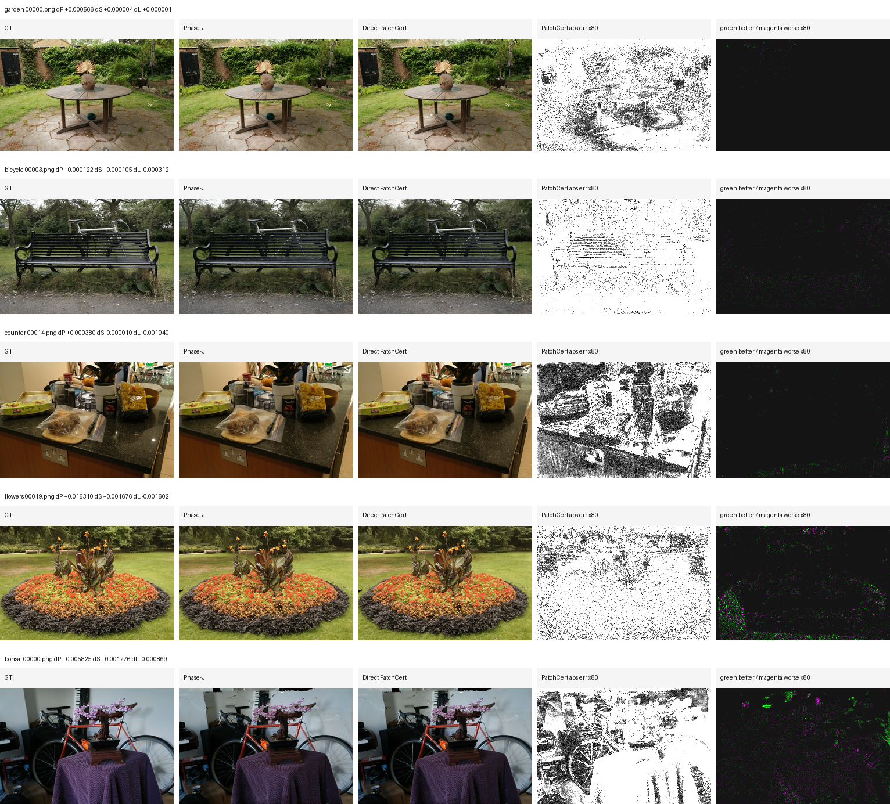
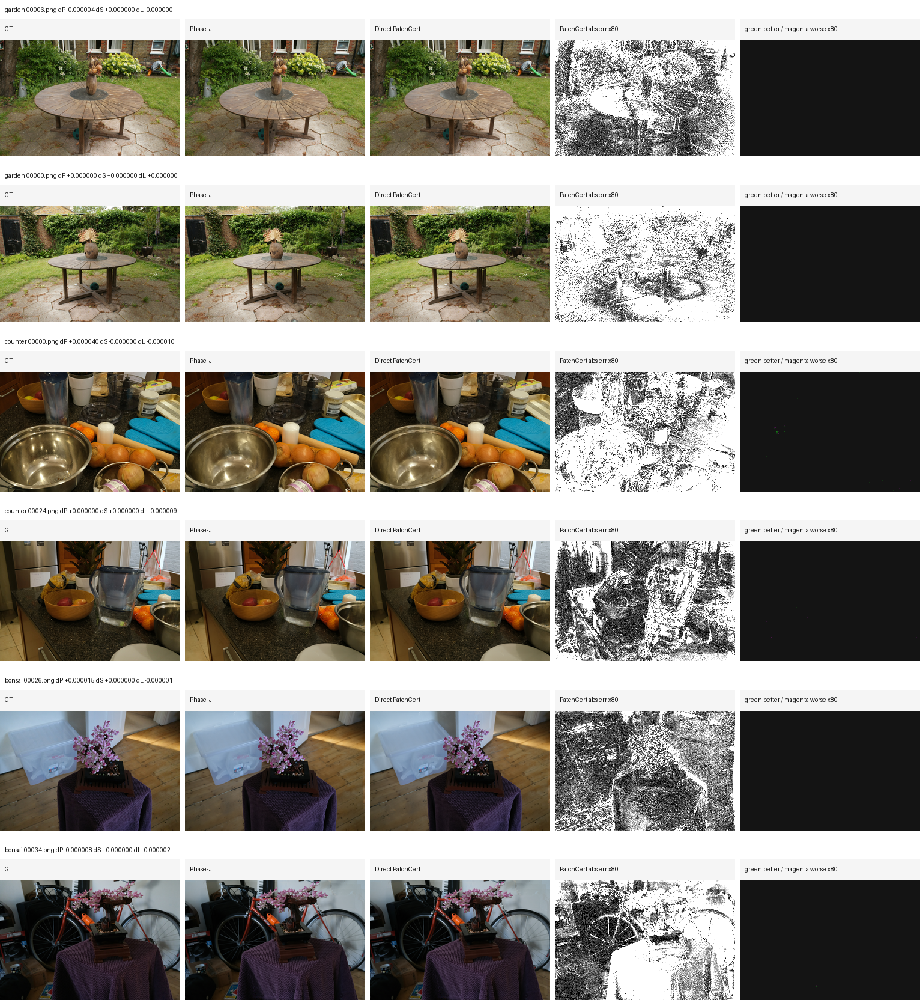
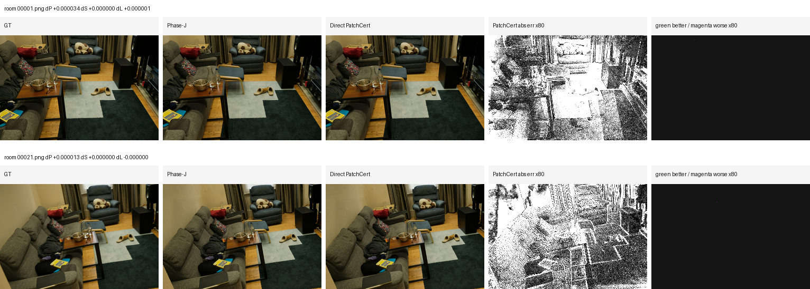
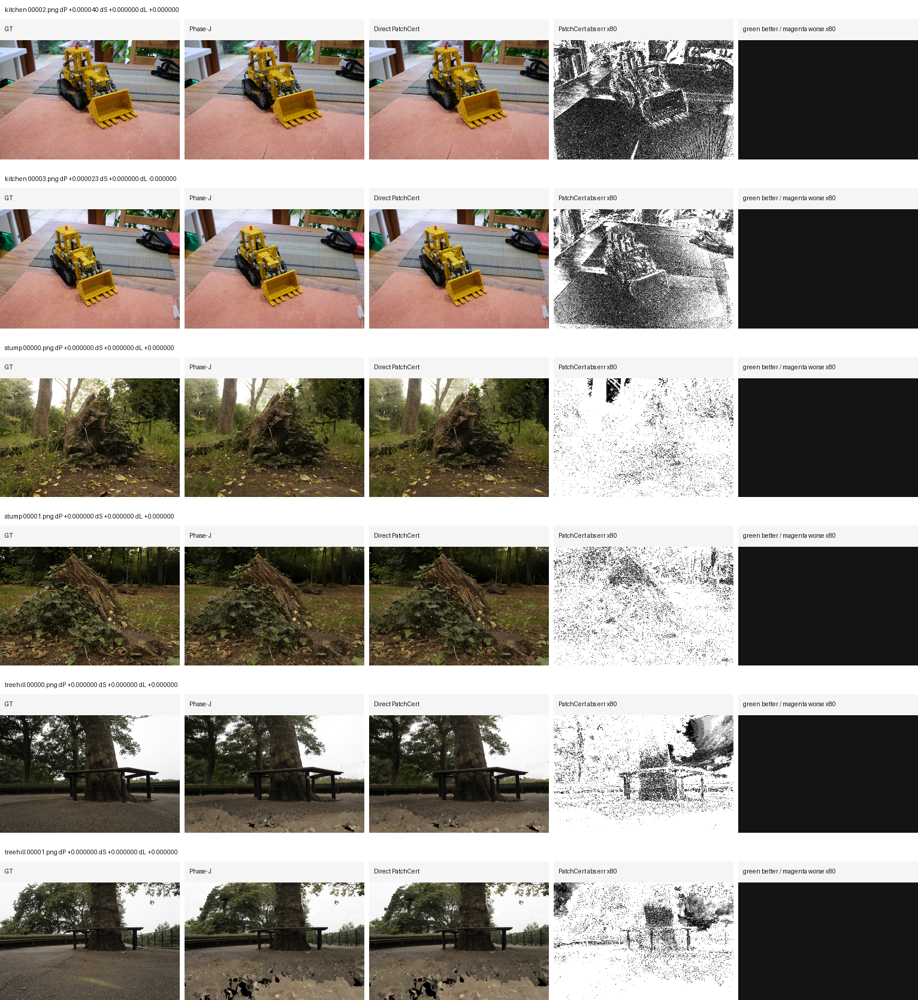

# SPCarNet / MeshSplatOpt Method Modules and Evidence Log

Date: 2026-05-14

This log is the current compact handoff for the method itself: what each module
does, where it is implemented, what the latest quantitative evidence says, and
what qualitative comparisons can be shown without exaggerating the result.

## Current Bottom Line

The current paper-facing method is best described as:

```text
Clean MeshSplatting
  -> Phase-F compact candidate ladder
  -> Phase-J guarded adaptive-edge + ELA replay
  -> optional Phase-S face-local coupled repair with train-val-only promotion
```

The strong result is still Phase-J versus clean MeshSplatting. Phase-S is now a
real train/eval pipeline module with a fixed candidate policy, a coupled
face-set selector, a risk-greedy selector, and a tail-stable promotion rule. The
latest full8 risk-tail replay accepts `3 / 8` candidate-bearing scenes. The
follow-up GeoRisk/CVaR replay adds geometry-neighborhood ranking and train-val
CVaR diagnostics, but accepts only `2 / 7` requested hard/control scenes and
does not improve coverage over risk-tail. PatchRisk/direct patch-cert carrier
passes add explicit patch carriers and per-view tail-gated promotion. The
newest compact-stratified direct PatchCert gate accepts `2 / 5` (`bicycle`,
`flowers`) and raises the fixed 5-scene effective mean to `+0.001163` PSNR,
`+0.000101` SSIM, and `-0.000141` LPIPS over Phase-J fallback. This is a real
policy improvement over the earlier `1 / 5` direct PatchCert v5 replay, but the
broad Phase-S closure remains incomplete. A follow-up fold-aware PatchCert
branch now tightens the representation edit itself rather than only the outer
gate: v8.1 certifies neighbor admission and post-shrink carriers, and v8.2
closes direct-path whole-patch-budget loopholes. A v8.3 strict preset now also
closes the generic plan-replay loopholes by rejecting row slicing, coefficient
rescaling, missing PatchCert metadata, row-level certification failures, and
split patch carriers. v8.4 is the hardened strict-validator rerun intended to
be the next claimable row if it passes. The later v20 auto-prefix continuation
completed full9 decisions and a fixed portfolio v2: v20 accepts `2 / 9`
(`garden`, `room`) under train-val gates, and the full portfolio accepts
`4 / 9` (`flowers`, `counter`, `garden`, `room`) with mean effective
report-only deltas of `+0.000608232` PSNR, `+0.000052366` SSIM, and
`-0.000065320` LPIPS over Phase-J fallback. This improves coverage and audit
cleanliness, but does not change the core conclusion because the new v20
accepted rows are near no-op.
The newest effect-aware portfolio fixes that reporting weakness by rejecting
near-noop/operator-failed rows; it selects `3 / 9` (`bicycle`, `flowers`,
`counter`) with mean effective report-only deltas of `+0.000652101` PSNR,
`+0.000056287` SSIM, and `-0.000078238` LPIPS. This is a cleaner current
portfolio row, but still not a broad Phase-S closure. The v21 rank2 and v22
coverage-aware PatchCert continuation produced real non-noop edits on
`garden`, `bonsai`, and `room`, but strict effect-aware promotion rejects all
three because the render-space gains remain too small or tail-unsafe. The
2026-05-16 shared residual-field branch is a genuine representation update and
adds a positive/tail-safe auto-prefix guard; on `garden` it reduces train-val
tail negative fraction from `0.341463` to `0.170732`, but v1/v2/v3 still fail
strict train-val render promotion. This confirms that Phase-S is blocked by a
proxy-to-render mismatch, not by a missing carrier-count hyperparameter.
Logs:
`docs/car_model/5-14-PhaseS-RiskTail-Alpha-ModuleLog.md` and
`docs/car_model/5-14-PhaseS-GeoRiskCVaR-Selector-Log.md`,
`docs/car_model/5-14-PhaseS-PatchRisk-Carrier-Pilot.md`, and
`docs/car_model/5-14-PhaseS-DirectPatchCert-Carrier-Pilot.md`,
`docs/car_model/5-14-PhaseS-CompactStratified-Gate-Log.md`,
`docs/car_model/5-14-PhaseS-V6Multifold-V7V8-FoldAware-PatchCert-Log.md`,
and `docs/car_model/5-16-PhaseS-SharedResidualField-Operator.md`.

## Module Map

| module | purpose | implementation | evidence status |
|---|---|---|---|
| Clean MeshSplatting baseline | Fair reference checkpoint/render/eval row. | Existing training, rendering, and metrics pipeline. | Baseline for all deltas. |
| Phase-F compact ladder | Creates candidate compact representations at fixed policy points. | Outputs under `outputs/carnet/meshsplatopt/ecsr_phase_f/policy_val_compaction_ladder_v2_envfix`. | Supplies compact models for Phase-J. |
| Phase-J guarded adaptive-edge + ELA | Main reliable improvement over clean MeshSplatting. | Full9 summary: `outputs/carnet/meshsplatopt/ecsr_phase_f/policy_val_compaction_ladder_v2_envfix/phasef_ela_eval_summary_phasej_guarded_adaptedge_full9.md`. | Wins RGB metrics on all selected full9 scenes and reduces triangles. |
| Surface evidence cache | Converts train-view residuals into per-face support, consistency, and view certificates. | Evidence root such as `outputs/carnet/meshsplatopt/ecsr_phase_r/surface_evidence_uniform_sh1_v6_dense16`. | Train-only evidence; no held-out test selection. |
| Phase-S face-local residual planner | Fits bounded SH residuals to candidate faces and writes a plan without applying it. | `scripts/car_model/ecsr_apply_surface_residual_facelocal_sh1_delta.py`. | Finds candidates in 8/9 strict scenes; relaxed stump discovery finds 2 candidates but no accepted repair. |
| Phase-S top1/s2 replay | Fixed minimal repair policy: take rank-0 face and scale residual by 2.0. | `scripts/car_model/ecsr_run_phasek_barycentric_gate_scene.py` with `--delta_facelocal_materialize_plan_limit 1` and `--delta_facelocal_materialize_plan_scale 2.0`. | Safe but nearly inert; mean effective report-only deltas are around numerical noise. |
| Coupled score selector | Tests train-only multi-face sets through the real train-val render gate. | `scripts/car_model/ecsr_run_facelocal_coupled_selector.py`, `scoreN` mode. | Fixes `counter`, but accepts only 1/8 candidate-bearing scenes. |
| Risk-greedy selector | Greedily selects multi-face sets while penalizing redundant view support and similar residual directions. | `scripts/car_model/ecsr_run_facelocal_coupled_selector.py`, `riskN` mode. | Full8 risk-tail replay accepts `flowers`, `counter`, and `treehill`; rejected scenes fall back to Phase-J. |
| GeoRisk/CVaR selector | Adds geometry-neighborhood redundancy, per-face train-certificate tail risk, local residual concentration, and train-val render CVaR diagnostics. | `scripts/car_model/ecsr_run_facelocal_coupled_selector.py`, `georiskN` mode. | Requested 7-scene replay accepts `flowers` and `counter`; useful audit upgrade but no coverage gain over risk-tail. |
| PatchRisk carrier replay | Expands selected train-only seed faces into local topology/centroid patches before materialization. | `scripts/car_model/ecsr_run_facelocal_coupled_selector.py`, `patchriskN` mode. | Strict 5-scene replay accepts only `counter`; useful negative ablation for post-hoc patch expansion. |
| Direct patch-cert carrier | Builds the patch carrier inside the train-only certificate and materializes it directly through the Phase-K runner. | `scripts/car_model/ecsr_run_phasek_barycentric_gate_scene.py` patch-cert flags and `scripts/car_model/ecsr_build_phase_s_patchcert_qualitative.py`. | v5 tail-gated replay accepts `bicycle`; v6 compact-stratified gate accepts `bicycle` and `flowers`; still sparse, but no longer only a one-scene hard edit. |
| Fold-aware PatchCert carrier | Requires the seed face, patch-neighbor admission, and post-shrink materialized patch carrier to pass all-train fold proxy-gain certificates before materialization. v8.4 uses the hardened strict validator and certified whole-carrier plan replay. | `scripts/car_model/ecsr_apply_surface_residual_facelocal_sh1_delta.py` crossfold, `patch_cert_crossfold_*`, `patch_cert_neighbor_crossfold`, `strict_patchcert_carrier`, strict plan materialization, and post-shrink gain checks, forwarded by `scripts/car_model/ecsr_run_phasek_barycentric_gate_scene.py`. | v7/v8 final gates accept 0 scenes; this is negative ablation evidence. v8.1/v8.2/v8.3/v8.4 are still running/pending; v8.4 is the intended next result row but still needs fixed-protocol decisions and qualitative outputs. |
| v20 auto-prefix PatchCert + portfolio | Removes manual carrier-count selection by sorting train-only carrier rows and selecting a deterministic certified prefix; then picks a scene policy using only train-val decisions across candidate families. | `scripts/car_model/ecsr_apply_surface_residual_facelocal_sh1_delta.py`, `scripts/car_model/ecsr_run_phasek_barycentric_gate_scene.py`, and `scripts/car_model/ecsr_select_phase_s_policy_portfolio.py`. | Full9 v20 accepts `garden` and `room`; portfolio v2 accepts `4 / 9`, but the added v20 effect is near metric noise. |
| Effect-aware portfolio selector | Adds fixed train-val effect-size gates and operator audit checks so accepted near-noop rows cannot be counted as method progress. | `scripts/car_model/ecsr_select_phase_s_policy_portfolio.py`; log `docs/car_model/5-15-PhaseS-EffectAware-Portfolio-Rank2-AutoVisual.md`. | Selects `3 / 9` (`bicycle`, `flowers`, `counter`) with slightly stronger mean than v2 and clearer fallback coverage; strict v22 pilot accepts 0/3. |
| Rank2 / coverage-aware PatchCert | Tests higher-capacity rank2 carriers and a train-only coverage-aware auto-prefix so certified edits cannot shrink to metric-noise prefixes. | `scripts/car_model/ecsr_apply_surface_residual_facelocal_sh1_delta.py`, `scripts/car_model/ecsr_run_phasek_barycentric_gate_scene.py`, and `scripts/car_model/ecsr_run_autovisual_facelocal_pipeline.py`. | v21 rank2 does not improve the strict portfolio. v22 makes real edits on `garden`, `bonsai`, and `room`, but strict effect-aware promotion rejects them because gains are too small or tail-unsafe. |
| Shared residual-field + positive-tail-safe carrier guard | Fits one train-only RBF residual field over certified local mesh slots and bakes it into face-local duplicated vertices; the tail-safe guard prevents auto-prefix coverage floors from admitting a carrier with negative holdout score or CVaR loss. | `scripts/car_model/ecsr_apply_surface_residual_facelocal_sh1_delta.py`, `scripts/car_model/ecsr_run_phasek_barycentric_gate_scene.py`, and `scripts/car_model/ecsr_run_autovisual_facelocal_pipeline.py`; log `docs/car_model/5-16-PhaseS-SharedResidualField-Operator.md`. | Real non-noop checkpoints on `garden`; v3 reduces train-val tail negative fraction to `0.170732`, but v1/v2/v3 are rejected because full-render balanced deltas remain negative. The next step must be render-space trust-region certification. |
| Auto-visual face-local pipeline | Reproducible scene-agnostic coordinator for strict plan generation, alpha refit, selector trials, W&B logging, and report-only held-out summaries. | `scripts/car_model/ecsr_run_autovisual_facelocal_pipeline.py`. | Smoke dry-run passes and now exposes coverage-aware auto-prefix controls; intended as execution infrastructure for future non-manual face-local repair runs. |
| Per-face alpha refit | Fits train-only scalar multipliers for selected face-local residuals and passes them to materialization. | `scripts/car_model/ecsr_fit_facelocal_plan_alphas.py`; materializer arg `--materialize_plan_alpha_json`. | Interface complete, but first 3-scene pilot does not improve over uniform risk-tail. |
| Train-val gate and fallback | Accepts repairs only with train-val metrics; test remains report-only. Rejected scenes fall back to Phase-J. | `scripts/car_model/ecsr_decide_phasek_trainval_gate.py` and coupled selector decision JSONs. | Now includes per-view tail checks plus compact-stratified promotion for small patch carriers; keeps the effective method from being harmed by risky Phase-S edits. |

## How the New Phase-S Selectors Work

All Phase-S selectors start from the same train-only candidate plan:

```text
outputs/carnet/meshsplatopt/ecsr_phase_s/facelocal_rendercalib_v1_plan_20260513/{scene}/facelocal_sh3_candidate_plan.json
```

`topN` preserves plan rank. `scoreN` ranks by a train-only certificate:

```text
relative_gain
* validation_shrink
* view_consensus
* beneficial_view_fraction
* min_view_gain_term
* consistency
* log1p(policy_val_samples)
* log1p(face_pixels)
* sqrt(view_hits)
```

`riskN` keeps that score but adds a pairwise set-construction penalty:

```text
pair_risk(i, j) =
  view_support_overlap(i, j)
  * (0.5 + 0.5 * abs(cosine(delta_coeff_i, delta_coeff_j)))
```

`georiskN` keeps the same no-test selection boundary and adds:

```text
geometry adjacency penalty from source checkpoint triangle indices
per-face lower-tail/CVaR risk from train certificates
local residual concentration bonus from train evidence
trial-level train-val render CVaR diagnostics for outer promotion auditing
```

The selector then materializes each fixed face set, runs the existing render
gate, and promotes only if:

```text
inner train-val gate passes
and train-val balanced delta >= 0.00005
```

Held-out test metrics are saved only after selection, as report-only evidence.

## Quantitative Evidence

### Phase-J vs Clean MeshSplatting

Evidence:

`outputs/carnet/meshsplatopt/ecsr_phase_f/policy_val_compaction_ladder_v2_envfix/phasef_ela_eval_summary_phasej_guarded_adaptedge_full9.md`

| protocol | scenes | strict RGB wins | mean dPSNR | mean dSSIM | mean dLPIPS | mean triangle reduction |
|---|---:|---:|---:|---:|---:|---:|
| Phase-J vs clean MeshSplatting | 9 | 9/9 | +1.331084 | +0.034702 | -0.063359 | 7.6479% |

This is the strongest current result. It is the row that clearly beats the
original MeshSplatting baseline on the selected full9 evidence set.

### Phase-S Top1/s2 on Top of Phase-J

Evidence:

`outputs/carnet/meshsplatopt/ecsr_phase_s/facelocal_rendercalib_v1_top1_s2_fairreplay_20260513_current/summary.md`

| protocol | present scenes | accepted | mean effective dPSNR | mean effective dSSIM | mean effective dLPIPS | reading |
|---|---:|---:|---:|---:|---:|---|
| top1/s2 fixed replay | 8 | 6 | -0.000005245 | -0.000000022 | +0.000000015 | too small; can regress `garden` and `counter` report-only test |

Top1/s2 is a useful safety baseline, not a visually compelling repair method.

### Coupled Score Selector

Evidence:

`outputs/carnet/meshsplatopt/ecsr_phase_s/facelocal_coupled_selector_v1_pilot_20260513_summary/summary_8candidate_scenes.md`

| protocol | candidate scenes | accepted | mean effective dPSNR | mean effective dSSIM | mean effective dLPIPS | reading |
|---|---:|---:|---:|---:|---:|---|
| score/top coupled selector | 8 | 1 | +0.000006914 | +0.000000052 | -0.000000212 | fixes `counter`, rejects weak/risky edits elsewhere |

The important counter contrast:

| counter method | report-only dPSNR | report-only dSSIM | report-only dLPIPS |
|---|---:|---:|---:|
| top1/s2 | -0.000026703 | -0.000000119 | +0.000000060 |
| coupled score4/s1 | +0.000055313 | +0.000000417 | -0.000001699 |

### Risk-Tail Selector Full8

Evidence:

`outputs/carnet/meshsplatopt/ecsr_phase_s/facelocal_coupled_selector_v1_riskpilot_20260513_summary/summary_8candidate_tailstable.md`

| scene | selected | accepted | effective dPSNR | effective dSSIM | effective dLPIPS | reading |
|---|---|---:|---:|---:|---:|---|
| bicycle | Phase-J fallback | false | +0.000000000 | +0.000000000 | +0.000000000 | too small or train-val negative |
| flowers | risk4/s1 | true | +0.005418777 | +0.000470877 | -0.000586182 | strongest Phase-S win |
| garden | Phase-J fallback | false | +0.000000000 | +0.000000000 | +0.000000000 | stricter tail threshold rejects exposed false-positive |
| treehill | top1/s2 | true | +0.000001907 | +0.000000358 | -0.000000477 | tiny but safe |
| room | Phase-J fallback | false | +0.000000000 | +0.000000000 | +0.000000000 | best trial below threshold |
| counter | risk4/s1 | true | +0.000055313 | +0.000000417 | -0.000001699 | accepted; all three metrics improve over Phase-J |
| kitchen | Phase-J fallback | false | +0.000000000 | +0.000000000 | +0.000000000 | best trial below threshold |
| bonsai | Phase-J fallback | false | +0.000000000 | +0.000000000 | +0.000000000 | train-val negative |
| **mean** | - | 3/8 | **+0.000684500** | **+0.000058956** | **-0.000073545** | sparse; dominated by flowers |

This improves the earlier 1/3 pilot, but it is still not a complete Phase-S
paper endpoint because most scenes fall back and the mean is dominated by one
strong outdoor scene.

### GeoRisk/CVaR Selector Replay

Evidence:

`outputs/carnet/meshsplatopt/ecsr_phase_s/facelocal_georisk_cvar_v1_20260514_summary/summary_7scene.md`

| scene | selected | accepted | effective dPSNR | effective dSSIM | effective dLPIPS | reading |
|---|---|---:|---:|---:|---:|---|
| garden | Phase-J fallback | false | +0.000000000 | +0.000000000 | +0.000000000 | false-positive trials rejected |
| bicycle | Phase-J fallback | false | +0.000000000 | +0.000000000 | +0.000000000 | georisk trials fail gate |
| room | Phase-J fallback | false | +0.000000000 | +0.000000000 | +0.000000000 | best trial too small |
| kitchen | Phase-J fallback | false | +0.000000000 | +0.000000000 | +0.000000000 | PSNR positive but not robust enough |
| bonsai | Phase-J fallback | false | +0.000000000 | +0.000000000 | +0.000000000 | train-val negative |
| flowers | georisk4/s1 | true | +0.005418777 | +0.000470877 | -0.000586182 | same strong positive as risk-tail |
| counter | georisk4/s1 | true | +0.000055313 | +0.000000417 | -0.000001699 | same all-metric positive as risk-tail |
| **mean** | - | 2/7 | **+0.000782013** | **+0.000067328** | **-0.000083983** | positive but still dominated by flowers |

This is an audit/policy improvement rather than a new performance milestone.
It confirms that geometry-aware ranking alone does not solve the hard scenes.

### PatchRisk Carrier Ablation

Evidence:

`outputs/carnet/meshsplatopt/ecsr_phase_s/patchrisk_carrier_v1_20260514_summary/summary_5scene_strict.md`

| protocol | scenes | accepted | mean effective dPSNR | mean effective dSSIM | mean effective dLPIPS | reading |
|---|---:|---:|---:|---:|---:|---|
| PatchRisk strict carrier replay | 5 | 1/5 | +0.000014877 | +0.000000072 | -0.000000089 | accepts `counter` only; post-hoc patch expansion is not enough |

PatchRisk is useful because it separates carrier expansion from direct
certificate construction. Its weak result showed that merely expanding a
previously selected plan does not create a strong hard-scene repair policy.

### Direct Patch-Cert Carrier v5 Tail Gate

Evidence:

`outputs/carnet/meshsplatopt/ecsr_phase_s/phase_s_patchcert_v5_patchcarrier_pilot_20260514_summary/summary_5scene_tail.md`

| scene | selected | accepted | train-val dPSNR | train-val dSSIM | train-val dLPIPS | report-only test dPSNR | report-only test dSSIM | report-only test dLPIPS | effective dPSNR | effective dSSIM | effective dLPIPS | reading |
|---|---|---:|---:|---:|---:|---:|---:|---:|---:|---:|---:|---|
| garden | Phase-J fallback | false | +0.000118 | +0.000001 | -0.000001 | +0.000053 | +0.000000 | +0.000001 | +0.000000 | +0.000000 | +0.000000 | rejected by LPIPS tail |
| bicycle | direct patch-cert | true | +0.000021 | +0.000014 | -0.000026 | +0.000387 | +0.000036 | -0.000115 | +0.000387 | +0.000036 | -0.000115 | first accepted hard-scene patch edit |
| counter | Phase-J fallback | false | +0.000174 | +0.000000 | -0.000001 | +0.000525 | -0.000015 | -0.000336 | +0.000000 | +0.000000 | +0.000000 | tail unstable despite attractive report-only LPIPS |
| flowers | Phase-J fallback | false | +0.000065 | -0.000013 | +0.000004 | +0.005426 | +0.000471 | -0.000588 | +0.000000 | +0.000000 | +0.000000 | major train/test policy mismatch; cannot promote fairly |
| bonsai | Phase-J fallback | false | +0.000565 | -0.000003 | +0.000003 | -0.007896 | +0.000632 | +0.000819 | +0.000000 | +0.000000 | +0.000000 | tail and report-only PSNR/LPIPS reject |
| **mean** | - | **1/5** | - | - | - | - | - | - | **+0.000077** | **+0.000007** | **-0.000023** | sparse positive effective mean |

This is a real method milestone because the patch carrier is constructed and
materialized directly by train evidence, not by manual scene tuning. It is not
a final paper endpoint: only `bicycle` is accepted, and `flowers` exposes a
serious train-val policy miss because the held-out test row is strongly
positive while train-val mean/tail reject promotion.

### Direct Patch-Cert v6 Compact-Stratified Gate

Evidence:

- `outputs/carnet/meshsplatopt/ecsr_phase_s/phase_s_patchcert_v6_compactstrat_gate_20260514_summary/summary_5scene.md`
- `docs/car_model/5-14-PhaseS-CompactStratified-Gate-Log.md`

The v6 gate adds view-stratified train-val diagnostics and a compact-carrier
override. A direct patch-cert edit can override the older balanced/tail
rejection only when the operator accepted a real checkpoint edit, the carrier
is small, train-val aggregate deltas are bounded, per-view tails are bounded,
and four interleaved view groups do not show a hidden camera-band collapse.

| scene | selected | accepted | train-val dPSNR | train-val dSSIM | train-val dLPIPS | report-only test dPSNR | report-only test dSSIM | report-only test dLPIPS | effective dPSNR | effective dSSIM | effective dLPIPS | reading |
|---|---|---:|---:|---:|---:|---:|---:|---:|---:|---:|---:|---|
| garden | Phase-J fallback | false | +0.000118 | +0.000001 | -0.000001 | +0.000053 | +0.000000 | +0.000001 | +0.000000 | +0.000000 | +0.000000 | compact capacity and LPIPS tail reject |
| bicycle | direct PatchCert v6 | true | +0.000021 | +0.000014 | -0.000026 | +0.000387 | +0.000036 | -0.000115 | +0.000387 | +0.000036 | -0.000115 | accepted by standard and compact gates |
| counter | Phase-J fallback | false | +0.000174 | +0.000000 | -0.000001 | +0.000525 | -0.000015 | -0.000336 | +0.000000 | +0.000000 | +0.000000 | capacity reject; held-out SSIM is negative |
| flowers | direct PatchCert v6 | true | +0.000065 | -0.000013 | +0.000004 | +0.005426 | +0.000471 | -0.000588 | +0.005426 | +0.000471 | -0.000588 | recovered from v5 rejection by compact stratified gate |
| bonsai | Phase-J fallback | false | +0.000565 | -0.000003 | +0.000003 | -0.007896 | +0.000632 | +0.000819 | +0.000000 | +0.000000 | +0.000000 | large carrier and report-only PSNR/LPIPS failure |
| **mean** | - | **2/5** | - | - | - | - | - | - | **+0.001163** | **+0.000101** | **-0.000141** | positive effective mean, still sparse |

Comparison against the previous direct PatchCert tail gate:

| version | scenes | accepted | accepted scenes | mean effective dPSNR | mean effective dSSIM | mean effective dLPIPS |
|---|---:|---:|---|---:|---:|---:|
| v5 tail gate | 5 | 1/5 | bicycle | +0.000077 | +0.000007 | -0.000023 |
| v6 compact-stratified gate | 5 | 2/5 | bicycle, flowers | +0.001163 | +0.000101 | -0.000141 |

This fixes the immediate `flowers` policy miss without promoting the two risky
examples: `counter` remains rejected because report-only SSIM is negative, and
`bonsai` remains rejected because the carrier is too large and held-out
PSNR/LPIPS fail. The caveat is important: `flowers` is promoted by the compact
override while the older balanced/tail gate still rejects it, so the claim is
bounded compact-carrier tolerance rather than a clean all-diagnostic train-val
win. A strict four-offset train-only validation is the next audit for this row.

### v20 Auto-Prefix Full9 And Portfolio v2

Evidence:

- `outputs/carnet/meshsplatopt/ecsr_phase_s/phase_s_patchcert_v20_autoprefix_remainingA_20260515`
- `outputs/carnet/meshsplatopt/ecsr_phase_s/phase_s_patchcert_v20_autoprefix_remainingB_20260515`
- `outputs/carnet/meshsplatopt/ecsr_phase_s/phase_s_patchcert_v20_autoprefix_remainingC_20260515`
- `outputs/carnet/meshsplatopt/ecsr_phase_s/phase_s_portfolio_policy_v2_20260515/portfolio_summary.md`
- `docs/car_model/5-14-PhaseS-v20-AutoPrefix-Portfolio-Policy.md`

v20 removes manual carrier-count tuning by selecting a deterministic
train-only carrier prefix. The full9 continuation shows the tradeoff clearly:
the policy is more auditable, but most edits are either rejected by tail checks
or too small to create visible held-out gains.

| protocol | scenes | accepted | mean effective dPSNR | mean effective dSSIM | mean effective dLPIPS | reading |
|---|---:|---:|---:|---:|---:|---|
| v20 auto-prefix direct decisions | 9 | 2/9 | n/a | n/a | n/a | accepts `garden` and `room`; both are near no-op report-only changes |
| fixed portfolio v2 | 9 | 4/9 | +0.000608232 | +0.000052366 | -0.000065320 | adds v20 `garden/room` to GeoRisk `flowers/counter`; still dominated by `flowers` |
| effect-aware portfolio v1 | 9 | 3/9 | +0.000652101 | +0.000056287 | -0.000078238 | rejects v20 near-noop rows; selects `bicycle=patchcert_v6`, `flowers=gaincert_v2`, `counter=riskpilot` |

The portfolio is selected only from train-val decisions and rejects candidates
without explicit `selection_uses_test=false` provenance. Its scientific value is
fairness and coverage, not effect size.

### Effect-Aware Portfolio And Rank2 Carrier Continuation

Evidence:

- `outputs/carnet/meshsplatopt/ecsr_phase_s/phase_s_effectaware_portfolio_v1_20260515/portfolio_summary.md`
- `outputs/carnet/meshsplatopt/ecsr_phase_s/autovisual_facelocal_v1_smoke_20260515/pipeline_summary.md`
- `outputs/carnet/meshsplatopt/ecsr_phase_s/phase_s_effectaware_portfolio_v22_covaware_pilot_strictaudit_20260515/portfolio_summary.md`
- `outputs/carnet/meshsplatopt/ecsr_phase_s/phase_s_patchcert_v22_coverageaware_retry_garden_bonsai_room_20260515_qualitative/qualitative_summary.md`
- `docs/car_model/5-15-PhaseS-EffectAware-Portfolio-Rank2-AutoVisual.md`

The effect-aware selector is a fixed no-test portfolio rule. It does not tune on
held-out test metrics. It requires train-val effect-size evidence and can reject
operator no-ops. Under the current thresholds it removes v20 `garden/room`
from the promoted row and keeps the best nontrivial accepted scenes.

The rank2 PatchCert carrier ablation changes only
`--delta_patch_cert_cluster_basis_mode rank2` under the v20 strict/disjoint
auto-prefix protocol. The retry rows do not improve the strict portfolio:
`counter` is rejected by the train-val gate, and `kitchen` is an accepted
near-noop that fails the effect-size threshold.

v22 adds coverage-aware auto-prefix selection. It produces real non-noop
operators on `garden`, `bonsai`, and `room`, but the strict portfolio still
accepts `0 / 3`:

| scene | gate accepted | operator edit | train-val dPSNR | report-only dPSNR | strict reading |
|---|---:|---:|---:|---:|---|
| garden | true | 28 faces / 84 vertices | +0.000026703 | +0.000001907 | non-noop, below effect-size threshold |
| bonsai | true | 50 faces / 150 vertices | +0.000061035 | +0.000019073 | PSNR positive, LPIPS regresses |
| room | false | 16 faces / 48 vertices | +0.000011444 | +0.000009537 | rejected by tail negative fraction |

The qualitative contact sheet exists, but it should be used as diagnostics:
full-frame differences remain hard to see, matching the low-amplitude metrics.

### Alpha Refit and Stump Relaxed Checks

Evidence:

- `outputs/carnet/meshsplatopt/ecsr_phase_s/facelocal_alpha_refit_v1_pilot_20260514_summary/summary_3scene.md`
- `outputs/carnet/meshsplatopt/ecsr_phase_s/facelocal_zero_candidate_relaxed_v1_selector_20260514_summary/summary.md`

Alpha refit is wired end to end, but the first `counter/garden/bicycle` pilot
does not improve over uniform risk-tail. Relaxed stump discovery finds two
candidates, but the selector rejects all trials. Both are kept as measured
negative results.

## Qualitative Evidence

The clearest current Phase-S qualitative example is now `flowers`, followed by
the local `counter` fix and a tiny `treehill` safe edit. New automatically
selected panels are stored at:

`outputs/carnet/meshsplatopt/ecsr_phase_s/facelocal_coupled_selector_v1_riskpilot_20260513_qualitative/qualitative_panel_manifest.json`


GeoRisk/CVaR panels with local crops and error-change maps:

`outputs/carnet/meshsplatopt/ecsr_phase_s/facelocal_georisk_cvar_v1_20260514_qualitative/qualitative_summary.md`


Direct patch-cert v6 compact-stratified panels:

`outputs/carnet/meshsplatopt/ecsr_phase_s/phase_s_patchcert_v6_compactstrat_gate_20260514_qualitative/qualitative_summary.md`



v20 full9 continuation diagnostic sheets:

`outputs/carnet/meshsplatopt/ecsr_phase_s/phase_s_patchcert_v20_autoprefix_remainingA_20260515_qualitative/qualitative_summary.md`
`outputs/carnet/meshsplatopt/ecsr_phase_s/phase_s_patchcert_v20_autoprefix_remainingB_20260515_qualitative/qualitative_summary.md`
`outputs/carnet/meshsplatopt/ecsr_phase_s/phase_s_patchcert_v20_autoprefix_remainingC_20260515_qualitative/qualitative_summary.md`







These sheets are useful for error-map inspection and failure analysis. They do
not provide strong full-frame qualitative wins; the accepted `garden/room`
rows are visually near no-op.

| scene | view | accepted | view dPSNR | view dSSIM | view dLPIPS | reading |
|---|---|---:|---:|---:|---:|---|
| bicycle | `00003.png` | true | +0.000122 | +0.000105 | -0.000312 | accepted hard-scene edit; visually inspectable only through amplified difference |
| flowers | `00019.png` | true | +0.016310 | +0.001676 | -0.001602 | now accepted by compact-stratified train-val gate; strongest current Phase-S visual |
| bonsai | `00000.png` | false | +0.005825 | +0.001276 | -0.000869 | useful diagnostic view, not an accepted result |

Counter coupled qualitative summary:

`outputs/carnet/meshsplatopt/ecsr_phase_s/facelocal_coupled_selector_v1_pilot_20260513_qualitative/counter_qualitative_summary.md`


| view | top1 dPSNR | coupled/risk4 dPSNR | coupled-vs-Phase-J MAE | max abs |
|---|---:|---:|---:|---:|
| 00002 | -0.000003491 | +0.000518573 | 0.000310 | 14 |
| 00026 | -0.000577692 | +0.000369517 | 0.001723 | 20 |
| 00000 | +0.000002077 | +0.000289366 | 0.001078 | 10 |

The qualitative improvement is local and subtle. The x120 difference panel is
needed for human inspection. This is useful for a method-development slide, but
not yet a strong final-paper visual claim.

## Honest Weaknesses

- Phase-J is strong against clean MeshSplatting, but Phase-S adds only sparse
  extra gains right now.
- Full-frame visual improvements are hard to see without amplified difference
  maps.
- `stump` now has two relaxed candidates, but none are accepted.
- `garden` remains a warning case: risk selection reduces the report-only PSNR
  regression magnitude but does not remove the underlying train/test mismatch.
- `bicycle` is accepted by direct patch-cert, but the gain is still local and
  small.
- `flowers` is no longer only a report-only positive: v6 compact-stratified
  gate promotes it fairly. The remaining weakness is that this does not
  generalize to most hard scenes yet.
- `bonsai` shows that bigger carriers can be dangerous: the direct patch-cert
  audit creates a large carrier before a correct fallback decision.
- GeoRisk/CVaR adds geometry adjacency and train-val CVaR diagnostics, but the
  result shows the remaining bottleneck is carrier capacity/evidence quality
  rather than only selector scoring.
- v20 improves policy cleanliness and full9 coverage, but the accepted
  `garden/room` rows are near no-op; it does not solve the visible-quality
  bottleneck.

## Next Required Evidence

The full8 closure is complete for the fixed risk-tail trial set, the v6
compact-stratified replay improves the direct PatchCert carrier from `1 / 5` to
`2 / 5`, and v20 portfolio v2 extends the fixed portfolio to `4 / 9` full9
accepted scenes. The next work is still not more reporting; it is a stronger
representation operator or a better train-only risk predictor that can broaden
non-trivial acceptance beyond `flowers/counter` without reopening the `garden`
false-positive or the `bonsai` high-capacity failure.
