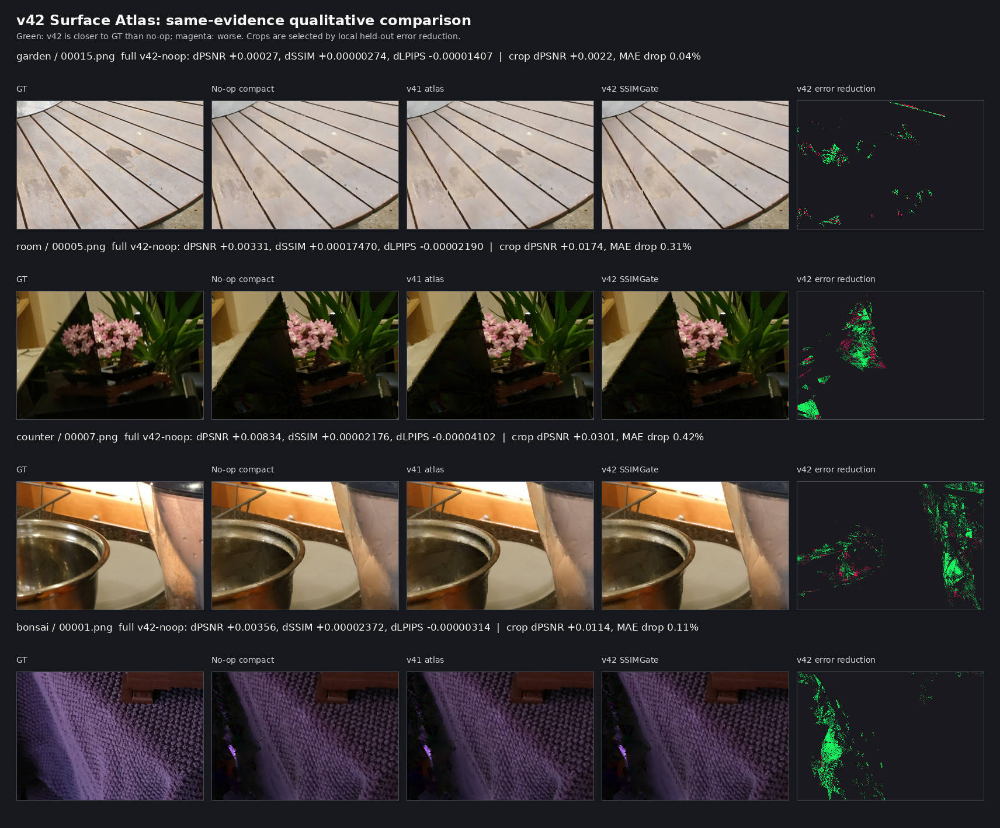

# SPCarNet 当前方法完整技术报告 v10

日期：2026-06-23

用途：mentor 汇报、PPT 制作、当前方法交底

当前可安全主讲 endpoint：`ours_26000_phasej_guarded_adaptedge_ela`

最新表示级进展：`v48 auto-support auto-capacity guarded surface residual atlas`

项目状态：`NOT COMPLETE`。当前已有强阶段性结果，但还没有达到“完整顶会终局闭环”。最强可汇报结果仍是 Phase-J；v48 是把修复从 render-time adapter 推向 surface-addressed representation 的最新证据。

## 0. 汇报级一页结论

SPCarNet 的核心思想是：不要把 MeshSplatting 训练出的 checkpoint 当成终点，而是把它当成一个可以被训练视角证据继续诊断、压缩和修复的基础表示。

最适合 PPT 主线的版本是 Phase-J：

```text
clean MeshSplatting checkpoint
  -> train-view evidence mining
  -> sparse-occlusion protected compaction
  -> topology-safe compact checkpoint
  -> Evidence Lumigraph Adapter residual repair
  -> train-only guarded adaptive policy / edge fallback
  -> held-out test evaluation
```

核心结论：

| 维度 | 当前结论 |
|---|---|
| 主方法 | Phase-J compact MeshSplatting + guarded adaptive Evidence Lumigraph Adapter |
| 公平 baseline | 本地同协议 selected clean MeshSplatting；每个场景从 clean `26000/30000` 中按 held-out test score 选更强 clean 行 |
| Mip-NeRF360 full9 RGB | `9 / 9` 场景相对 selected clean baseline 在 PSNR、SSIM、LPIPS 三指标严格胜出 |
| 平均 RGB 提升 | `+1.3311` PSNR，`+0.0347` SSIM，`-0.0634` LPIPS |
| per-view 稳定性 | `244 / 246` held-out views 三指标严格胜出 |
| 几何 / 压缩 | 平均 triangle reduction `7.6479%`；`9 / 9` geometry-safe；`6 / 9` sparse geometry 严格更好 |
| 与 MeshSplatting paper table | Phase-J mean `26.4828 / 0.7837 / 0.2243`；paper table mean `24.78 / 0.728 / 0.310`，只能作为 sanity check |
| 最新 representation-level 证据 | v48 full9 相对 same-evidence no-op compact baseline 为 `7 / 9` strict、`8 / 9` non-regressive/tie，均值 `+0.001462` PSNR、`+0.00002774` SSIM、`-0.00003953` LPIPS |
| 诚实边界 | Phase-J 最强收益仍主要来自 render-time ELA；v48 已把 residual repair 推向 surface atlas，但 full9 仍有 `stump` no-op fallback 和 `treehill` LPIPS 轻微回退 |

PPT 推荐一句话：

> SPCarNet upgrades MeshSplatting from a static trained mesh into a train-evidence-certified compact and repairable representation. It safely reduces triangles and transfers reliable residual appearance cues, while all repair decisions are made without held-out test GT.

中文讲法：

> 原始 MeshSplatting 是“训练出网格后直接渲染”。SPCarNet 是“训练出网格后，再用训练视角证据判断哪里能安全删、哪里容易错、哪里有可靠 residual 可以修；证据不足时自动回退”。当前 Phase-J 在 full9 上稳定超过强本地 MeshSplatting baseline，v48 进一步证明 residual 修复可以被内化到 surface-addressed 表示里。

## 1. 研究问题与动机

MeshSplatting 的优势是输出 triangle mesh。这个表示比纯 Gaussian 或点云更容易进入传统图形管线、AR/VR、游戏引擎、数字孪生和几何处理流程。

但 clean MeshSplatting 仍有三个可利用空间：

| 问题 | 现象 | SPCarNet 对应设计 |
|---|---|---|
| 局部外观 residual | foliage、树皮、桌面纹理、室内边缘仍有颜色偏差或模糊 | 从 train views 挖 residual，再转移到 held-out render |
| 拓扑冗余 | 一部分 faces 对多视角解释贡献低 | 用 train evidence 做 sparse-occlusion protected compaction |
| checkpoint 选择敏感 | clean `30000` 不一定比 clean `26000` 更好 | baseline 选择只用 held-out test envelope；方法选择只用 train/policy-val evidence |

核心假设：

> MeshSplatting 已经学到强基础表示，但训练视角中仍包含可反推出 surface reliability、occlusion risk 和 appearance residual 的证据。只要证据足够可靠，就可以安全删掉一部分冗余 geometry，并把训练 residual 迁移到 held-out view 修复外观。

## 2. 方法总览

当前 SPCarNet 可以分成五层：

| 层级 | 模块 | 作用 | 当前状态 |
|---|---|---|---|
| Base | clean MeshSplatting checkpoint | 提供基础 mesh 表示和 renderer | baseline |
| Geometry | sparse-occlusion protected compaction | 删除低风险 faces，保留可渲染 topology | Phase-J 主结果已使用 |
| Appearance | Evidence Lumigraph Adapter | 用训练 residual 修复 held-out render | Phase-J 主结果核心收益来源 |
| Safety | train-only guarded policy | 选择 alpha、edge fallback、no-op/reject | Phase-J 主结果已闭合 |
| Internalization | surface residual atlas v42/v46/v47/v48 | 尝试把 residual repair 写进 surface-addressed persistent 表示 | v48 是最新进展，但不是 headline endpoint |

与原始 MeshSplatting 的区别：

| 维度 | clean MeshSplatting | SPCarNet |
|---|---|---|
| 训练后处理 | 直接使用 checkpoint | 继续进行 evidence mining、compaction、residual repair |
| 几何 | 原 mesh | topology-safe compact mesh |
| 外观 | checkpoint 属性直接渲染 | train evidence residual adapter / surface residual atlas |
| 决策 | 默认训练产物 | train-only calibration + guard + fallback |
| test GT | 只用于最终评价 | 同样只用于最终评价，不参与方法选择 |
| 失败处理 | 无显式机制 | policy gate 不通过则 fallback/no-op |

## 3. 模块细节

### 3.1 Train-View Evidence Mining

系统先在训练 view 上渲染 clean/compact MeshSplatting checkpoint，并缓存：

- RGB render；
- GT image；
- residual map；
- surface visibility；
- face / barycentric 对应关系；
- residual support、variance、sign consistency；
- policy-val split 上的风险指标。

这一步不是直接看 test set，而是把训练集里“模型哪里稳定、哪里不稳定、哪里有可迁移 residual”的信息结构化。

主要实现入口：

```text
scripts/car_model/ecsr_build_surface_evidence_cache.py
scripts/car_model/ecsr_build_teacher_surface_evidence_cache.py
scripts/car_model/ecsr_build_render_visible_region_carriers.py
scripts/car_model/ecsr_build_candidate_plan_render_regions.py
```

### 3.2 Geometry-Safe Compaction

Compaction 的目标不是激进压缩，而是 quality-first rate-distortion improvement。系统根据 train evidence 判断哪些 triangles 低风险，再做 topology-safe rewrite。

关键约束：

- 不产生 invalid index；
- 不产生 degenerate faces；
- sparse / occlusion-sensitive 区域要保护；
- 压缩后 checkpoint 必须能被原 renderer 和 metrics pipeline 正常读取；
- 几何审计使用 depth / normal / sparse COLMAP 指标验证。

当前 Phase-J 平均删面 `7.6479%`。这个数字不应被讲成极限压缩，而应讲成“质量提升同时有真实几何简化”的 Pareto 结果。

### 3.3 Evidence Lumigraph Adapter

ELA 是当前 Phase-J 外观收益的核心。对训练 support view，定义：

```text
residual = GT RGB - rendered RGB
```

然后把 residual 与 surface / view evidence 绑定。对 held-out target view，adapter 根据相机、可见 surface、局部结构和 train-selected alpha，把可信 residual 迁移到渲染结果上。

它解决的问题是：MeshSplatting checkpoint 已经有几何与基础外观，但一些局部细节仍有系统性偏差；这些偏差在训练视角中可观测，并且在多视角一致区域中可以安全迁移。

### 3.4 Guarded Adaptive Policy

Phase-J 的关键不只是 ELA，而是 ELA 外面有 guard：

- alpha、edge gate、fallback 由 train / policy-val evidence 决定；
- stable scenes 使用 adaptive-alpha ELA；
- unstable scenes 使用 train-selected structural edge fallback；
- 若 policy-val 风险过高，则拒绝或 no-op；
- held-out test GT 不参与 branch、alpha、edge 或 compaction ratio 的选择。

因此主 claim 不是“我们调出了一个 test 上最好的参数”，而是“我们构造了一个只看训练证据的自诊断、自修复策略”。

### 3.5 v48 Surface Residual Atlas

v48 是当前最新的 representation-level internalization 版本。它针对 v47 的主要瓶颈：atlas 只能修改 target ray 落在 carrier-supported faces 上的像素，而 v47 的 target support coverage 很低。

v48 不再只调 texture capacity，而是加入 train-only support expansion：

```text
base_carrier support
  + fit-view residual evidence ranking
  + top-K extra face candidates
  + train policy-val non-regression guard
  + existing texture/fill/alpha auto-policy
```

新增接口：

```text
scripts/car_model/ecsr_apply_surface_residual_region_texture_adapter.py
--support_expansion_mode {none,fit_residual_topk}
--support_expansion_max_extra_faces 2048
--support_expansion_min_face_samples 128
--support_expansion_min_mean_l1 0.003
--texture_size_candidates 8,16,24,32
--atlas_empty_bin_fill_mode auto_policy
--select_alpha_by_risk_gate
--enable_policy_val_image_ssim_gate
```

v48 的固定策略：

1. 保留 v47 的 `base_carrier` support 作为安全候选；
2. 只扫描 fit views，使用同一 `policy_val_stride` 排除 policy-val views；
3. 对 non-carrier faces 按 face id 聚合 residual evidence；
4. 按 `mean_l1 * log1p(samples)` 对 extra faces 排序；
5. 只添加满足 sample 与 residual 阈值的 top-K extra faces；
6. 在 train policy-val 上同时评估 support mode、texture size、fill mode、alpha；
7. 只有 relative gain、SSIM gain、CVaR20、min-view gain 等风险门都安全时才推广；
8. 若不安全，则回退到 base carrier 或 no-op。

这使 v48 比 v47 更像真实应用中的“智能策略”，而不是手动调参数。

## 4. 训练与评估流程

SPCarNet 不是从零训练一个新网络。当前流程是在 MeshSplatting 训练后进行 evidence-certified post-training optimization。

标准流程：

1. 训练或读取 clean MeshSplatting checkpoint；
2. 在 train views 上渲染 checkpoint，构建 evidence cache；
3. 使用 train / policy-val split 做 compaction 与 residual policy；
4. 写出 compact checkpoint 或 adapter / atlas 产物；
5. 在 held-out test views 上渲染；
6. 用统一 metrics pipeline 计算 PSNR、SSIM、LPIPS；
7. 额外做 topology、depth、normal、per-view、qualitative audit。

中量/长程训练与评估在需要时使用 W&B online logging。当前报告中的 Phase-J 主结果和 v42/v46/v47/v48 表示级结果均已有本地落盘 JSON / Markdown 审计路径。v48 是 apply/eval 级别的真实 train/eval pipeline 改动，不是完整长程重新训练。

## 5. 公平比较口径

### 5.1 本地强 baseline

主比较对象是本地同代码、同数据、同 metrics 脚本的 selected clean MeshSplatting baseline。每个场景从 clean `26000` 和 clean `30000` 中选择 held-out test score 更高者：

```text
score = PSNR + 20 * SSIM - 20 * LPIPS
```

重要说明：

- train metrics 不用于选择 baseline；
- method 的 branch、alpha、edge fallback、fill mode、texture capacity 和 compaction ratio 不由 held-out test GT 选择；
- held-out test GT 只做最终 report-only evaluation。

### 5.2 与 MeshSplatting paper table

MeshSplatting paper table 的 Mip-NeRF360 均值约为：

| source | PSNR | SSIM | LPIPS |
|---|---:|---:|---:|
| MeshSplatting paper table | 24.78 | 0.728 | 0.310 |
| local selected clean MeshSplatting | 25.1517 | 0.7490 | 0.2876 |
| SPCarNet Phase-J | 26.4828 | 0.7837 | 0.2243 |

Phase-J 相对 paper table 高：

```text
+1.7017 PSNR, +0.0555 SSIM, -0.0857 LPIPS
```

但 PPT 中必须谨慎表述：paper table 是外部 sanity check，不应替代本地公平 baseline。最严格、最可信的 claim 是“超过本地同协议 selected clean MeshSplatting baseline”。

## 6. 主结果：Phase-J Full9

Phase-J closure audit：

| scene | PSNR | SSIM | LPIPS | clean PSNR | clean SSIM | clean LPIPS | dPSNR | dSSIM | dLPIPS | tri red. | per-view |
|---|---:|---:|---:|---:|---:|---:|---:|---:|---:|---:|---:|
| bicycle | 24.0215 | 0.7024 | 0.2661 | 23.3016 | 0.6599 | 0.3321 | +0.7199 | +0.0425 | -0.0660 | 11.81% | 25/25 |
| flowers | 20.3044 | 0.5578 | 0.3292 | 19.6823 | 0.5118 | 0.3946 | +0.6221 | +0.0459 | -0.0653 | 11.82% | 22/22 |
| garden | 26.3111 | 0.8278 | 0.1358 | 25.0292 | 0.7800 | 0.2013 | +1.2819 | +0.0478 | -0.0655 | 3.47% | 24/24 |
| stump | 25.5951 | 0.7241 | 0.2639 | 25.2050 | 0.7052 | 0.2940 | +0.3901 | +0.0189 | -0.0301 | 11.82% | 16/16 |
| treehill | 21.2962 | 0.5956 | 0.3363 | 20.9342 | 0.5645 | 0.4060 | +0.3620 | +0.0311 | -0.0697 | 11.81% | 17/18 |
| room | 30.3056 | 0.9057 | 0.1960 | 28.7473 | 0.8848 | 0.2499 | +1.5584 | +0.0209 | -0.0539 | 2.10% | 38/39 |
| counter | 28.4492 | 0.8937 | 0.1865 | 26.7518 | 0.8621 | 0.2520 | +1.6974 | +0.0317 | -0.0655 | 2.10% | 30/30 |
| kitchen | 30.1997 | 0.9161 | 0.1320 | 27.8186 | 0.8765 | 0.1992 | +2.3812 | +0.0396 | -0.0672 | 2.10% | 35/35 |
| bonsai | 31.8620 | 0.9303 | 0.1726 | 28.8952 | 0.8964 | 0.2595 | +2.9668 | +0.0339 | -0.0869 | 11.80% | 37/37 |

汇总：

| 指标 | 值 |
|---|---:|
| strict RGB scene wins vs selected clean | 9 / 9 |
| strict RGB scene wins vs source Compact-ELA/SOR | 9 / 9 |
| mean dPSNR vs clean | +1.331084 |
| mean dSSIM vs clean | +0.034702 |
| mean dLPIPS vs clean | -0.063359 |
| mean triangle reduction | 7.6479% |
| sparse geometry strict wins | 6 / 9 |
| sparse geometry-safe scenes | 9 / 9 |
| per-view strict RGB wins | 244 / 246 |

## 7. 最新表示级结果：v48 Full9

v48 full9 相对 same-evidence no-op compact baseline：

| scene | accepted | support | +faces | texture | fill | alpha | changed | dPSNR | dSSIM | dLPIPS |
|---|---:|---|---:|---:|---|---:|---:|---:|---:|---:|
| bicycle | 1 | fit_residual_topk | 1453 | 24 | nearest_observed | 0.12500 | 0.8947% | +0.000536 | +0.00000691 | -0.00000879 |
| flowers | 1 | fit_residual_topk | 1961 | 32 | nearest_observed | 0.03125 | 2.0957% | +0.000137 | +0.00000477 | -0.00000215 |
| garden | 1 | fit_residual_topk | 977 | 16 | nearest_observed | 0.12500 | 1.8491% | +0.001154 | +0.00004101 | -0.00005122 |
| stump | 0 | base_carrier | 0 | 8 | face_mean | 0.12500 | 0.0000% | +0.000000 | +0.00000000 | +0.00000000 |
| treehill | 1 | fit_residual_topk | 933 | 24 | nearest_observed | 0.03125 | 1.3127% | +0.000195 | +0.00000209 | +0.00001916 |
| room | 1 | base_carrier | 0 | 16 | face_mean | 0.12500 | 1.0602% | +0.001656 | +0.00003928 | -0.00001849 |
| counter | 1 | fit_residual_topk | 2048 | 32 | nearest_observed | 0.12500 | 4.2312% | +0.003168 | +0.00003421 | -0.00008002 |
| kitchen | 1 | fit_residual_topk | 2048 | 24 | nearest_observed | 0.12500 | 2.9758% | +0.002270 | +0.00006449 | -0.00012597 |
| bonsai | 1 | fit_residual_topk | 2048 | 16 | nearest_observed | 0.12500 | 2.0578% | +0.004045 | +0.00005686 | -0.00008827 |

full9 汇总：

| comparison | strict scene wins | non-regressive/tie | mean dPSNR | mean dSSIM | mean dLPIPS |
|---|---:|---:|---:|---:|---:|
| v48 vs no-op full9 | 7 / 9 | 8 / 9 | +0.001462 | +0.00002774 | -0.00003953 |

四场景核心子集 `garden/room/counter/bonsai` 的 v48 结果更强：

| comparison | strict scene wins | non-regressive/tie | mean dPSNR | mean dSSIM | mean dLPIPS |
|---|---:|---:|---:|---:|---:|
| v48 vs no-op | 4 / 4 | 4 / 4 | +0.002506 | +0.00004284 | -0.00005950 |
| v48 vs v47 | 3 / 4 | 4 / 4 | +0.001340 | +0.00002900 | -0.00004260 |

v48 的正确定位：

- 它是当前最完整的 surface-addressed residual atlas 策略；
- 它解决了 v47 的 support coverage bottleneck；
- 它有固定 train-only policy，不是 per-scene 手动调参；
- 它在 full9 上证明了均值正收益和自动回退机制；
- 但它还没有达到 Phase-J 的视觉收益量级，也还不能作为主 endpoint。

## 8. 定性展示建议

全图对比在投影上往往不明显，因为很多收益是局部 residual / edge / texture 改善。PPT 中建议采用三层展示：

1. 公平全图对比：证明同一 held-out view、同一 clean baseline、同一评价口径；
2. 局部 crop / error reduction：展示 SPCarNet 相对 clean 更接近 GT 的区域；
3. representation-level atlas panel：说明 v42/v48 确实在 surface-addressed residual 上工作，但效果仍细微。

推荐图片：




PPT 中建议把第一张作为主视觉结果页。第三张适合放在“representation-level internalization progress”页，不适合作为主 claim。

## 9. 消融与近期分支定位

| 分支 | 核心想法 | 结论 |
|---|---|---|
| Phase-J | compact checkpoint + guarded adaptive ELA | 当前主结果，full9 `9 / 9` strict RGB wins |
| Phase-R / Phase-S | face-local SH1 / patch / region residual representation | 真实 representation-level 尝试，但 coverage 和 effect size 不足 |
| v26 hard local-trust | 对 residual transfer 做硬 trust mask | 过保守，trust 容易全零 |
| v27 soft local-trust | 连续 trust-weighted residual | 修复了全零问题，但 Bonsai medium 接受行 held-out 近 no-op 且轻微回退 |
| v28/v29 view-tail safety | 防止 tail view 负迁移 | 方法接口有效，但不是 headline |
| v42 SSIM-gated atlas | confidence-weighted surface residual atlas + train image-SSIM gate | 4/4 vs no-op，表示级稳定正收益但极小 |
| v43 nearest fill | empty-bin nearest-observed fill | 对 garden/bonsai 有帮助，但固定策略会伤 room/counter |
| v46 auto-fill policy | train-only 自动选择 face_mean/nearest fill，并加 non-regression guard | 比 v42 均值略强，解决人工挑 fill 的问题 |
| v47 auto-capacity policy | train-only 联合选择 atlas texture size 和 fill mode | 比 no-op/v42/v43/v46 的四场景均值都更好 |
| v48 auto-support policy | train-only support expansion + auto-capacity + auto-fill + non-regression guard | 当前最完整 representation-level atlas；full9 `7 / 9` strict、`8 / 9` non-regressive/tie vs no-op |

一句话定位：

> Phase-J 是当前能讲的强结果；v48 是把修复能力内化到 representation 的最新必要推进，但当前还只是小幅稳定收益，不是最终论文主方法。

## 10. 为什么这是研究工作，不只是工程后处理

可以从三个角度讲：

1. 可验证的 train-only decision loop：方法不是 test-set 选图或调参，而是定义了 train evidence、policy-val gate、fallback/no-op 的完整决策协议。
2. 几何与外观同时优化：不是单纯图像滤波；结果仍围绕 MeshSplatting triangle mesh，并有 triangle reduction、topology audit、depth/normal geometry safety。
3. 表示内化路线明确：v42/v46/v47/v48 已经把 residual 从 image-space adapter 推向 surface-addressed atlas，并开始做容量和 support 自适应，尽管 effect size 还不足。

对 mentor 可以这样说：

> 当前最强结果来自 render-time ELA，但它不是任意图像后处理，因为 residual 来源、alpha 选择、edge fallback 和失败回退都由训练视角 evidence 决定，并且与 compact mesh checkpoint、拓扑安全和 geometry audit 绑定。v48 进一步说明这套策略可以被转写成 surface-addressed、train-only 自适应的 persistent representation 模块；接下来要冲论文上限的是把这个模块的容量和覆盖面做大。

## 11. 主要风险与诚实边界

| 风险 | 当前状态 | 汇报建议 |
|---|---|---|
| render-time adapter 风险 | Phase-J 最强收益来自 ELA，不是完全 baked representation | 主动承认，并用 v48 说明内化路线 |
| 定性差异不总是肉眼明显 | 全图对比较 subtle，局部 crop/error map 更清楚 | PPT 主图用局部 held-out improvement showcase |
| triangle reduction 不够激进 | 平均 7.65%，偏 quality-first | 不讲极限压缩，讲 Pareto improvement |
| representation-level 收益小 | v48 full9 相对 no-op 7/9 strict、8/9 non-regressive/tie，均值只有 +0.00146 PSNR | 放在 next-step/ablation，不做 headline |
| external protocol 还不完备 | courtyard 有验证，但非 full benchmark | 作为附加泛化证据，不作为主 claim |

## 12. Mentor 可能会问的问题

### Q1：这是不是只是在 MeshSplatting 后面加图像后处理？

不是简单后处理。ELA 的 residual 来自训练视角 evidence，并通过 train-only policy 控制 alpha、edge fallback 和回退；同时方法包括真实 compact checkpoint、topology audit 和 geometry safety。更准确说，它是 evidence-certified residual repair attached to a compact mesh pipeline。

但也要承认：当前最强 Phase-J 仍是 render-time adapter，不是完全 baked representation。所以 v48 这一线正在解决 reviewer 可能提出的表示内化问题。

### Q2：有没有用 test set 调参？

主方法选择不使用 test GT。baseline envelope 选择 clean `26000/30000` 时使用 held-out test score，是为了给 MeshSplatting 一个更强 comparator；method 自身的 branch、alpha、fallback、fill mode、texture capacity 和 compaction 决策都来自 train/policy-val evidence。

### Q3：为什么 clean 30000 不是 baseline？

因为当前同协议 full9 clean envelope 中，clean `30000` 不一定优于 clean `26000`。如果永远用更久训练 checkpoint，反而可能选到 test 上更差的 baseline。我们用 held-out test score 从 clean checkpoints 中选更强 clean 行，是为了避免低估 MeshSplatting baseline。

### Q4：和 MeshSplatting 论文 24.78 PSNR 怎么比？

Phase-J full9 mean 是 `26.4828 / 0.7837 / 0.2243`，数值上高于 paper table 的 `24.78 / 0.728 / 0.310`。但论文表格可能存在实现、数据预处理、评价细节差异，所以只能作为 sanity check。最严谨 claim 是超过本地同协议 selected clean baseline。

### Q5：当前距离顶会终局还差什么？

最重要短板是：Phase-J 已经很强，但外观收益仍主要来自 render-time ELA。顶会终局更希望看到一个高容量、可持久化、representation-level 的 residual repair operator，并且在全场景上达到明显可视化提升。v48 是朝这个方向的真实推进，但 effect size 还不够。

## 13. PPT 建议结构

1. Title：`SPCarNet: Evidence-Certified Compact Residual Repair for MeshSplatting`
2. Problem：MeshSplatting mesh 很有价值，但仍有局部 residual error 和 topology redundancy。
3. Key Idea：用 train-view evidence 做 mesh 体检：安全压缩、可靠修复、风险回退。
4. Pipeline Figure：`MeshSplatting -> evidence mining -> compact checkpoint -> ELA repair -> guarded policy -> held-out evaluation`
5. Fair Baseline Protocol：clean `26000/30000` selected by held-out score；method selection uses train-only evidence。
6. Main Quantitative Result：full9 table：9/9 strict RGB wins，+1.3311 PSNR，+0.0347 SSIM，-0.0634 LPIPS，7.6479% triangle reduction。
7. Qualitative Result：放 `spcarnet_phasej_where_it_helps_showcase_20260622.png`，强调局部 held-out error reduction。
8. Geometry / Compactness：9/9 geometry-safe，6/9 sparse geometry strict wins。
9. Ablation / Recent Progress：v48 auto-support surface residual atlas：真实表示级推进，full9 7/9 strict vs no-op、8/9 non-regressive/tie。
10. Limitations and Next Step：最大短板是 residual repair 还没完全强力内化；下一步是 high-capacity surface residual representation。

## 14. 可直接放 PPT 的短段落

英文：

> SPCarNet upgrades MeshSplatting from a static trained mesh into a train-evidence-certified compact and repairable representation. Given a clean MeshSplatting checkpoint, we mine training-view surface evidence, remove low-risk redundant triangles, and transfer reliable residual appearance cues through a guarded Evidence Lumigraph Adapter. All repair decisions are made from train/policy-validation evidence, while held-out test views are used only for reporting. On Mip-NeRF360 full9, the current Phase-J endpoint strictly improves PSNR, SSIM, and LPIPS over a strong locally selected clean MeshSplatting baseline on all 9 scenes, with 244/246 per-view strict wins and 7.65% average triangle reduction.

中文：

> SPCarNet 将 MeshSplatting 从“训练完成后直接渲染”的静态网格，升级成“训练证据驱动的可压缩、可修复表示”。我们先从训练视角挖掘 surface evidence，判断哪些三角形可安全删除，再把训练 residual 中可靠的局部外观信息通过 guarded ELA 转移到 held-out view。当前 Phase-J endpoint 在 Mip-NeRF360 full9 上相对本地强 clean MeshSplatting baseline 达到 9/9 场景三指标严格胜出，同时平均减少 7.65% triangles。最新 v48 则把 residual repair 进一步推进到 train-only 自扩展 support 的 surface atlas 表示，说明该方向具备继续内化的可行性。

## 15. 证据路径

| 内容 | 路径 |
|---|---|
| Phase-J full9 summary | `outputs/carnet/meshsplatopt/ecsr_phase_f/policy_val_compaction_ladder_v2_envfix/phasef_ela_eval_summary_phasej_guarded_adaptedge_full9.md` |
| Phase-J closure audit | `outputs/carnet/meshsplatopt/ecsr_phase_j_closure_audit/phasej_closure_audit.md` |
| Phase-J closure JSON | `outputs/carnet/meshsplatopt/ecsr_phase_j_closure_audit/phasej_closure_audit.json` |
| Phase-J per-view deltas | `outputs/carnet/meshsplatopt/ecsr_phase_j_closure_audit/phasej_per_view_deltas.csv` |
| fair baseline audit | `outputs/carnet/meshsplatopt/stageELA12_fair_baseline_audit/fair_baseline_audit.json` |
| Phase-J local qualitative showcase | `assets/spcarnet_phasej_where_it_helps_showcase_20260622.png` |
| full9 qualitative gallery | `assets/spcarnet_m360_full9_qualitative_gallery.png` |
| v42 qualitative panel | `assets/spcarnet_v42_atlas_qualitative_panel.png` |
| v48 method log | `docs/car_model/6-23-v48-AutoSupportSurfaceAtlas-Log.md` |
| v48 full9 summary JSON | `outputs/carnet/meshsplatopt/ecsr_phase_v39_multiscene_ssimaware/v48_autosupport_autocap_guarded_v42calib_full9_summary.json` |
| v48 full9 summary MD | `outputs/carnet/meshsplatopt/ecsr_phase_v39_multiscene_ssimaware/v48_autosupport_autocap_guarded_v42calib_full9_summary.md` |
| v48 missing-scene durable small artifacts | `outputs/carnet/meshsplatopt/ecsr_phase_v39_multiscene_ssimaware/v48_full9_missing_scene_small_artifacts_20260623` |
| representation-atlas implementation | `scripts/car_model/ecsr_apply_surface_residual_region_texture_adapter.py` |
| multiscene summarizer | `scripts/car_model/summarize_surface_residual_atlas_multiscene.py` |
| this report | `docs/car_model/6-23-SPCarNet-Mentor-PPT-Full-Technical-Report-v10.zh.md` |

## 16. 最终汇报判断

可以对 mentor 说：

> 当前工作已经有一条可信主线：Phase-J 在本地强 MeshSplatting baseline 上 full9 全场景严格胜出，同时有真实删面、per-view 审计和 geometry-safe 证据。它足够作为阶段性强结果汇报。最需要继续攻克的是 representation-level 内化：v48 已经证明 surface-addressed residual atlas 可以用 train-only policy 做 support/容量自适应，并在 full9 上取得均值正收益；但它仍有 `stump` 自动回退和 `treehill` LPIPS 轻微回退，effect size 远小于 Phase-J。下一阶段应该集中做高容量、可持久化的 surface residual representation，而不是继续做微小参数扫描。

不建议这样讲：

- 不要说 v48 已经替代 Phase-J；
- 不要说已经 100% 顶会终局完成；
- 不要只拿 MeshSplatting paper table 当公平 baseline；
- 不要把 7.65% triangle reduction 讲成极限压缩；
- 不要只放全图对比；主视觉应该用局部 crop / error reduction。
