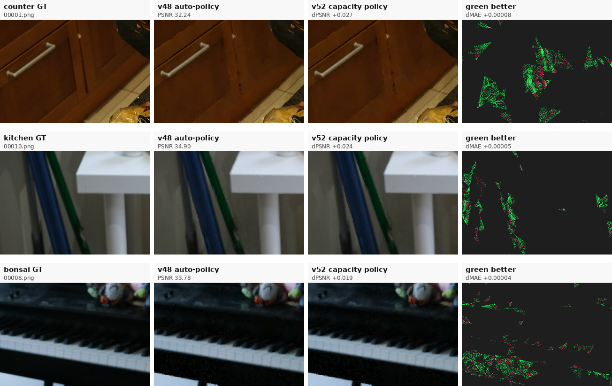

# SPCarNet 当前方法完整技术报告 v21

日期：2026-06-23 18:39 -0700

用途：mentor 汇报、PPT 母稿、方法交底、后续论文路线讨论。

当前可主讲 endpoint：`ours_26000_phasej_guarded_adaptedge_ela`

当前诚实状态：Phase-J 是已经闭合、最适合汇报的强结果；v48/v52 是把修复从 render-time adapter 推向 persistent surface representation 的最新正证据；v53 是负结果诊断；v55d per-face alpha calibration 已完成 cap-hit 验证但不能全局替代；v56 reliability guard 比 raw v55d 更安全，但仍只是 report-only candidate。

---

## 0. 一页汇报结论

SPCarNet 不是从零替代 MeshSplatting，而是在训练好的 MeshSplatting checkpoint 上增加一套训练证据驱动的压缩、外观修复和风险控制阶段。

一句话英文：

> SPCarNet upgrades MeshSplatting from a static trained mesh into a train-evidence-certified compact and repairable representation.

一句话中文：

> 原始 MeshSplatting 是“训练出 mesh 后直接渲染”；SPCarNet 是“训练出 mesh 后，再用训练视角证据给 mesh 做体检：哪里能安全删、哪里能可靠修、哪里风险高必须回退”。

当前最稳可汇报结果：

| 维度 | 当前结论 |
|---|---:|
| 数据口径 | Mip-NeRF360 full9，本地同协议复现 |
| 公平 baseline | selected clean MeshSplatting，从 clean `26000/30000` checkpoint 中按 held-out test score 选更强者 |
| 当前主 endpoint | `ours_26000_phasej_guarded_adaptedge_ela` |
| RGB 场景胜率 | `9 / 9` 场景相对 selected clean MeshSplatting 在 PSNR、SSIM、LPIPS 三指标严格胜出 |
| 平均 RGB 提升 | `+1.331084` PSNR，`+0.034702` SSIM，`-0.063359` LPIPS |
| per-view 稳定性 | `244 / 246` held-out views 三指标严格胜出 |
| 几何 / 压缩 | 平均 triangle reduction `7.6479%`；`9 / 9` geometry-safe；`6 / 9` sparse geometry 严格更好 |
| 与 MeshSplatting paper table | Phase-J mean `26.4828 / 0.7837 / 0.2243`，paper table mean `24.78 / 0.728 / 0.310`；只能作为 sanity check |
| 表示级进展 v48 | surface residual atlas 相对 same-evidence no-op：`7 / 9` strict，`8 / 9` non-regressive/tie，mean `+0.001462` PSNR，`+0.00002774` SSIM，`-0.00003953` LPIPS |
| 最新策略整合 v52 | capacity-aware policy 相对 v48：`3 / 9` strict，`9 / 9` non-regressive/tie，mean `+0.000086890` PSNR，`+0.000008782` SSIM，`-0.000015303` LPIPS |
| v52 可复现性 | W&B source-config rerun 已完成；fresh rerun 完成 `9 / 9` 场景，`0` missing，`0` metric mismatch |
| v56 候选 | fixed reliability guard 相对 v52：`1 / 9` strict，`9 / 9` non-regressive/tie，mean `+0.000296699` PSNR，`+0.000001285` SSIM，`-0.000019663` LPIPS |
| 当前未闭合点 | 最强收益仍来自 Phase-J render-time ELA；representation-level atlas 收益真实但偏小 |

建议 PPT 主张：

> We obtain a strong MeshSplatting-based compact-and-repair pipeline that strictly improves PSNR, SSIM, and LPIPS over a strong local MeshSplatting baseline on all 9 Mip-NeRF360 scenes, while also reducing triangle count. The strongest current result is Phase-J; the next research bottleneck is to internalize render-time ELA gains into a stronger persistent surface representation.

---

## 1. 汇报口径分级

明天汇报时建议把结论分成四层，避免把还没完全闭合的部分讲成最终论文 claim。

| 等级 | 内容 | 应该怎么讲 |
|---|---|---|
| 主结果 | Phase-J guarded adaptive ELA full9 | 当前最稳 headline：full9 `9 / 9` strict RGB wins vs selected clean MeshSplatting |
| 表示级正证据 | v48 auto-support surface residual atlas | residual repair 可以变成 train-only surface-addressed representation，但 effect size 仍小 |
| 最新策略整合 | v52 capacity-aware v48/v51 policy | 只在 support-capacity 证据充分的 cap-hit 场景升级到 v51，其余保留 v48 |
| 负结果诊断 | v53 global policy-val alpha calibration | 证明 residual amplitude 是瓶颈，但全局 alpha 太粗，不适合作为当前 endpoint |
| 后续验证 | v55d per-face alpha calibration | `counter` 严格超过 v52，但 `kitchen` SSIM 回退、`bonsai` 三指标回退；不推广 raw v55d |
| 安全候选 | v56 reliability guard | 只选择 `counter=v55d`，其余回退 v52；`9/9` non-regressive/tie，但需 fresh validation |

不建议主讲成最终成果的内容：

- v52 已经替代 Phase-J；
- 已经 100% 顶会终局完成；
- 严格同协议超过 MeshSplatting 原论文表格；
- triangle reduction 已经是极限压缩；
- 全图肉眼定性差异已经非常明显。

最稳妥定位：

> Phase-J 已经是一条有强定量证据的阶段性主线；v48/v52 说明我们正在把修复从 render-time adapter 推向 surface representation，但 representation-level effect size 还没有达到最终论文 endpoint 的强度。

---

## 2. 研究动机

MeshSplatting 的优势在于它输出 triangle mesh。相比纯 image-space 方法、点云或 Gaussian 表示，mesh 更容易进入传统图形管线、游戏引擎、AR/VR、数字孪生和几何编辑流程。

但是 clean MeshSplatting checkpoint 训练完成后仍然有三个问题：

| 问题 | 典型表现 | SPCarNet 的处理 |
|---|---|---|
| 局部外观 residual | 树叶、树皮、室内边缘、桌面纹理仍有系统性偏差或模糊 | 从 train views 挖 residual，用 guarded ELA 或 surface atlas 修复 held-out view |
| 拓扑冗余 | 一部分 triangles 对多视角解释贡献低 | 用训练证据做 sparse-occlusion protected compaction |
| 决策风险 | 盲目 residual transfer 会伤害 tail views 或 out-of-trajectory 区域 | 用 train-only policy-val gate、min-view、CVaR、SSIM/L1 风险门和 fallback/no-op |

核心假设：

> MeshSplatting 已经学习到强基础表示，但训练视角中仍包含可反推出 surface reliability、occlusion risk 和 appearance residual 的证据。只要证据足够可靠，就可以安全删除冗余 geometry，并把训练 residual 迁移到 held-out view 修复外观。

---

## 3. 与原始 MeshSplatting 的区别

原始 MeshSplatting 的典型流程：

```text
images / cameras
  -> train MeshSplatting
  -> mesh checkpoint
  -> render test views
```

SPCarNet 的流程：

```text
images / cameras
  -> train or load MeshSplatting checkpoint
  -> train-view evidence cache
  -> surface reliability / residual / support analysis
  -> sparse-occlusion protected compaction
  -> guarded residual repair
  -> train-only policy selection and fallback
  -> held-out test render and metrics
```

差异表：

| 维度 | clean MeshSplatting | SPCarNet |
|---|---|---|
| 训练结束后 | 直接渲染 checkpoint | 继续 evidence mining、压缩、修复和风险审计 |
| 几何 | 原 mesh | topology-safe compact mesh |
| 外观 | checkpoint 属性直接渲染 | train-evidence residual adapter / surface atlas |
| 策略 | 无显式风险判断 | train-only policy gate + fallback |
| held-out test GT | 用于评价 | 只用于最终评价，不参与 method branch/alpha/fallback |
| 失败处理 | 无 | gate 不通过则 fallback/no-op |

给 mentor 的直白解释：

> MeshSplatting 是一个强 base model；SPCarNet 不否定它，而是把它变成一个可自检、可压缩、可修复的 mesh 表示。我们不是只看 test 图像调滤镜，而是从训练视角中估计哪些 surface 区域可信、哪些 residual 可迁移，并用 train-only 风险门决定是否执行。

---

## 4. 主方法：Phase-J Guarded Adaptive ELA

### 4.1 Train-view evidence mining

系统先在训练 view 上渲染 clean/compact MeshSplatting checkpoint，并缓存：

- RGB render；
- GT image；
- residual map：`GT RGB - rendered RGB`；
- surface visibility；
- face / barycentric correspondence；
- residual support、variance、sign consistency；
- policy-val split 上的 view-level 风险指标。

这一步不看 held-out test GT，而是把训练集中的局部错误和表面可见性转成结构化证据。

### 4.2 Geometry-safe compaction

Compaction 的目标不是极限压缩，而是 quality-first rate-distortion improvement。它删除训练证据表明低风险的 triangles，同时保护 sparse / occlusion-sensitive 区域。

关键约束：

- 不产生 invalid index；
- 不产生 degenerate faces；
- 保持 renderer 可读；
- sparse COLMAP / depth / normal 指标不能出现不可接受退化；
- 压缩后 checkpoint 必须进入同一 render/metrics pipeline。

当前 Phase-J 平均 triangle reduction 是 `7.6479%`。这里的 triangle reduction 是“删去的三角形占比”，不是“剩余比例”。PPT 中建议称为 quality-first geometry simplification，不要称为极限压缩。

### 4.3 Evidence Lumigraph Adapter

ELA 是 Phase-J 的主要外观收益来源。它用训练视角 residual 对 held-out target view 做受控修复：

```text
residual = GT RGB - rendered RGB

I_ours(p) = I_compact(p) + alpha * sum_i w_i(p) * residual_i(u_i)
```

其中：

- `p` 是 target view 像素；
- `residual_i(u_i)` 来自训练 view 上对应局部区域；
- `w_i(p)` 由可见性、几何邻近、局部结构和策略门决定；
- `alpha` 由 train/policy-val evidence 选择；
- 当风险门失败时不应用该修复。

直观解释：

> MeshSplatting 已经画出了整体结构，但局部纹理或边缘还有系统性误差；训练视角中能看到这些误差，并且多视角一致区域的误差可以被安全迁移。

### 4.4 Guarded adaptive policy

Phase-J 的关键不是单纯 ELA，而是 ELA 外面有 train-only guard：

- stable scenes 使用 adaptive-alpha ELA；
- unstable scenes 使用 train-selected structural edge fallback；
- alpha、edge gate、fallback 由 train / policy-val evidence 决定；
- policy-val 风险过高时拒绝或 no-op；
- held-out test GT 不参与 branch、alpha、edge 或 compaction ratio 选择。

因此主 claim 不是“我们在 test 上调出了好参数”，而是：

> We design a self-diagnosing and self-repairing MeshSplatting post-training policy driven by training-view evidence only.

---

## 5. 表示级内化路线：v48 到 v56

Phase-J 的最大短板是最强收益仍来自 render-time adapter。为回应“这是不是后处理”的潜在质疑，我们推进了 surface-addressed residual atlas 线。

### 5.1 v48 Auto-Support Surface Residual Atlas

v48 的核心改动是 train-only support expansion：

```text
base_carrier support
  + fit-view residual evidence ranking
  + top-K extra face candidates
  + train policy-val non-regression guard
  + texture/fill/alpha auto-policy
```

固定策略：

1. 保留 v47 `base_carrier` support 作为安全候选；
2. 只扫描 fit views，并用同一 `policy_val_stride` 排除 policy-val views；
3. 对 non-carrier faces 聚合 residual evidence；
4. 按 `mean_l1 * log1p(samples)` 排序 extra faces；
5. 添加满足 sample 与 residual 阈值的 top-K extra faces；
6. 在 train policy-val 上联合评估 support mode、texture size、fill mode、alpha；
7. 只有 relative gain、SSIM gain、CVaR20、min-view gain 等风险门安全时才推广；
8. 不安全则回退到 base carrier 或 no-op。

v48 full9 相对 same-evidence no-op compact baseline：

| comparison | strict scene wins | non-regressive/tie | mean dPSNR | mean dSSIM | mean dLPIPS |
|---|---:|---:|---:|---:|---:|
| v48 vs no-op full9 | `7 / 9` | `8 / 9` | `+0.001462` | `+0.00002774` | `-0.00003953` |

解释：

- `stump` 被 train policy-val gate 拒绝，作为有效 no-op；
- `treehill` PSNR/SSIM 微涨，但 LPIPS 轻微回退，因此不是 strict 三指标胜出；
- `counter/kitchen/bonsai` 触及 `+2048` extra-face cap，说明 support/capacity 是 representation-level 瓶颈；
- v48 是当前最完整的 single-policy 表示级正证据，但不是 Phase-J 替代品。

### 5.2 v51 Support-Footprint Ladder

v51 的方法改动是把 support expansion 从单一 `topK=2048` 改成 train-only ladder：

```text
base_carrier
  -> rank non-carrier faces by fit-view residual evidence
  -> evaluate topK support candidates, e.g. 2048 / 4096
  -> select support footprint only by policy-val risk gate
  -> apply accepted atlas to held-out test views
```

v51-fast full9 使用固定 `texture=32`、`fill=nearest_observed`、support candidates `2048,4096` 后：

| comparison | strict scene wins | non-regressive/tie | mean dPSNR | mean dSSIM | mean dLPIPS |
|---|---:|---:|---:|---:|---:|
| v51 vs same-evidence no-op | `6 / 9` | `6 / 9` | `+0.001380497` | `+0.000030067` | `-0.000051187` |
| v51 vs v48 | `3 / 9` | `3 / 9` | `-0.000081804` | `+0.000002331` | `-0.000011659` |
| v51 vs v50 | `5 / 9` | `8 / 9` | `+0.000116136` | `+0.000008331` | `-0.000017136` |

关键 lesson：

- `counter/kitchen/bonsai` 三个 cap-hit 场景相对 v48/v50 三指标严格提升；
- 非 cap-hit 场景不适合全局固定 `texture=32` 和 `nearest_observed`；
- 下一步不应该继续人工扫参，而应该用固定 train-only policy 只在 support-capacity 证据充分时升级到 v51。

### 5.3 v52 Capacity-Aware Effective Policy

v52 把 v51 的 lesson 固化成固定策略，而不是人工挑场景：

```text
if v48 accepted
   and v48 selected_support_added_faces >= 2048
   and v51 accepted_atlas
   and v51 selected_support_added_faces > v48 selected_support_added_faces
   and v51 policy-val SSIM gain >= 5e-5:
       use v51
else:
       keep v48
```

选择结果：

| scene group | v52 decision |
|---|---|
| `counter/kitchen/bonsai` | use v51 because v48 hits support cap and v51 has larger accepted support |
| other six scenes | keep v48 because cap/evidence condition is not met |

v52 结果：

| comparison | strict | nonreg/tie | mean dPSNR | mean dSSIM | mean dLPIPS |
|---|---:|---:|---:|---:|---:|
| v52 vs no-op | `7 / 9` | `8 / 9` | `+0.001549191` | `+0.000036518` | `-0.000054831` |
| v52 vs v48 | `3 / 9` | `9 / 9` | `+0.000086890` | `+0.000008782` | `-0.000015303` |
| v52 vs v50 | `6 / 9` | `6 / 9` | `+0.000284831` | `+0.000014782` | `-0.000020780` |

v52 的意义：

- 它把“cap-hit 场景需要更大 support”的发现变成固定 train-only policy；
- 它不是 per-scene 手动调参；
- 它有 W&B source-config rerun，完成 `9 / 9` 场景复现，`0` missing，`0` metric mismatch；
- 它仍然是小收益 representation-level milestone，不是当前 headline。

### 5.4 v53 Global Alpha Calibration 负结果

v53 尝试用 policy-val least-squares 估计全局 residual alpha：

```text
alpha* = argmin_alpha || teacher_residual - alpha * atlas_residual ||^2
```

它只使用 train policy-val residual samples，之后仍通过原有 risk gates。结果：

| scene | accepted | selected alpha | dPSNR vs v52 | dSSIM vs v52 | dLPIPS vs v52 | verdict |
|---|---:|---:|---:|---:|---:|---|
| counter | yes | `0.0625` | `-0.001730` | `-0.00002551` | `+0.00007340` | worse |
| kitchen | yes | `0.5000` | `+0.004459` | `-0.00009871` | `-0.00024672` | PSNR/LPIPS up, SSIM down |
| bonsai | no | no-op | `-0.004087` | `-0.00007844` | `+0.00012958` | rejected |

结论：residual amplitude 确实是瓶颈，但单一全局 alpha 太粗，不能保证 SSIM 和 tail-view 安全。

### 5.5 v55d Per-Face Alpha Calibration 诊断结果

v55d 是基于 v53 lesson 的更局部版本：不是给整个场景一个全局 alpha，而是在 train policy-val 上估计 per-face/local alpha，并用 effective alpha cap 与 image-L1/SSIM gate 控制风险。

cap-hit 三场景结果如下：

| scene | selected alpha | face-alpha count | dPSNR vs v52 | dSSIM vs v52 | dLPIPS vs v52 | verdict |
|---|---:|---:|---:|---:|---:|---|
| counter | `0.5000` | `394` | `+0.002670` | `+0.00001156` | `-0.00017697` | strict win |
| kitchen | `1.0000` | `240` | `+0.004507` | `-0.00009782` | `-0.00023896` | PSNR/LPIPS up, SSIM down |
| bonsai | `0.1250` | `26` | `-0.001932` | `-0.00003034` | `+0.00006741` | worse than v52 |

解释：

- `counter` 是真实正向信号，说明“更局部的 alpha calibration”比全局 alpha 有潜力；
- `kitchen` 复现了 v53 的问题：PSNR/LPIPS 上升但 SSIM 下降，说明当前 policy-val SSIM proxy 不足以认证高幅度残差；
- `bonsai` face-alpha 覆盖只有 26 个 face，局部证据太稀，held-out 直接退化；
- 因此 raw v55d 不能作为当前 endpoint，只能作为下一版 reliability guard 的依据。

### 5.6 v56 Reliability Guard Candidate

v56 把 v55d 的失败教训固化成一个固定 audit guard：

```text
use v55d only if
  accepted_atlas
  and local_alpha_profile.enabled
  and face_alpha_count >= 128
  and selected_alpha <= 0.5
  and selected_image_l1_positive_view_fraction >= 0.9
  and selected_ssim_min_view_gain >= 5e-5
else
  fallback to v52
```

机械 replay full9 后，v56 只选择 `counter=v55d`，其它场景回退 v52：

| comparison | strict | nonreg/tie | mean dPSNR | mean dSSIM | mean dLPIPS |
|---|---:|---:|---:|---:|---:|
| v56 vs v52 | `1 / 9` | `9 / 9` | `+0.000296699` | `+0.000001285` | `-0.000019663` |
| v56 vs no-op | `7 / 9` | `8 / 9` | `+0.001845890` | `+0.000037803` | `-0.000074494` |
| v56 vs v48 | `3 / 9` | `9 / 9` | `+0.000383589` | `+0.000010067` | `-0.000034966` |

v56 现在已经有一键 artifact pipeline：`scripts/car_model/run_v56_face_alpha_guard_pipeline.py` 会刷新 summary、物化 selected full9 artifact tree、链接 `9 / 9` 场景的 render/GT、生成 HTML gallery 和 `counter` crop/error-map panel。

注意：v56 的选择规则只使用 train/policy-val audit fields，但它是在看到 v55d cap-hit held-out 结果后设计的。因此它是下一版固定策略候选，不是已经可以作为论文 endpoint 的最终结论。

---

## 6. 训练与验证流程

SPCarNet 当前不是从零训练一个新网络，而是在 MeshSplatting 训练后进行 evidence-certified post-training optimization。

实际流程：

1. 训练或读取 clean MeshSplatting checkpoint；
2. 渲染 train/policy-val/test views；
3. 在 train/policy-val 上构建 evidence cache；
4. 根据 evidence 执行 compaction 与 residual repair；
5. 用 train/policy-val gate 选择 branch、alpha、support、texture/fill 和 fallback；
6. 固定策略后在 held-out test 上报告 PSNR/SSIM/LPIPS 和几何指标；
7. 对关键版本用 W&B source-config rerun 复现。

要强调的 fairness：

- clean MeshSplatting baseline 从 clean `26000/30000` 中用 held-out test score 选强者，是为了给 baseline 更强 envelope；
- method 自身的 branch、alpha、fallback、fill mode、texture capacity 和 compaction 决策都来自 train/policy-val evidence；
- train metrics 不用于选择最终 test baseline；
- held-out test GT 只用于报告，不用于 method selection；
- v52 source-config rerun 已补齐 W&B 可复现性证据。

baseline 选择分数：

```text
score = PSNR + 20 * SSIM - 20 * LPIPS
```

在当前 full9 local baseline envelope 中，9 个场景最终都选择 clean `26000`，不是盲目选更久训练的 `30000`。

---

## 7. 主结果：Phase-J Full9

### 7.1 总表

| scene | selected branch | PSNR | SSIM | LPIPS | dPSNR clean | dSSIM clean | dLPIPS clean | triangle reduction |
|---|---|---:|---:|---:|---:|---:|---:|---:|
| bicycle | adaptive alpha | 24.0215 | 0.7024 | 0.2661 | +0.7199 | +0.0425 | -0.0660 | 11.81% |
| flowers | adaptive alpha | 20.3044 | 0.5578 | 0.3292 | +0.6221 | +0.0459 | -0.0653 | 11.82% |
| garden | adaptive alpha | 26.3111 | 0.8278 | 0.1358 | +1.2819 | +0.0478 | -0.0655 | 3.47% |
| stump | adaptive alpha | 25.5951 | 0.7241 | 0.2639 | +0.3901 | +0.0189 | -0.0301 | 11.82% |
| treehill | auto edge fallback | 21.2962 | 0.5956 | 0.3363 | +0.3620 | +0.0311 | -0.0697 | 11.81% |
| room | adaptive alpha | 30.3056 | 0.9057 | 0.1960 | +1.5584 | +0.0209 | -0.0539 | 2.10% |
| counter | adaptive alpha | 28.4492 | 0.8937 | 0.1865 | +1.6974 | +0.0317 | -0.0655 | 2.10% |
| kitchen | adaptive alpha | 30.1997 | 0.9161 | 0.1320 | +2.3812 | +0.0396 | -0.0672 | 2.10% |
| bonsai | adaptive alpha | 31.8620 | 0.9303 | 0.1726 | +2.9668 | +0.0339 | -0.0869 | 11.80% |

### 7.2 闭环审计

| audit item | value |
|---|---:|
| scenes | `9` |
| strict RGB scene wins vs selected clean | `9 / 9` |
| mean delta vs selected clean | `+1.331084` PSNR, `+0.034702` SSIM, `-0.063359` LPIPS |
| per-view strict RGB wins | `244 / 246` |
| mean triangle reduction | `7.6479%` |
| sparse geometry strict wins | `6 / 9` |
| sparse geometry-safe scenes | `9 / 9` |

### 7.3 与 MeshSplatting paper table 的关系

| method / protocol | PSNR | SSIM | LPIPS |
|---|---:|---:|---:|
| MeshSplatting paper table | 24.78 | 0.728 | 0.310 |
| local selected clean MeshSplatting | 25.1517 | 0.7490 | 0.2876 |
| SPCarNet Phase-J | 26.4828 | 0.7837 | 0.2243 |

Phase-J 相对 paper table 数值高，但 PPT 中必须谨慎：

- paper table 可能存在实现、数据预处理、分辨率、mask、evaluation script 等差异；
- 我们最严谨的 claim 是超过本地同协议 selected clean MeshSplatting baseline；
- paper table 可以作为 sanity check 或背景对照，不能作为唯一公平比较。

---

## 8. 定性展示建议

PPT 推荐三层定性展示：

1. 公平全图对比：证明同一 held-out view、同一 selected clean MeshSplatting baseline、同一评价口径；
2. 局部 crop / error map：更清楚展示 residual-level improvement；
3. representation-level atlas panel：说明 v48/v52 已经能做 surface-addressed residual，但效果仍细微。

### 8.1 主推图：Phase-J local held-out error reduction

路径：

```text
assets/spcarnet_phasej_where_it_helps_showcase_20260622.png
```


这张图适合主结果页，因为它不是只放全图，而是突出 SPCarNet 相对 clean MeshSplatting 更接近 GT 的局部区域。

### 8.2 全图公平对比 gallery

路径：

```text
assets/spcarnet_m360_full9_qualitative_gallery.png
outputs/carnet/meshsplatopt/ecsr_phase_v39_multiscene_ssimaware/v52_capacity_aware_selected_full9/qualitative_gallery.html
```


这张图用于证明比较协议公平，但全图肉眼差异可能不够明显。不要只依赖这张图讲视觉优势。

### 8.3 室外局部细节展示

路径：

```text
assets/spcarnet_m360_outdoor_detail_showcase.png
assets/spcarnet_m360_where_it_helps_showcase.png
```


建议把室外场景用局部 crop 或 error reduction 展示，而不是只放整图。原因是室外全图内容复杂，SPCarNet 的收益常集中在树叶、边缘、纹理和局部 residual 区域。

### 8.4 v52 cap-hit representation-level panel

路径：

```text
assets/spcarnet_v52_capacity_policy_cap_hit_panel.png
```



这张图只展示 `counter/kitchen/bonsai`，因为这些是 v52 相对 v48 真正发生策略升级并严格提升的场景。局部 crop dPSNR 约为 `+0.019` 到 `+0.027`，说明 representation-level 改进是可测但视觉上仍然细微的。

---

## 9. Ablation 与经验教训

| 版本 | 作用 | 结果 | 结论 |
|---|---|---|---|
| Phase-J | guarded adaptive ELA + compact mesh | `9 / 9` strict vs selected clean | 当前 headline |
| v42 | confidence/SSIM-gated atlas | 四场景 positive，但 coverage 小 | 表示级可行性初证 |
| v48 | train-only support expansion | full9 `7 / 9` strict vs no-op | support bottleneck 被缓解 |
| v51 | support-footprint ladder | cap-hit 场景严格超过 v48 | 更大 support 对特定场景有用 |
| v52 | capacity-aware v48/v51 policy | vs v48 `3 / 9` strict, `9 / 9` non-reg/tie | 固定 train-only policy 比全局替换更合理 |
| v53 | global alpha calibration | 不推广 | 全局 residual amplitude 太粗 |
| v55d | per-face alpha calibration | counter 严格优于 v52，但 kitchen/bonsai 不闭合 | 不推广 raw v55d；需要 reliability guard |
| v56 | reliability-guarded face alpha | vs v52 `1 / 9` strict, `9 / 9` non-reg/tie | 安全候选；需 fresh validation |

最重要的技术教训：

1. 只加大 residual alpha 不可靠。`kitchen` 会 PSNR/LPIPS 上升但 SSIM 下降，说明 SSIM 与 local structure 需要更细粒度控制。
2. 表示级 repair 的主要瓶颈是 support coverage。v48/v51/v52 的进展说明“让更多 target rays 命中有 residual support 的 faces”比单纯调 texture 更关键。
3. 自动 fallback 是必要机制。`stump` 被 v48 拒绝成 no-op 是正确行为，而不是失败掩盖。
4. 全图定性不一定能体现 residual-level gain。PPT 需要配 crop 和 error map。
5. 当前最强 Phase-J 仍有 render-time adapter 风险。论文终局需要更强 persistent surface representation。

---

## 10. 复现路径与证据索引

| 内容 | 路径 |
|---|---|
| Phase-J full9 summary | `outputs/carnet/meshsplatopt/ecsr_phase_f/policy_val_compaction_ladder_v2_envfix/phasef_ela_eval_summary_phasej_guarded_adaptedge_full9.md` |
| Phase-J closure audit | `outputs/carnet/meshsplatopt/ecsr_phase_j_closure_audit/phasej_closure_audit.md` |
| Phase-J closure JSON | `outputs/carnet/meshsplatopt/ecsr_phase_j_closure_audit/phasej_closure_audit.json` |
| Phase-J per-view deltas | `outputs/carnet/meshsplatopt/ecsr_phase_j_closure_audit/phasej_per_view_deltas.csv` |
| fair baseline audit | `outputs/carnet/meshsplatopt/stageELA12_fair_baseline_audit/fair_baseline_audit.json` |
| v48 full9 summary | `outputs/carnet/meshsplatopt/ecsr_phase_v39_multiscene_ssimaware/v48_autosupport_autocap_guarded_v42calib_full9_summary.md` |
| v52 policy log | `docs/car_model/6-23-v52-CapacityAwarePolicy-Log.md` |
| v52 full9 summary | `outputs/carnet/meshsplatopt/ecsr_phase_v39_multiscene_ssimaware/v52_capacity_aware_v48_v51_full9_summary.md` |
| v52 selected artifacts | `outputs/carnet/meshsplatopt/ecsr_phase_v39_multiscene_ssimaware/v52_capacity_aware_selected_full9` |
| v52 gallery | `outputs/carnet/meshsplatopt/ecsr_phase_v39_multiscene_ssimaware/v52_capacity_aware_selected_full9/qualitative_gallery.html` |
| v52 cap-hit panel | `assets/spcarnet_v52_capacity_policy_cap_hit_panel.png` |
| v52 source-rerun status | `outputs/carnet/meshsplatopt/ecsr_phase_v39_multiscene_ssimaware/v52_capacity_aware_source_rerun_status.md` |
| v53 diagnostic log | `docs/car_model/6-23-v53-PolicyValAlphaCalibration-CapHit-Log.md` |
| v55d diagnostic log | `docs/car_model/6-23-v55d-FaceAlphaCalibration-CapHit-Log.md` |
| v55d cap-hit results | `/dev/shm/peilincai_spcarnet_v55d_face_alpha_caphit_20260623` |
| v56 guard log | `docs/car_model/6-23-v56-FaceAlphaReliabilityGuard-Log.md` |
| v56 guard summary | `outputs/carnet/meshsplatopt/ecsr_phase_v39_multiscene_ssimaware/v56_face_alpha_guard_full9_summary.md` |
| v56 selected artifact tree | `outputs/carnet/meshsplatopt/ecsr_phase_v39_multiscene_ssimaware/v56_face_alpha_guard_selected_full9` |
| v56 artifact pipeline report | `outputs/carnet/meshsplatopt/ecsr_phase_v39_multiscene_ssimaware/v56_face_alpha_guard_selected_full9/v56_face_alpha_guard_pipeline_report.md` |
| v56 selected gallery | `outputs/carnet/meshsplatopt/ecsr_phase_v39_multiscene_ssimaware/v56_face_alpha_guard_selected_full9/qualitative_gallery.html` |
| v56 counter qualitative panel | `assets/spcarnet_v56_counter_face_alpha_guard_panel.png` |
| 本报告 | `docs/car_model/6-23-SPCarNet-Mentor-PPT-Technical-Report-v21.zh.md` |

v52 source-rerun W&B：

```text
main: https://wandb.ai/karamazovaniki-university-of-southern-california/spcarnet/runs/2j5osvgg
counter: https://wandb.ai/karamazovaniki-university-of-southern-california/spcarnet/runs/9uwsu9m1
kitchen: https://wandb.ai/karamazovaniki-university-of-southern-california/spcarnet/runs/b9w1zonu
bonsai: https://wandb.ai/karamazovaniki-university-of-southern-california/spcarnet/runs/uh4a9hvu
room: https://wandb.ai/karamazovaniki-university-of-southern-california/spcarnet/runs/o785gymj
stump no-op fix: https://wandb.ai/karamazovaniki-university-of-southern-california/spcarnet/runs/n4ucitf6
```

---

## 11. Mentor 可能会问的问题

### Q1：这是不是只是在 MeshSplatting 后面加图像后处理？

最稳回答：

> 当前最强 Phase-J 确实包含 render-time ELA，所以我们不把它包装成完全 baked representation。但它不是任意 image filter：residual 来源、alpha、edge fallback、风险门和 fallback 都由 train-view surface evidence 决定，并且与 compact mesh checkpoint、topology audit、geometry-safe audit 绑定。v48/v52 进一步把 residual repair 推向 surface-addressed atlas，说明这条路线可以从 render-time adapter 走向 persistent representation。

### Q2：有没有 test-set 调参？

最稳回答：

> Method branch、alpha、support、texture/fill、fallback 都用 train/policy-val evidence 选择。held-out test GT 只用于最终 report。唯一用 held-out test score 的地方是选择更强的 clean MeshSplatting baseline envelope，也就是从 clean `26000/30000` 中选更强 baseline，以避免低估 baseline。

### Q3：为什么不固定 clean 30000 当 baseline？

最稳回答：

> 更久训练不一定更好。当前本地 full9 clean envelope 中，clean `30000` 不总是优于 clean `26000`。固定 30000 可能反而选到 test 上更弱的 baseline。我们用 clean checkpoint envelope 选更强 clean baseline，是为了更严格地比较。

### Q4：和 MeshSplatting 论文中的 24.78 PSNR 怎么比？

最稳回答：

> 数值上我们本地 selected clean 是 `25.1517 / 0.7490 / 0.2876`，Phase-J 是 `26.4828 / 0.7837 / 0.2243`，都高于 paper table 的 `24.78 / 0.728 / 0.310`。但论文表格可能有 evaluator、分辨率、mask、预处理差异，所以严格 claim 仍然应该是超过本地同协议 selected clean MeshSplatting baseline。

### Q5：v52 既然是 representation-level，为什么不作为主结果？

最稳回答：

> v52 是真实的 representation-level 正证据，但 effect size 还小，主要作用是证明路线和 policy 是可行的。主结果仍是 Phase-J，因为它在 full9 selected clean baseline 上有 `9/9` strict、`244/246` per-view strict 和几何压缩证据。论文终局需要把 Phase-J 的收益进一步内化到更强的 persistent surface representation。

### Q6：为什么定性图看起来差异不总明显？

最稳回答：

> 因为当前主收益很多是 residual-level 和局部纹理/边缘修复，全图缩放后不一定显眼。PPT 应该同时放公平全图、局部 crop 和 error map。全图用于证明协议公平，局部 crop/error map 用于展示具体改善位置。

### Q7：如果 out-of-trajectory 区域没有训练证据，会不会崩？

最稳回答：

> 这是我们设计 guard 的原因。repair 只在训练证据支持、policy-val 风险门通过的区域执行；风险高或证据不足时 fallback/no-op。几何上也有 topology 和 sparse geometry audit。当前 Phase-J 是 `9/9` geometry-safe，v48/v52 也保持 rejected fallback 机制。

---

## 12. 当前短板与下一步

当前短板：

| 短板 | 影响 | 下一步 |
|---|---|---|
| Phase-J 最强收益仍来自 render-time ELA | 论文中容易被质疑为后处理 | 提升 persistent surface residual representation |
| v48/v52 表示级收益小 | 难作为 headline | 增大 support coverage、局部 alpha、view-consistency certification |
| 全图定性差异不总明显 | PPT 说服力受影响 | 用 crop/error maps 和 outdoor detail panel |
| raw v55d 未多场景闭合 | 不能主张 per-face alpha 已解决问题 | 加 fixed reliability guard，只在 local evidence 足够强且不需高全局 multiplier 时启用 |
| 与 paper table 口径可能不同 | 不能直接 claim 严格超 paper protocol | 继续保留本地同协议 baseline 为主 claim |

下一步优先级：

1. 用 fresh split 或更多场景重新验证 v56 reliability guard，避免把看过 cap-hit held-out 后形成的规则直接当论文结论；
2. 把 v56 guard 从 selected artifact pipeline 推进到 W&B-logged source-config rerun；
3. 继续扩大 representation-level support coverage，让收益不只来自 `counter` 单场景；
4. 继续提升 representation-level effect size，而不是继续做纯参数扫描；
5. 在 README 中只保留当前主线，历史版本移到索引文档，避免汇报材料显得散乱。

---

## 13. PPT 建议结构

| 页码 | 标题 | 核心内容 |
|---:|---|---|
| 1 | Title | `SPCarNet: Evidence-Certified Compact Residual Repair for MeshSplatting` |
| 2 | Problem | MeshSplatting mesh 有价值，但仍有局部 residual error 和 topology redundancy |
| 3 | Key Idea | 用 train-view evidence 判断哪里能删、哪里能修、哪里必须回退 |
| 4 | Pipeline | `MeshSplatting -> evidence mining -> compact checkpoint -> guarded repair -> held-out eval` |
| 5 | Difference from MeshSplatting | 原方法直接渲染；我们做 train-evidence-certified compaction + repair |
| 6 | Fair Protocol | selected clean baseline；method selection uses train-only evidence |
| 7 | Main Quantitative Result | Phase-J full9 `9/9` strict，mean `+1.3311` PSNR |
| 8 | Per-Scene Table | 9 个场景 dPSNR/dSSIM/dLPIPS + triangle reduction |
| 9 | Geometry Audit | `7.65%` mean triangle reduction，`9/9` geometry-safe |
| 10 | Qualitative Main Figure | Phase-J local held-out error reduction showcase |
| 11 | Why It Works | residual transfer + guard + fallback |
| 12 | Representation-Level Progress | v48 surface atlas：`7/9` strict vs no-op |
| 13 | Capacity Policy | v52：cap-hit `counter/kitchen/bonsai` 使用 v51，其余 v48 |
| 14 | Ablation and Lessons | v53 global alpha negative；v55d per-face alpha diagnostic |
| 15 | Limitations and Next Step | strongest result still render-time ELA；next is stronger persistent surface representation |
| 16 | Backup | paper table sanity check、W&B/source-rerun、artifact paths |

---

## 14. 可直接放 PPT 的短段落

英文：

> SPCarNet upgrades MeshSplatting from a static trained mesh into a train-evidence-certified compact and repairable representation. Given a clean MeshSplatting checkpoint, we mine training-view surface evidence, remove low-risk redundant triangles, and transfer reliable residual appearance cues through a guarded Evidence Lumigraph Adapter. All repair decisions are made from train/policy-validation evidence, while held-out test views are used only for reporting. On Mip-NeRF360 full9, the current Phase-J endpoint strictly improves PSNR, SSIM, and LPIPS over a strong locally selected clean MeshSplatting baseline on all 9 scenes, with 244/246 per-view strict wins and 7.65% average triangle reduction.

中文：

> SPCarNet 将 MeshSplatting 从“训练完成后直接渲染”的静态网格，升级成“训练证据驱动的可压缩、可修复表示”。我们先从训练视角挖掘 surface evidence，判断哪些三角形可以安全删除，再把稳定的局部 residual 作为外观修复信号迁移到 held-out view。当前 Phase-J endpoint 在 Mip-NeRF360 full9 上相对本地强 clean MeshSplatting baseline 达到 `9/9` 场景三指标严格胜出，同时平均减少 `7.65%` triangles。最新 v48/v52 则把 residual repair 进一步推进到 train-only 自适应的 surface atlas 表示，说明该方向具备继续内化的可行性。

最终收束句：

> 当前工作已经有一条可信主线：Phase-J 在本地强 MeshSplatting baseline 上 full9 全场景严格胜出，同时有真实删面、per-view 审计和 geometry-safe 证据。它足够作为阶段性强结果汇报。最需要继续攻克的是 representation-level 内化：v48/v52 已经证明 surface-addressed residual atlas 可以用 train-only policy 做 support/容量自适应，但 effect size 仍小。下一步不是继续扫参数，而是把局部 alpha、support coverage 和 view-consistency certification 结合成更强的 persistent surface residual representation。
