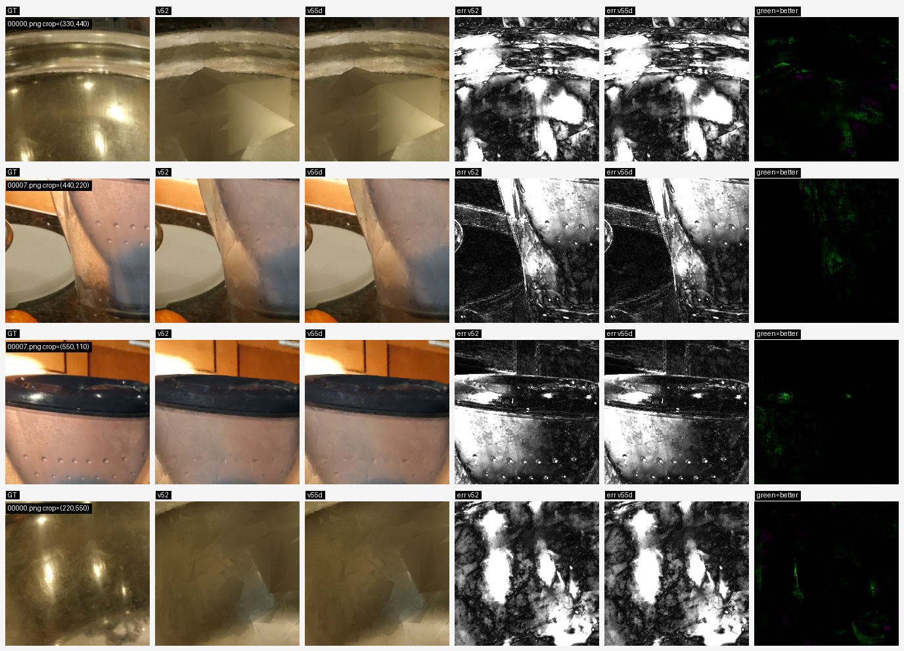

# v56 Face-Alpha Reliability Guard Log

Date: 2026-06-23

Status: `REPORT_ONLY_EFFECTIVE_POLICY_CANDIDATE`. v56 is a fixed guard over v52 and v55d. It is safer than raw v55d, but it is not yet a paper-level promoted endpoint because the guard was designed after inspecting v55d cap-hit held-out results.

## Motivation

Raw v55d per-face alpha calibration improves `counter`, but fails the full cap-hit strict standard:

| scene | raw v55d verdict vs v52 |
|---|---|
| counter | strict win |
| kitchen | PSNR/LPIPS improve, SSIM regresses |
| bonsai | PSNR/SSIM/LPIPS all regress |

The failure pattern suggests that per-face alpha should only be enabled when local calibration is dense enough and the selected scene-level multiplier is not high.

## Fixed Guard

Implementation:

```text
scripts/car_model/summarize_v56_face_alpha_guard_policy.py
```

Rule:

```text
use v55d only if
  accepted_atlas
  and local_alpha_profile.enabled
  and face_alpha_count >= 128
  and selected_alpha <= 0.5
  and selected_image_l1_positive_view_fraction >= 0.9
  and selected_ssim_min_view_gain >= 5e-5
  and selected_image_l1_cvar20_view_gain >= -5e-6
else
  fallback to v52
```

The rule uses train/policy-val audit fields only. The caveat is that it was designed after seeing v55d cap-hit held-out outcomes, so it must be treated as a next fixed policy candidate and validated further.

## Command

```bash
/home/peilincai/micromamba/envs/mesh_splatting/bin/python \
  scripts/car_model/summarize_v56_face_alpha_guard_policy.py
```

Outputs:

```text
outputs/carnet/meshsplatopt/ecsr_phase_v39_multiscene_ssimaware/v56_face_alpha_guard_full9_summary.json
outputs/carnet/meshsplatopt/ecsr_phase_v39_multiscene_ssimaware/v56_face_alpha_guard_full9_summary.md
```

Artifact pipeline command:

```bash
/home/peilincai/micromamba/envs/mesh_splatting/bin/python \
  scripts/car_model/run_v56_face_alpha_guard_pipeline.py
```

Artifact pipeline outputs:

```text
outputs/carnet/meshsplatopt/ecsr_phase_v39_multiscene_ssimaware/v56_face_alpha_guard_selected_full9/
outputs/carnet/meshsplatopt/ecsr_phase_v39_multiscene_ssimaware/v56_face_alpha_guard_selected_full9/manifest.json
outputs/carnet/meshsplatopt/ecsr_phase_v39_multiscene_ssimaware/v56_face_alpha_guard_selected_full9/qualitative_gallery.html
outputs/carnet/meshsplatopt/ecsr_phase_v39_multiscene_ssimaware/v56_face_alpha_guard_selected_full9/v56_face_alpha_guard_pipeline_manifest.json
outputs/carnet/meshsplatopt/ecsr_phase_v39_multiscene_ssimaware/v56_face_alpha_guard_selected_full9/v56_face_alpha_guard_pipeline_report.md
```

Pipeline validation:

- selected scenes: `9 / 9`
- render/GT linked scenes: `9 / 9`
- selection uses held-out metrics: `False`
- selected source changes from v52 only on `counter`, where the guard selects v55d.

Qualitative panel command:

```bash
/home/peilincai/micromamba/envs/mesh_splatting/bin/python \
  scripts/car_model/build_v56_counter_face_alpha_panel.py
```

Panel outputs:

```text
assets/spcarnet_v56_counter_face_alpha_guard_panel.png
assets/spcarnet_v56_counter_face_alpha_guard_panel_manifest.json
```

Compile check:

```bash
/home/peilincai/micromamba/envs/mesh_splatting/bin/python -m py_compile \
  scripts/car_model/summarize_v56_face_alpha_guard_policy.py \
  scripts/car_model/run_v56_face_alpha_guard_pipeline.py \
  scripts/car_model/build_v56_counter_face_alpha_panel.py
```

## Results

v56 selects `counter=v55d` and falls back to v52 for all other scenes.

| comparison | scenes | strict | nonreg/tie | mean dPSNR | mean dSSIM | mean dLPIPS |
|---|---:|---:|---:|---:|---:|---:|
| v56 vs v52 | 9 | 1 | 9 | `+0.000296699` | `+0.000001285` | `-0.000019663` |
| v56 vs no-op | 9 | 7 | 8 | `+0.001845890` | `+0.000037803` | `-0.000074494` |
| v56 vs v48 | 9 | 3 | 9 | `+0.000383589` | `+0.000010067` | `-0.000034966` |
| v56 vs v50 | 9 | 6 | 6 | `+0.000581529` | `+0.000016067` | `-0.000040443` |

Per-scene decisions:

| scene | selected | reason |
|---|---|---|
| bicycle | v52 fallback | no v55d audit |
| flowers | v52 fallback | no v55d audit |
| garden | v52 fallback | no v55d audit |
| stump | v52 fallback | no v55d audit |
| treehill | v52 fallback | no v55d audit |
| room | v52 fallback | no v55d audit |
| counter | v55d face alpha | guard passed |
| kitchen | v52 fallback | selected alpha `1.0` is above `0.5` |
| bonsai | v52 fallback | face-alpha count `26 < 128`; SSIM min-view gain below threshold |

## Decision

Do not promote v56 as a final endpoint yet.

What it achieves:

- converts raw v55d from unsafe mixed behavior into a non-regressive effective policy candidate;
- adds a small full9 improvement over v52;
- preserves the train/policy-val-only selection interface.
- materializes a selected full9 artifact tree, gallery, manifest, and pipeline report.

What remains:

- effect size is still small;
- the guard was designed after v55d held-out inspection;
- no fresh blind scene/protocol has validated the guard yet;
- qualitative evidence is limited to one focused `counter` crop/error-map panel and remains visually subtle.

Next step: validate v56 as a fixed rule on additional scenes or a fresh split, then wire it into a W&B-logged source-config rerun rather than only the artifact pipeline.

## Qualitative Evidence

The current panel is generated mechanically by selecting local crops with the highest MSE reduction from v52 to v55d on the selected `counter` scene. It should be interpreted conservatively: the RGB difference is subtle, but the error and improvement columns show localized reductions.

```text
assets/spcarnet_v56_counter_face_alpha_guard_panel.png
assets/spcarnet_v56_counter_face_alpha_guard_panel_manifest.json
```


