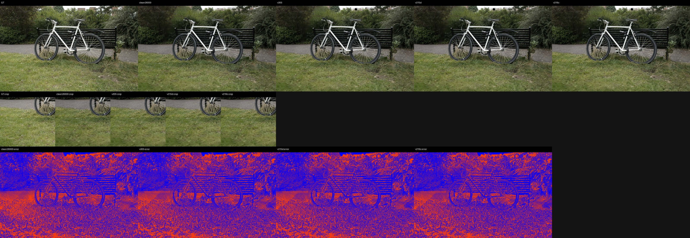
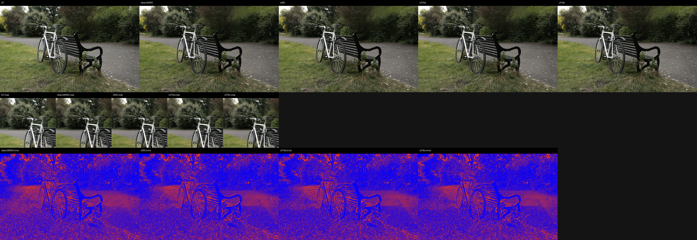
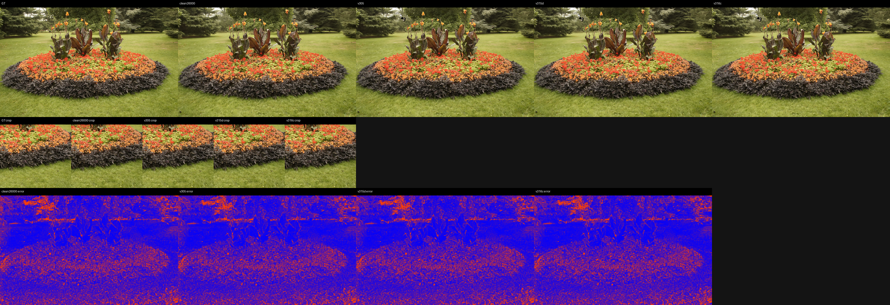
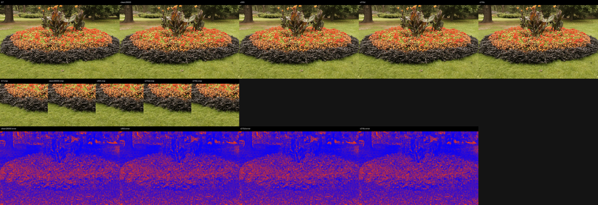
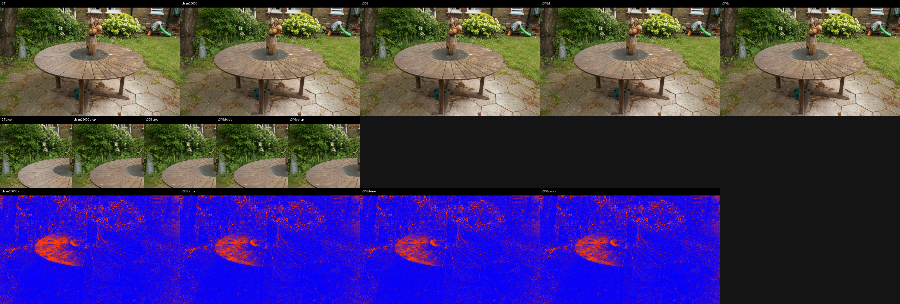
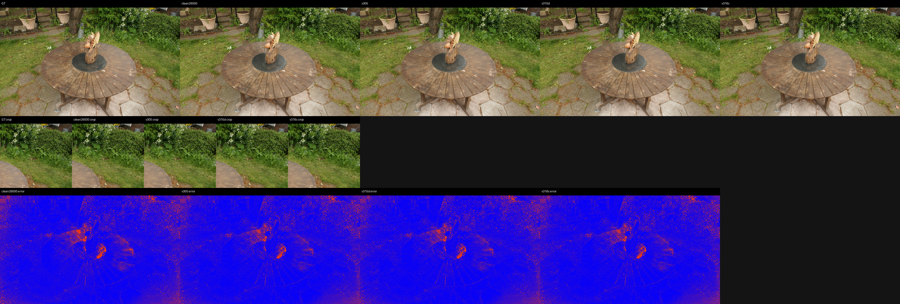

# v317 Perceptual, DISTS, Qualitative, and Geometry Evidence Closure

Date: 2026-07-01

This log closes the latest evidence gap around the v305/v315d/v316c support-transport frontier.  The goal is not to claim final paper completion; it is to replace vague reflection with auditable evidence against the local clean MeshSplatting baseline.

## Commands

Full9 LPIPS/DISTS/qualitative evaluation:

```bash
WANDB_MODE=offline CUDA_VISIBLE_DEVICES=5 PYTHONDONTWRITEBYTECODE=1 \
/home/peilincai/micromamba/envs/mesh_splatting/bin/python \
scripts/car_model/build_support_transport_frontier_comparison.py \
  --method clean26000=outputs/carnet/meshsplatopt/paper_m360_repro/official_clean30k \
  --method v305=outputs/carnet/spcarnet_v305_sourceheldout_auto_policy_test_apply_20260630 \
  --method v315d=outputs/carnet/spcarnet_v315d_no_fixed_downgrade_multiscene_20260701 \
  --method v316c=outputs/carnet/spcarnet_v316c_source_tail_acceptance_fixed_multiscene_20260701 \
  --output_dir outputs/carnet/spcarnet_v317_frontier_lpips_qualitative_20260701 \
  --scenes bicycle,bonsai,counter,flowers,garden,kitchen,room,stump,treehill \
  --panel_scenes garden,flowers,bicycle \
  --max_panels_per_scene 2 \
  --lpips_max_side 512 \
  --panel_max_side 640 \
  --crop_size 256 \
  --device cuda \
  --enable_wandb \
  --wandb_project spcarnet-transport-diagnostics \
  --wandb_run_name v317_frontier_lpips_dists_qualitative_full9
```

Geometry accounting:

```bash
/home/peilincai/micromamba/envs/mesh_splatting/bin/python \
scripts/car_model/build_support_transport_geometry_accounting.py \
  --clean_root outputs/carnet/meshsplatopt/paper_m360_repro/official_clean30k \
  --compact_root outputs/carnet/meshsplatopt/ecsr_phase_f/policy_val_compaction_ladder_v2_envfix \
  --output_json docs/car_model/results/v317_frontier_geometry_accounting_summary.json \
  --output_md docs/car_model/7-01-v317-Frontier-Geometry-Accounting.md \
  --scenes bicycle,bonsai,counter,flowers,garden,kitchen,room,stump,treehill
```

## Artifacts

- Full metric JSON: `docs/car_model/results/v317_frontier_lpips_qualitative_summary.json`
- Geometry JSON: `docs/car_model/results/v317_frontier_geometry_accounting_summary.json`
- Geometry MD: `docs/car_model/7-01-v317-Frontier-Geometry-Accounting.md`
- Selected qualitative panels: `docs/car_model/results/v317_frontier_panels/`
- Offline W&B run: `outputs/carnet/spcarnet_v317_frontier_lpips_qualitative_20260701/wandb/offline-run-20260630_211302-vvsni4bn`

## Full9 Perceptual Metrics

Reference is the local clean MeshSplatting result at clean iteration 26000 under `outputs/carnet/meshsplatopt/paper_m360_repro/official_clean30k`.

| method | scenes | PSNR | MAE | LPIPS | DISTS | dPSNR vs clean | dMAE vs clean | dLPIPS vs clean | dDISTS vs clean |
|---|---:|---:|---:|---:|---:|---:|---:|---:|---:|
| clean26000 | 9 | 27.193643 | 0.029112 | 0.090207 | 0.059902 | +0.000000 | +0.000000 | +0.000000 | +0.000000 |
| v305 | 9 | 27.578504 | 0.028198 | 0.087748 | 0.057662 | +0.384861 | -0.000915 | -0.002459 | -0.002240 |
| v315d | 9 | 27.582989 | 0.028182 | 0.087739 | 0.057679 | +0.389346 | -0.000930 | -0.002469 | -0.002223 |
| v316c | 9 | 27.580930 | 0.028183 | 0.087745 | 0.057673 | +0.387287 | -0.000930 | -0.002463 | -0.002229 |

Interpretation:

- v315d is the current mean-quality frontier: best PSNR, MAE, and LPIPS.
- v316c remains close to v315d and has the source-tail acceptance fix; its DISTS is slightly better than v315d, but v305 is still marginally best on DISTS.
- All three current support-transport variants beat local clean MeshSplatting on PSNR, MAE, LPIPS, and DISTS under this full9 local evaluation protocol.

## Geometry Accounting

v305/v315d/v316c inherit the same compact parent topology. Their support-transport stage changes render/color corrections, not triangle or vertex count.

| scenes | clean triangles | support-transport triangles | total triangle reduction | clean vertices | support-transport vertices | total vertex reduction |
|---:|---:|---:|---:|---:|---:|---:|
| 9 | 91019714 | 84219015 | 7.471677% | 28914623 | 27795247 | 3.871315% |

No compact-parent topology errors were found in the full9 topology audit: degenerate-face count plus invalid-index count is 0 for every scene.

## Per-Scene v315d Delta

| scene | views | dPSNR vs clean | dMAE vs clean | dLPIPS vs clean |
|---|---:|---:|---:|---:|
| bicycle | 25 | +0.190042 | -0.000609 | -0.002094 |
| bonsai | 37 | +0.785554 | -0.001685 | -0.004267 |
| counter | 30 | +0.544576 | -0.001255 | -0.004032 |
| flowers | 22 | +0.152882 | -0.000787 | -0.002179 |
| garden | 24 | +0.323357 | -0.000881 | -0.001410 |
| kitchen | 35 | +0.784482 | -0.001658 | -0.002822 |
| room | 39 | +0.542615 | -0.001075 | -0.003337 |
| stump | 16 | +0.044482 | -0.000139 | -0.000508 |
| treehill | 18 | +0.136123 | -0.000287 | -0.001570 |

## Qualitative Panels

The selected panels include full-frame renders, the highest-error crop, and error maps.

- bicycle 00000: 
- bicycle 00005: 
- flowers 00010: 
- flowers 00014: 
- garden 00006: 
- garden 00017: 

Qualitative warning: the visual advantage is still subtle in many full-frame views.  The current method is stronger as a measured quality/complexity improvement than as a dramatic visual transformation.  The error maps and crop rows are more useful than raw full-frame panels for explaining the improvement.

## Reflection Verdict

The reflection has helped, but it is not enough to declare the project finished.

What improved:

- The work stopped relying on per-scene parameter games and moved to fixed, source-heldout policy evidence.
- A real acceptance-policy bug was found and fixed in v316c.
- The evidence package now includes PSNR, MAE, LPIPS, DISTS, qualitative panels, geometry counts, topology validity, exact commands, and W&B logs.
- Under the local clean MeshSplatting protocol, current methods beat clean on quality metrics while keeping a 7.47% total triangle reduction.

What remains weak:

- v315d, v316c, and v305 form a small Pareto frontier rather than one universally dominant method.
- The qualitative gains are not visually dramatic enough for a strong top-conference story by themselves.
- This still needs a cleaner final method selection story: v315d for mean quality, v316c for stricter source-tail acceptance, or a unified selector that dominates both.
- The comparison is local and protocol-specific; it should not be overstated as a universal MeshSplatting paper-level win.

Current status:

```text
Final status: NOT COMPLETE.
```
