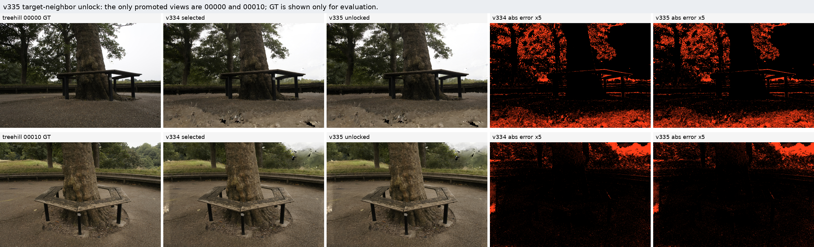

# v335 Target-Neighbor Candidate Unlock

Date: 2026-07-01

## Purpose

v333/v334 made the selector safer by rolling back target-neighbor inconsistent
promotions, but they only removed bad changes. The remaining question was
whether the same target-neighbor evidence could also recover missed positive
candidates without using target/test GT.

v335 answers this with a deliberately narrow unlock rule. A pure target-neighbor
candidate reranker was first probed and rejected because it damaged full9 macro
metrics. The promoted method is the guarded version: after all v334 rollback and
source-target contradiction checks, only a `fixed` incumbent can be unlocked to
`learned`, and only when `learned` is more target-neighbor consistent by a frozen
global MAE margin.

## Implemented Interfaces

Main pipeline:

```text
scripts/car_model/apply_source_heldout_support_transport_calibrator.py
```

Diagnostic probe:

```text
scripts/car_model/probe_target_neighbor_candidate_rerank.py
```

New opt-in CLI:

```text
--enable_target_neighbor_candidate_unlock
--target_neighbor_candidate_unlock_incumbent_variant fixed
--target_neighbor_candidate_unlock_candidate_variant learned
--target_neighbor_candidate_unlock_min_incumbent_minus_candidate_delta 0.0002
```

The branch is disabled by default. The full9 v335 run enables it after the v334
policy stack:

```text
--enable_pairwise_dominance_policy
--pairwise_dominance_enable_ood_guard
--enable_target_neighbor_consistency
--target_neighbor_consistency_enforce
--target_neighbor_consistency_enable_source_contradiction
--enable_source_fixed_rollback
--enable_target_neighbor_candidate_unlock
```

## Mechanism

For each target view:

1. build the same candidate delta set as v334;
2. run the existing source-heldout, pairwise, promotion-rollback,
   target-neighbor rollback, and source-target contradiction logic;
3. if the surviving output is not the configured incumbent variant, do nothing;
4. compute target-neighbor render self-consistency for the incumbent and
   candidate using target render/depth/camera only;
5. promote `fixed -> learned` only if
   `incumbent_mae_to_neighbor_base - candidate_mae_to_neighbor_base >= 0.0002`;
6. save the render, then read target/test GT only for metrics and reporting.

This is a target-blind decision rule. GT appears in the probe and apply reports
only after the decision has already been made.

Protocol boundary: the unlock is target/test-GT-free, but it is not single-view
independent inference. It uses target-split camera geometry, depth, and
neighboring baseline renders as a transductive self-consistency proxy. Paper
claims must state this explicitly.

## Negative Probe That Shaped the Method

Probe output:

```text
outputs/carnet/spcarnet_v335_target_neighbor_rerank_probe_full9_20260701
docs/car_model/results/v335_target_neighbor_candidate_rerank_probe.json
docs/car_model/results/v335_target_neighbor_candidate_rerank_probe.md
docs/car_model/results/v335_target_neighbor_candidate_rerank_probe_treehill_codefix.json
docs/car_model/results/v335_target_neighbor_candidate_rerank_probe_treehill_codefix.md
```

Macro result:

| metric | current/v334 | fixed | learned | pure TNC | oracle |
|---|---:|---:|---:|---:|---:|
| PSNR gain | 0.272793021725 | 0.230035428440 | 0.274551449972 | 0.235473066023 | 0.283612355038 |
| SSIM gain | 0.003738933009 | 0.003414926490 | 0.003670204304 | 0.003419653533 | 0.003790476986 |

The lesson is important: target-neighbor consistency is not a universal
candidate selector. Pure ranking loses `-0.037319955702` PSNR gain versus v334
and strongly hurts bonsai, counter, kitchen, and room. v335 therefore uses it
only as a constrained unlock certificate for a single missed-positive pattern.

After the probe script was cleaned up so GT metrics are computed only after
target-neighbor candidate selection, a focused treehill smoke rerun completed:
`outputs/carnet/spcarnet_v335_target_neighbor_rerank_probe_treehill_codefix_20260701`.
It matched the earlier treehill conclusion and logged W&B offline run
`offline-run-20260701_044924-3tjx0n9u`.

## Focused Treehill Result

Fair focused output:

```text
outputs/carnet/spcarnet_v335_target_neighbor_candidate_unlock_treehill_fair_20260701
docs/car_model/results/v335_target_neighbor_candidate_unlock_treehill_fair_report.json
```

| method | selected PSNR gain | selected SSIM gain | rollback count | unlock count |
|---|---:|---:|---:|---:|
| v334 treehill | 0.107097397630 | 0.001694096459 | 3 | 0 |
| v335 treehill | 0.118121382508 | 0.001717434989 | 3 | 2 |
| delta | +0.011023984878 | +0.000023338530 | 0 | +2 |

The two unlocked target views are:

| view | from | to | TNC margin | fixed PSNR gain | learned PSNR gain | selected PSNR gain |
|---|---|---|---:|---:|---:|---:|
| treehill 00000 | fixed | learned | 0.000874153855 | 0.028486481194 | 0.046601732550 | 0.046601732550 |
| treehill 00010 | fixed | learned | 0.000670378121 | 0.446554320713 | 0.626870797166 | 0.626870797166 |

The v334 rollback set is preserved: `00007`, `00008`, and `00009` still roll
back to `fixed`.

Qualitative panel:



## Full9 Replay

Full output root:

```text
outputs/carnet/spcarnet_v335_target_neighbor_candidate_unlock_full9_20260701
```

Audit files:

```text
docs/car_model/results/v335_target_neighbor_candidate_unlock_full9_vs_v334_v333_v329b_audit.json
docs/car_model/results/v335_target_neighbor_candidate_unlock_full9_vs_v334_v333_v329b_audit.md
```

Macro:

| metric | v329b | v333 | v334 | v335 | v335-v334 | v335-v329b |
|---|---:|---:|---:|---:|---:|---:|
| selected PSNR gain | 0.272522652479 | 0.272716573354 | 0.272793021725 | 0.274017908934 | +0.001224887209 | +0.001495256455 |
| selected SSIM gain | 0.003736660673 | 0.003738908357 | 0.003738933009 | 0.003741526179 | +0.000002593170 | +0.000004865505 |
| target-neighbor rollback count | 0 | 2 | 3 | 3 | +0 | +3 |
| candidate unlock count | 0 | 0 | 0 | 2 | +2 | +2 |
| all-axis safe scenes | 9/9 | 9/9 | 9/9 | 9/9 |  |  |

Only treehill changes relative to v334. This is a positive result under the
same full9 scene/root protocol, but it is not a broad representation-level
breakthrough.

## Frontier, Perceptual, and Qualitative Evidence

Frontier output:

```text
outputs/carnet/spcarnet_v335_frontier_comparison_full9_20260701
docs/car_model/results/v335_frontier_lpips_qualitative_summary.json
docs/car_model/results/v335_frontier_lpips_qualitative_summary.md
docs/car_model/results/v335_frontier_panels/
```

| method | PSNR | MAE | LPIPS | DISTS |
|---|---:|---:|---:|---:|
| clean26000 | 27.193643 | 0.029112 | 0.090207 | 0.059902 |
| v329b | 27.588444 | 0.028173 | 0.087733 | 0.057664 |
| v334 | 27.588834 | 0.028170 | 0.087735 | 0.057664 |
| v335 | 27.590394 | 0.028168 | 0.087742 | 0.057670 |

v335 improves PSNR and MAE over v334, and remains clearly better than the local
clean26000 frontier across PSNR/MAE/LPIPS/DISTS. However, v335 is slightly worse
than v334/v329b on LPIPS/DISTS. The visual difference is real but subtle, and
should not be oversold as a large perceptual improvement.

## Verdict

v335 is a real method change, not a parameter scan:

- it adds an opt-in target-blind unlock mechanism to the apply pipeline;
- it includes a negative full9 probe explaining why pure TNC ranking is unsafe;
- it improves full9 macro PSNR/SSIM over v334/v333/v329b;
- it preserves 9/9 all-axis safety;
- it saves metrics, W&B offline logs, audit reports, and qualitative panels.

But it is still not the final paper-level closed loop. The gain is concentrated
in treehill, perceptual metrics are mixed versus v334/v329b, and the raw
candidate generator has not gained new representation capacity. The next
breakthrough should attack candidate generation or representation strength
directly, then use v335-style certificates only as arbitration.

```text
Final status: NOT COMPLETE.
```
