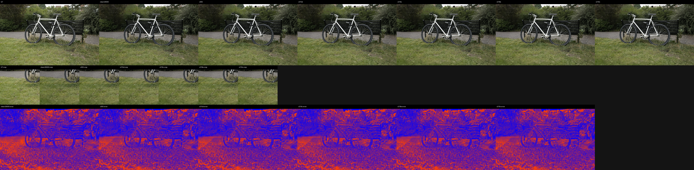
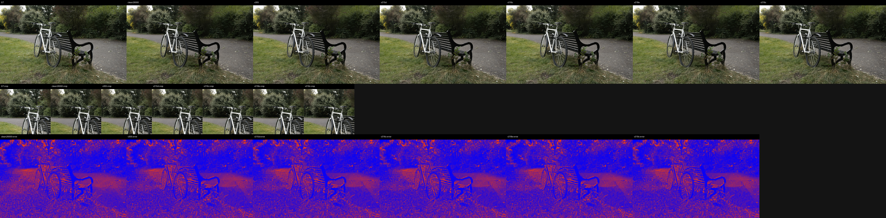
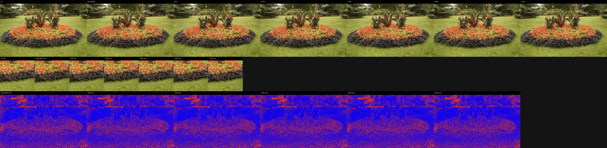
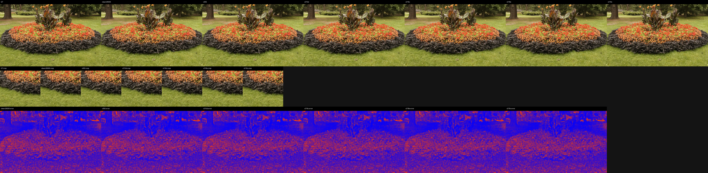
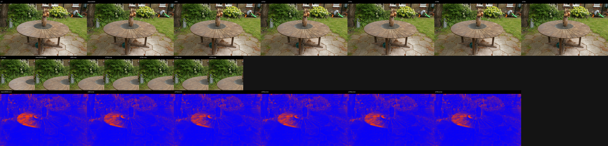
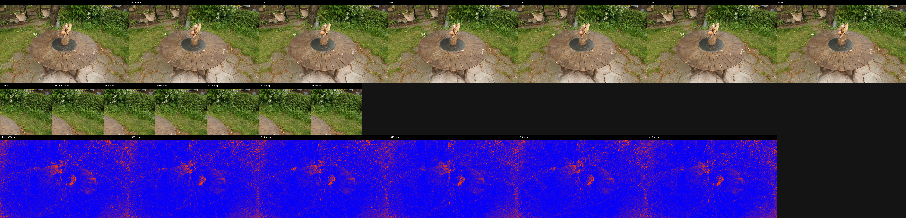
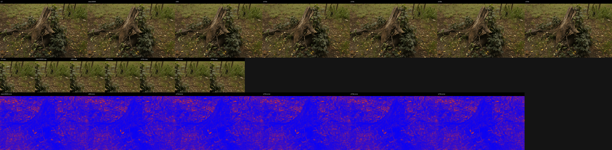
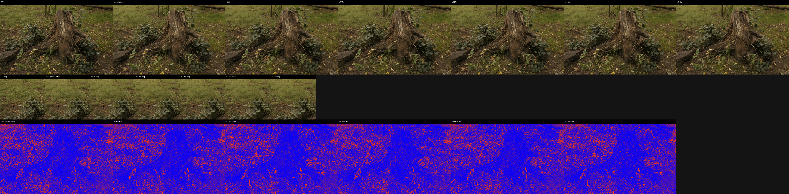
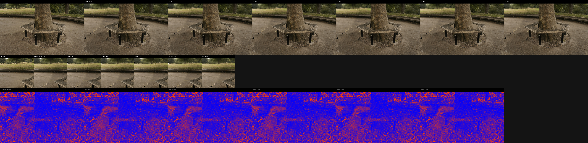
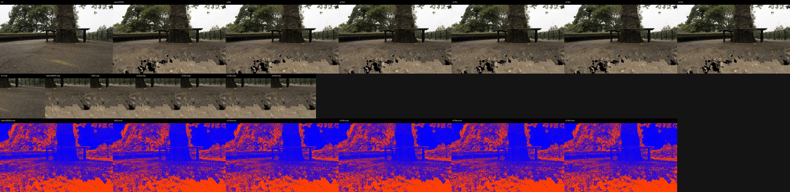

# Support-Transport Frontier LPIPS and Qualitative Evidence

LPIPS net: `alex`, max side: `512`.
DISTS status: `computed_piq_DISTS_reduction_mean`.

## Aggregate

| method | scenes | PSNR | MAE | LPIPS | DISTS | dPSNR vs ref | dMAE vs ref | dLPIPS vs ref | dDISTS vs ref |
|---|---:|---:|---:|---:|---:|---:|---:|---:|---:|
| clean26000 | 9 | 27.193643 | 0.029112 | 0.090207 | 0.059902 | +0.000000 | +0.000000 | +0.000000 | +0.000000 |
| v305 | 9 | 27.578504 | 0.028198 | 0.087748 | 0.057662 | +0.384861 | -0.000915 | -0.002459 | -0.002240 |
| v315d | 9 | 27.582989 | 0.028182 | 0.087739 | 0.057679 | +0.389346 | -0.000930 | -0.002469 | -0.002223 |
| v316c | 9 | 27.580930 | 0.028183 | 0.087745 | 0.057673 | +0.387287 | -0.000930 | -0.002463 | -0.002229 |
| v318e | 9 | 27.581262 | 0.028185 | 0.087743 | 0.057674 | +0.387619 | -0.000928 | -0.002464 | -0.002228 |
| v319c | 9 | 27.583642 | 0.028181 | 0.087746 | 0.057678 | +0.389999 | -0.000932 | -0.002461 | -0.002224 |

## Selected Panels

- `bicycle/00000.png`: 
- `bicycle/00005.png`: 
- `flowers/00010.png`: 
- `flowers/00014.png`: 
- `garden/00006.png`: 
- `garden/00017.png`: 
- `stump/00007.png`: 
- `stump/00005.png`: 
- `treehill/00013.png`: 
- `treehill/00001.png`: 
