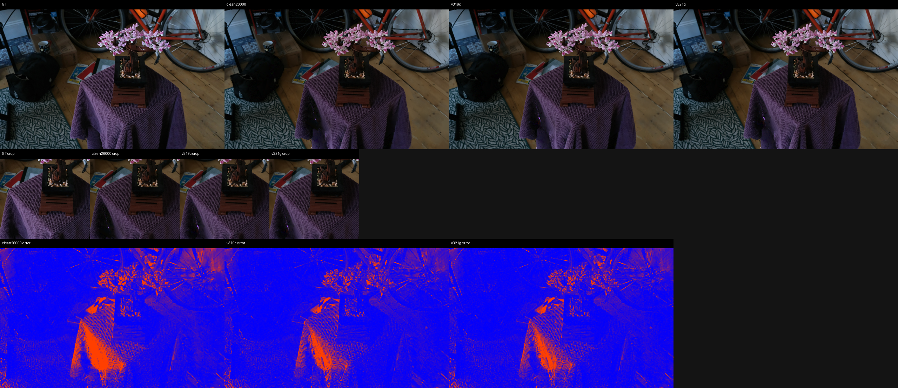
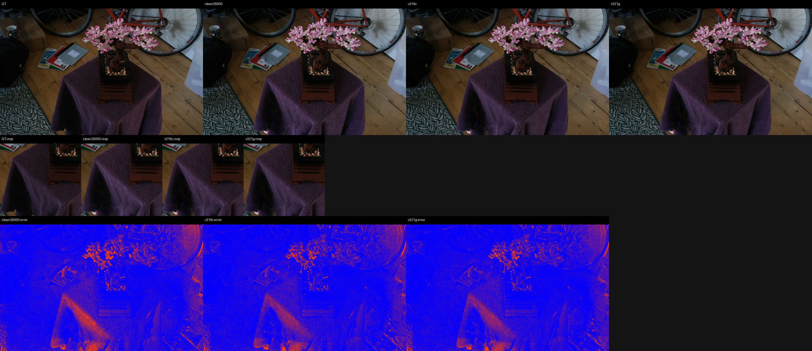
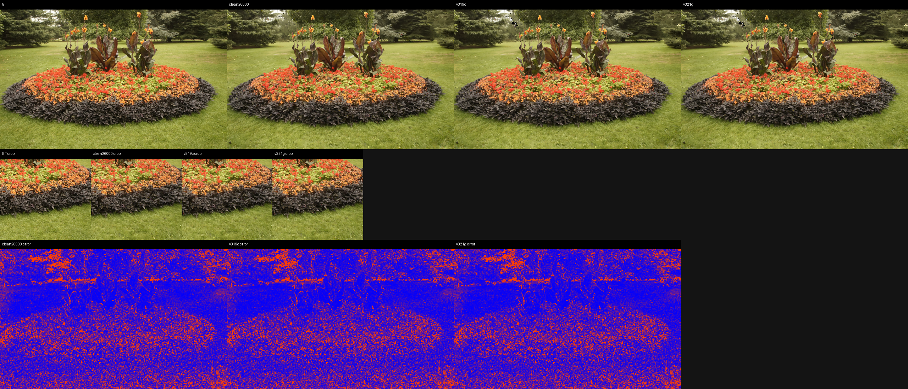
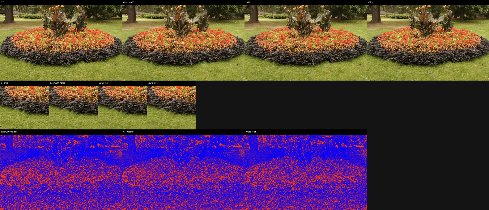
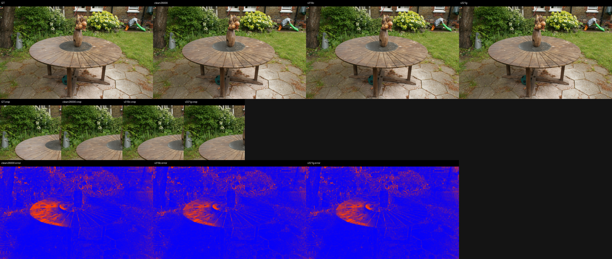
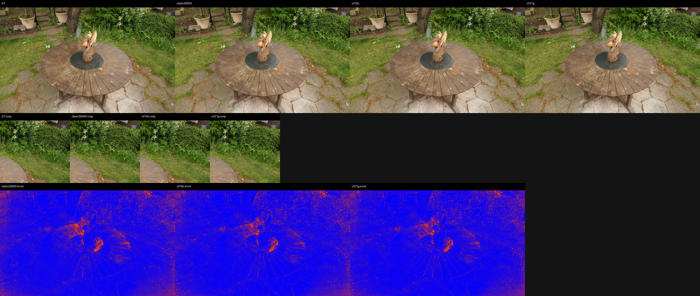
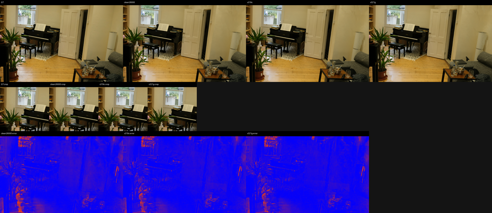
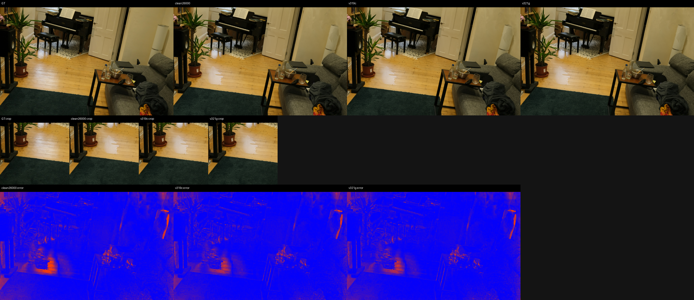
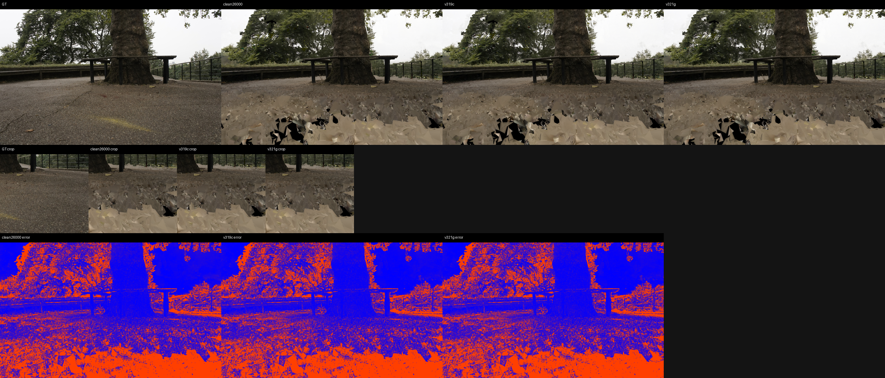
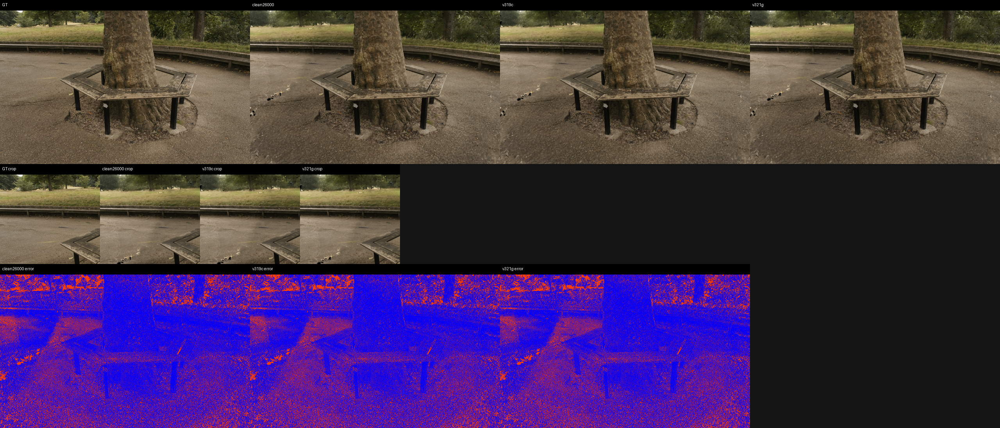

# Support-Transport Frontier LPIPS and Qualitative Evidence

LPIPS net: `alex`, max side: `512`.
DISTS status: `computed_piq_DISTS_reduction_mean`.

## Aggregate

| method | scenes | PSNR | MAE | LPIPS | DISTS | dPSNR vs ref | dMAE vs ref | dLPIPS vs ref | dDISTS vs ref |
|---|---:|---:|---:|---:|---:|---:|---:|---:|---:|
| clean26000 | 9 | 27.193643 | 0.029112 | 0.090207 | 0.059902 | +0.000000 | +0.000000 | +0.000000 | +0.000000 |
| v319c | 9 | 27.583642 | 0.028181 | 0.087746 | 0.057678 | +0.389999 | -0.000932 | -0.002461 | -0.002224 |
| v321g | 9 | 27.586900 | 0.028173 | 0.087736 | 0.057660 | +0.393257 | -0.000939 | -0.002471 | -0.002242 |

## Selected Panels

- `bonsai/00001.png`: 
- `bonsai/00035.png`: 
- `flowers/00010.png`: 
- `flowers/00014.png`: 
- `garden/00006.png`: 
- `garden/00017.png`: 
- `room/00004.png`: 
- `room/00009.png`: 
- `treehill/00001.png`: 
- `treehill/00013.png`: 
