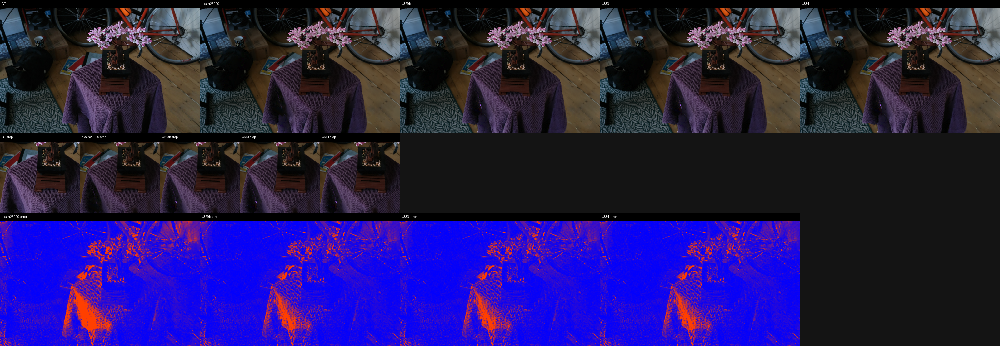
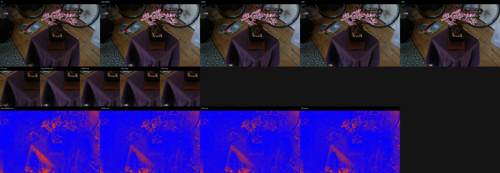
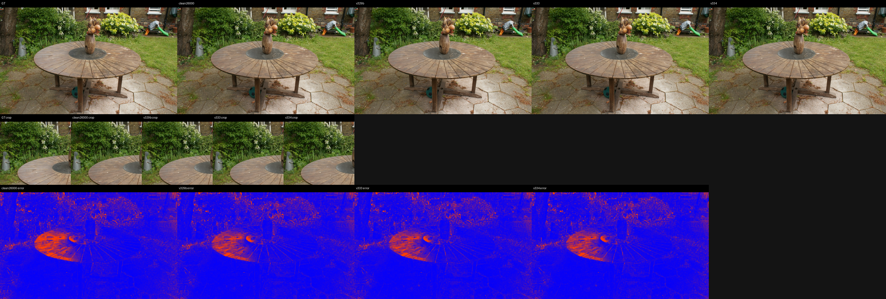
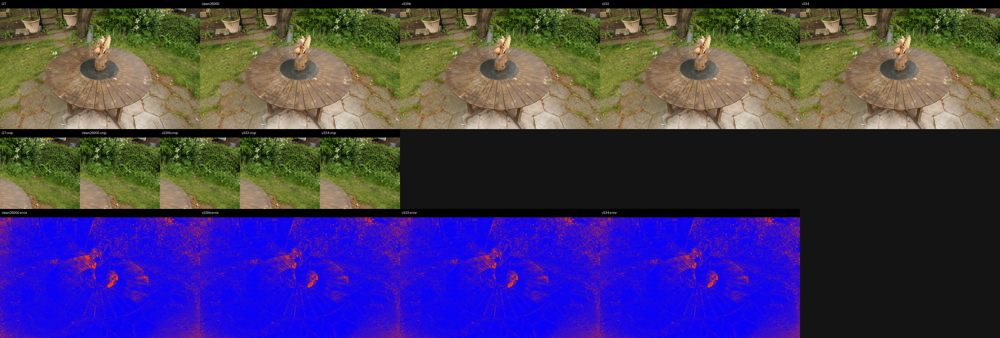
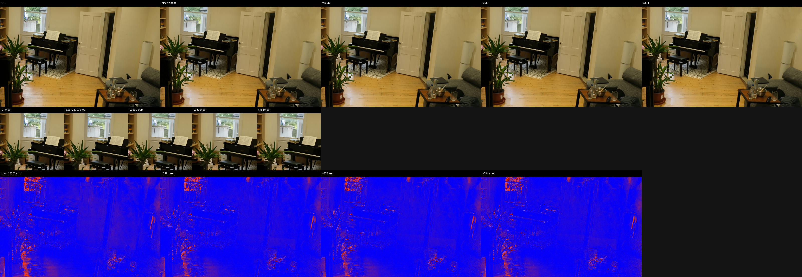
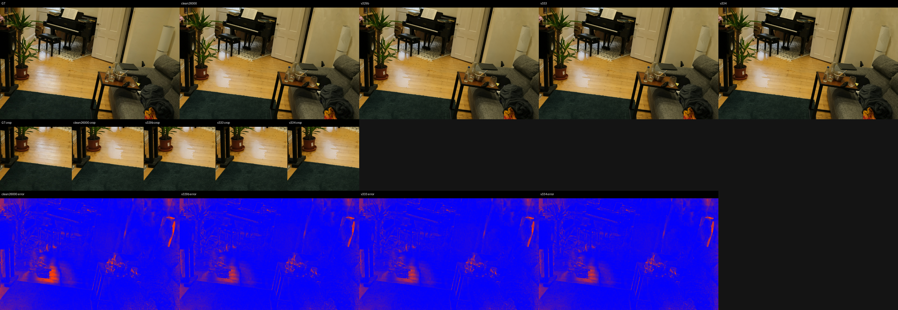
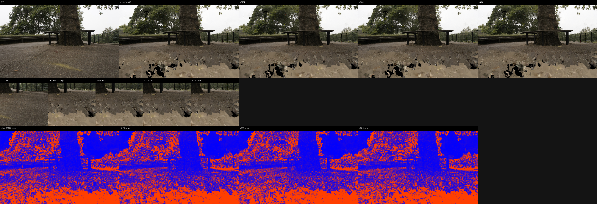
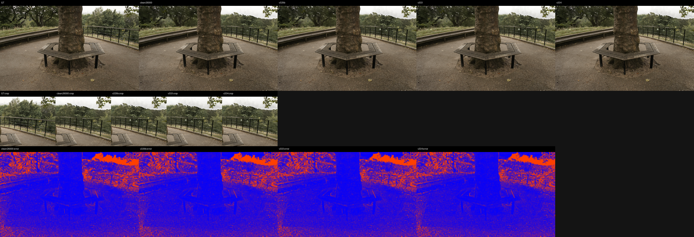

# Support-Transport Frontier LPIPS and Qualitative Evidence

LPIPS net: `alex`, max side: `512`.
DISTS status: `computed_piq_DISTS_reduction_mean`.

## Aggregate

| method | scenes | PSNR | MAE | LPIPS | DISTS | dPSNR vs ref | dMAE vs ref | dLPIPS vs ref | dDISTS vs ref |
|---|---:|---:|---:|---:|---:|---:|---:|---:|---:|
| clean26000 | 9 | 27.193643 | 0.029112 | 0.090207 | 0.059902 | +0.000000 | +0.000000 | +0.000000 | +0.000000 |
| v329b | 9 | 27.588444 | 0.028173 | 0.087733 | 0.057664 | +0.394801 | -0.000939 | -0.002474 | -0.002238 |
| v333 | 9 | 27.588734 | 0.028171 | 0.087735 | 0.057664 | +0.395091 | -0.000941 | -0.002473 | -0.002238 |
| v334 | 9 | 27.588834 | 0.028170 | 0.087735 | 0.057664 | +0.395191 | -0.000942 | -0.002473 | -0.002238 |

## Selected Panels

- `bonsai/00001.png`: 
- `bonsai/00035.png`: 
- `garden/00006.png`: 
- `garden/00017.png`: 
- `room/00004.png`: 
- `room/00009.png`: 
- `treehill/00001.png`: 
- `treehill/00011.png`: 
