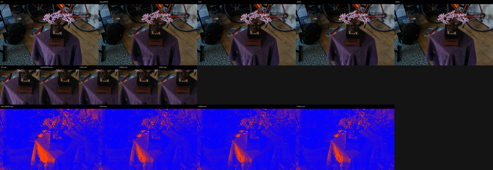
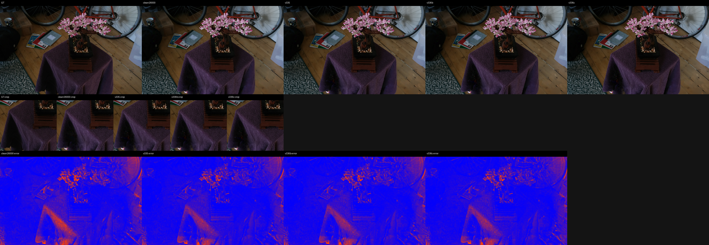
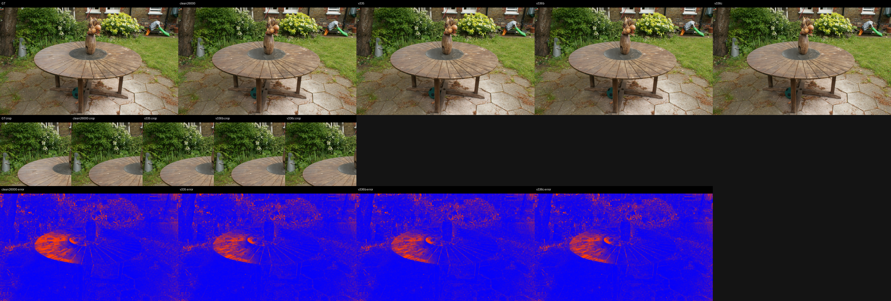
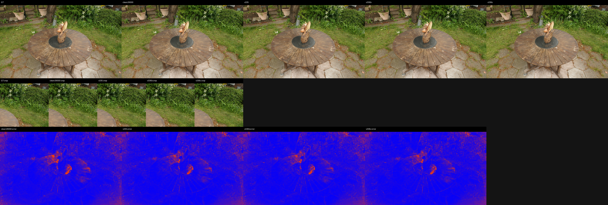
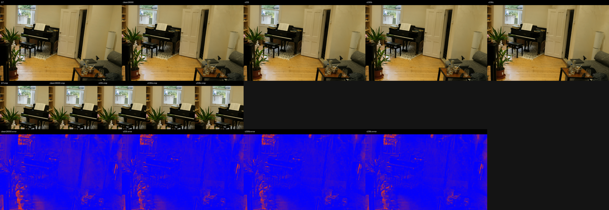
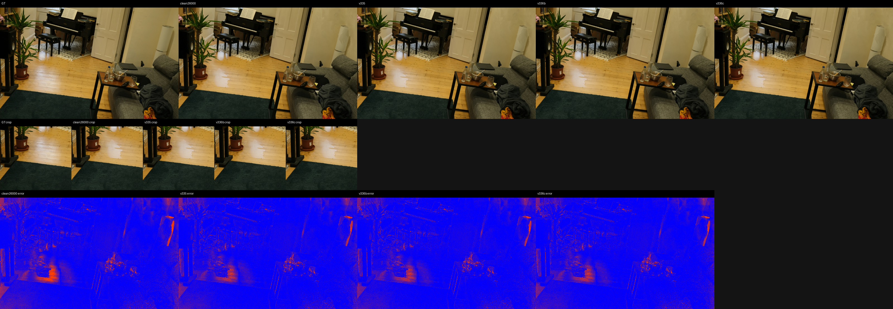
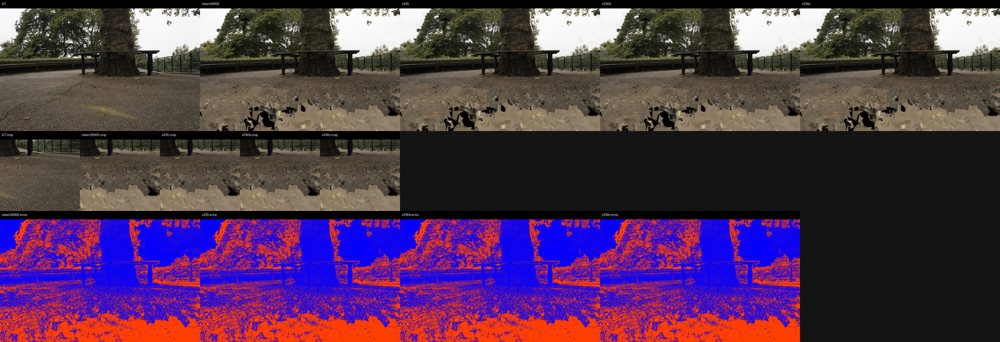
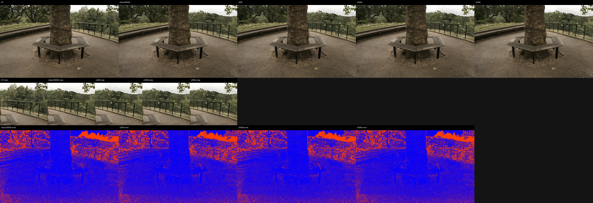

# Support-Transport Frontier LPIPS and Qualitative Evidence

LPIPS net: `alex`, max side: `512`.
DISTS status: `computed_piq_DISTS_reduction_mean`.

## Aggregate

| method | scenes | PSNR | MAE | LPIPS | DISTS | dPSNR vs ref | dMAE vs ref | dLPIPS vs ref | dDISTS vs ref |
|---|---:|---:|---:|---:|---:|---:|---:|---:|---:|
| clean26000 | 9 | 27.193643 | 0.029112 | 0.090207 | 0.059902 | +0.000000 | +0.000000 | +0.000000 | +0.000000 |
| v335 | 9 | 27.590394 | 0.028168 | 0.087742 | 0.057670 | +0.396751 | -0.000944 | -0.002466 | -0.002232 |
| v336b | 9 | 27.590928 | 0.028167 | 0.087737 | 0.057667 | +0.397285 | -0.000945 | -0.002470 | -0.002235 |
| v336c | 9 | 27.590966 | 0.028167 | 0.087738 | 0.057667 | +0.397323 | -0.000945 | -0.002469 | -0.002235 |

## Selected Panels

- `bonsai/00001.png`: 
- `bonsai/00035.png`: 
- `garden/00006.png`: 
- `garden/00017.png`: 
- `room/00004.png`: 
- `room/00009.png`: 
- `treehill/00001.png`: 
- `treehill/00011.png`: 
